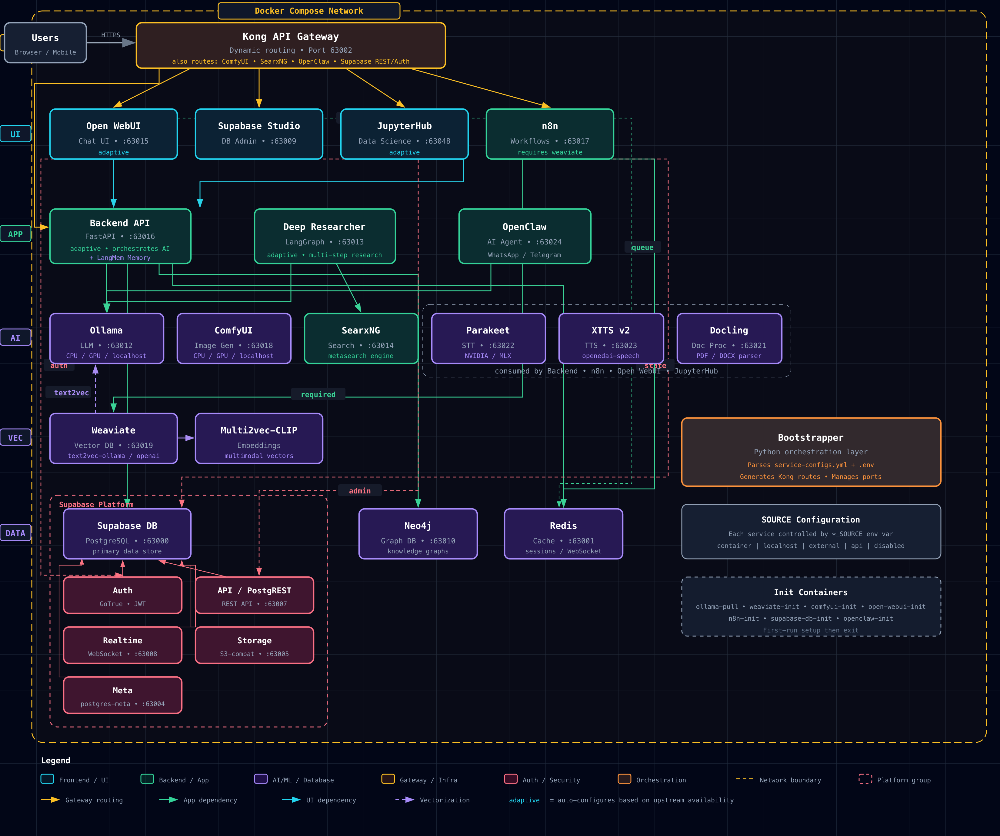

# GenAI Vanilla Stack

A flexible, modular GenAI project boilerplate with customizable services.

This project provides a solid foundation for building GenAI applications with a focus on modularity, allowing developers to swap components or connect to external services as needed. It supports both local development and production deployment with GPU acceleration.



## 1. Project Overview

GenAI Vanilla Stack is a customizable multi-service architecture for AI applications, featuring:

- Multiple deployment flavors using standalone Docker Compose files
- Modular service architecture with interchangeability between containerized and external services
- Support for local development and cloud deployment (AWS ECS compatible)
- Key services including Supabase (PostgreSQL + Meta + Auth + Storage + Studio), Neo4j, Redis, Ollama, FastAPI backend, and Kong API Gateway

## 2. Features

- **2.1. API Gateway (Kong)**: Centralized API management, authentication, and routing for backend services.
- **2.2. Real-time Data Synchronization**: Live database change notifications via Supabase Realtime WebSocket connections.
- **2.3. Flexible Service Configuration**: Switch between containerized services or connect to existing external endpoints by using different Docker Compose files (e.g., `docker-compose.dev-ollama-local.yml` for local Ollama, `docker-compose.prod-gpu.yml` for GPU support).
- **2.4. Multiple Deployment Flavors**: Choose different service combinations with standalone Docker Compose files
- **2.5. Cloud Ready**: Designed for seamless deployment to cloud platforms like AWS ECS
- **2.6. Environment-based Configuration**: Easy configuration through environment variables
- **2.7. Explicit Initialization Control**: Uses a dedicated `supabase-db-init` service to manage custom database setup after the base database starts.

## 3. Getting Started

### 3.1. Prerequisites

- Docker and Docker Compose
- Python 3.10+ (for local development)
- UV package manager (optional, for Python dependency management)

#### 3.1.1. Docker Resource Requirements

This stack requires sufficient resources allocated to your Docker environment:

- **Memory**: At least 8GB, preferably 10-12GB RAM allocated to Docker
- **CPU**: At least 4 cores recommended, especially for running AI models
- **Disk**: At least 10GB of free space for Docker volumes

**For Docker Desktop users:**
- Increase memory allocation in Settings → Resources → Memory
- Increase CPU allocation in Settings → Resources → CPU

**For Colima users:**
```bash
# Start Colima with adequate resources (adjust as needed)
colima start --memory 12 --cpu 6
```

**Important**: After adding the n8n service to the stack, memory requirements have increased. If you experience container crashes with exit code 137 (OOM kill), this indicates insufficient memory allocated to Docker.

### 3.2. Running the Stack

#### Using Convenience Scripts (Recommended)

The project includes cross-platform scripts that simplify starting and stopping the stack:

```bash
# Start the stack with default settings
./start.sh

# Start with a custom base port (all service ports will be incremented from this base)
./start.sh --base-port 64000

# Start with a specific deployment profile
./start.sh --profile dev-ollama-local

# Combine options
./start.sh --base-port 64000 --profile prod-gpu

# Stop the stack and clean up resources
./stop.sh

# Stop a specific profile
./stop.sh --profile prod-gpu
```

#### Manual Docker Compose Commands (Alternative)

You can also use Docker Compose commands directly:

```bash
# First, make sure all previous services are stopped to avoid port conflicts
docker compose --env-file=.env down --remove-orphans

# Start all services
docker compose --env-file=.env up

# Start with a specific flavor
docker compose -f docker-compose.<flavor_name>.yml --env-file=.env down --remove-orphans
docker compose -f docker-compose.<flavor_name>.yml --env-file=.env up

# Build services
docker compose --env-file=.env build

# Fresh/Cold Start (completely reset the environment)
# This will remove all volumes, containers, and orphaned services before rebuilding and starting
docker compose --env-file=.env down --volumes --remove-orphans && docker compose --env-file=.env up --build
```

For a fresh/cold start with a specific flavor, use:

```bash
docker compose -f docker-compose.<flavor_name>.yml --env-file=.env down --volumes --remove-orphans && docker compose -f docker-compose.<flavor_name>.yml --env-file=.env up --build
```

### 3.3. Convenience Scripts

The project includes two cross-platform scripts to simplify deployment and port management:

#### start.sh

This script provides a streamlined way to start the stack with configurable ports and deployment profiles:

```bash
Usage: ./start.sh [options]
Options:
  --base-port PORT   Set the base port number (default: 63000)
  --profile PROFILE  Set the deployment profile (default: default)
                     Supported profiles: default, dev-ollama-local, prod-gpu
  --cold             Force creation of new .env file and generate new keys
  --help             Show this help message
```

The script automatically:
1. Checks if `.env` exists, and if not, creates one from `.env.example` and generates Supabase keys
2. Generates a new `.env` file with incremented port numbers based on the specified base port
3. Preserves all non-port-related environment variables and comments from the source `.env` file
4. Backs up your existing `.env` file with a timestamp (e.g., `.env.backup.YYYYMMDDHHMMSS`)
5. Displays a detailed port assignment table for all services
6. Explicitly uses the `.env` file when starting Docker Compose to ensure port settings are applied consistently
7. Starts the appropriate Docker Compose configuration

**First-time Setup:**
When running for the first time, the script will automatically:
- Create the `.env` file from `.env.example`
- Run `generate_supabase_keys.sh` to generate required JWT keys
- Set all port numbers based on the specified base port

**Cold Start Option:**
Use the `--cold` option to force a complete reset of the environment:
```bash
./start.sh --cold
```
This will:
- Back up your existing `.env` file with a timestamp
- Create a fresh `.env` file from `.env.example`
- Generate new Supabase keys
- Set all port numbers based on the specified base port
- Remove Docker volumes if specified

**Port Assignment Logic:**
- SUPABASE_DB_PORT = BASE_PORT + 0
- REDIS_PORT = BASE_PORT + 1
- KONG_HTTP_PORT = BASE_PORT + 2
- KONG_HTTPS_PORT = BASE_PORT + 3
- SUPABASE_META_PORT = BASE_PORT + 4
- SUPABASE_STORAGE_PORT = BASE_PORT + 5
- SUPABASE_AUTH_PORT = BASE_PORT + 6
- SUPABASE_API_PORT = BASE_PORT + 7
- SUPABASE_REALTIME_PORT = BASE_PORT + 8
- SUPABASE_STUDIO_PORT = BASE_PORT + 9
- GRAPH_DB_PORT = BASE_PORT + 10
- GRAPH_DB_DASHBOARD_PORT = BASE_PORT + 11
- OLLAMA_PORT = BASE_PORT + 12
- LOCAL_DEEP_RESEARCHER_PORT = BASE_PORT + 13
- OPEN_WEB_UI_PORT = BASE_PORT + 14
- BACKEND_PORT = BASE_PORT + 15
- N8N_PORT = BASE_PORT + 16

**Troubleshooting Port Issues:**
- If services appear to use inconsistent port numbers despite setting a custom base port, make sure to always use the `--env-file=.env` flag with Docker Compose commands
- The script automatically uses this flag to ensure Docker Compose reads the updated environment variables
- When running Docker Compose manually, always include this flag: `docker compose --env-file=.env ...`

**Troubleshooting Research Integration:**
- Research service health: `curl http://localhost:${BACKEND_PORT}/research/health`
- Check local-deep-researcher status: `docker compose ps local-deep-researcher`
- View research logs: `docker compose logs local-deep-researcher`
- For detailed troubleshooting: See section 15.3 "Deep Researcher Integration"

#### stop.sh

This script stops the stack and cleans up resources:

```bash
Usage: ./stop.sh [options]
Options:
  --profile PROFILE  Set the deployment profile (default: default)
                     Supported profiles: default, dev-ollama-local, prod-gpu
  --cold             Remove volumes (data will be lost)
  --help             Show this help message
```

The script:
1. Stops all containers in the specified profile
2. Removes orphaned containers
3. Preserves data volumes by default

**Cold Stop Option:**
Use the `--cold` option to perform a complete cleanup including volumes:
```bash
./stop.sh --cold
```
This will:
- Stop all containers in the specified profile
- Remove all volumes (all data will be lost)
- Remove orphaned containers

This is useful when you want to start completely fresh, but be careful as all database data will be lost.

## 4. Service Configuration

Services can be configured through environment variables or by selecting different Docker Compose profiles:

### 4.1. Environment Variables

The project uses two environment files:
- `.env` - Contains actual configuration values (not committed to git)
- `.env.example` - Template with the same structure but empty secret values (committed to git)

**Note on Service Naming:**

The service names used in the `docker-compose.yml` files (e.g., `supabase-auth`, `supabase-api`) differ from the internal service names used within the `kong.yml` declarative configuration (e.g., `auth`, `rest`). The Kong gateway routes requests to the internal service names defined in `kong.yml`, which are mapped to the corresponding Docker Compose service names.

### 4.2. Kong API Gateway Configuration

The Kong API Gateway is used for centralized API management, including routing, authentication, and plugin management. It is configured using a declarative configuration file (`kong.yml`).

*   **Configuration File:** `./volumes/api/kong.yml` defines the services and routes managed by Kong.
*   **Environment Variables:** The following variables are used by the Kong service and must be set in your `.env` file:
    *   `KONG_HTTP_PORT`: Port for Kong's HTTP listener.
    *   `KONG_HTTPS_PORT`: Port for Kong's HTTPS listener.
    *   `DASHBOARD_USERNAME`: Username for accessing the Kong dashboard (if enabled).
    *   `DASHBOARD_PASSWORD`: Password for accessing the Kong dashboard.

When setting up the project:
1. Copy `.env.example` to `.env`
2. Fill in the required values in `.env`
3. Keep both files in sync when adding new variables

## 5. Authentication and User Management

This stack utilizes Supabase Auth (GoTrue) for user authentication and management, leveraging JSON Web Tokens (JWTs) for secure API access.

### 5.1. Overview

- **Provider:** Supabase Auth (`supabase-auth` service) handles user registration, login, password management, and JWT issuance.
- **Method:** Authentication relies on JWTs signed with a shared secret (`SUPABASE_JWT_SECRET`).
- **Gateway:** The Kong API Gateway (`kong-api-gateway`) acts as the entry point for most API requests, routing them to the appropriate backend services. While Kong can enforce authentication policies, the `key-auth` and `acl` plugins are currently commented out in `kong.yml` due to potential compatibility issues with DB-less mode and the need for further investigation based on official Kong documentation. Authentication is primarily handled by the upstream Supabase services.
- **Clients:** Services like `supabase-studio` and the `backend` API act as clients, obtaining JWTs from `supabase-auth` and including them in requests to other services via Kong.

### 5.2. Key Components and Configuration

- **`supabase-auth` (GoTrue):**
    - Issues JWTs upon successful login/sign-up.
    - Validates JWTs presented to its endpoints.
    - Configured via `GOTRUE_*` environment variables in `docker-compose` files (e.g., `GOTRUE_JWT_SECRET`, `GOTRUE_DISABLE_SIGNUP`, `GOTRUE_MAILER_AUTOCONFIRM`).
    - By default, sign-ups are enabled (`GOTRUE_DISABLE_SIGNUP="false"`) and emails are auto-confirmed (`GOTRUE_MAILER_AUTOCONFIRM="true"`) for local development convenience.
- **`supabase-api` (PostgREST):**
    - Expects a valid JWT in the `Authorization: Bearer <token>` header for most requests.
    - Validates the JWT signature using `PGRST_JWT_SECRET` (shared with `supabase-auth`).
    - Enforces database permissions based on the `role` claim in the JWT (e.g., `anon`, `authenticated`) via PostgreSQL's Row Level Security (RLS).
- **`supabase-storage`:**
    - Uses JWTs passed via Kong to enforce storage access policies defined in the database.
- **`kong-api-gateway`:**
    - Routes authenticated requests to backend services.
    - Currently relies on upstream services for JWT validation. (See note above about commented-out plugins).
- **JWT Keys (`.env` file):**
    - `SUPABASE_JWT_SECRET`: The secret key used to sign and verify all JWTs. Must be consistent across `supabase-auth`, `supabase-api`, and `supabase-storage`.
    - `SUPABASE_ANON_KEY`: A pre-generated, long-lived JWT representing the `anon` (anonymous) role. Used for public access requests.
    - `SUPABASE_SERVICE_KEY`: A pre-generated, long-lived JWT representing the `service_role`. Grants administrative privileges, bypassing RLS. Use with caution.

### 5.3. Setup and Usage

1.  **Generate Keys:** Before starting the stack for the first time, run the `generate_supabase_keys.sh` script. This will create secure values for `SUPABASE_JWT_SECRET`, `SUPABASE_ANON_KEY`, and `SUPABASE_SERVICE_KEY` and populate them in your `.env` file.
2.  **Client Authentication:** Client applications (like a frontend app interacting with the `backend` service, or the `backend` service itself interacting with Supabase APIs) need to:
    *   Implement a login flow using `supabase-auth` endpoints (e.g., `/auth/v1/token?grant_type=password`).
    *   Store the received JWT securely.
    *   Include the JWT in the `Authorization: Bearer <token>` header for subsequent requests to protected API endpoints via the Kong gateway.
3.  **Anonymous Access:** For requests that should be publicly accessible, use the `SUPABASE_ANON_KEY` in the `Authorization` header. Ensure appropriate RLS policies are set up in the database for the `anon` role.
4.  **Service Role Access:** For backend operations requiring administrative privileges, use the `SUPABASE_SERVICE_KEY` in the `Authorization` header. This key should be handled securely and never exposed to frontend clients.
5.  **User Management via Studio:** You can manage users (invite, delete, etc.) through the Supabase Studio interface (`http://localhost:${SUPABASE_STUDIO_PORT}`), which interacts with the `supabase-auth` service.

## 6. Database Services

### 6.1. Supabase Services

The Supabase services provide a PostgreSQL database with additional capabilities along with a web-based Studio interface for management:

#### 6.1.1. Supabase PostgreSQL Database

The Supabase PostgreSQL database comes with pgvector and PostGIS extensions for vector operations and geospatial functionality.

#### 6.1.2. Supabase Auth Service

The Supabase Auth service (GoTrue) provides user authentication and management:

- **API Endpoint**: Available at http://localhost:${SUPABASE_AUTH_PORT} (configured via `SUPABASE_AUTH_PORT`)
- **JWT Authentication**: Uses a secure JWT token system for authentication
- **Features**: User registration, login, password recovery, email confirmation, and more

#### 6.1.3. Supabase Storage Service

The Supabase Storage service provides a secure file storage and management system:

- **API Endpoint**: Available at http://localhost:${SUPABASE_STORAGE_PORT} (configured via `SUPABASE_STORAGE_PORT`)
- **Features**:
  - File upload and download
  - Public and private buckets
  - Access control via JWT tokens
  - Integration with Supabase Auth for user-specific storage
- **Configuration**:
  - `STORAGE_BACKEND`: File storage backend (default: file)
  - `FILE_SIZE_LIMIT`: Maximum file size in bytes (default: 50MB)
  - `REGION`: Storage region identifier (default: local)
- **Dependencies**: Requires Supabase DB and Auth services

#### 6.1.4. Supabase API Service (PostgREST)

The Supabase API service (PostgREST) provides a RESTful API interface to the PostgreSQL database:

- **API Endpoint**: Available at http://localhost:${SUPABASE_API_PORT} (configured via `SUPABASE_API_PORT`)
- **Auto-generated API**: Automatically generates RESTful endpoints for all tables and views
- **JWT Authentication**: Uses the same JWT tokens as the Auth service for secure access
- **Role-Based Access Control**: Enforces database-level permissions based on JWT claims
- **Dependencies**: Requires both the Supabase DB and Auth services

**API Usage Examples:**

- **List all records**: `GET http://localhost:${SUPABASE_API_PORT}/table_name`
- **Filter records**: `GET http://localhost:${SUPABASE_API_PORT}/table_name?column=value`
- **Create record**: `POST http://localhost:${SUPABASE_API_PORT}/table_name` with JSON body
- **Update record**: `PATCH http://localhost:${SUPABASE_API_PORT}/table_name?id=eq.1` with JSON body
- **Delete record**: `DELETE http://localhost:${SUPABASE_API_PORT}/table_name?id=eq.1`

**Authentication Headers:**

- Anonymous access: `Authorization: Bearer ${SUPABASE_ANON_KEY}`
- Authenticated access: `Authorization: Bearer user_jwt_token`
- Service role access: `Authorization: Bearer ${SUPABASE_SERVICE_KEY}`

**Health Check Endpoint:**

- The API provides a health check endpoint at `/health` that returns a simple "healthy" response
- This endpoint is used by Docker health checks to monitor the service status

**Configuration Options:**

The Supabase API service can be customized using the following environment variables:

- `SUPABASE_API_MAX_ROWS`: Maximum number of rows returned by a request (default: 1000)
- `SUPABASE_API_POOL`: Number of database connections to keep open (default: 10)
- `SUPABASE_API_POOL_TIMEOUT`: Timeout for acquiring a connection from the pool (default: 10)
- `SUPABASE_API_EXTRA_SEARCH_PATH`: Additional schemas to search (default: public,extensions)
- `SUPABASE_API_SERVER_PROXY_URI`: Proxy URI for external access

**Important Note on Environment Variables:**

The Supabase API service uses native PostgREST variables with the `PGRST_` prefix (e.g., `PGRST_DB_URI`, `PGRST_DB_SCHEMA`).

**IMPORTANT**: Before starting the stack for the first time, you must generate a secure JWT secret and auth tokens:

### Automatic setup (recommended)

Run the included script to automatically generate all required keys:

```bash
# Make the script executable
chmod +x generate_supabase_keys.sh

# Run the script to generate and set all required keys in your .env file
./generate_supabase_keys.sh
```

This script will:
1. Generate a secure random JWT secret
2. Create properly signed JWT tokens for both anonymous and service role access
3. Update your .env file with all three values

### Manual setup (alternative)

If you prefer to generate the keys manually:

1. Generate a JWT secret:
```bash
# Generate a random 32-character hex string for the JWT secret
openssl rand -hex 32

# Then copy this value to your .env file in the SUPABASE_JWT_SECRET variable
```

2. Generate JWT tokens for authentication using the JWT secret:
   - Go to [jwt.io](https://jwt.io/)
   - In the "PAYLOAD" section, create tokens with the following structure:
   
   For the ANON key (anonymous access):
   ```json
   {
     "iss": "supabase-local",
     "role": "anon",
     "exp": 2147483647
   }
   ```
   
   For the SERVICE key (service role access):
   ```json
   {
     "iss": "supabase-local",
     "role": "service_role",
     "exp": 2147483647
   }
   ```
   
   - In the "VERIFY SIGNATURE" section, enter your JWT secret
   - Copy the generated tokens to your .env file for SUPABASE_ANON_KEY and SUPABASE_SERVICE_KEY variables

#### 6.1.5. Supabase Realtime Service

The Supabase Realtime service provides real-time database change notifications via WebSocket connections:

- **API Endpoint**: Available at http://localhost:${SUPABASE_REALTIME_PORT} (configured via `SUPABASE_REALTIME_PORT`)
- **WebSocket Endpoint**: Available at `ws://localhost:${KONG_HTTP_PORT}/realtime/v1/` (via Kong API Gateway)
- **Features**:
  - Real-time database change notifications via logical replication
  - Presence channels for tracking online users
  - Broadcast messaging between clients
  - Row-Level Security (RLS) enforcement for secure channels
- **Configuration**:
  - Uses logical replication with dedicated replication slot (`supabase_realtime_slot`)
  - JWT authentication using the same tokens as other Supabase services
  - Configurable channel security and access control
- **Dependencies**: Requires Supabase DB, Auth, and API services
- **Integration**: Accessible through Kong API Gateway for centralized routing and policy enforcement

**Usage Examples:**

- **Connect to WebSocket**: `ws://localhost:${KONG_HTTP_PORT}/realtime/v1/websocket`
- **Subscribe to table changes**: Listen for INSERT, UPDATE, DELETE events on specific tables
- **Presence channels**: Track which users are currently online in your application
- **Broadcast messages**: Send real-time messages between connected clients

**Authentication:**
- Use the same JWT tokens as other Supabase services
- Anonymous access: Include `apikey=${SUPABASE_ANON_KEY}` in WebSocket connection
- Authenticated access: Include `apikey=user_jwt_token` in WebSocket connection

#### 6.1.6. Supabase Studio Dashboard

The Supabase Studio provides a modern web-based administration interface for PostgreSQL:

- **Accessible**: Available at http://localhost:${SUPABASE_STUDIO_PORT} (configured via `SUPABASE_STUDIO_PORT`)
- **Database**: The dashboard automatically connects to the PostgreSQL database
- **Features**: Table editor, SQL editor, database structure visualization, real-time connection monitoring, and more
- **Authentication**: Integrated with the Auth service for user management
- **Realtime Integration**: Shows active realtime connections and channel subscriptions

### 6.2. Neo4j Graph Database (neo4j-graph-db)

The Neo4j Graph Database service (`neo4j-graph-db`) provides a robust graph database for storing and querying connected data:

- **Built-in Dashboard Interface**: Available at http://localhost:${GRAPH_DB_DASHBOARD_PORT} (configured via `GRAPH_DB_DASHBOARD_PORT`)
- **First-time Login**:
  1. When you first access the dashboard, you'll see the Neo4j Browser interface
  2. In the connection form, you'll see it's pre-filled with "neo4j://neo4j-graph-db:7687"
  3. **Change the connection URL to**: `neo4j://localhost:${GRAPH_DB_PORT}` or `bolt://localhost:${GRAPH_DB_PORT}`
  4. Connection details:
     - Database: Leave as default (neo4j)
     - Authentication type: Username / Password
     - Username: `neo4j`
     - Password: Value of `GRAPH_DB_PASSWORD` from your `.env` file (default: neo4j_password)
  5. Click "Connect" button

- **Application Connection**: Applications can connect to the database using the Bolt protocol:
  - Bolt URL: `bolt://localhost:${GRAPH_DB_PORT}`
  - Username: `neo4j`
  - Password: Value of `GRAPH_DB_PASSWORD` from your `.env` file
- **Persistent Storage**: Data is stored in a Docker volume for persistence between container restarts

## 7. AI Services

### 7.1. Ollama Service

The Ollama service provides a containerized environment for running large language models locally:

- **API Endpoint**: Available at http://localhost:${OLLAMA_PORT}
- **Persistent Storage**: Model files are stored in a Docker volume for persistence between container restarts
- **Multiple Deployment Options**:
  - **Default (Containerized)**: Uses the Ollama container within the stack
  - **Local Ollama**: Connect to an Ollama instance running on your host machine
  - **Production with GPU**: Use NVIDIA GPU acceleration for improved performance

#### 7.1.1. Switching Between Deployment Options

The Ollama service can be deployed in different configurations using separate Docker Compose files:

```bash
# Default: Use the containerized Ollama service (CPU)
docker compose up

# Development with local Ollama (running on your host machine)
# First ensure Ollama is running on your host
docker compose -f docker-compose.dev-ollama-local.yml up

# Production with NVIDIA GPU support
docker compose -f docker-compose.prod-gpu.yml up
```

#### 7.1.2. Environment-Specific Configuration

The Ollama service is configured for different environments using standalone Docker Compose files:

- **Default (docker-compose.yml)**: Standard containerized Ollama service (runs on CPU)
- **dev-ollama-local (docker-compose.dev-ollama-local.yml)**: Complete stack without an Ollama container, connects directly to a locally running Ollama instance
- **prod-gpu (docker-compose.prod-gpu.yml)**: Complete stack with NVIDIA GPU acceleration for the Ollama container

The configuration includes an `ollama-pull` service that automatically downloads required models from the Supabase database. It queries the LLMs table for models where `provider='ollama'` and `active=true`, then pulls each model via the Ollama API. This ensures the necessary models are always available for dependent services.

### 7.2. Local Deep Researcher Service

The Local Deep Researcher service provides an advanced AI-powered research platform built on LangGraph for conducting comprehensive web research tasks:

- **API Endpoint**: Available at http://localhost:${LOCAL_DEEP_RESEARCHER_PORT} (configured via `LOCAL_DEEP_RESEARCHER_PORT`)
- **LangGraph Server**: Runs a LangGraph development server internally on port 2024, exposed via the configured port
- **Database Integration**: Automatically queries the Supabase database to detect and use active LLM models
- **Dynamic Configuration**: Adapts to your preferred LLM setup by reading from the LLMs table
- **Web Research**: Performs multi-source web scraping and research with configurable depth and search backends

#### 7.2.1. Features

- **Intelligent Model Selection**: Automatically detects active Ollama models from the database, with preference for Ollama providers
- **Configurable Research Depth**: Adjustable number of research loops via `LOCAL_DEEP_RESEARCHER_LOOPS` (default: 3)
- **Multiple Search Backends**: Supports DuckDuckGo and other search APIs via `LOCAL_DEEP_RESEARCHER_SEARCH_API`
- **LangGraph Integration**: Built on LangGraph for advanced workflow orchestration and AI agent management
- **Persistent Storage**: Research data and results stored in Docker volumes for persistence between restarts

#### 7.2.2. Configuration

The Local Deep Researcher service is configured through environment variables and database queries:

- **Environment Variables**:
  - `LOCAL_DEEP_RESEARCHER_PORT`: Port to expose the service (default: 63013)
  - `LOCAL_DEEP_RESEARCHER_LOOPS`: Number of research iteration loops (default: 3)
  - `LOCAL_DEEP_RESEARCHER_SEARCH_API`: Search backend to use (default: DuckDuckGo)

- **Database Integration**:
  - Queries `public.llms` table for active content LLMs: `SELECT provider, name FROM public.llms WHERE active = true AND content = true ORDER BY provider = 'ollama' DESC, name LIMIT 1`
  - Automatically configures runtime settings based on detected models
  - Falls back to llama3.2 if no active models are found

#### 7.2.3. Dependencies and Startup

The Local Deep Researcher service depends on:
- **Supabase Database**: For LLM configuration queries and potential data storage
- **Ollama Service**: For AI model inference (either containerized or local host)
- **Ollama Pull Service**: Ensures required models are available before startup

#### 7.2.4. Different Deployment Configurations

The service adapts to different deployment scenarios:

- **Default (docker-compose.yml)**: Connects to containerized Ollama service
- **Development (docker-compose.dev-ollama-local.yml)**: Connects to local host Ollama instance
- **Production (docker-compose.prod-gpu.yml)**: Connects to GPU-accelerated containerized Ollama

#### 7.2.5. Usage

Once running, the Local Deep Researcher provides:
- **Web Interface**: Accessible via browser for managing research tasks
- **API Endpoints**: RESTful API for programmatic research task submission
- **Research Workflows**: Automated multi-step research processes with web scraping and analysis
- **Result Management**: Persistent storage and retrieval of research findings

### 7.3. Open Web UI

The Open Web UI service provides a web interface for interacting with AI models:

- **Accessible**: Available at http://localhost:${OPEN_WEB_UI_PORT} (configured via `OPEN_WEB_UI_PORT`)
- **Model Integration**: Connects to Ollama API endpoint for standard AI chat functionality
- **Database Integration**: Uses the Supabase PostgreSQL database (`DATABASE_URL`) for storing conversations and settings
- **Storage Interaction**: Interacts with the Supabase Storage API (via the Kong API Gateway) for file operations
- **Deep Researcher Integration**: Multiple ways to access research capabilities:
    - **Functions**: Slash commands like `/deep_researcher` for user-triggered research (auto-loaded)
    - **Tools**: AI-invoked research capabilities that models can use automatically (manual import)
    - **Shared Architecture**: Common research client eliminates code duplication
    - **Manual Setup**: Tools require one-time manual import via Open-WebUI admin interface
    - **Database-driven**: Research uses active models from the `llms` table (qwen3:latest by default)
    - **Real-time Updates**: Progress indicators and status updates during research operations
- **Volume Mounts**: 
    - `open-web-ui-data:/app/backend/data` - Persistent data storage
    - `./open-webui/functions:/app/backend/data/functions` - Custom functions directory
- **Generic Image**: Uses standard `dyrnq/open-webui:latest` for reliability and simplicity
- **Dependencies**: Depends on Ollama, Supabase DB, Ollama Pull, Local Deep Researcher, and Supabase Storage services
- **Configuration**:
    - `OLLAMA_BASE_URL`: URL for Ollama API
    - `DATABASE_URL`: PostgreSQL connection string for Supabase
    - `WEBUI_SECRET_KEY`: Secret key for Open Web UI

**Usage**: 
- **Functions**: Type `/deep_researcher {"query": "your question"}` for user-controlled research (works immediately)
- **Tools**: AI models automatically invoke research when they need current information (requires manual import)
- **Manual Setup**: Import tools via Open-WebUI admin interface → Tools → Add New Tool

#### 7.3.1. Open-WebUI Directory Structure

The `open-webui/` folder contains custom integrations:

- `functions/` - Custom functions invoked via slash commands (auto-loaded via volume mount)
- `tools/` - AI tools for manual import into Open-WebUI
- `shared/` - Common modules to avoid code duplication between functions and tools

#### 7.3.2. Functions vs Tools

**Functions**:
- **Purpose**: User-invoked utilities via slash commands
- **Usage**: Type `/function_name` in chat to execute
- **Loading**: Automatically loaded via volume mount
- **Implementation**: Simple Python scripts with a `main()` function
- **Best for**: Direct user control, immediate execution

**Tools**:
- **Purpose**: AI capabilities that models can invoke automatically
- **Usage**: Models decide when to use them during conversations
- **Loading**: Manual import through Open-WebUI admin interface
- **Implementation**: Class-based with `Tools` class and `Valves` configuration
- **Best for**: AI-enhanced capabilities, seamless integration

#### 7.3.3. Available Deep Researcher Functions

These functions are automatically available when you start any docker-compose flavor:

- `/deep_researcher` - Advanced research with progress tracking
- `/deep_researcher_manual` - Research with custom parameters
- `/deep_researcher_pipe` - Pipeline-based research agent

**Usage Example**:
```bash
/deep_researcher {"query": "Latest AI developments in 2024", "max_loops": 3}
```

#### 7.3.4. Tool Configuration

**Research Service Settings**:
All research operations use the Local Deep Researcher service which:
- Uses the default LLM from the database (LLMs table)
- Connects via the backend API at `http://backend:8000`
- Supports configurable research depth and search engines

**Tool Configuration (Valves)**:
Once imported, tools can be configured via the Valves interface:
- `backend_url`: Backend service URL (default: `http://backend:8000`)
- `timeout`: Maximum research time (default: 300 seconds)
- `poll_interval`: Status check interval (default: 5 seconds)
- `default_max_loops`: Research depth (default: 3)
- `default_search_api`: Search engine (default: DuckDuckGo)

#### 7.3.5. Development Guidelines

**Adding a New Function**:
1. Create a Python file in `open-webui/functions/` with metadata header:
   ```python
   """
   title: My Function
   author: Your Name
   description: What it does
   requirements: requests
   version: 1.0.0
   """
   
   def main(body: dict) -> dict:
       # Implementation
   ```
2. Restart container to load new function

**Adding a New Tool**:
1. Create a Python file in `open-webui/tools/` with metadata header
2. Implement `Tools` class with methods and `Valves`:
   ```python
   class Tools:
       class Valves(BaseModel):
           # Configuration parameters
           
       def __init__(self):
           self.valves = self.Valves()
           
       def my_tool_method(self, param: str) -> str:
           """Tool method description"""
           # Implementation
   ```
3. Manually import via Open-WebUI admin interface
4. Enable for desired models

**Using Shared Modules**:
```python
import sys
from pathlib import Path  # Python standard library
sys.path.insert(0, str(Path(__file__).parent.parent))
from shared.research_client import ResearchClient
```

#### 7.3.6. Troubleshooting

**Functions Not Working**:
1. Check Open-WebUI logs for import errors
2. Verify function syntax and metadata format
3. Ensure all requirements are available
4. Restart container if needed

**Tools Not Appearing**:
1. Check that tool was successfully imported via admin interface
2. Verify tool syntax matches Open-WebUI requirements
3. Check model settings to ensure tool is enabled
4. Look for errors in Open-WebUI logs

**Research Failures**:
1. Verify Local Deep Researcher service is running:
   ```bash
   docker compose ps local-deep-researcher
   ```
2. Check backend service connectivity:
   ```bash
   curl http://localhost:${BACKEND_PORT}/research/health
   ```
3. Ensure default LLM is configured in database

### 7.4. Backend API Service

The Backend service provides a FastAPI-based REST API that connects to Supabase PostgreSQL, Neo4j Graph Database, and Ollama for AI model inference. It interacts with Supabase Storage via the Kong API Gateway. Its own API is also exposed through the Kong gateway.

- **API Endpoint (via Kong):** Available at `http://localhost:${KONG_HTTP_PORT}/backend` (or HTTPS equivalent). Kong routes requests starting with `/backend` to this service.
- **Direct API Endpoint (Internal/Testing):** Available at `http://localhost:${BACKEND_PORT}` (configured via `BACKEND_PORT`).
- **API Documentation (via Kong):**
  - Swagger UI: `http://localhost:${KONG_HTTP_PORT}/backend/docs`
  - ReDoc: `http://localhost:${KONG_HTTP_PORT}/backend/redoc`
- **Features**:
  - Connection to Supabase PostgreSQL with pgvector support
  - Authentication via Supabase Auth service
  - Neo4j Graph Database integration for storing and querying connected data
  - DSPy framework for advanced prompt engineering and LLM optimization
  - Integration with Ollama for local AI model inference
  - Support for multiple LLM providers (OpenAI, Groq, etc.)
  - Comprehensive research API integration with Local Deep Researcher
  - Async task management for long-running research operations
  - Session tracking and result persistence
  - Dependency management with uv instead of pip/virtualenv

- **Research API Endpoints**:
  - `POST /research/start` - Start new research session
  - `GET /research/{session_id}/status` - Check research progress
  - `GET /research/{session_id}/result` - Get completed results
  - `POST /research/{session_id}/cancel` - Cancel running research
  - `GET /research/{session_id}/logs` - Get detailed process logs
  - `GET /research/sessions` - List user research history
  - `GET /research/health` - Service health check

#### 7.3.1. Configuration

The backend service is configured via environment variables:

- `KONG_URL`: Base URL for the Kong API Gateway (e.g., `http://kong-api-gateway:8000`). Used for interacting with Supabase services like Storage via the gateway.
- `DATABASE_URL`: PostgreSQL connection string for Supabase (direct connection).
- `OLLAMA_BASE_URL`: URL for Ollama API (direct connection or via host).
- `NEO4J_URI`: Connection URI for Neo4j Graph Database (bolt://neo4j-graph-db:7687) (direct connection).
- `NEO4J_USER`: Username for Neo4j authentication (set via `GRAPH_DB_USER` in .env).
- `NEO4J_PASSWORD`: Password for Neo4j authentication (set via `GRAPH_DB_PASSWORD` in .env).
- `BACKEND_PORT`: Port to expose the API (configured via `BACKEND_PORT`).

#### 7.3.2. Dependencies and Interactions

The backend service interacts with several other services:

**Direct Connections:**
- **Supabase DB:** Connects directly using a PostgreSQL driver and the `DATABASE_URL` for standard database operations.
- **Neo4j Graph DB (neo4j-graph-db):** Connects directly using the Bolt protocol and `NEO4J_URI` for graph operations.
- **Ollama:** Connects directly via HTTP using `OLLAMA_BASE_URL` for AI model inference.

**Connections via Kong API Gateway:**
- **Supabase Storage:** Interacts with the Storage API via Kong using the `KONG_URL` (e.g., `http://kong-api-gateway:8000/storage/v1`) and the `storage3` client library.
- **Supabase Auth & API (PostgREST):** If the backend needs to make HTTP calls to Supabase Auth or the PostgREST API, it **should** use the `KONG_URL` (e.g., `http://kong-api-gateway:8000/auth/v1` or `http://kong-api-gateway:8000/rest/v1`) to route these requests through the gateway. (Note: Current implementation in `main.py` does not show these calls, but explicit environment variables should be added if needed).

**Architectural Rationale:**
- Direct connections are used for non-HTTP protocols (PostgreSQL, Bolt) or for services not typically managed under the central API gateway policies (like Ollama in this setup). The Neo4j service is configured to advertise its service name (`neo4j-graph-db`) for reliable inter-container communication.
- HTTP API interactions with core Supabase services (Auth, API, Storage) are routed through the Kong gateway (`kong-api-gateway`) to leverage centralized routing, potential policy enforcement (authentication, rate limiting - though auth plugins are currently commented out), and a unified access point.

#### 7.3.3. Local Development

For local development outside of Docker:

```bash
# Navigate to app directory
cd backend/app

# Install dependencies using uv
uv pip install -r requirements.txt

# Run the server in development mode
uvicorn main:app --reload
```

## 8. Database Setup Process

The database initialization follows a two-stage process managed by Docker Compose dependencies:

1.  **Base Database Initialization (`supabase-db` service):**
    *   Uses the standard `supabase/postgres` image.
    *   On first start with an empty data volume, this image runs its own internal initialization scripts located within its `/docker-entrypoint-initdb.d/`.
    *   These base scripts handle setting up PostgreSQL, creating the database specified by `POSTGRES_DB`, creating standard Supabase roles (`anon`, `authenticated`, `service_role`), enabling necessary extensions (like `pgcrypto`, `uuid-ossp`), and setting up the basic `auth` and `storage` schemas.
    *   **IMPORTANT**: The `SUPABASE_DB_USER` in your `.env` file must be set to `supabase_admin`. This is required by the base image's internal scripts.

2.  **Custom Post-Initialization (`supabase-db-init` service):**
    *   A dedicated, short-lived service (`supabase-db-init`) using a `postgres:alpine` image (which includes `psql` and `pg_isready`).
    *   This service `depends_on: supabase-db`.
    *   Its entrypoint (`supabase/db/scripts/db-init-runner.sh`) first waits until `supabase-db` is ready to accept connections using `pg_isready`.
    *   Once the database is ready, the runner script executes all `.sql` files found in the `./supabase/db/scripts/` directory (mounted to `/scripts` inside the container) in alphabetical/numerical order.
    *   These custom scripts handle project-specific setup *after* the base Supabase initialization is complete. This includes:
        *   Ensuring required extensions like `vector` and `postgis` are enabled (`01-extensions.sql`).
        *   Ensuring schemas like `auth` and `storage` exist (`02-schemas.sql`).
        *   Creating necessary custom types for Supabase Auth (`03-auth-types.sql`).
        *   Creating custom public tables like `users` and `llms` (`04-public-tables.sql`).
        *   Granting appropriate permissions to standard roles (`05-permissions.sql`).
        *   Creating custom functions like `public.health` (`06-functions.sql`).
        *   Inserting seed data like default LLMs (`07-seed-data.sql`).
    *   All custom SQL scripts use `IF NOT EXISTS` or equivalent idempotent logic to allow safe re-runs if needed (though `db-init` only runs once per `docker compose up`).

3.  **Service Dependencies:**
    *   Most other services (`supabase-meta`, `supabase-auth`, `supabase-api`, `supabase-studio`, `ollama-pull`, `open-web-ui`, `backend`) now have `depends_on: { supabase-db-init: { condition: service_completed_successfully } }`.
    *   This ensures they only start *after* both the base database initialization and all custom post-initialization steps are fully completed.

This approach separates base database setup from custom application setup, improving reliability and maintainability.

## 9. Neo4j Graph Database (neo4j-graph-db) Backup and Restore

#### 9.1. Manual Backup

To manually create a graph database backup:

     ```bash
     # Create a backup (will temporarily stop and restart Neo4j)
     docker exec -it ${PROJECT_NAME}-neo4j-graph-db /usr/local/bin/backup.sh
     ```

The backup will be stored in the `/snapshot` directory inside the container, which is mounted to the `./neo4j-graph-db/snapshot/` directory on your host machine.

#### 9.2. Manual Restore

To restore from a previous backup:

     ```bash
     # Restore from the latest backup
     docker exec -it ${PROJECT_NAME}-neo4j-graph-db /usr/local/bin/restore.sh
     ```

#### 9.3. Important Notes:
- By default, data persists in the Docker volume between restarts
- Automatic restoration at startup is enabled by default for Neo4j. When the container starts, it will automatically restore from the latest backup if one is available
- To disable automatic restore for Neo4j, remove or rename the auto_restore.sh script in the Dockerfile

## 10. Project Structure (Note: Network and Volume names)

The project uses Docker named volumes for data persistence and a custom bridge network for inter-service communication.
- **Network Name:** `backend-bridge-network` (defined in `docker-compose` files)
- **Volume Names:** `supabase-db-data`, `redis-data`, `graph-db-data`, `ollama-data`, `open-web-ui-data`, `backend-data`, `supabase-storage-data` (defined in `docker-compose` files). Note: Volume names do not currently support environment variable substitution in the top-level `volumes:` definition.

```
genai-vanilla-stack/
├── .env                  # Environment configuration
├── .env.example          # Template environment configuration
├── generate_supabase_keys.sh # Script to generate JWT keys for Supabase
├── start.sh              # Script to start the stack with configurable ports
├── stop.sh              # Script to stop the stack and clean up resources
├── docker-compose.yml    # Main compose file
├── docker-compose.dev-ollama-local.yml  # Local Ollama flavor
├── docker-compose.prod-gpu.yml          # GPU-optimized flavor
├── backend/              # FastAPI backend service
│   ├── Dockerfile
│   └── app/
│       ├── main.py
│       ├── requirements.txt
│       └── data/         # Data storage (mounted as volume)
├── graph-db/             # Neo4j Graph Database configuration
│   ├── Dockerfile
│   ├── scripts/
│   │   ├── backup.sh
│   │   ├── restore.sh
│   │   ├── auto_restore.sh
│   │   └── docker-entrypoint-wrapper.sh
│   └── snapshot/
├── supabase/             # Supabase configuration
│   ├── db/
│   │   ├── scripts/      # Contains db-init-runner.sh and post-init SQL scripts (01-*.sql, etc.)
│   │   └── snapshot/     # Database backup storage (manual dumps)
│   ├── auth/             # Supabase Auth service (GoTrue) - Uses standard image
│   ├── api/              # Supabase API service (PostgREST)
│   └── storage/          # Supabase Storage (if added)
├── volumes/              # Docker volumes and configurations
│   └── api/              # API gateway configurations
│       └── kong.yml      # Kong declarative configuration file
└── docs/                 # Documentation and diagrams
    ├── diagrams/
    │   ├── README.md
    │   ├── architecture.mermaid
    │   └── generate_diagram.sh
    └── images/
       └── architecture.png
```


Note: Many services will be pre-packaged and pulled directly in docker-compose.yml without needing separate Dockerfiles.

## 11. Cross-Platform Compatibility

This project is designed to work across different operating systems:

### 11.1. Line Ending Handling

- A `.gitattributes` file is included to enforce consistent line endings across platforms
- All shell scripts use LF line endings (Unix-style) even when checked out on Windows
- Docker files and YAML configurations maintain consistent line endings

### 11.2. Host Script Compatibility

The following scripts that run on the host machine (not in containers) have been made cross-platform compatible:

- `start.sh` - For starting the stack with configurable ports and profiles
- `stop.sh` - For stopping the stack and clean up resources
- `generate_supabase_keys.sh` - For generating JWT keys
- `docs/diagrams/generate_diagram.sh` - For generating architecture diagrams

These scripts use:
- The more portable `#!/usr/bin/env bash` shebang
- Cross-platform path handling
- Platform detection for macOS vs Linux differences

### 11.3. Container Scripts

Scripts that run inside Docker containers (in the `neo4j-graph-db/scripts/` and `supabase/db/scripts/` directories) use standard Linux shell scripting as they always execute in a Linux environment regardless of the host operating system.

### 11.4. Windows Compatibility Notes

When running on Windows:

- Use Git Bash or WSL (Windows Subsystem for Linux) for running host scripts
- Docker Desktop for Windows handles path translations automatically
- Host scripts will detect Windows environments and provide appropriate guidance

## 12. License

[MIT](LICENSE)

## 13. Redis Service

The Redis service provides a high-performance in-memory data store that is used for caching, pub/sub messaging, and geospatial operations.

### 13.1. Overview

- **Image**: Uses the official `redis:7.2-alpine` image for a lightweight footprint
- **Persistence**: Configured with AOF (Append-Only File) persistence for data durability
- **Security**: Protected with password authentication
- **Port**: Available at `localhost:${REDIS_PORT}` (configured via `REDIS_PORT`)
- **Dependencies**: Starts after the successful completion of the `supabase-db-init` service

### 13.2. Integration with Other Services

- **Kong API Gateway**: Uses Redis for rate limiting and other Redis-backed plugins
- **Backend Service**: Uses Redis for caching, pub/sub messaging, and geospatial operations

### 13.3. Configuration

The Redis service can be configured through the following environment variables:

- `REDIS_PORT`: The port on which Redis is accessible (default: 63001)
- `REDIS_PASSWORD`: The password used to authenticate with Redis
- `REDIS_URL`: The connection URL used by services to connect to Redis

### 13.4. Usage in Backend

The backend service is configured to use Redis for:

- **Caching**: Improving performance by caching frequently accessed data
- **Pub/Sub**: Enabling real-time messaging between components
- **Geohashing**: Supporting geospatial operations and queries

## 14. n8n Workflow Automation Service

The n8n service provides a powerful workflow automation platform that can be used to create, schedule, and monitor automated workflows.

### 14.1. Overview

- **Image**: Uses the official `n8nio/n8n:latest` image
- **Database**: Uses the Supabase PostgreSQL database for storing workflows and execution data
- **Queue Management**: Uses Redis for workflow execution queueing
- **Authentication**: Protected with basic authentication
- **Port**: Available at `http://localhost:${N8N_PORT}` (configured via `N8N_PORT`)
- **Dependencies**: Starts after the successful completion of the `supabase-db-init` and `ollama-pull` services

### 14.2. Features

- **Visual Workflow Editor**: Create workflows with a drag-and-drop interface
- **Node-Based Architecture**: Connect different services and actions using nodes
- **Scheduling**: Run workflows on a schedule or trigger them based on events
- **Error Handling**: Configure retry logic and error workflows
- **Credentials Management**: Securely store and manage credentials for various services
- **Extensibility**: Create custom nodes for specific use cases

### 14.3. Integration with Other Services

- **Backend Service**: The backend service can trigger n8n workflows for tasks like data processing, notifications, and more
- **Supabase PostgreSQL**: n8n uses the Supabase database for storing workflows and execution data
- **Redis**: n8n uses Redis for queue management, improving reliability and scalability of workflow executions

### 14.4. Configuration

The n8n service can be configured through the following environment variables:

- `N8N_PORT`: The port on which n8n is accessible (default: 63014)
- `N8N_ENCRYPTION_KEY`: The encryption key used to secure credentials and other sensitive data
- `N8N_AUTH_ENABLED`: Whether authentication is enabled (default: true)
- `N8N_BASIC_AUTH_ACTIVE`: Whether basic authentication is active (default: true)
- `N8N_BASIC_AUTH_USER`: The username for basic authentication
- `N8N_BASIC_AUTH_PASSWORD`: The password for basic authentication
- `N8N_HOST`: The hostname for n8n (default: localhost)
- `N8N_PROTOCOL`: The protocol for n8n (default: http)
- `N8N_PATH`: The base path for n8n (default: /)
- `N8N_EXECUTIONS_MODE`: The execution mode for n8n (default: queue)

### 14.5. Usage Examples

n8n can be used for a wide variety of automation tasks, including:

- **Data Processing**: Automatically process and transform data from various sources
- **Notifications**: Send notifications to Slack, email, or other channels based on events
- **Scheduled Tasks**: Run tasks on a schedule, such as nightly vector database refreshes
- **API Integrations**: Connect to external APIs to fetch or send data
- **Conditional Logic**: Create complex workflows with conditional branching
- **Error Handling**: Configure retry logic and error workflows

## 15. Completed Integrations

### 15.1 Supabase Realtime ✅

**Status**: Fully integrated and operational

**Implementation Details**:
- ✅ Added `supabase/realtime:v2.33.72` service to all Docker Compose flavors
- ✅ Configured `wal_level=logical` for PostgreSQL logical replication
- ✅ Created dedicated replication slot (`supabase_realtime_slot`)
- ✅ Exposed `/realtime/v1` endpoint via Kong API Gateway
- ✅ Added required database extensions (`pgcrypto`) and schema (`realtime`)
- ✅ Configured proper service dependencies and environment variables
- ✅ Updated port assignments and documentation

**Features Available**:
- Real-time database change notifications via WebSocket
- Presence channels for tracking online users
- Broadcast messaging between clients
- Row-Level Security (RLS) enforcement for secure channels
- Integration with existing JWT authentication system

**Access Points**:
- WebSocket: `ws://localhost:${KONG_HTTP_PORT}/realtime/v1/websocket`
- Direct API: `http://localhost:${SUPABASE_REALTIME_PORT}`

> This integration enables live data synchronization without polling, providing a foundation for real-time features in Open Web UI, backend services, and future frontend applications.

### 15.2 Local Deep Researcher ✅

**Status**: Fully integrated and operational

**Implementation Details**:
- ✅ Added `local-deep-researcher` service to all Docker Compose flavors (default, dev-ollama-local, prod-gpu)
- ✅ Built custom Docker container with LangGraph CLI and uv package management
- ✅ Implemented database-driven configuration that queries `public.llms` table for active models
- ✅ Created initialization scripts for dynamic LLM detection and runtime configuration
- ✅ Added proper service dependencies (supabase-db-init, ollama-pull)
- ✅ Configured health checks and restart policies
- ✅ Updated port assignments and environment variables
- ✅ Added persistent volume for research data storage

**Features Available**:
- AI-powered web research with configurable depth and search backends
- Automatic LLM model detection from database with Ollama preference
- LangGraph-based workflow orchestration for complex research tasks
- Configurable search APIs (DuckDuckGo default) and research iteration loops
- Persistent storage for research findings and workflow data
- Multi-deployment support (containerized/local/GPU-accelerated Ollama)

**Access Points**:
- Web Interface: `http://localhost:${LOCAL_DEEP_RESEARCHER_PORT}` (default: 55679)
- LangGraph Server: Internal port 2024, exposed via configured port
- Research Data: Stored in `local-deep-researcher-data` Docker volume

**Configuration**:
- Environment variables: `LOCAL_DEEP_RESEARCHER_LOOPS`, `LOCAL_DEEP_RESEARCHER_SEARCH_API`
- Database integration: Automatic query of `public.llms` table for model selection
- Fallback configuration: llama3.2 model if no active models detected

> This integration provides advanced AI research capabilities, enabling automated multi-source web research with intelligent model selection and persistent result storage.

### 15.3 Deep Researcher Integration ✅

**Status**: Fully integrated with dynamic LLM selection and Pipe-based Open-WebUI interface

**Overview**: The Deep Researcher integration provides comprehensive AI-powered web research capabilities with database-driven model selection, accessible through multiple interfaces including a modern Pipe function in Open-WebUI.

#### Architecture

```
┌─────────────────┐    ┌─────────────────┐    ┌─────────────────┐
│   Open-WebUI    │    │      n8n        │    │   External      │
│  (Pipe Interface)│    │   Workflows     │    │   Applications  │
└─────────┬───────┘    └─────────┬───────┘    └─────────┬───────┘
          │                      │                      │
          │ Pipe Function        │ HTTP Requests        │ REST API
          │                      │                      │
          └──────────────────────┼──────────────────────┘
                                 │
                    ┌─────────────▼───────────┐
                    │     Backend API         │
                    │   (FastAPI Service)     │
                    └─────────────┬───────────┘
                                  │ HTTP Client
                                  │
                    ┌─────────────▼───────────┐
                    │ Local Deep Researcher   │◄──────┐
                    │   (LangGraph Service)   │       │
                    └─────────────┬───────────┘       │ Config
                                  │                    │
          ┌───────────────────────┼────────────────────┼───────┐
          │                       │                    │       │
    ┌─────▼─────┐       ┌─────────▼────────┐    ┌────▼────┐  │
    │ Supabase  │       │     Ollama       │◄───│ Ollama  │  │
    │ Database  │       │   AI Models      │    │  Pull   │  │
    │  + llms   │       │  (qwen3:latest)  │    │ Service │  │
    │   table   │       └──────────────────┘    └─────────┘  │
    └───────────┘                                             │
          │                                                   │
          └───────────────────────────────────────────────────┘
                        Model Configuration Flow
```

#### Components

**1. Database Layer (Supabase)**

**Research Tables**:
- `research_sessions`: Track research requests and status
- `research_results`: Store completed research findings
- `research_sources`: Individual sources and references
- `research_logs`: Step-by-step research process logs

**LLM Configuration Table**:
- `llms`: Manages available AI models
  - `active`: Whether the model is available for use
  - `content`: Whether the model can be used for research content generation
  - `provider`: Model provider (e.g., ollama, openai)
  - `name`: Model identifier (e.g., qwen3:latest)

**Key Features**:
- Row Level Security (RLS) for user data isolation
- Automatic timestamps and status tracking
- Comprehensive audit trail
- Integration with existing user management
- Dynamic model configuration

**2. Backend API (FastAPI)**

**Research Endpoints**:
- `POST /research/start` - Start new research session
- `GET /research/{session_id}/status` - Check research progress
- `GET /research/{session_id}/result` - Get completed results
- `POST /research/{session_id}/cancel` - Cancel running research
- `GET /research/{session_id}/logs` - Get detailed process logs
- `GET /research/sessions` - List user research history
- `GET /research/health` - Service health check

**Features**:
- Async task management for long-running research
- Comprehensive error handling and validation
- Database persistence and session tracking
- Health monitoring and diagnostics

**3. n8n Workflow Integration**

**Pre-built Workflows**:

1. **Simple Research** (`research-simple.json`)
   - Single query research via webhook
   - Automatic result retrieval
   - Webhook: `/webhook/research-trigger`

2. **Batch Research** (`research-batch.json`)
   - Multiple query processing
   - Consolidated results
   - Webhook: `/webhook/batch-research`

3. **Scheduled Research** (`research-scheduled.json`)
   - Automated weekly research reports
   - Configurable topics and schedules
   - Report generation and storage

**4. Open-WebUI Integration (Pipe Function)**

The Deep Researcher is integrated as a **Pipe function** in Open-WebUI, providing a seamless research experience:

**Deep Researcher Pipe** (`deep_researcher_pipe.py`):
- **Type**: Pipe function (appears in model dropdown)
- **Name**: "Deep Researcher 🔍"
- **Features**:
  - Real-time progress updates during research
  - Formatted results with sources and metadata
  - Configurable settings via Valves
  - Async operation with event emitters

**Key Capabilities**:
- Comprehensive web research on any topic
- Dynamic status updates (loops, sources found)
- Structured output with summary, findings, and sources
- Uses database-configured LLM (qwen3:latest by default)

**Important Note**: The Deep Researcher uses its own LLM configuration from the database, not the model selected in Open-WebUI's main interface

**5. API Gateway (Kong)**

**Research API Routes**:
- External access via `/research/` path
- Rate limiting (30/minute, 500/hour)
- CORS support for web applications
- Optional API key authentication

#### Dynamic LLM Selection

The Local Deep Researcher uses a database-driven approach for selecting which LLM model to use for research:

**How It Works**

1. **Database Configuration**:
   - Models are stored in the `llms` table in Supabase
   - Each model has flags: `active`, `content`, `embeddings`, `vision`
   - The Deep Researcher uses models marked with `active = true` AND `content = true`

2. **Automatic Model Selection**:
   ```
   Database Query → Active Content Model → Configuration → Deep Researcher
   ```
   - On startup, `init-config.py` queries the database
   - Prefers Ollama providers (for local inference)
   - Creates runtime configuration with selected model
   - Default: `qwen3:latest` (not llama3.2)

3. **Model Pull Process**:
   - The `ollama-pull` service automatically pulls all active Ollama models
   - Runs before Deep Researcher starts
   - Ensures models are available locally

**Current Default Model**

Based on the seed data, the default model is:
- **Model**: `qwen3:latest`
- **Provider**: ollama
- **Features**: 100+ language support, strong reasoning capabilities
- **Context Window**: 40,000 tokens

**Changing the Research Model**

To use a different model for research:

1. **Add the model to the database**:
   ```sql
   INSERT INTO public.llms (name, provider, active, content, description)
   VALUES ('llama3.2', 'ollama', true, true, 'Meta Llama 3.2 model');
   ```

2. **Deactivate the current model** (optional):
   ```sql
   UPDATE public.llms 
   SET active = false 
   WHERE name = 'qwen3:latest' AND content = true;
   ```

3. **Restart the services**:
   ```bash
   docker compose restart ollama-pull local-deep-researcher
   ```

The system will automatically:
- Pull the new model via ollama-pull
- Configure Deep Researcher to use it
- Apply the change to all research operations

#### Open-WebUI Usage

The Deep Researcher is now available as a Pipe function in Open-WebUI:

**Using the Deep Researcher**

1. **Select the Deep Researcher**:
   - Open the model dropdown in Open-WebUI
   - Select "Deep Researcher 🔍"
   - The interface will switch to use the research pipe

2. **Perform Research**:
   - Simply type your research question
   - No special commands or formatting needed
   - Watch real-time progress updates

**Example Interactions**

**Basic Research**:
```
User: What are the latest cybersecurity threats in 2024?

Deep Researcher 🔍: [Shows progress: 🔍 Researching... Loop 1/3 | Sources found: 5]
[After completion, displays formatted research report with summary, findings, and sources]
```

**Complex Research**:
```
User: Compare the features, pricing, and performance of AWS, Azure, and Google Cloud for machine learning workloads

Deep Researcher 🔍: [Shows progress updates throughout the research process]
[Returns comprehensive comparison with multiple sources]
```

**Configuring the Pipe (Admin Only)**

1. Navigate to Workspace → Functions
2. Find "Deep Researcher Pipe"
3. Click the gear icon
4. Adjust settings:
   - `backend_url`: Backend service URL
   - `timeout`: Maximum research time (seconds)
   - `max_loops`: Research depth (1-6)
   - `show_status`: Enable/disable progress updates

**Important Notes**

- The Deep Researcher uses the model configured in the database (qwen3:latest by default)
- It does NOT use the model you might have selected before switching to Deep Researcher
- Research depth and quality depend on the `max_loops` setting
- All research is persisted in the database for future reference

#### Configuration

**Environment Variables**

**Backend Service**:
- `DATABASE_URL`: PostgreSQL connection string
- `LOCAL_DEEP_RESEARCHER_URL`: Research service endpoint (default: `http://local-deep-researcher:2024`)
- `BACKEND_PORT`: API service port (default: 63016)

**Local Deep Researcher**:
- `LOCAL_DEEP_RESEARCHER_PORT`: Service port (default: 63013)
- `LOCAL_DEEP_RESEARCHER_LOOPS`: Default research iterations (default: 3)
- `LOCAL_DEEP_RESEARCHER_SEARCH_API`: Search engine (default: duckduckgo)
- `OLLAMA_BASE_URL`: Ollama service URL (set automatically to `http://ollama:11434`)
- `DATABASE_URL`: PostgreSQL connection for model configuration

**Model Configuration** (via Database):
- `LOCAL_LLM`: Dynamically set from llms table (default: qwen3:latest)
- `LLM_PROVIDER`: Dynamically set from llms table (default: ollama)

**Open-WebUI**:
- `OPEN_WEB_UI_PORT`: Web interface port (default: 63015)
- `OPEN_WEB_UI_SECRET_KEY`: Session encryption key

#### LLM Configuration

The Deep Researcher's LLM selection is entirely database-driven, providing flexibility and easy management:

**Understanding the LLM Table**

The `llms` table structure:
```sql
CREATE TABLE public.llms (
  id bigint PRIMARY KEY,
  active boolean NOT NULL DEFAULT false,
  vision boolean NOT NULL DEFAULT false,
  content boolean NOT NULL DEFAULT false,
  structured_content boolean NOT NULL DEFAULT false,
  embeddings boolean NOT NULL DEFAULT false,
  provider varchar NOT NULL,
  name varchar NOT NULL UNIQUE,
  description text,
  size_gb numeric,
  context_window integer,
  created_at timestamptz DEFAULT now(),
  updated_at timestamptz DEFAULT now()
);
```

**Model Selection Logic**

1. **Query Priority**:
   ```sql
   SELECT provider, name FROM public.llms 
   WHERE active = true AND content = true 
   ORDER BY provider = 'ollama' DESC, name
   LIMIT 1;
   ```

2. **Selection Criteria**:
   - Must have `active = true`
   - Must have `content = true` (for text generation)
   - Prefers `ollama` provider for local inference
   - Falls back to `llama3.2` if no models found

**Managing Research Models**

View Available Models:
```sql
-- See all content-capable models
SELECT name, provider, active, description 
FROM public.llms 
WHERE content = true;

-- Check current active research model
SELECT name, provider 
FROM public.llms 
WHERE active = true AND content = true 
ORDER BY provider = 'ollama' DESC
LIMIT 1;
```

Add New Models:
```sql
-- Add a new Ollama model
INSERT INTO public.llms (
  name, provider, active, content, 
  description, context_window
) VALUES (
  'llama3.1:70b', 'ollama', true, true,
  'Large Llama 3.1 model with enhanced capabilities', 128000
);
```

Switch Active Model:
```sql
-- Deactivate current model
UPDATE public.llms 
SET active = false 
WHERE name = 'qwen3:latest';

-- Activate new model
UPDATE public.llms 
SET active = true 
WHERE name = 'llama3.1:70b';
```

**Model Pull Process**

The `ollama-pull` service automatically:
1. Queries the database for all active Ollama models
2. Pulls each model using Ollama's API
3. Ensures models are available before services start

To manually trigger a model pull:
```bash
docker compose restart ollama-pull
```

**Integration with Services**

- **Local Deep Researcher**: Uses `init-config.py` to read model configuration
- **Open-WebUI**: The Pipe function uses the backend API, which connects to the configured model
- **n8n Workflows**: Research workflows use the same backend API

#### Troubleshooting

**Research Service Unavailable**
```bash
# Check service status
docker compose ps local-deep-researcher

# Check logs
docker compose logs local-deep-researcher

# Restart if needed
docker compose restart local-deep-researcher
```

**Model Not Found or Not Loading**
```bash
# Check if model is in database
docker compose exec supabase-db psql -U postgres -d postgres -c \
  "SELECT name, provider, active FROM public.llms WHERE content = true;"

# Check ollama-pull logs
docker compose logs ollama-pull

# Manually pull a model
docker compose exec ollama ollama pull qwen3:latest

# Restart services to reload configuration
docker compose restart ollama-pull local-deep-researcher
```

**Deep Researcher Not Appearing in Open-WebUI**
1. Check if the pipe function file exists:
   ```bash
   ls -la open-webui/functions/deep_researcher_pipe.py
   ```
2. Restart Open-WebUI to reload functions:
   ```bash
   docker compose restart open-web-ui
   ```
3. Check Open-WebUI logs for function loading errors:
   ```bash
   docker compose logs open-web-ui | grep -i "deep_researcher"
   ```

**Wrong Model Being Used**
```sql
-- Check which model is active
SELECT name, provider FROM public.llms 
WHERE active = true AND content = true 
ORDER BY provider = 'ollama' DESC;

-- If multiple models are active, deactivate unwanted ones
UPDATE public.llms SET active = false 
WHERE name != 'your-preferred-model' AND content = true;
```

**Model Configuration Not Updating**
1. Ensure init-config.py ran successfully:
   ```bash
   docker compose logs local-deep-researcher | grep -i "config"
   ```
2. Check runtime configuration:
   ```bash
   docker compose exec local-deep-researcher cat /app/config/runtime_config.json
   ```
3. Force reconfiguration:
   ```bash
   docker compose restart local-deep-researcher
   ```

> This integration provides a modern, database-driven research platform with intelligent model selection, real-time status updates, and seamless integration across all services. The Pipe-based Open-WebUI interface offers an intuitive user experience while maintaining the flexibility to use different models and configurations.

#### Tool Integration for Open-WebUI

The Deep Researcher is available as both **Functions** and **Tools** in Open-WebUI for maximum flexibility.

**Integration Types:**
- **Functions**: User-invoked via slash commands (e.g., `/deep_researcher`) - auto-loaded via volume mount
- **Tools**: AI-invoked automatically when models need research capabilities - manual import required

**Manual Tool Setup**

The project includes a Deep Researcher Tool (`open-webui/tools/deep_researcher_tool.py`) that can be imported into Open-WebUI for automatic use by AI models.

**Setup Process (Manual Import Required)**

Tools require one-time manual import via the Open-WebUI admin interface:

```bash
# 1. Start any docker-compose flavor
docker compose up -d
# Functions work immediately, tools require manual import

# 2. Import tools via Open-WebUI admin interface (see steps below)
```

**Import Steps:**
1. Access Open-WebUI at `http://localhost:${OPEN_WEB_UI_PORT}`
2. Go to **Admin Panel** → **Tools**
3. Click **"+"** to add a new tool
4. Copy contents of `open-webui/tools/deep_researcher_tool.py`
5. Paste into the tool editor
6. Click **Save**

**Enable Tool for AI Models**

After importing the tool:

1. Go to **Admin Panel** → **Models**
2. Select a model (e.g., your default LLM) and click **Edit**
3. Find **"Deep Researcher Tool"** in the Tools section
4. **Toggle it ON** to enable it for that model
5. Click **Save** to confirm changes

**Using the Tool in Conversations**

Once enabled, the AI can automatically use the tool when appropriate:

```
User: "What are the latest developments in quantum computing?"
AI: [Automatically calls research_web tool] Based on my research, here are the latest developments...

User: "Research the current state of renewable energy adoption"
AI: [Calls research_web tool] I'll research that for you...
```

**Tool Configuration**

The tool can be configured via the Valves interface:
- `backend_url`: Backend service URL (default: http://backend:8000)
- `timeout`: Maximum research time (default: 300 seconds)
- `poll_interval`: Status check interval (default: 5 seconds)
- `default_max_loops`: Default research depth (default: 3)
- `default_search_api`: Default search engine (default: duckduckgo)
- `enable_tool`: Enable/disable the tool (default: true)

**Tool Troubleshooting**

**If manual tool import fails:**
```bash
# Check if tool was imported successfully
docker exec -it ${PROJECT_NAME}-open-web-ui sqlite3 /app/backend/data/webui.db "SELECT name FROM tool;"

# Check Open-WebUI logs for errors
docker logs ${PROJECT_NAME}-open-web-ui | grep -i "error"

# Verify tool file syntax before importing
python -m py_compile open-webui/tools/deep_researcher_tool.py
```

**If AI doesn't use the tool when expected:**
1. Verify tool is enabled in Admin Panel → Models → [Model] → Tools
2. Check that the tool was successfully imported via Admin Panel → Tools
3. Try being more explicit: "Please research..." or "Can you look up..."
4. Check tool configuration in the Valves section

**Development Notes**

- **Architecture**: Shared modules in `open-webui/shared/` eliminate code duplication
- **Database**: Tools stored in Open-WebUI's SQLite database at `/app/backend/data/webui.db`
- **Tool Files**: Located in `open-webui/tools/` directory  
- **Function Files**: Located in `open-webui/functions/` directory
- **Configuration**: Auto-enablement controlled by `open-webui/tool_config.json`
- **LLM Selection**: Research uses database-configured LLM, not the chat model
- **Status Updates**: Tools support real-time progress updates during research operations

