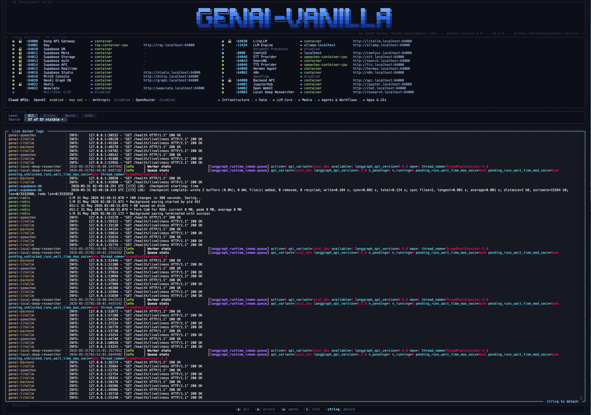
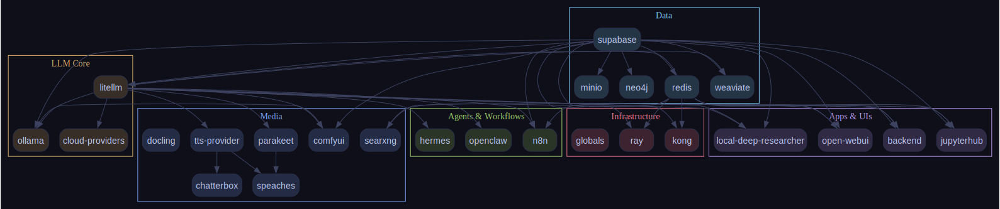

# GenAI Vanilla Stack

A flexible, modular GenAI project boilerplate with customizable services.

[](./docs/screenshots/wizard-running.png)

*The Textual TUI wizard mid-launch: ASCII brand banner pinned at the top, stack overview + cloud-API status, filter + log-source chips, and the live `docker compose` log stream below. Captured during a normal `./start.sh` run.*

[](./docs/diagrams/architecture.svg)

*Topologically-ordered architecture: external clients enter via Kong, the gateway routes to Apps and Agents, which call the LLM Core (LiteLLM → Ollama + cloud) and the Media + Data tiers. Hand-authored via the [`architecture-diagram` skill](https://github.com/anthropics/claude-code/tree/main/skills/architecture-diagram); the per-service diagrams under `services/<name>/architecture.svg` share the same design system but are auto-regenerated from each manifest's `data_flow.calls`.*

## 1. Quick Start

### 1.1 First-time setup

```bash
# 1. Clone the repository
git clone https://github.com/thekaveh/genai-vanilla && cd genai-vanilla

# 2. Start with the interactive setup wizard (no configuration needed)
./start.sh

# 3. Wait ~5 minutes for AI models to download, then access:
# Open WebUI (Chat):     http://localhost:63082
# n8n (Workflows):       http://localhost:63062
# Supabase Studio:       http://localhost:63017
# SearxNG (Search):      http://localhost:63043
# ComfyUI:               http://localhost:63041
# JupyterHub (IDE):      http://localhost:63081
# MinIO Console:         http://localhost:63019
#
# Optional Kong host routes after ./start.sh --setup-hosts:
# Chat:                  http://chat.localhost:63000
# n8n:                   http://n8n.localhost:63000
# ComfyUI:               http://comfyui.localhost:63000
# LiteLLM Dashboard:     http://litellm.localhost:63000/ui/
# MinIO Console:         http://minio.localhost:63000

# Default credentials:
# Supabase Studio: admin@example.com / changeme123
# n8n:             admin@example.com / changeme123
```

The default configuration runs the full stack on CPU: chat UI, workflow automation, vector database, and privacy search.

### 1.2 Common option combinations

```bash
# Local AI services (faster, less memory)
./start.sh --llm-provider-source ollama-localhost --comfyui-source localhost

# GPU acceleration
./start.sh --llm-provider-source ollama-container-gpu --comfyui-source container-gpu --stt-provider-source speaches-container-gpu

# Pick a different STT engine (Speaches is the default)
./start.sh --stt-provider-source parakeet-container-gpu   # SOTA NVIDIA (CC-BY-4.0)
./start.sh --stt-provider-source whisper-cpp-localhost    # Best on macOS — Metal + Core ML
./start.sh --stt-provider-source parakeet-localhost       # Parakeet-MLX (macOS) or native Linux

# Pick a different TTS engine (Speaches is the default)
./start.sh --tts-provider-source chatterbox-container-gpu  # Voice cloning, NVIDIA
./start.sh --tts-provider-source chatterbox-localhost      # Voice cloning, macOS MPS / Linux

# Minimal setup (chat only)
./start.sh --n8n-source disabled --searxng-source disabled --weaviate-source disabled

# Cloud-only LLMs (no local Ollama; LiteLLM gateway routes to cloud providers)
# The bootstrapper auto-disables a cloud provider whose API key is empty,
# so pass --openai-api-key on the command line OR set OPENAI_API_KEY in .env first.
./start.sh --llm-provider-source none --cloud-openai-source enabled --openai-api-key sk-... --comfyui-source disabled

# Observability bundle (Prometheus + Grafana + node-exporter + cAdvisor + per-service exporters)
# Off by default; opt in to scrape Kong, LiteLLM, Weaviate, n8n, JupyterHub, MinIO, Backend,
# Postgres, and Redis. 7 starter dashboards in the "GenAI Vanilla" Grafana folder.
# Grafana admin password is auto-generated on first run (see .env after launch).
./start.sh --prometheus-source container --grafana-source container
./start.sh --prometheus-source container --grafana-source container --prometheus-retention-days 30
```

### 1.3 Troubleshooting tips

- **Port conflicts?** → `./start.sh --base-port 64000`
- **Out of memory?** → Increase Docker memory to 10GB+
- **Can't access *.localhost?** → Run `./start.sh --setup-hosts`
- **Want fresh start?** → `./stop.sh --cold && ./start.sh --cold`

### 1.4 Interactive setup wizard

Running `./start.sh` with no arguments launches an interactive setup wizard that walks through configuring every service step by step:

- Step-by-step service configuration with descriptions and contextual hints (GPU requirements, localhost options, etc.)
- LLM cluster spliced immediately after the LLM Engine step: single unified Ollama models multiselect (source-aware — localhost/external rows are badged `[pulled]` / `[library]`) + a free-text "additional models to pull" step → OpenAI / Anthropic / OpenRouter key + multiselect pairs (live `/v1/models` fetch), keeping engine + local + cloud adjacent in the wizard flow
- Live `ollama.com/library` scrape (a few hundred entries; exact count depends on the upstream catalog at fetch time) for both container and host-side Ollama sources
- Real-time command preview showing the equivalent CLI command as you make selections
- Dependency validation that warns if you enable a service without its required dependencies
- Pre-launch summary table with all endpoints and access URLs before starting
- Color-coded streaming logs once the stack launches, with the full session (wizard warnings + launch phase) tee'd to `/tmp/genai-vanilla-launch-<YYYYMMDDTHHMMSS>.log`
- Keyboard shortcuts: `Esc` returns to the previous step, `Space` toggles multiselect rows, `Ctrl+Q` quits

The wizard covers all configurable services, base port selection, cold start option, and hosts file setup. After reviewing the configuration summary, confirm to launch the stack.

> For users who prefer CLI flags, all options remain available. See [Command Line Interface](#51-command-line-interface) or the [Interactive Setup Wizard Guide](docs/quick-start/interactive-setup-wizard.md).

## Table of contents

- [Quick Start](#1-quick-start)
- [Overview](#2-overview)
- [Getting Started](#3-getting-started)
- [Core Services](#4-core-services)
- [Usage Guide](#5-usage-guide)
- [Advanced Configuration](#6-advanced-configuration)
- [Development](#7-development)
- [Troubleshooting](#8-troubleshooting)
- [Documentation](#9-documentation)

## 2. Overview

### 2.1 What is GenAI Vanilla Stack?

GenAI Vanilla Stack is a customizable multi-service architecture for AI applications, featuring:

- **Dynamic service configuration**: SOURCE-based deployment with CLI overrides
- **Kong gateway**: auto-generated routes based on active services
- **Cross-platform support**: Python-based bootstrapping works on all OS
- **Flexible deployment**: mix containerized, localhost, and external services
- **GPU support**: container variants with NVIDIA GPU access for inference services
- **Always-on core**: Supabase ecosystem, Neo4j, Redis, LiteLLM gateway (fronts Ollama + cloud LLM providers), FastAPI backend, Kong Gateway
- **Opt-in**: Ray (distributed compute) and the LLM/Media/Agents tiers are activated via SOURCE flags or the interactive wizard

### 2.2 Key features

- **API gateway (Kong)**: centralized API management with dynamic routing
- **Real-time data sync**: live database notifications via Supabase Realtime
- **Flexible service sources**: switch between container, localhost, external, and cloud variants
- **Modular architecture**: choose service combinations via SOURCE variables
- **Environment-based config**: configuration through environment variables
- **Cross-platform Python scripts**: consistent behavior across Windows, macOS, Linux

### 2.3 Architecture overview

The canonical architecture diagram is embedded at the top of this README; the source lives at [`docs/diagrams/architecture.svg`](docs/diagrams/architecture.svg) — hand-authored via the [`architecture-diagram` skill](https://github.com/anthropics/claude-code/tree/main/skills/architecture-diagram) (cyan / emerald / violet / amber / rose / orange palette, JetBrains Mono, layered topological flow). See [`docs/diagrams/README.md`](docs/diagrams/README.md) for update instructions.

The diagram summarizes the default stack around Kong, Open WebUI, the always-on Backend API, the always-on LiteLLM gateway (fronting Ollama and any enabled cloud LLM providers), Supabase/PostgreSQL, Redis, Neo4j, Weaviate, n8n, ComfyUI, JupyterHub, SearxNG, Ray, and optional Hermes Agent / OpenClaw / STT/TTS/document-processing services. Per-service diagrams (auto-regenerated from each manifest's `data_flow.calls`) live next to each service folder at `services/<name>/architecture.{svg,html}`.

## 3. Getting Started

### 3.1 Getting started summary

- **New to the stack?** → Use containers with `./start.sh` for the easiest experience
- **Have local Ollama?** → Use `./start.sh --llm-provider-source ollama-localhost` for better performance (LiteLLM still fronts the upstream)
- **Have NVIDIA GPU?** → Use `./start.sh --comfyui-source container-gpu` for image generation acceleration
- **Need cloud APIs?** → Use `./start.sh --llm-provider-source none --cloud-openai-source enabled` (or the matching `--cloud-anthropic-source` / `--cloud-openrouter-source` flag) — LiteLLM routes to whichever providers are enabled
- **Limited resources?** → Disable services with `--n8n-source disabled --searxng-source disabled`

The SOURCE-based configuration system controls how each service is deployed.

### 3.2 Prerequisites

- **Docker & Docker Compose** — container orchestration
- **Python 3.10+** — for start/stop scripts
- **8GB+ RAM** allocated to Docker (12GB recommended)
- **10GB+ disk space** for Docker volumes

**Install UV (recommended)** for Python dependency management:
```bash
pip install uv
```

### 3.3 Installation

#### Quick install (recommended)
```bash
git clone <repository-url>
cd genai-vanilla
./start.sh
```

#### Custom configuration
```bash
# Edit configuration before starting
cp .env.example .env
# Edit .env to customize SOURCE variables
./start.sh
```

### 3.4 SOURCE system

The stack uses **SOURCE variables** to control how services are deployed.

**LLM access (always through LiteLLM):**
- **LiteLLM gateway** — always-on; every consumer reads `LITELLM_BASE_URL` + `LITELLM_API_KEY`
- **Ollama upstream** (`LLM_PROVIDER_SOURCE=ollama-container-cpu|ollama-container-gpu|ollama-localhost|none`) — what LiteLLM forwards to for local inference
- **Cloud upstreams** (`CLOUD_OPENAI_SOURCE`, `CLOUD_ANTHROPIC_SOURCE`, `CLOUD_OPENROUTER_SOURCE`) — independent `enabled`/`disabled` toggles; each requires the matching API key

**Other services that support localhost:**
- **ComfyUI** (`COMFYUI_SOURCE=localhost`) — use local ComfyUI; the bootstrapper resolves `host.docker.internal:${COMFYUI_LOCALHOST_PORT}` (default `8000`; override to `8188` or whatever port your host install uses)
- **Weaviate** (`WEAVIATE_SOURCE=localhost`) — use local Weaviate instance
- **OpenClaw** (`OPENCLAW_SOURCE=localhost`) — use local OpenClaw installation
- **Hermes Agent** (`HERMES_SOURCE=localhost`) — use a host-installed Hermes; the bootstrapper resolves `host.docker.internal:${HERMES_LOCALHOST_PORT}` (default `63028`); useful when Hermes should drive your real shell, browser, or microphone

**Container-only services:**
- **n8n** (`N8N_SOURCE=container|disabled`) — workflow automation
- **SearxNG** (`SEARXNG_SOURCE=container|disabled`) — privacy search
- **Open WebUI** (`OPEN_WEB_UI_SOURCE=container|disabled`) — chat interface
- **Backend API** (`BACKEND_SOURCE=container`) — always-on adaptive FastAPI backend
- **JupyterHub** (`JUPYTERHUB_SOURCE=container|disabled`) — data science IDE

**Observability bundle (opt-in, disabled by default):**
- **Prometheus** (`PROMETHEUS_SOURCE=container|disabled`) — metrics scraper + TSDB bundled with `node-exporter` and `cAdvisor`. When enabled, 12 scrape jobs cover Kong, LiteLLM, Weaviate, n8n, MinIO, Backend, Postgres (via `postgres-exporter` sidecar in the Supabase family), and Redis (via `redis-exporter` sidecar in the Redis family), plus four self / infrastructure targets (prometheus, grafana, node-exporter, cAdvisor). JupyterHub and Hermes are deferred — see `services/prometheus/README.md` §4. Retention is user-configurable via `--prometheus-retention-days` (default 7).
- **Grafana** (`GRAFANA_SOURCE=container|disabled`) — dashboards + unified alerting UI on top of Prometheus. Pre-provisions the Prometheus datasource and 7 starter dashboards (stack overview, LiteLLM, Kong, Postgres+Redis, Containers+Host, n8n, app-tier). Admin login is auto-generated on first bootstrap (`GRAFANA_ADMIN_USERNAME` / `GRAFANA_ADMIN_PASSWORD` in `.env`).

<!-- TOPOLOGY:BEGIN -->
_Auto-generated by `bootstrapper/tools/generate_readme_topology.py`._

_Engine-only manifests (speaches, chatterbox) are not listed — they're selected as source variants of their parent (STT Provider / TTS Provider) rather than as standalone services._

| Category | Service | Default port | Alias |
|---|---|---:|---|
| Infrastructure | Kong API Gateway | 63000 | — |
| Infrastructure | Ray | 63002 | ray.localhost |
| Infrastructure | Prometheus | 63005 | prometheus.localhost |
| Infrastructure | Grafana | 63008 | grafana.localhost |
| Data | Supabase DB | 63010 | — |
| Data | Supabase Meta | 63012 | — |
| Data | Supabase Storage | 63013 | — |
| Data | Supabase Auth | 63014 | — |
| Data | Supabase API | 63015 | — |
| Data | Supabase Realtime | 63016 | — |
| Data | Supabase Studio | 63017 | studio.localhost |
| Data | MinIO Console | 63019 | minio.localhost |
| Data | Neo4j Graph DB | 63021 | graph.localhost |
| Data | Redis | 63022 | — |
| Data | Weaviate | 63024 | weaviate.localhost |
| Data | Multi2Vec CLIP | — | — |
| LLM Core | LiteLLM | 63030 | litellm.localhost |
| LLM Core | LLM Engine | — | ollama.localhost |
| Media | Document Processor | 63040 | docling.localhost |
| Media | ComfyUI | 63041 | comfyui.localhost |
| Media | STT Provider | 63042 | stt.localhost |
| Media | SearxNG | 63043 | search.localhost |
| Media | TTS Provider | 63044 | tts.localhost |
| Agents & Workflows | Hermes Agent | 63060 | hermes.localhost |
| Agents & Workflows | n8n | 63062 | n8n.localhost |
| Agents & Workflows | OpenClaw | 63063 | openclaw.localhost |
| Apps & UIs | Backend API | 63080 | api.localhost |
| Apps & UIs | JupyterHub | 63081 | jupyter.localhost |
| Apps & UIs | Open WebUI | 63082 | chat.localhost |
| Apps & UIs | Local Deep Researcher | 63083 | research.localhost |
<!-- TOPOLOGY:END -->

## 4. Core Services

### 4.1 Service overview

| Service | Direct URL | Kong URL | Purpose | Auth required |
|---------|------------|----------|---------|---------------|
| **Open WebUI** | http://localhost:63082 | http://chat.localhost:63000 | AI chat interface | Create account |
| **n8n** | http://localhost:63062 | http://n8n.localhost:63000 | Workflow automation | admin@example.com |
| **Supabase Studio** | http://localhost:63017 | http://studio.localhost:63000 | Database management | admin@example.com |
| **ComfyUI** | http://localhost:63041 | http://comfyui.localhost:63000 | Image generation | None |
| **SearxNG** | http://localhost:63043 | http://search.localhost:63000 | Privacy search | None |
| **JupyterHub** | http://localhost:63081 | http://jupyter.localhost:63000 | Data science IDE — ships Python + Scala 2.13 + Scala 3 kernels; configured for VS Code remote-Jupyter (see [services/jupyterhub/README.md](services/jupyterhub/README.md) §10). | Token (optional; auto-generated if `JUPYTERHUB_TOKEN` is empty — grep from `docker logs genai-jupyterhub`) |
| **Neo4j Browser** | http://localhost:63021 | http://graph.localhost:63000 | Graph database | neo4j / password |
| **Backend API** | http://localhost:63080 | http://api.localhost:63000 | REST API | API key |
| **LiteLLM Gateway** | http://localhost:63030 | http://litellm.localhost:63000 | OpenAI-compatible LLM front door (Ollama + cloud). The same alias 302-redirects `/` → `/ui/` (admin dashboard). | API: `LITELLM_MASTER_KEY` (Bearer). Dashboard: `admin` / `${LITELLM_MASTER_KEY}` |
| **Audio (TTS + STT)** | TTS: http://localhost:63044, STT: http://localhost:63042 | http://tts.localhost:63000, http://stt.localhost:63000 | Default install: Speaches serves both `/v1/audio/speech` (Kokoro/Piper) and `/v1/audio/transcriptions` (Faster-Whisper). Engine-specific overrides — Chatterbox on `:63045`, Speaches on `:63046`, host-side variants resolved via `*_LOCALHOST_PORT`. See [services/tts-provider/README.md](services/tts-provider/README.md) and [services/stt-provider/README.md](services/stt-provider/README.md). | None |
| **Docling Processor** | http://localhost:63040 | http://docling.localhost:63000 | Document processing | None |
| **OpenClaw Agent** | http://localhost:63063 | http://openclaw.localhost:63000 | AI agent (messaging) | Token (optional) |
| **Hermes Agent** | http://localhost:63060 (API), http://localhost:63061 (dashboard) | http://hermes.localhost:63000 | Programmable AI agent runtime (Nous Research) | `HERMES_API_KEY` (Bearer) |
| **MinIO Console** | http://localhost:63019 | http://minio.localhost:63000 | S3-compatible object storage admin UI (gated on `MINIO_SOURCE != disabled`). S3 API at `:63018` is NOT aliased — S3 clients use the direct port. | `minioadmin` / `MINIO_ROOT_PASSWORD` |
| **Ray Dashboard** | http://localhost:63002 | http://ray.localhost:63000 | Distributed-compute substrate (cluster head + workers). Disabled by default; opt-in via `--ray-source ray-container-cpu` / `ray-container-gpu`. | None |
| **Prometheus** | http://localhost:63005 | http://prometheus.localhost:63000 | Metrics scraper + TSDB. Disabled by default; opt-in via `--prometheus-source container`. Bundled with `node-exporter` and `cAdvisor`. 12 scrape jobs cover the application + infra tiers — see [services/prometheus/README.md](services/prometheus/README.md). | None |
| **Grafana** | http://localhost:63008 | http://grafana.localhost:63000 | Observability dashboards + unified alerting on top of Prometheus. Disabled by default; opt-in via `--grafana-source container`. 7 starter dashboards ship pre-provisioned. | `admin` / auto-generated `GRAFANA_ADMIN_PASSWORD` (first-run) |

### 4.2 Database layer
- **PostgreSQL (Supabase)** — primary database with auth, storage, realtime
- **Neo4j** — graph database for relationships and graph queries
- **Weaviate** — vector database for embeddings and semantic search
- **MinIO** — S3-compatible artifact-tier object storage (ComfyUI outputs, Backend blobs, n8n files, JupyterHub datasets, Doc Processor output). Complements Supabase Storage rather than replacing it.
- **Redis** — cache and message queue

### 4.3 AI services
- **LiteLLM Gateway** — always-on OpenAI-compatible front door for every LLM provider in the stack (one URL, one key)
- **Ollama** — local LLM inference engine behind LiteLLM (supports CPU/GPU/localhost/external/none)
- **ComfyUI** — image generation with workflows
- **STT layer** — pluggable speech-to-text: Speaches (default, Faster-Whisper inside, CPU-friendly), NVIDIA Parakeet-TDT (SOTA EN/EU), whisper.cpp localhost (best on Apple Silicon)
- **TTS layer** — pluggable text-to-speech: Speaches (default, Kokoro + Piper voices), Chatterbox (voice cloning, MIT-licensed)
- **Docling** — document processing with table extraction (IBM Docling, GPU-accelerated)
- **OpenClaw** — AI agent for messaging platforms (WhatsApp, Telegram, Discord), file management, and task automation
- **Hermes Agent** — programmable AI agent runtime (Nous Research) with skills, memory, voice, and tool use; routes reasoning through LiteLLM and appears as the `hermes-agent` model to every consumer
- **Deep Researcher** — research assistant
- **LangMem** — persistent conversation memory with automated fact extraction, semantic recall, and consolidation (embedded in Backend)
- **Ray** — distributed-compute substrate (head + workers) for parallelizing Python workloads (data prep, fine-tuning, batch inference). Disabled by default; enable via `--ray-source ray-container-cpu` (or `ray-container-gpu`). Consumed by Backend / JupyterHub via `RAY_ADDRESS`.

## 5. Usage Guide

### 5.1 Command line interface

```bash
# Interactive wizard (recommended for first-time setup)
./start.sh                    # Launches step-by-step configuration wizard

# Direct commands (skip wizard)
./start.sh --llm-provider-source ollama-localhost  # Any flag skips wizard
./start.sh --help            # Show all options
./stop.sh                    # Stop services, keep data
./stop.sh --cold             # Stop and remove all data

# Port and network
./start.sh --base-port 64000  # Custom port range
./start.sh --setup-hosts      # Configure *.localhost domains

# SOURCE overrides (temporary)
./start.sh --llm-provider-source ollama-localhost
./start.sh --comfyui-source container-gpu
./start.sh --stt-provider-source whisper-cpp-localhost  # Best on Apple Silicon
./start.sh --tts-provider-source chatterbox-localhost   # Voice cloning, native
./start.sh --doc-processor-source docling-container-gpu # Enable document processing
./start.sh --openclaw-source container                 # Enable OpenClaw agent
./start.sh --hermes-source localhost                   # Use a host-installed Hermes
./start.sh --hermes-source disabled                    # Skip Hermes entirely
./start.sh --n8n-source disabled

# Combined examples
./start.sh --cold --base-port 55666 --llm-provider-source ollama-localhost

# Cloud provider keys + models (skip the wizard for cloud config)
./start.sh \
  --cloud-openai-source enabled --openai-api-key sk-... \
  --openai-models "gpt-5,gpt-5-mini,text-embedding-3-large"

# Multi-provider cloud setup
./start.sh \
  --cloud-openai-source enabled --openai-api-key sk-... --openai-models gpt-5 \
  --cloud-anthropic-source enabled --anthropic-api-key sk-ant-... --anthropic-models "claude-opus-4-7,claude-sonnet-4-6" \
  --cloud-openrouter-source enabled --openrouter-api-key sk-or-... --openrouter-models openrouter/auto

# Ollama model selection (CLI parity with the wizard's multiselects)
./start.sh \
  --llm-provider-source ollama-container-cpu \
  --ollama-models "qwen3.6:latest,nomic-embed-text" \
  --ollama-custom-models "mistral:7b,phi4:latest"
```

`*_USER_MODELS` env vars persist across runs, so you only need to pass the model flags once unless you want to change the active set. Cloud-provider key/source flags also imply `--cloud-X-source enabled` when paired with `--X-api-key`.

#### Stop script options

```bash
# Basic stop commands
./stop.sh                    # Stop services, keep data
./stop.sh --cold             # Stop and remove all data (destructive)
./stop.sh --clean-hosts      # Remove *.localhost entries from hosts file
./stop.sh --help             # Show all options

# The --cold option removes all Docker volumes (data loss).
# Use with caution — all database data will be permanently deleted.
```

### 5.2 Service access patterns

**Direct access:**
- Most services accessible directly via `http://localhost:PORT`
- Suitable for development and debugging

**Kong gateway routing:**
- Services with `*.localhost` URLs route through Kong
- Provides centralized authentication and rate limiting
- Requires hosts file setup: `./start.sh --setup-hosts`

## 6. Advanced Configuration

### 6.1 Custom deployments

See [docs/deployment/source-configuration.md](docs/deployment/source-configuration.md) for detailed SOURCE configuration guides.

### 6.2 GPU setup

For NVIDIA GPU acceleration, set the relevant SOURCE variables to a `*-container-gpu` variant (e.g., `LLM_PROVIDER_SOURCE=ollama-container-gpu`, `COMFYUI_SOURCE=container-gpu`, `STT_PROVIDER_SOURCE=speaches-container-gpu` or `parakeet-container-gpu`, `TTS_PROVIDER_SOURCE=speaches-container-gpu` or `chatterbox-container-gpu`). See [docs/deployment/source-configuration.md](docs/deployment/source-configuration.md) for the full list of GPU variants per service.

### 6.3 Using as infrastructure foundation

GenAI Vanilla can be used as a git submodule to provide infrastructure for your projects:

```bash
# Add as submodule in your project
git submodule add <repository-url> infra

# Configure and start
cd infra
cp .env.example .env
# Edit .env: Set PROJECT_NAME=myproject
./start.sh

# Access from your application
# - Docker network: myproject-network
# - Kong gateway: http://localhost:63000
# - Direct ports: derived from BASE_PORT, default http://localhost:63000+
```

**Capabilities:**
- Infrastructure code separated from application code
- Upstream updates can be pulled while maintaining local settings
- Project-specific environment configurations
- Standard git workflow for contributing changes upstream
- Multiple isolated instances with separate Docker resources

**Integration patterns:**
1. **Docker network** — connect your services to `${PROJECT_NAME}-network`
2. **Kong gateway** — use Kong as single entry point (port 63000)
3. **Direct access** — access services via exposed ports

See [docs/deployment/submodule-usage.md](docs/deployment/submodule-usage.md) for the complete guide including:
- Detailed setup instructions
- Integration patterns with code examples
- Contributing back to genai-vanilla
- Troubleshooting submodule issues

## 7. Development

### 7.1 Project structure
```
genai-vanilla/
├── bootstrapper/              # Python startup, SOURCE parsing, port/Kong generation, wizard
│   ├── services/              # Manifest loader, validator, env_assembler, hooks, sc_synthesizer
│   ├── schemas/               # JSON Schemas for service.yml manifests
│   ├── tests/                 # ~390 tests (loader, validator, byte-equiv, source-permutation, hooks)
│   ├── tools/                 # validate_fragments CLI lint
│   └── start.py / stop.py     # Entry points
├── services/                  # One folder per service family — single source of truth
│   ├── globals/               # Project-wide vars (PROJECT_NAME, BASE_PORT, BRAND_*, tier ordering)
│   ├── supabase/              # supabase-db, db-init, meta, storage, auth, api, realtime, studio
│   │   ├── service.yml        # Manifest: env vars, source variants, deps, runtime_sc slice
│   │   ├── compose.yml        # Compose fragment for the family
│   │   └── db/                # SQL init scripts + snapshots (bind-mounted into supabase-db-init)
│   ├── litellm/               # LiteLLM gateway + init + catalog-init
│   │   ├── service.yml
│   │   ├── compose.yml
│   │   ├── init/              # litellm-init Dockerfile + scripts (config.yaml renderer)
│   │   └── catalog-init/      # llm-catalog-init Dockerfile + scripts (public.llms UPSERT)
│   ├── ollama/                # ollama + ollama-pull (with pull/ scripts subfolder)
│   ├── weaviate/              # weaviate + multi2vec-clip + weaviate-init
│   ├── comfyui/               # comfyui + comfyui-init (with init/ scripts subfolder)
│   ├── n8n/                   # n8n + n8n-worker + n8n-init (with init/ assets, workflows-stage/)
│   ├── open-webui/            # open-web-ui + open-webui-init (with extras/ tools+functions)
│   ├── hermes/                # hermes + hermes-init (with init/ scripts & templates)
│   ├── minio/                 # minio + minio-init (with init/ bucket provisioning scripts)
│   ├── backend/               # FastAPI backend (with app/ source code)
│   ├── jupyterhub/            # JupyterHub (with build/ Dockerfile + notebooks)
│   ├── neo4j/                 # Neo4j (with build/ Dockerfile + scripts)
│   ├── parakeet/              # STT engine (parakeet-gpu, with provider/ source code)
│   ├── speaches/              # Unified TTS+STT engine (CPU/GPU)
│   ├── chatterbox/            # TTS engine (GPU, voice cloning)
│   ├── tts-provider/          # Virtual manifest — TTS source selector (with provider/ host notes)
│   ├── docling/               # Document processor (with provider/ source code)
│   ├── searxng/               # SearXNG (with config/ settings.yml)
│   ├── local-deep-researcher/ # Research agent (with build/ Dockerfile)
│   ├── openclaw/              # OpenClaw agent gateway + init
│   ├── kong/                  # Kong API gateway
│   ├── ray/                   # Ray distributed-compute substrate (head + workers)
│   ├── cloud-providers/       # Virtual manifest — OpenAI/Anthropic/OpenRouter toggles
│   ├── stt-provider/          # Doc-only — aggregate STT provider documentation
│   ├── doc-processor/         # Doc-only — aggregate doc-processor documentation
│   ├── multi2vec-clip/        # Doc-only — aggregate multi2vec-clip documentation (container ships inside weaviate/)
│   └── _user/                 # (Gitignored) downstream submodule consumers' overlay slot
├── docs/                      # User, service, deployment, diagram, and planning docs
│   ├── CONTRIBUTING-services.md  # How to add a new service to the modular layout
│   └── …
├── scripts/                   # Top-level utility scripts (e.g. migration helpers)
├── docker-compose.yml         # ~55-line thin shell — include: list pulling each fragment
├── .env.example               # Configuration template (hand-maintained; kept in sync with manifests by tests)
├── start.sh / stop.sh         # Entry points
└── .github/workflows/         # CI: services-lint (validator, byte-equiv, source-permutation)
```

Top-level is intentionally minimal: `bootstrapper/`, `docs/`, `scripts/`, `services/`. Every service lives entirely under its `services/<name>/` folder — init scripts, source code, build context, config files — so opening a service folder shows everything that defines it.

### 7.2 Adding services

New services are declared by creating `services/<name>/{service.yml, compose.yml}` and adding the fragment to the `include:` list in `docker-compose.yml`. The manifest's `runtime_sc:` block declares per-source scale/environment/deploy/extra_hosts; `bootstrapper/services/sc_synthesizer.py` concatenates these slices into the dict that the bootstrapper consumes at startup. See [docs/CONTRIBUTING-services.md](docs/CONTRIBUTING-services.md) for the full walkthrough.

## 8. Troubleshooting

### 8.1 Common issues

**Port conflicts:**
```bash
./start.sh --base-port 64000  # Use different port range
lsof -i :63000               # Check what's using port
```

**Memory issues:**
```bash
# Increase Docker memory in Docker Desktop
# Settings → Resources → Memory (set to 10-12GB)
```

**Service health:**
```bash
docker compose ps              # Check service status
docker logs genai-litellm -f   # Check LLM gateway logs
docker logs genai-ollama -f    # Check Ollama upstream logs (if enabled)
```

### 8.2 Detailed troubleshooting

For longer-form troubleshooting guides, see [docs/quick-start/troubleshooting.md](docs/quick-start/troubleshooting.md).

## 9. Documentation

The [documentation index](docs/README.md) is the top-level navigation hub.
Key entry points by audience:

### 9.1 First-time users
- [Interactive setup wizard](docs/quick-start/interactive-setup-wizard.md) — step-by-step guided configuration on first `./start.sh`
- [Quick Start guides](docs/quick-start/) — installation and first-run
- [Troubleshooting](docs/quick-start/troubleshooting.md) — common issues and known-benign warnings
- [Expected startup warnings](docs/deployment/expected-startup-warnings.md) — log lines that look scary but aren't

### 9.2 Operators
- [SOURCE configuration](docs/deployment/source-configuration.md) — every service's container / localhost / external / disabled / api modes (and GPU variants)
- [Ports and routes](docs/deployment/ports-and-routes.md) — canonical port offsets, direct URLs, and Kong routes
- [Using as a submodule](docs/deployment/submodule-usage.md) — embedding the stack inside another project
- [Service documentation](services/) — per-service READMEs (each owns its manifest, compose fragment, and architecture diagram)

### 9.3 Contributors
- [CONTRIBUTING-services.md](docs/CONTRIBUTING-services.md) — adding a new service to the stack (manifest schema, compose fragment, docs regen)
- [SECURITY.md](SECURITY.md) — threat model, supported versions, responsible-disclosure address
- [Cross-service integration matrix](docs/research/integration-matrix.md) — Phase B research index linking every service to its candidate integrations
- [Research rows](docs/research/rows/) and [candidates](docs/research/candidates/) — per-service / per-candidate integration design notes

### 9.4 Release history
- [ROADMAP.md](docs/ROADMAP.md) — future development plans and tier-status of every service
- [CHANGELOG.md](docs/CHANGELOG.md) — release history and the `[Unreleased]` known-follow-ups block

## 10. Contributing

Contributions welcome. Open a PR or an issue to propose changes.

## 11. License

[Apache License 2.0](LICENSE)

## 12. Support

- Check the [documentation](docs/README.md)
- Report issues on [GitHub Issues](https://github.com/thekaveh/genai-vanilla/issues)
- Ask questions in [GitHub Discussions](https://github.com/thekaveh/genai-vanilla/discussions)
