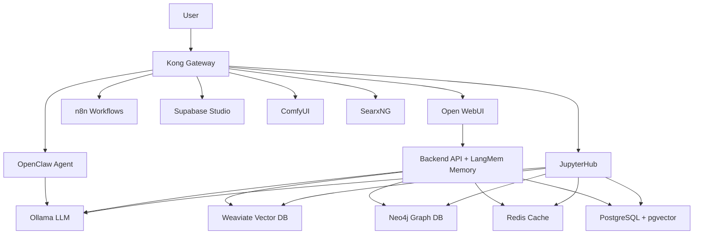

# GenAI Vanilla Stack

A flexible, modular GenAI project boilerplate with customizable services.


## Quick Start

### First-time setup

```bash
# 1. Clone the repository
git clone <your-repository-url> && cd genai-vanilla

# 2. Start with the interactive setup wizard (no configuration needed)
./start.sh

# 3. Wait ~5 minutes for AI models to download, then access:
# Open WebUI (Chat):     http://localhost:63015
# n8n (Workflows):       http://localhost:63002
# Supabase Studio:       http://localhost:63009
# SearxNG (Search):      http://localhost:63014
# ComfyUI:               http://comfyui.localhost:63002
# JupyterHub (IDE):      http://localhost:63048

# Default credentials:
# Supabase Studio: admin@example.com / changeme123
# n8n:             admin@example.com / changeme123
```

The default configuration runs the full stack on CPU: chat UI, workflow automation, vector database, and privacy search.

### Common option combinations

```bash
# Local AI services (faster, less memory)
./start.sh --llm-provider-source ollama-localhost --comfyui-source localhost

# GPU acceleration
./start.sh --llm-provider-source ollama-container-gpu --comfyui-source container-gpu --stt-provider-source parakeet-container-gpu

# Enable STT (disabled by default)
./start.sh --stt-provider-source parakeet-localhost  # Mac MLX or Linux native

# Enable TTS (disabled by default)
./start.sh --tts-provider-source xtts-localhost      # Any platform native
./start.sh --tts-provider-source xtts-container-gpu  # NVIDIA GPU Docker

# Minimal setup (chat only)
./start.sh --n8n-source disabled --searxng-source disabled --weaviate-source disabled

# Cloud APIs (no local AI)
./start.sh --llm-provider-source api --comfyui-source disabled
```

### Troubleshooting

- **Port conflicts?** → `./start.sh --base-port 64000`
- **Out of memory?** → Increase Docker memory to 10GB+
- **Can't access *.localhost?** → Run `./start.sh --setup-hosts`
- **Want fresh start?** → `./stop.sh --cold && ./start.sh --cold`

### Interactive setup wizard

Running `./start.sh` with no arguments launches an interactive setup wizard that walks through configuring every service step by step:

- Step-by-step service configuration with descriptions and contextual hints (GPU requirements, localhost options, etc.)
- Live progress bar tracking your progress through all configuration steps
- Real-time command preview showing the equivalent CLI command as you make selections
- Dependency validation that warns if you enable a service without its required dependencies
- Pre-launch summary table with all endpoints and access URLs before starting
- Keyboard shortcuts: `Escape` to restart from the beginning, `Ctrl+C` to quit

The wizard covers all configurable services, base port selection, cold start option, and hosts file setup. After reviewing the configuration summary, confirm to launch the stack.

> For users who prefer CLI flags, all options remain available. See [Command Line Interface](#41-command-line-interface) or the [Interactive Setup Wizard Guide](docs/quick-start/interactive-setup-wizard.md).

## Table of contents

- [Overview](#1-overview)
- [Getting Started](#2-getting-started)
- [Core Services](#3-core-services)
- [Usage Guide](#4-usage-guide)
- [Advanced Configuration](#5-advanced-configuration)
- [Development](#6-development)
- [Troubleshooting](#7-troubleshooting)
- [Documentation](#documentation)

## 1. Overview

### 1.1 What is GenAI Vanilla Stack?

GenAI Vanilla Stack is a customizable multi-service architecture for AI applications, featuring:

- **Dynamic service configuration**: SOURCE-based deployment with CLI overrides
- **Kong gateway**: auto-generated routes based on active services
- **Cross-platform support**: Python-based bootstrapping works on all OS
- **Flexible deployment**: mix containerized, localhost, and external services
- **GPU support**: container variants with NVIDIA GPU access for inference services
- **Core services**: Supabase ecosystem, Neo4j, Redis, Ollama, FastAPI backend, Kong Gateway

### 1.2 Key features

- **API gateway (Kong)**: centralized API management with dynamic routing
- **Real-time data sync**: live database notifications via Supabase Realtime
- **Flexible service sources**: switch between container, localhost, external, and cloud variants
- **Modular architecture**: choose service combinations via SOURCE variables
- **Environment-based config**: configuration through environment variables
- **Cross-platform Python scripts**: consistent behavior across Windows, macOS, Linux

### 1.3 Architecture overview


```mermaid
graph TB
    User[User] --> Kong[Kong Gateway]
    Kong --> OpenWebUI[Open WebUI]
    Kong --> N8N[n8n Workflows]
    Kong --> Supabase[Supabase Studio]
    Kong --> ComfyUI[ComfyUI]
    Kong --> SearxNG[SearxNG]
    Kong --> JupyterHub[JupyterHub]
    Kong --> OpenClaw[OpenClaw Agent]

    OpenClaw --> Ollama
    OpenWebUI --> Backend[Backend API + LangMem Memory]
    Backend --> Ollama[Ollama LLM]
    Backend --> Weaviate[Weaviate Vector DB]
    Backend --> Neo4j[Neo4j Graph DB]
    Backend --> Redis[Redis Cache]
    Backend --> PostgreSQL[PostgreSQL + pgvector]

    JupyterHub --> Ollama
    JupyterHub --> Weaviate
    JupyterHub --> Neo4j
    JupyterHub --> PostgreSQL
    JupyterHub --> Redis
```

## 2. Getting Started

### 2.1 Getting started summary

- **New to the stack?** → Use containers with `./start.sh` for the easiest experience
- **Have local Ollama?** → Use `./start.sh --llm-provider-source ollama-localhost` for better performance
- **Have NVIDIA GPU?** → Use `./start.sh --comfyui-source container-gpu` for image generation acceleration
- **Need cloud APIs?** → Use `./start.sh --llm-provider-source api` for OpenAI/Anthropic integration
- **Limited resources?** → Disable services with `--n8n-source disabled --searxng-source disabled`

The SOURCE-based configuration system controls how each service is deployed.

### 2.2 Prerequisites

- **Docker & Docker Compose** — container orchestration
- **Python 3.10+** — for start/stop scripts
- **8GB+ RAM** allocated to Docker (12GB recommended)
- **10GB+ disk space** for Docker volumes

**Install UV (recommended)** for Python dependency management:
```bash
pip install uv
```

### 2.2 Installation

#### Quick install (recommended)
```bash
git clone <repository-url>
cd genai-vanilla
./start.sh
```

#### Custom configuration
```bash
# Edit configuration before starting
cp .env.example .env
# Edit .env to customize SOURCE variables
./start.sh
```

### 2.3 SOURCE system

The stack uses **SOURCE variables** to control how services are deployed.

**Services that support localhost:**
- **Ollama** (`LLM_PROVIDER_SOURCE=ollama-localhost`) — use local Ollama installation
- **ComfyUI** (`COMFYUI_SOURCE=localhost`) — use local ComfyUI (port 8188)
- **Weaviate** (`WEAVIATE_SOURCE=localhost`) — use local Weaviate instance
- **OpenClaw** (`OPENCLAW_SOURCE=localhost`) — use local OpenClaw installation

**Container-only services:**
- **n8n** (`N8N_SOURCE=container|disabled`) — workflow automation
- **SearxNG** (`SEARXNG_SOURCE=container|disabled`) — privacy search
- **Open WebUI** (`OPEN_WEB_UI_SOURCE=container|disabled`) — chat interface
- **Backend API** (`BACKEND_SOURCE=container|disabled`) — FastAPI backend
- **JupyterHub** (`JUPYTERHUB_SOURCE=container|disabled`) — data science IDE

## 3. Core Services

### 3.1 Service overview

| Service | URL | Purpose | Auth required |
|---------|-----|---------|---------------|
| **Open WebUI** | http://localhost:63015 | AI chat interface | Create account |
| **n8n** | http://n8n.localhost:63002 | Workflow automation | admin@example.com |
| **Supabase Studio** | http://localhost:63009 | Database management | admin@example.com |
| **ComfyUI** | http://comfyui.localhost:63002 | Image generation | None |
| **SearxNG** | http://search.localhost:63002 | Privacy search | None |
| **JupyterHub** | http://localhost:63048 | Data science IDE | Token (optional) |
| **Neo4j Browser** | http://localhost:63011 | Graph database | neo4j / password |
| **Backend API** | http://localhost:63000 | REST API | API key |
| **Ollama API** | http://localhost:63004 | LLM API | None |
| **Parakeet STT** | http://localhost:63022 | Speech-to-text | None |
| **XTTS v2 TTS** | http://localhost:63023 | Text-to-speech | None |
| **Docling Processor** | http://localhost:63021 | Document processing | None |
| **OpenClaw Agent** | http://openclaw.localhost:63002 | AI agent (messaging) | Token (optional) |

### 3.2 Database layer
- **PostgreSQL (Supabase)** — primary database with auth, storage, realtime
- **Neo4j** — graph database for relationships and graph queries
- **Weaviate** — vector database for embeddings and semantic search
- **Redis** — cache and message queue

### 3.3 AI services
- **Ollama** — local LLM inference (supports CPU/GPU/localhost)
- **ComfyUI** — image generation with workflows
- **Parakeet STT** — speech-to-text with NVIDIA Parakeet-TDT (localhost for Mac MLX, Docker for NVIDIA GPU)
- **XTTS v2 TTS** — text-to-speech with voice cloning (NVIDIA GPU in Docker or native on any platform)
- **Docling** — document processing with table extraction (IBM Docling, GPU-accelerated)
- **OpenClaw** — AI agent for messaging platforms (WhatsApp, Telegram, Discord), file management, and task automation
- **Deep Researcher** — research assistant
- **LangMem** — persistent conversation memory with automated fact extraction, semantic recall, and consolidation (embedded in Backend)

## 4. Usage Guide

### 4.1 Command line interface

```bash
# Interactive wizard (recommended for first-time setup)
./start.sh                    # Launches step-by-step configuration wizard

# Direct commands (skip wizard)
./start.sh --llm-provider-source ollama-localhost  # Any flag skips wizard
./start.sh --help            # Show all options
./stop.sh                    # Stop services, keep data
./stop.sh --cold             # Stop and remove all data

# Port and network
./start.sh --base-port 64000  # Custom port range
./start.sh --setup-hosts      # Configure *.localhost domains

# SOURCE overrides (temporary)
./start.sh --llm-provider-source ollama-localhost
./start.sh --comfyui-source container-gpu
./start.sh --stt-provider-source parakeet-localhost    # Mac users must use localhost
./start.sh --tts-provider-source xtts-localhost        # Any platform native
./start.sh --doc-processor-source docling-container-gpu # Enable document processing
./start.sh --openclaw-source container                 # Enable OpenClaw agent
./start.sh --n8n-source disabled

# Combined examples
./start.sh --cold --base-port 55666 --llm-provider-source ollama-localhost
```

#### Stop script options

```bash
# Basic stop commands
./stop.sh                    # Stop services, keep data
./stop.sh --cold             # Stop and remove all data (destructive)
./stop.sh --clean-hosts      # Remove *.localhost entries from hosts file
./stop.sh --help             # Show all options

# The --cold option removes all Docker volumes (data loss).
# Use with caution — all database data will be permanently deleted.
```

### 4.2 Service access patterns

**Direct access:**
- Most services accessible directly via `http://localhost:PORT`
- Suitable for development and debugging

**Kong gateway routing:**
- Services with `*.localhost` URLs route through Kong
- Provides centralized authentication and rate limiting
- Requires hosts file setup: `./start.sh --setup-hosts`

## 5. Advanced Configuration

### 5.1 Custom deployments

See [docs/deployment/source-configuration.md](docs/deployment/source-configuration.md) for detailed SOURCE configuration guides.

### 5.2 GPU setup

For NVIDIA GPU acceleration, set the relevant SOURCE variables to a `*-container-gpu` variant (e.g., `LLM_PROVIDER_SOURCE=ollama-container-gpu`, `COMFYUI_SOURCE=container-gpu`, `STT_PROVIDER_SOURCE=parakeet-container-gpu`). See [docs/deployment/source-configuration.md](docs/deployment/source-configuration.md) for the full list of GPU variants per service.

### 5.3 Using as infrastructure foundation

GenAI Vanilla can be used as a git submodule to provide infrastructure for your projects:

```bash
# Add as submodule in your project
git submodule add <repository-url> infra

# Configure and start
cd infra
cp .env.example .env
# Edit .env: Set PROJECT_NAME=myproject
./start.sh

# Access from your application
# - Docker network: myproject-network
# - Kong gateway: http://localhost:63002
# - Direct ports: http://localhost:63000+
```

**Capabilities:**
- Infrastructure code separated from application code
- Upstream updates can be pulled while maintaining local settings
- Project-specific environment configurations
- Standard git workflow for contributing changes upstream
- Multiple isolated instances with separate Docker resources

**Integration patterns:**
1. **Docker network** — connect your services to `${PROJECT_NAME}-network`
2. **Kong gateway** — use Kong as single entry point (port 63002)
3. **Direct access** — access services via exposed ports

See [docs/deployment/submodule-usage.md](docs/deployment/submodule-usage.md) for the complete guide including:
- Detailed setup instructions
- Integration patterns with code examples
- Contributing back to genai-vanilla
- Troubleshooting submodule issues

## 6. Development

### 6.1 Project structure
```
genai-vanilla/
├── bootstrapper/              # Python bootstrapping scripts
├── services/                  # Service definitions
├── volumes/                   # Persistent data
├── docs/                      # Documentation
├── docker-compose.yml         # Main compose file
├── .env.example              # Configuration template
├── start.sh                  # Start script
└── stop.sh                   # Stop script
```

### 6.2 Adding services

New services are declared in `bootstrapper/service-configs.yml` (under `source_configurable` or `adaptive_services`) and wired into `docker-compose.yml`. The bootstrapper computes ports, generates Kong routes, and adapts dependent services automatically.

## 7. Troubleshooting

### 7.1 Common issues

**Port conflicts:**
```bash
./start.sh --base-port 64000  # Use different port range
lsof -i :63015               # Check what's using port
```

**Memory issues:**
```bash
# Increase Docker memory in Docker Desktop
# Settings → Resources → Memory (set to 10-12GB)
```

**Service health:**
```bash
docker compose ps            # Check service status
docker logs genai-ollama -f  # Check specific service logs
```

### 7.2 Detailed troubleshooting

For longer-form troubleshooting guides, see [docs/quick-start/troubleshooting.md](docs/quick-start/troubleshooting.md).

## Documentation

- [Documentation index](docs/README.md)
- [Quick Start guides](docs/quick-start/) — installation and first-run
- [Service documentation](docs/services/) — individual service guides
- [Deployment guides](docs/deployment/) — deployment options and configuration
- [ROADMAP.md](docs/ROADMAP.md) — future development plans
- [CHANGELOG.md](docs/CHANGELOG.md) — release history

## Contributing

Contributions welcome. Open a PR or an issue to propose changes.

## License

[MIT License](LICENSE)

## Support

- Check the [documentation](docs/README.md)
- Report issues on [GitHub Issues](https://github.com/your-repo/issues)
- Ask questions in [GitHub Discussions](https://github.com/your-repo/discussions)
