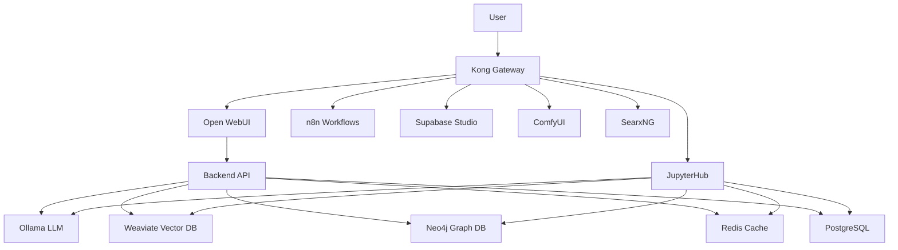

# GenAI Vanilla Stack

A flexible, modular GenAI project boilerplate with customizable services.


> **🚀 Get started in 5 minutes** - Complete AI stack with chat UI, workflow automation, vector database, and privacy search.

## 🚀 Quick Start

### Zero to Hero in 5 Minutes

```bash
# 1. Clone the repository
git clone <your-repository-url> && cd genai-vanilla

# 2. Start everything with defaults (no configuration needed!)
./start.sh

# 3. Wait ~5 minutes for AI models to download, then access:
# 🎨 Open WebUI (Chat): http://localhost:63015
# 🔧 n8n (Workflows): http://localhost:63002
# 📊 Supabase Studio: http://localhost:63009
# 🔍 SearxNG (Search): http://localhost:63014
# 🖼️ ComfyUI: http://comfyui.localhost:63002
# 📓 JupyterHub (IDE): http://localhost:63048

# Default credentials:
# Supabase Studio: admin@example.com / changeme123
# n8n: admin@example.com / changeme123
```

**What you get:** A complete AI stack with chat UI, workflow automation, vector database, and privacy search - all running locally with CPU.

### ⚡ Quick Options

```bash
# Local AI services (faster, less memory)
./start.sh --llm-provider-source ollama-localhost --comfyui-source localhost

# GPU acceleration
./start.sh --llm-provider-source ollama-container-gpu --comfyui-source container-gpu --stt-provider-source parakeet-container-gpu

# Enable STT (disabled by default)
./start.sh --stt-provider-source parakeet-localhost  # Mac MLX or Linux native

# Enable TTS (disabled by default)
./start.sh --tts-provider-source xtts-localhost      # Any platform native
./start.sh --tts-provider-source xtts-container-gpu  # NVIDIA GPU Docker

# Minimal setup (chat only)
./start.sh --n8n-source disabled --searxng-source disabled --weaviate-source disabled

# Cloud APIs (no local AI)
./start.sh --llm-provider-source api --comfyui-source disabled
```

### 🆘 Quick Fixes

- **Port conflicts?** → `./start.sh --base-port 64000`
- **Out of memory?** → Increase Docker memory to 10GB+
- **Can't access *.localhost?** → Run `./start.sh --setup-hosts`
- **Want fresh start?** → `./stop.sh --cold && ./start.sh --cold`

## 📖 Table of Contents

- [Overview](#1-overview)
- [Getting Started](#2-getting-started)
- [Core Services](#3-core-services)
- [Usage Guide](#4-usage-guide)
- [Advanced Configuration](#5-advanced-configuration)
- [Development](#6-development)
- [Troubleshooting](#7-troubleshooting)
- [Documentation](#-documentation)

## 1. Overview

### 1.1 What is GenAI Vanilla Stack?

GenAI Vanilla Stack is a customizable multi-service architecture for AI applications, featuring:

- **🔧 Dynamic Service Configuration**: SOURCE-based deployment with CLI overrides
- **🌐 Intelligent Kong Gateway**: Auto-generated routes based on active services  
- **💻 Cross-Platform Support**: Python-based bootstrapping works on all OS
- **🔄 Flexible Deployment**: Mix containerized, localhost, and external services
- **🚀 GPU Ready**: Support for GPU acceleration and cloud deployment (AWS ECS compatible)
- **🏗️ Core services**: Supabase ecosystem, Neo4j, Redis, Ollama, FastAPI backend, Kong Gateway

### 1.2 Key Features

- **API Gateway (Kong)**: Centralized API management with dynamic routing
- **Real-time Data Sync**: Live database notifications via Supabase Realtime
- **Flexible Service Sources**: Switch between container/localhost/external/cloud services
- **Modular Architecture**: Choose service combinations via SOURCE variables
- **Environment-based Config**: Easy configuration through environment variables
- **Cross-platform Python Scripts**: Consistent behavior across Windows, macOS, Linux

### 1.3 Architecture Overview



## 2. Getting Started

### 2.1 Getting Started Summary

**New to the stack?** → Use containers with `./start.sh` for the easiest experience  
**Have local Ollama?** → Use `./start.sh --llm-provider-source ollama-localhost` for better performance  
**Have NVIDIA GPU?** → Use `./start.sh --comfyui-source container-gpu` for maximum speed  
**Need cloud APIs?** → Use `./start.sh --llm-provider-source api` for OpenAI/Anthropic integration  
**Limited resources?** → Disable services with `--n8n-source disabled --searxng-source disabled`

The SOURCE-based configuration system provides a simple and flexible way to customize your deployment.

### 2.2 Prerequisites

- **Docker & Docker Compose** - Container orchestration
- **Python 3.10+** - For start/stop scripts
- **8GB+ RAM** allocated to Docker (12GB recommended)
- **10GB+ disk space** for Docker volumes

**Install UV (recommended)** for better Python dependency management:
```bash
pip install uv
```

### 2.2 Installation

#### Quick Install (Recommended)
```bash
git clone <repository-url>
cd genai-vanilla
./start.sh  # That's it!
```

#### Custom Configuration
```bash
# Edit configuration before starting
cp .env.example .env
# Edit .env to customize SOURCE variables
./start.sh
```

### 2.3 SOURCE System

The stack uses **SOURCE variables** to control how services are deployed:

**Services that support localhost:**
- ✅ **Ollama** (`LLM_PROVIDER_SOURCE=ollama-localhost`) - Use local Ollama installation
- ✅ **ComfyUI** (`COMFYUI_SOURCE=localhost`) - Use local ComfyUI (port 8188)
- ✅ **Weaviate** (`WEAVIATE_SOURCE=localhost`) - Use local Weaviate instance

**Container-only services:**
- ❌ **N8N** (`N8N_SOURCE=container|disabled`) - Workflow automation
- ❌ **SearxNG** (`SEARXNG_SOURCE=container|disabled`) - Privacy search
- ❌ **Open WebUI** (`OPEN_WEB_UI_SOURCE=container|disabled`) - Chat interface
- ❌ **Backend API** (`BACKEND_SOURCE=container|disabled`) - FastAPI backend
- ❌ **JupyterHub** (`JUPYTERHUB_SOURCE=container|disabled`) - Data Science IDE

## 3. Core Services

### 3.1 Service Overview

| Service | URL | Purpose | Auth Required |
|---------|-----|---------|---------------|
| **Open WebUI** | http://localhost:63015 | AI Chat Interface | Create account |
| **n8n** | http://n8n.localhost:63002 | Workflow Automation | admin@example.com |
| **Supabase Studio** | http://localhost:63009 | Database Management | admin@example.com |
| **ComfyUI** | http://comfyui.localhost:63002 | Image Generation | None |
| **SearxNG** | http://search.localhost:63002 | Privacy Search | None |
| **JupyterHub** | http://localhost:63048 | Data Science IDE | Token (optional) |
| **Neo4j Browser** | http://localhost:63011 | Graph Database | neo4j / password |
| **Backend API** | http://localhost:63000 | REST API | API key |
| **Ollama API** | http://localhost:63004 | LLM API | None |
| **Parakeet STT** | http://localhost:63022 | Speech-to-Text | None |
| **XTTS v2 TTS** | http://localhost:63023 | Text-to-Speech | None |
| **Docling Processor** | http://localhost:63021 | Document Processing | None |

### 3.2 Database Layer
- **PostgreSQL (Supabase)** - Primary database with auth, storage, realtime
- **Neo4j** - Graph database for relationships and graph queries  
- **Weaviate** - Vector database for embeddings and semantic search
- **Redis** - Cache and message queue

### 3.3 AI Services
- **Ollama** - Local LLM inference (supports CPU/GPU/localhost)
- **ComfyUI** - AI image generation with workflows
- **Parakeet STT** - Speech-to-text with NVIDIA Parakeet-TDT (localhost for Mac MLX, Docker for NVIDIA GPU)
- **XTTS v2 TTS** - Text-to-speech with voice cloning (NVIDIA GPU in Docker or native on any platform)
- **Docling** - AI-powered document processing with table extraction (IBM Docling, GPU-accelerated)
- **Deep Researcher** - AI-powered research assistant

## 4. Usage Guide

### 4.1 Command Line Interface

```bash
# Basic commands
./start.sh                    # Start with .env configuration
./start.sh --help            # Show all options
./stop.sh                    # Stop services, keep data
./stop.sh --cold             # Stop and remove all data

# Port and network
./start.sh --base-port 64000  # Custom port range
./start.sh --setup-hosts      # Configure *.localhost domains

# SOURCE overrides (temporary)
./start.sh --llm-provider-source ollama-localhost
./start.sh --comfyui-source container-gpu
./start.sh --stt-provider-source parakeet-localhost    # Mac users must use localhost
./start.sh --tts-provider-source xtts-localhost        # Any platform native
./start.sh --doc-processor-source docling-container-gpu # Enable document processing
./start.sh --n8n-source disabled

# Combined examples
./start.sh --cold --base-port 55666 --llm-provider-source ollama-localhost
```

#### Stop Script Options

```bash
# Basic stop commands
./stop.sh                    # Stop services, keep data
./stop.sh --cold             # Stop and remove all data (destructive!)
./stop.sh --clean-hosts      # Remove *.localhost entries from hosts file
./stop.sh --help            # Show all options

# The --cold option removes all Docker volumes (data loss!)
# Use with caution - all database data will be permanently deleted
```

### 4.2 Service Access Patterns

**Direct Access:**
- Most services accessible directly via `http://localhost:PORT`
- Good for development and debugging

**Kong Gateway Routing:**
- Services with `*.localhost` URLs route through Kong
- Provides centralized authentication and rate limiting
- Requires hosts file setup: `./start.sh --setup-hosts`

## 5. Advanced Configuration

### 5.1 Custom Deployments

See [docs/deployment/source-configuration.md](docs/deployment/source-configuration.md) for detailed SOURCE configuration guides.

### 5.2 GPU Setup

See [docs/deployment/gpu-setup.md](docs/deployment/gpu-setup.md) for NVIDIA GPU acceleration setup.

### 5.3 Development Setup

See [docs/development/](docs/development/) for development guides and API documentation.

## 6. Development

### 6.1 Project Structure
```
genai-vanilla/
├── bootstrapper/              # Python bootstrapping scripts
├── services/                  # Service definitions
├── volumes/                   # Persistent data
├── docs/                      # Detailed documentation
├── docker-compose.yml         # Main compose file
├── .env.example              # Configuration template
├── start.sh                  # Start script
└── stop.sh                   # Stop script
```

### 6.2 Adding Services

See [docs/development/adding-services.md](docs/development/adding-services.md) for guide on adding new services to the stack.

## 7. Troubleshooting

### 7.1 Common Issues

**Port Conflicts:**
```bash
./start.sh --base-port 64000  # Use different port range
lsof -i :63015               # Check what's using port
```

**Memory Issues:**
```bash
# Increase Docker memory in Docker Desktop
# Settings → Resources → Memory (set to 10-12GB)
```

**Service Health:**
```bash
docker compose ps            # Check service status
docker logs genai-ollama -f  # Check specific service logs
```

### 7.2 Detailed Troubleshooting

For comprehensive troubleshooting guides, see [docs/quick-start/troubleshooting.md](docs/quick-start/troubleshooting.md).

## 📚 Documentation

### Detailed Documentation
- [📖 Complete Documentation](docs/README.md) - Full documentation index
- [⚡ Quick Start Guides](docs/quick-start/) - Installation and first-run guides
- [🔧 Service Documentation](docs/services/) - Individual service guides
- [🚀 Deployment Guides](docs/deployment/) - Deployment options and configuration
- [💻 Development Docs](docs/development/) - Architecture and development guides
- [⚙️ Operations](docs/operations/) - Monitoring, backup, and maintenance
- [📋 Reference](docs/reference/) - CLI commands, environment variables, etc.

### Additional Resources
- [🗺️ ROADMAP.md](docs/ROADMAP.md) - Future development plans
- [📝 CHANGELOG.md](docs/CHANGELOG.md) - Release history and completed features

## 🤝 Contributing

We welcome contributions! See [docs/development/contributing.md](docs/development/contributing.md) for guidelines.

## 📄 License

[MIT License](LICENSE)

## 🆘 Support

- 📖 Check the [documentation](docs/README.md)
- 🐛 Report issues on [GitHub Issues](https://github.com/your-repo/issues)
- 💬 Ask questions in [GitHub Discussions](https://github.com/your-repo/discussions)

---

**GenAI Vanilla Stack** - Your foundation for AI application development 🚀