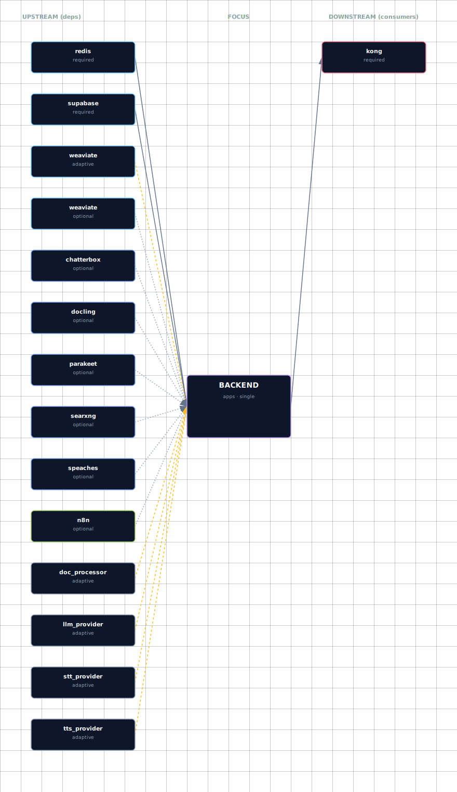

# Backend API

**Port:** 63016
**SOURCE variable:** `BACKEND_SOURCE`
**SOURCE options:** container

## Overview

Always-on adaptive FastAPI service that connects enabled AI, data, and workflow services.

## Access

| Path | URL | Notes |
|---|---|---|
| Direct | http://localhost:63016 | Works when the service is enabled in container mode and the port is exposed. |
| Kong | http://api.localhost:63002 | Requires `./start.sh --setup-hosts`; only available for services with Kong routes. |

See the canonical port table at [Ports and Routes](../../deployment/ports-and-routes.md).

## Configuration

Configure this service through `.env`, the interactive wizard, or CLI flags where available. Prefer SOURCE variables and documented env vars over direct `docker-compose.yml` edits.

```bash
BACKEND_SOURCE=<option>
```

Use `./start.sh` for the guided wizard, or pass a targeted flag for scripted changes when the CLI exposes one.

## Troubleshooting

```bash
# Check service status
docker compose ps

# Check logs; replace SERVICE with the compose service name when needed
docker compose logs -f SERVICE
```

For general startup and routing issues, see [Troubleshooting](../../quick-start/troubleshooting.md).

## Dependencies & Integrations

> Auto-generated section — the **Current** subsections are derived from `services/backend/service.yml`. Re-run `python -m bootstrapper.docs.regen backend` after manifest changes.

### Current — Upstream (this service depends on)

| Service | Type | Mechanism | Failure mode |
|---|---|---|---|
| redis | required | `http://redis:<port>` | _unspecified_ |
| supabase | required | `http://supabase:<port>` | _unspecified_ |
| weaviate | adaptive | `WEAVIATE_URL=http://weaviate:8080` | _unspecified_ |
| weaviate | optional | `(optional — wired conditionally; see manifest)` | _unspecified_ |
| chatterbox | optional | `(optional — wired conditionally; see manifest)` | _unspecified_ |
| docling | optional | `(optional — wired conditionally; see manifest)` | _unspecified_ |
| parakeet | optional | `(optional — wired conditionally; see manifest)` | _unspecified_ |
| searxng | optional | `(optional — wired conditionally; see manifest)` | _unspecified_ |
| speaches | optional | `(optional — wired conditionally; see manifest)` | _unspecified_ |
| n8n | optional | `(optional — wired conditionally; see manifest)` | _unspecified_ |
| doc_processor | adaptive | `DOCLING_ENDPOINT=${DOCLING_ENDPOINT}` | _unspecified_ |
| llm_provider | adaptive | `LITELLM_BASE_URL=http://litellm:4000` | _unspecified_ |
| stt_provider | adaptive | `STT_ENDPOINT=${STT_ENDPOINT}` | _unspecified_ |
| tts_provider | adaptive | `TTS_ENDPOINT=${TTS_ENDPOINT}` | _unspecified_ |

### Current — Downstream (services that depend on this)

| Service | Type | Mechanism |
|---|---|---|
| kong | required | kong declares backend in depends_on.required |

### Architecture diagram



[Open the interactive HTML diagram](./architecture.html) for a full-screen view.

### Future — Missing pair integrations

_No high-confidence opportunities identified._

### Future — Candidate new services

_No high-confidence opportunities identified._

### Future — Unused features in this service

_No high-confidence opportunities identified._
