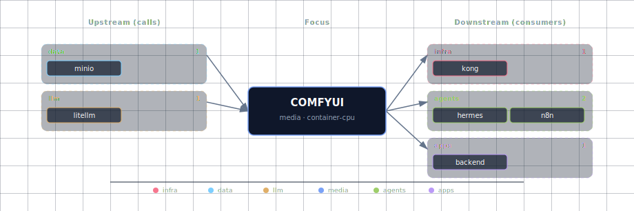

# ComfyUI

**Port:** 63018
**SOURCE variable:** `COMFYUI_SOURCE`
**SOURCE options:** container-cpu, container-gpu, localhost, external, disabled

## Overview

Image generation workflow UI/API. Container mode exposes the stack port; localhost/external modes route dependent services to configured URLs.

## Access

| Path | URL | Notes |
|---|---|---|
| Direct | http://localhost:63018 | Works when the service is enabled in container mode and the port is exposed. |
| Kong | http://comfyui.localhost:63002 | Requires `./start.sh --setup-hosts`; only available for services with Kong routes. |

See the canonical port table at [Ports and Routes](../../deployment/ports-and-routes.md).

## Configuration

Configure this service through `.env`, the interactive wizard, or CLI flags where available. Prefer SOURCE variables and documented env vars over direct `docker-compose.yml` edits.

```bash
COMFYUI_SOURCE=<option>
```

Use `./start.sh` for the guided wizard, or pass a targeted flag for scripted changes when the CLI exposes one.

## Troubleshooting

```bash
# Check service status
docker compose ps

# Check logs; replace SERVICE with the compose service name when needed
docker compose logs -f SERVICE
```

For general startup and routing issues, see [Troubleshooting](../../quick-start/troubleshooting.md).

## Dependencies & Integrations

> Auto-generated section — the **Current** subsections are derived from `services/comfyui/service.yml`'s `data_flow.calls` field (and inverse passes). Re-run `python -m bootstrapper.docs.regen comfyui` after manifest changes.

### Current — Upstream (this service calls)

| Service | Category |
|---|---|
| minio | data |
| litellm | llm |

### Current — Downstream (services that call this)

| Service | Category |
|---|---|
| kong | infra |
| hermes | agents |
| n8n | agents |
| backend | apps |

### Architecture diagram



[Open the interactive HTML diagram](./architecture.html) for a full-screen view.

### Future — Missing pair integrations

_No high-confidence opportunities identified._

### Future — Candidate new services

_No high-confidence opportunities identified._

### Future — Unused features in this service

_No high-confidence opportunities identified._
