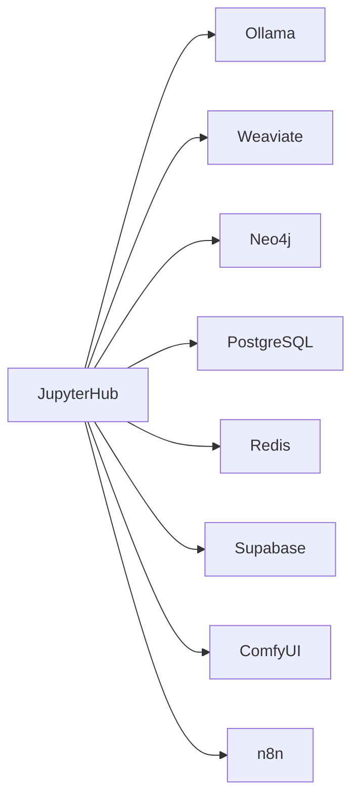

# JupyterHub - Data Science IDE

**Status:** ✅ Production Ready
**Port:** 63048
**Category:** Application Tier
**Dependencies:** PostgreSQL, Redis, Ollama, Weaviate, Neo4j

---

## Overview

JupyterHub provides an interactive Jupyter Lab environment pre-configured with access to all GenAI Vanilla Stack services. It's designed for data scientists and AI engineers to experiment, prototype, and develop AI applications.

## Quick Start

### Access JupyterHub

```bash
# Start the stack (JupyterHub enabled by default)
./start.sh

# Access at: http://localhost:63048
```

### Disable JupyterHub

```bash
# Temporarily disable
./start.sh --jupyterhub-source disabled

# Permanently disable (edit .env)
JUPYTERHUB_SOURCE=disabled
```

## Features

- **Pre-installed AI Libraries**: Ollama, LangChain, LlamaIndex, Transformers
- **Database Clients**: Weaviate, Neo4j, PostgreSQL, Redis, Supabase
- **Sample Notebooks**: 7 ready-to-use notebooks demonstrating service integration
- **Persistent Storage**: All notebooks saved in Docker volumes
- **Environment Variables**: Auto-configured connections to all services

## Configuration

### Environment Variables (`.env`)

```bash
JUPYTERHUB_SOURCE=container     # Options: container, disabled
JUPYTERHUB_IMAGE=jupyter/datascience-notebook:latest
JUPYTERHUB_PORT=63048
JUPYTERHUB_TOKEN=               # Optional: authentication token
```

### Authentication

- **No token set**: Auto-generated token shown in logs
- **Custom token**: Set `JUPYTERHUB_TOKEN` in `.env`
- **View token**: `docker logs genai-jupyterhub | grep token`

## Sample Notebooks

| Notebook | Description |
|----------|-------------|
| `00_environment_check.ipynb` | Verify all service connections |
| `01_ollama_basics.ipynb` | LLM inference with Ollama |
| `02_langchain_rag.ipynb` | RAG pipeline with Weaviate |
| `03_neo4j_graphs.ipynb` | Knowledge graph queries |
| `04_supabase_data.ipynb` | Database and storage operations |
| `05_comfyui_images.ipynb` | AI image generation |
| `06_n8n_workflows.ipynb` | Workflow automation |

## Service Integration Examples

### Connect to Ollama (LLM)

```python
import os
from ollama import Client

client = Client(host=os.getenv("OLLAMA_BASE_URL"))
response = client.chat(model="llama3.2", messages=[
    {"role": "user", "content": "Hello!"}
])
```

### Connect to Weaviate (Vector DB)

```python
import os
import weaviate

client = weaviate.connect_to_custom(
    http_host=os.getenv("WEAVIATE_URL").replace("http://", "").split(":")[0],
    http_port=8080
)
```

### Connect to Neo4j (Graph DB)

```python
import os
from neo4j import GraphDatabase

driver = GraphDatabase.driver(
    os.getenv("NEO4J_URI"),
    auth=(os.getenv("NEO4J_USER"), os.getenv("NEO4J_PASSWORD"))
)
```

## Data Persistence

- **Work Directory**: `/home/jovyan/work` - Persisted in `jupyterhub-data` volume
- **Sample Notebooks**: `/home/jovyan/notebooks` - Read-only, copy to `work/` to modify
- **Shared Config**: `/shared` - Weaviate configuration (read-only)

## Custom Packages

### Temporary Installation

```bash
!pip install package-name
```

### Permanent Installation

1. Edit `jupyterhub/requirements.txt`
2. Rebuild: `docker compose build jupyterhub`
3. Restart: `./stop.sh && ./start.sh`

## Troubleshooting

### Cannot Access JupyterHub

**Check if running:**
```bash
docker ps | grep jupyterhub
```

**View logs:**
```bash
docker logs genai-jupyterhub
```

### Token Not Working

**Get current token:**
```bash
docker logs genai-jupyterhub | grep "token="
```

**Set permanent token:**
```bash
# In .env
JUPYTERHUB_TOKEN=my-secret-token
```

### Port Already in Use

```bash
# In .env
JUPYTERHUB_PORT=64048  # Use different port
```

### Out of Memory

Increase Docker memory:
- Docker Desktop → Settings → Resources → Memory
- Recommended: 8GB+ for data science workloads

## Advanced Configuration

### GPU Access

If using GPU-enabled services, add to `docker-compose.yml`:

```yaml
jupyterhub:
  deploy:
    resources:
      reservations:
        devices:
          - driver: nvidia
            count: 1
            capabilities: [gpu]
```

### Multi-user Setup

For authentication, create `jupyterhub_config.py`:

```python
c.JupyterHub.authenticator_class = 'firstuseauthenticator.FirstUseAuthenticator'
```

## Architecture



## Resources

- [Jupyter Lab Documentation](https://jupyterlab.readthedocs.io/)
- [JupyterHub Documentation](https://jupyterhub.readthedocs.io/)
- [Sample Notebooks](../../jupyterhub/notebooks/)
- [GenAI Stack Docs](../README.md)

## Support

- **Logs**: `docker logs genai-jupyterhub`
- **Issues**: [GitHub Issues](https://github.com/your-repo/issues)
- **Docs**: [Full Documentation](../README.md)
