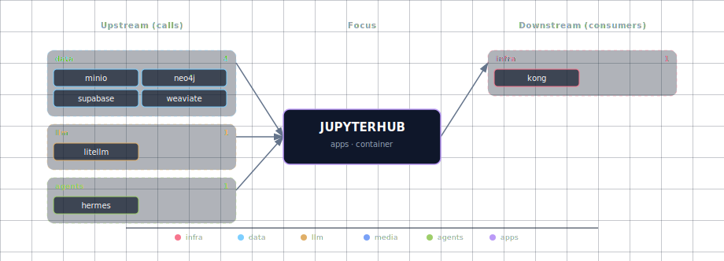

# JupyterHub - Data Science IDE

**Port:** 63048
**Category:** Application Tier
**Dependencies:** PostgreSQL, Redis, LiteLLM (gateway to Ollama / cloud LLMs), Weaviate, Neo4j

---

## Overview

JupyterHub provides an interactive Jupyter Lab environment pre-configured with access to all GenAI Vanilla Stack services. It's designed for data scientists and AI engineers to experiment, prototype, and develop AI applications.

## Quick Start

### Access JupyterHub

```bash
# Start the stack (JupyterHub enabled by default)
./start.sh

# Access at: http://localhost:63048
```

### Disable JupyterHub

```bash
# Temporarily disable
./start.sh --jupyterhub-source disabled

# Permanently disable (edit .env)
JUPYTERHUB_SOURCE=disabled
```

## Features

- **Pre-installed AI Libraries**: OpenAI SDK (pointed at LiteLLM), LangChain, LlamaIndex, Transformers
- **Database Clients**: Weaviate, Neo4j, PostgreSQL, Redis, Supabase
- **Sample Notebooks**: 7 ready-to-use notebooks demonstrating service integration
- **Persistent Storage**: All notebooks saved in Docker volumes
- **Environment Variables**: Auto-configured connections to all services

## Configuration

### Environment Variables (`.env`)

```bash
JUPYTERHUB_SOURCE=container     # Options: container, disabled
# Using python-3.11 tag for stable builds and Docker cache optimization
# Note: :latest tag causes rebuilds every time (5-10 min). Use specific version for caching.
JUPYTERHUB_IMAGE=jupyter/datascience-notebook:python-3.11
JUPYTERHUB_PORT=63048
JUPYTERHUB_TOKEN=               # Optional: authentication token
```

> **Performance Tip**: The `python-3.11` tag provides stable Docker layer caching, reducing rebuild times from 8-10 minutes to 5-10 seconds on subsequent starts. Using `:latest` forces Docker to check for updates and rebuild layers every time.

### Authentication

- **No token set**: Auto-generated token shown in logs
- **Custom token**: Set `JUPYTERHUB_TOKEN` in `.env`
- **View token**: `docker logs genai-jupyterhub | grep token`

## Sample Notebooks

| Notebook | Description |
|----------|-------------|
| `00_environment_check.ipynb` | Verify all service connections |
| `01_ollama_basics.ipynb` | LLM inference via the LiteLLM gateway (Ollama upstream) |
| `02_langchain_rag.ipynb` | RAG pipeline with Weaviate |
| `03_neo4j_graphs.ipynb` | Knowledge graph queries |
| `04_supabase_data.ipynb` | Database and storage operations |
| `05_comfyui_images.ipynb` | AI image generation |
| `06_n8n_workflows.ipynb` | Workflow automation |

## Service Integration Examples

### Connect to the LLM gateway (LiteLLM)

Every notebook talks to LiteLLM via the OpenAI-compatible API — never to Ollama directly. The container has `OPENAI_API_BASE` and `OPENAI_API_KEY` pre-set from `LITELLM_BASE_URL` and `LITELLM_API_KEY` (which equals `LITELLM_MASTER_KEY`).

```python
import os
from openai import OpenAI

client = OpenAI(
    base_url=os.getenv("OPENAI_API_BASE"),  # e.g. http://litellm:4000/v1
    api_key=os.getenv("OPENAI_API_KEY"),    # equals $LITELLM_API_KEY
)

response = client.chat.completions.create(
    model="ollama/qwen3.6:latest",  # or "gpt-4o", "claude-sonnet-4-6", etc.
    messages=[{"role": "user", "content": "Hello!"}],
)
print(response.choices[0].message.content)
```

LangChain users should reach for `ChatOpenAI` / `OpenAIEmbeddings` against the same env vars:

```python
from langchain_openai import ChatOpenAI

llm = ChatOpenAI(model="ollama/qwen3.6:latest")  # picks up OPENAI_API_BASE / OPENAI_API_KEY
```

### Connect to Weaviate (Vector DB)

```python
import os
import weaviate

client = weaviate.connect_to_custom(
    http_host=os.getenv("WEAVIATE_URL").replace("http://", "").split(":")[0],
    http_port=8080
)
```

### Connect to Neo4j (Graph DB)

```python
import os
from neo4j import GraphDatabase

driver = GraphDatabase.driver(
    os.getenv("NEO4J_URI"),
    auth=(os.getenv("NEO4J_USER"), os.getenv("NEO4J_PASSWORD"))
)
```

## Data Persistence

- **Work Directory**: `/home/jovyan/work` - Persisted in `jupyterhub-data` volume
- **Sample Notebooks**: `/home/jovyan/notebooks` - Read-only, copy to `work/` to modify
- **Shared Config**: `/shared` - Weaviate configuration (read-only)

## Custom Packages

### Temporary Installation

```bash
!pip install package-name
```

### Permanent Installation

1. Edit `services/jupyterhub/build/requirements.txt`
2. Rebuild: `docker compose build jupyterhub`
3. Restart: `./stop.sh && ./start.sh`

## Troubleshooting

### Cannot Access JupyterHub

**Check if running:**
```bash
docker ps | grep jupyterhub
```

**View logs:**
```bash
docker logs genai-jupyterhub
```

### Token Not Working

**Get current token:**
```bash
docker logs genai-jupyterhub | grep "token="
```

**Set permanent token:**
```bash
# In .env
JUPYTERHUB_TOKEN=my-secret-token
```

### Port Already in Use

```bash
# In .env
JUPYTERHUB_PORT=64048  # Use different port
```

### Out of Memory

Increase Docker memory:
- Docker Desktop → Settings → Resources → Memory
- Recommended: 8GB+ for data science workloads

## Advanced Configuration

### GPU-aware workflows

JupyterHub itself is configured through `.env` and the stack startup flow. Prefer enabling GPU-backed upstream services through their SOURCE variables, for example `LLM_PROVIDER_SOURCE=ollama-container-gpu`, `COMFYUI_SOURCE=container-gpu`, or `MULTI2VEC_CLIP_SOURCE=container-gpu`.

Avoid direct `docker-compose.yml` edits for normal operation; local compose edits are unsupported experiments and can be overwritten or invalidated by future stack changes.

### Multi-user Setup

For authentication, create `jupyterhub_config.py`:

```python
c.JupyterHub.authenticator_class = 'firstuseauthenticator.FirstUseAuthenticator'
```

## Architecture

JupyterHub runs inside the Docker Compose network and receives environment variables for the services that are enabled. It reaches LLMs through the always-on LiteLLM gateway (`LITELLM_BASE_URL` / `LITELLM_API_KEY`, also exported as `OPENAI_API_BASE` / `OPENAI_API_KEY`) and connects directly to Weaviate, Neo4j, PostgreSQL/Supabase, Redis, ComfyUI, n8n, STT/TTS, and document-processing services when those services are available.

For the current high-level stack diagram, see [Architecture Diagram](../../diagrams/architecture.svg).

## Resources

- [Jupyter Lab Documentation](https://jupyterlab.readthedocs.io/)
- [JupyterHub Documentation](https://jupyterhub.readthedocs.io/)
- [Sample Notebooks](../../../services/jupyterhub/build/notebooks/)
- [GenAI Stack Docs](../../README.md)

## Support

- **Logs**: `docker logs genai-jupyterhub`
- **Issues**: [GitHub Issues](https://github.com/thekaveh/genai-vanilla/issues)
- **Docs**: [Full Documentation](../../README.md)

## Dependencies & Integrations

> Auto-generated section — the **Current** subsections are derived from `services/jupyterhub/service.yml`'s `data_flow.calls` field (and inverse passes). Re-run `python -m bootstrapper.docs.regen jupyterhub` after manifest changes.

### Current — Upstream (this service calls)

| Service | Category |
|---|---|
| minio | data |
| neo4j | data |
| supabase | data |
| weaviate | data |
| litellm | llm |
| hermes | agents |

### Current — Downstream (services that call this)

| Service | Category |
|---|---|
| kong | infra |

### Architecture diagram



[Open the interactive HTML diagram](./architecture.html) for a full-screen view.

### Future — Missing pair integrations

_No high-confidence opportunities identified._

### Future — Candidate new services

_No high-confidence opportunities identified._

### Future — Unused features in this service

_No high-confidence opportunities identified._
