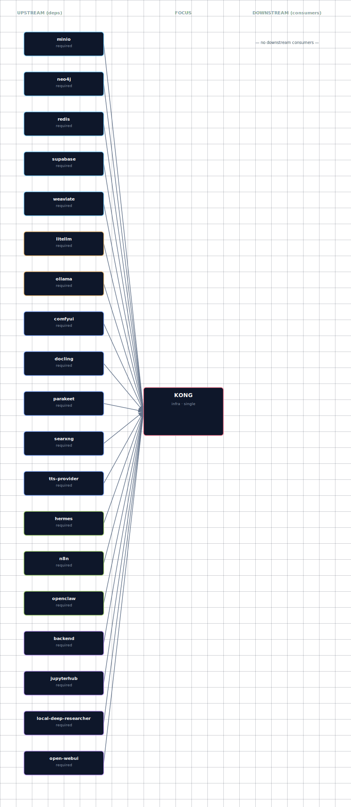

# Kong API Gateway

Kong serves as the intelligent API gateway for the GenAI Vanilla Stack, providing dynamic routing, authentication, and service management.

## Overview

Kong acts as the central entry point for most services, routing requests to appropriate backend services based on dynamic configuration generated at startup.

## Dynamic Configuration

Unlike traditional static configuration files, the GenAI Vanilla Stack uses dynamic Kong configuration that adapts to your SOURCE settings:

- **Automatic Route Generation**: Kong routes are created based on enabled services
- **Health Checking**: Localhost services are checked for availability before routing
- **Adaptive Configuration**: Disabled services automatically have their routes removed
- **No Manual Configuration**: Replaces the old dual kong.yml/kong-local.yml approach

The configuration is generated at startup by `bootstrapper/utils/kong_config_generator.py`.

`volumes/api/kong-dynamic.yml` is **a generated runtime artifact, not a checked-in file**. It is `.gitignore`d, regenerated on every `./start.sh`, and reflects the resolved SOURCE state (containers, localhost, external) at that moment. Direct `docker compose up` from a clean checkout will fail because the bind mount target won't exist — always launch through `./start.sh`, which writes the file before invoking compose.

Validate the default-route **generator contract** (no `./start.sh` needed; the checker materialises a tmp dir with a copy of `.env.example`, runs `kong_config_generator` against it, and verifies the output. Your local `volumes/api/kong-dynamic.yml` is *not* read — its contents depend on your current `.env`, which makes it useless as a regression check):

```bash
uv run --project bootstrapper python docs/scripts/check-kong-routes.py
```

Plain `python3 docs/scripts/check-kong-routes.py` works too if `PyYAML` is on your system Python — the checker prints `FAIL import: PyYAML is required to parse Kong config` and exits with status 2 otherwise. The `uv` form is preferred because it uses the project's pinned dependencies.

## Service Routing

### Always-Available Routes (Supabase)
- `/auth/v1/` → Supabase Auth service
- `/rest/v1/` → Supabase API (PostgREST)
- `/graphql/v1/` → Supabase GraphQL
- `/realtime/v1/` → Supabase Realtime
- `/storage/v1/` → Supabase Storage
- `/pg/` → Supabase Meta service
- `/` → Supabase Studio dashboard

### Dynamic Routes (Based on SOURCE)
- `comfyui.localhost` → ComfyUI service (if enabled)
- `n8n.localhost` → n8n service (if enabled)
- `search.localhost` → SearxNG service (if enabled)
- `api.localhost` → Backend API (always-on adaptive core service)
- `chat.localhost` → Open WebUI (if enabled)
- `jupyter.localhost` → JupyterHub (if enabled)
- `openclaw.localhost` → OpenClaw gateway (if enabled)
- `hermes.localhost` → Hermes Agent web dashboard (if `HERMES_SOURCE != disabled` and `HERMES_DASHBOARD_ENABLED=true`)
- `litellm.localhost` → LiteLLM gateway + admin dashboard (always-on; same alias exposes `/ui/`, `/v1/*`, and `/spend/*`)
- `minio.localhost` → MinIO admin console (if `MINIO_SOURCE != disabled`; S3 API at `MINIO_PORT` NOT aliased — S3 clients use the direct port)
- `studio.localhost` → Supabase Studio dashboard (and bare `localhost` falls through to the same upstream)
- `graph.localhost` → Neo4j Browser (`NEO4J_GRAPH_DB_SOURCE != disabled`)
- `weaviate.localhost` → Weaviate REST API (`WEAVIATE_SOURCE != disabled`)
- `ollama.localhost` → Ollama upstream (`LLM_PROVIDER_SOURCE ∈ {ollama-container-*, ollama-localhost}`; `ollama-external` does NOT get a Kong route — LiteLLM forwards via `LLM_PROVIDER_EXTERNAL_URL`)
- `docling.localhost` → Docling document processor (`DOC_PROCESSOR_SOURCE != disabled`)
- `research.localhost` → Local Deep Researcher (`LOCAL_DEEP_RESEARCHER_SOURCE != disabled`)
- `stt.localhost` → STT engine (`STT_PROVIDER_SOURCE != disabled`; container resolves to `parakeet-gpu` or `speaches`, localhost to `host.docker.internal` on the per-engine port)
- `tts.localhost` → TTS engine (`TTS_PROVIDER_SOURCE != disabled`; container resolves to `speaches:8000` or `chatterbox:4123`, localhost to `host.docker.internal` on the per-engine port)

Each `*-localhost` source still gets a Kong route — Kong proxies through `host.docker.internal` to the user's host machine. Kong's compose entry includes `extra_hosts: ["host.docker.internal:${HOST_GATEWAY_IP}"]` so this works on Linux Docker too (Docker Desktop on macOS/Windows resolves it automatically). Users with non-default localhost ports can override via `<SVC>_LOCALHOST_URL` env vars where the service's compose already reads them (docling, parakeet, whisper-cpp, chatterbox). Neo4j, Weaviate, and Ollama hardcode the default port — Kong matches the compose `runtime_sc` block so both consumers stay in sync.

## SOURCE-Based Configuration

### ComfyUI Routes
```python
# Generated based on COMFYUI_SOURCE
if source == 'localhost':
    service['url'] = COMFYUI_LOCALHOST_URL or 'http://host.docker.internal:8000/'
elif source == 'external':
    service['url'] = external_url
elif source in ['container-cpu', 'container-gpu']:
    service['url'] = 'http://comfyui:18188/'
# No route created if source == 'disabled'
```

### Localhost Service Health Checks
When routing to localhost services, Kong generator performs health checks:

```python
def check_localhost_service(self, host: str, port: int, service_name: str) -> bool:
    try:
        with socket.create_connection((host, port), timeout=2):
            return True
    except (socket.error, socket.timeout):
        print(f"WARN: {service_name} localhost service not reachable on {host}:{port}")
        return False
```

## Authentication

Kong handles multiple authentication schemes:

- **API Key Authentication**: Used for Supabase API services
- **Basic Authentication**: Used for protected admin interfaces
- **Pass-through Authentication**: For services that handle their own auth

## CORS Handling

All services automatically get CORS plugin configuration for cross-origin requests:

```python
'plugins': [{'name': 'cors'}]
```

## Rate Limiting

Some services include rate limiting for protection:

```python
# SearxNG example
{
    'name': 'rate-limiting',
    'config': {
        'minute': 60,
        'hour': 1000,
        'policy': 'local'
    }
}
```

## WebSocket Support

Kong supports WebSocket connections for real-time services:

```python
{
    'name': 'realtime-v1-ws',
    'url': 'http://supabase-realtime:4000/socket',
    'protocol': 'ws',
    # ...
}
```

## Configuration Generation Process

1. **Startup**: `start.py` calls Kong configuration generator at step 4.5
2. **Environment Parsing**: Current .env file is parsed for SOURCE values
3. **Health Checks**: Localhost services are checked for availability  
4. **Route Generation**: Only enabled services get routes created
5. **File Writing**: Configuration written to volumes/api/kong-dynamic.yml
6. **Kong Startup**: Kong loads the generated configuration

## Debugging Kong Configuration

### View Generated Configuration
```bash
# Check what configuration was generated
cat volumes/api/kong-dynamic.yml

# View Kong logs
docker logs genai-kong-api-gateway -f

# Test Kong health
curl http://localhost:63002/health
```

### Verify Routes
```bash
# List all configured routes
docker exec genai-kong-api-gateway kong config -c /kong.yml dump

# Test specific routes
curl -H "Host: comfyui.localhost" http://localhost:63002/
curl -H "Host: n8n.localhost" http://localhost:63002/
curl -H "Host: jupyter.localhost" http://localhost:63002/
curl -H "Host: openclaw.localhost" http://localhost:63002/
curl -H "Host: hermes.localhost" http://localhost:63002/
curl -H "Host: litellm.localhost" http://localhost:63002/ui/
curl -H "Host: minio.localhost" http://localhost:63002/
```

## Troubleshooting

### Common Issues

**Route not found (404)**
- Check if service SOURCE is enabled
- Verify service is running and healthy
- Check hosts file configuration

**Connection refused**
- For localhost routes, ensure service is running on specified port
- Check firewall settings for localhost services
- Verify Docker network connectivity

**Authentication errors**
- Check if service requires API key authentication
- Verify Supabase keys are properly generated
- Ensure proper headers are sent

### Debug Commands
```bash
# Check Kong gateway status
docker compose ps | grep kong

# View detailed Kong configuration
docker exec genai-kong-api-gateway cat /kong.yml

# Test internal Kong admin API
docker exec genai-kong-api-gateway curl http://localhost:8001/status
```

## Advanced Configuration

For advanced Kong configuration needs, modify the `KongConfigGenerator` class in `bootstrapper/utils/kong_config_generator.py`.

Key methods:
- `generate_kong_config()` - Main configuration generator
- `check_localhost_service()` - Health check implementation
- `generate_*_service()` - Service-specific route generators

## Integration with Other Services

Kong integrates tightly with:
- **Service Configuration**: Uses SOURCE values from service_config.py
- **Environment Management**: Reads from parsed .env files
- **Health Monitoring**: Checks localhost service availability
- **Dynamic Scaling**: Adapts to enabled/disabled services

For more information on Kong's role in the overall architecture, see the system overview in the project [README](../../README.md) and the architecture diagram at `docs/diagrams/architecture.svg`.

## Dependencies & Integrations

> Auto-generated section — the **Current** subsections are derived from `services/kong/service.yml`. Re-run `python -m bootstrapper.docs.regen kong` after manifest changes.

### Current — Upstream (this service depends on)

| Service | Type | Mechanism | Failure mode |
|---|---|---|---|
| minio | required | `http://minio:<port>` | _unspecified_ |
| neo4j | required | `http://neo4j:<port>` | _unspecified_ |
| redis | required | `http://redis:<port>` | _unspecified_ |
| supabase | required | `http://supabase:<port>` | _unspecified_ |
| weaviate | required | `http://weaviate:<port>` | _unspecified_ |
| litellm | required | `http://litellm:<port>` | _unspecified_ |
| ollama | required | `http://ollama:<port>` | _unspecified_ |
| comfyui | required | `http://comfyui:<port>` | _unspecified_ |
| docling | required | `http://docling:<port>` | _unspecified_ |
| parakeet | required | `http://parakeet:<port>` | _unspecified_ |
| searxng | required | `http://searxng:<port>` | _unspecified_ |
| tts-provider | required | `http://tts-provider:<port>` | _unspecified_ |
| hermes | required | `http://hermes:<port>` | _unspecified_ |
| n8n | required | `http://n8n:<port>` | _unspecified_ |
| openclaw | required | `http://openclaw:<port>` | _unspecified_ |
| backend | required | `http://backend:<port>` | _unspecified_ |
| jupyterhub | required | `http://jupyterhub:<port>` | _unspecified_ |
| local-deep-researcher | required | `http://local-deep-researcher:<port>` | _unspecified_ |
| open-webui | required | `http://open-webui:<port>` | _unspecified_ |

### Current — Downstream (services that depend on this)

_No downstream consumers._

### Architecture diagram



[Open the interactive HTML diagram](./architecture.html) for a full-screen view.

### Future — Missing pair integrations

_No high-confidence opportunities identified._

### Future — Candidate new services

_No high-confidence opportunities identified._

### Future — Unused features in this service

_No high-confidence opportunities identified._
