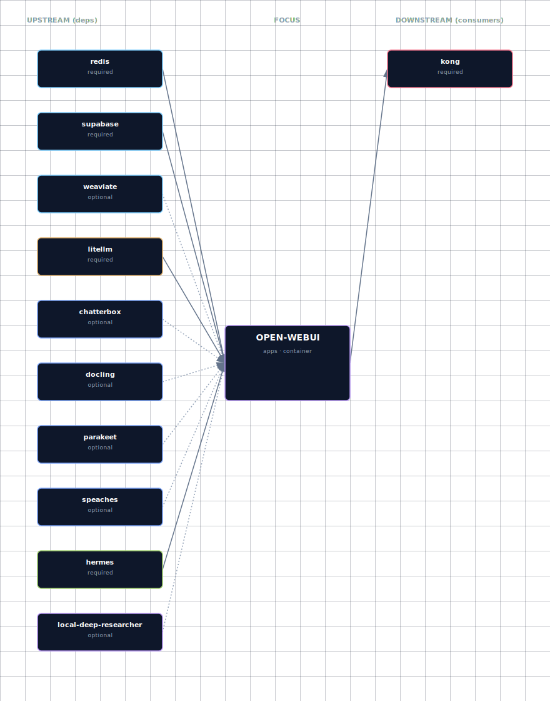

# Open WebUI

**Port:** 63015
**SOURCE variable:** `OPEN_WEB_UI_SOURCE`
**SOURCE options:** container, disabled

## Overview

Main browser chat UI. It adapts to the configured LLM provider and related stack services.

## Access

| Path | URL | Notes |
|---|---|---|
| Direct | http://localhost:63015 | Works when the service is enabled in container mode and the port is exposed. |
| Kong | http://chat.localhost:63002 | Requires `./start.sh --setup-hosts`; only available for services with Kong routes. |

See the canonical port table at [Ports and Routes](../../deployment/ports-and-routes.md).

## Configuration

Configure this service through `.env`, the interactive wizard, or CLI flags where available. Prefer SOURCE variables and documented env vars over direct `docker-compose.yml` edits.

```bash
OPEN_WEB_UI_SOURCE=<option>
```

Use `./start.sh` for the guided wizard, or pass a targeted flag for scripted changes when the CLI exposes one.

## Dependencies and integration

The service participates in the Docker Compose network and may be consumed by the Backend API, Open WebUI, JupyterHub, n8n, Weaviate, or init containers depending on which SOURCE modes are enabled.

When [Hermes Agent](../hermes/README.md) is enabled (`HERMES_SOURCE != disabled`), it appears in the model dropdown as `hermes-agent` via the LiteLLM gateway — no per-WebUI wiring required. The model-list cache TTL is 5 minutes (`OPEN_WEB_UI_MODEL_CACHE_TTL=300`) so a newly-enabled Hermes can take that long to appear in the dropdown; set the TTL to `0` during development.

If a dependency is disabled, adaptive services should degrade where supported. Some implementation-level dependency cleanup is tracked separately as bootstrapper work and is outside this documentation pass.

## Troubleshooting

```bash
# Check service status
docker compose ps

# Check logs; replace SERVICE with the compose service name when needed
docker compose logs -f SERVICE
```

For general startup and routing issues, see [Troubleshooting](../../quick-start/troubleshooting.md).

## Dependencies & Integrations

> Auto-generated section — the **Current** subsections are derived from `services/open-webui/service.yml`. Re-run `python -m bootstrapper.docs.regen open-webui` after manifest changes.

### Current — Upstream (this service depends on)

| Service | Type | Mechanism | Failure mode |
|---|---|---|---|
| redis | required | `http://redis:<port>` | _unspecified_ |
| supabase | required | `http://supabase:<port>` | _unspecified_ |
| weaviate | optional | `(optional — wired conditionally; see manifest)` | _unspecified_ |
| litellm | required | `http://litellm:<port>` | _unspecified_ |
| chatterbox | optional | `(optional — wired conditionally; see manifest)` | _unspecified_ |
| docling | optional | `(optional — wired conditionally; see manifest)` | _unspecified_ |
| parakeet | optional | `(optional — wired conditionally; see manifest)` | _unspecified_ |
| speaches | optional | `(optional — wired conditionally; see manifest)` | _unspecified_ |
| hermes | required | `http://hermes:<port>` | _unspecified_ |
| local-deep-researcher | optional | `(optional — wired conditionally; see manifest)` | _unspecified_ |

### Current — Downstream (services that depend on this)

| Service | Type | Mechanism |
|---|---|---|
| kong | required | kong declares open-webui in depends_on.required |

### Architecture diagram



[Open the interactive HTML diagram](./architecture.html) for a full-screen view.

### Future — Missing pair integrations

_No high-confidence opportunities identified._

### Future — Candidate new services

_No high-confidence opportunities identified._

### Future — Unused features in this service

_No high-confidence opportunities identified._
