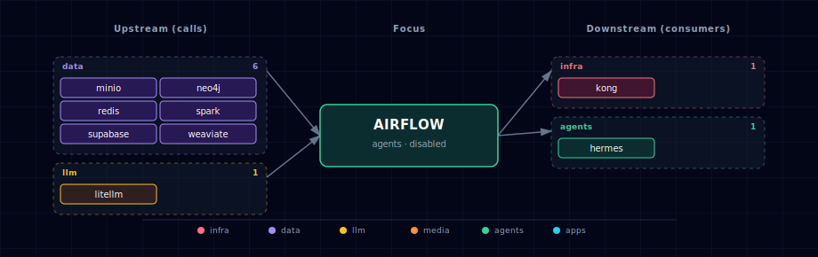

# Apache Airflow (DAG orchestrator)

Airflow runs as a 3-container family in the stack's `agents` band: `airflow-webserver` (Web UI + REST API), `airflow-scheduler` (DAG parser + LocalExecutor task runner), and `airflow-init` (one-shot bootstrap: DB migrate + admin user + Connection seeding).

## 1. Overview

Image: `apache/airflow:3.2.2` (Apache 2.0), wrapped by a local `services/airflow/build/Dockerfile` that adds the 8-provider bundle needed for the cross-stack integrations (apache-spark, amazon, postgres, redis, weaviate, neo4j, openai, langchain). LocalExecutor is the only supported executor in v1 — tasks run in the scheduler's process pool. Metadata DB lives in a new `airflow` database on Supabase Postgres, created by `airflow-init` on first start.

## 2. Access

| Surface | URL | Auth |
|---|---|---|
| Web UI (direct) | `http://localhost:${AIRFLOW_PORT}` | `admin` / `${AIRFLOW_ADMIN_PASSWORD}` |
| Web UI (Kong) | `http://airflow.localhost:${KONG_HTTP_PORT}` | Same |
| REST API | `http://airflow.localhost:${KONG_HTTP_PORT}/api/v2/` | HTTP basic (same admin creds) |

`AIRFLOW_ADMIN_PASSWORD` is auto-generated on first run and persisted to `.env`. Treat it like any other secret.

## 3. Configuration

```bash
AIRFLOW_SOURCE=disabled              # container | disabled
AIRFLOW_IMAGE=apache/airflow:3.2.2
AIRFLOW_PORT=                        # auto-assigned (agents band)
AIRFLOW_DB_USER=airflow              # role on Supabase Postgres
AIRFLOW_DB_PASSWORD=                 # auto-generated
AIRFLOW_FERNET_KEY=                  # auto-generated (Connection-password encryption)
AIRFLOW_SECRET_KEY=                  # auto-generated (Flask session secret)
AIRFLOW_ADMIN_PASSWORD=              # auto-generated (admin login)
```

## 4. Seeded Connections

`airflow-init` runs once at first start and seeds Airflow Connection objects for every enabled sibling service. Each is gated on the sibling's `_SOURCE` env var:

| Connection ID | Type | Target | Gated on |
|---|---|---|---|
| `postgres_supabase` | postgres | `supabase-db:5432/${SUPABASE_DB_NAME}` | always (required dep) |
| `spark_default` | spark | `spark://spark-master:7077` | `SPARK_SOURCE=container` |
| `minio_default` | aws (S3-compat) | `http://minio:9000` with root creds | `MINIO_SOURCE=container` |
| `litellm_default` | openai | `http://litellm:4000/v1` with `LITELLM_MASTER_KEY` | `LITELLM_SOURCE != disabled` |
| `weaviate_default` | weaviate | `http://weaviate:8080` | `WEAVIATE_SOURCE != disabled` |
| `neo4j_default` | neo4j | `bolt://neo4j:7687` | `NEO4J_SOURCE != disabled` |
| `redis_default` | redis | `redis:6379` | `REDIS_SOURCE != disabled` |

Connection seeding is idempotent — `airflow-init` deletes-then-adds each Connection on every run, so changes to credentials propagate on the next `./start.sh`.

## 5. Sample DAG

`services/airflow/dags/example_etl_with_llm.py` ships pre-loaded. Three operators that smoke-test each Connection:

1. `SparkSubmitOperator` against `spark_default`.
2. `OpenAIOperator` against `litellm_default` (sends a one-token prompt).
3. `S3Hook.list_buckets()` against `minio_default`.

Use it as a template. Drop your own DAGs into `services/airflow/dags/` — they're bind-mounted into the container.

## 6. Hermes → Airflow integration

Hermes can trigger Airflow DAGs via the REST API:

```bash
curl -X POST \
  -u admin:${AIRFLOW_ADMIN_PASSWORD} \
  -H 'Content-Type: application/json' \
  -d '{"conf": {}}' \
  http://airflow.localhost:${KONG_HTTP_PORT}/api/v2/dags/example_etl_with_llm/dagRuns
```

This pattern — agent runtime → orchestrated workflow — pairs Hermes's reactive surface with Airflow's batch/scheduled surface.

## 7. Dependencies & Integrations

> Auto-generated section — the **Current** subsections are derived from `services/airflow/service.yml`'s `data_flow.calls` field (and inverse passes). Re-run `python -m bootstrapper.docs.regen airflow` after manifest changes.

### 7.1 Current — Upstream (this service calls)

| Service | Category |
|---|---|
| minio | data |
| neo4j | data |
| redis | data |
| spark | data |
| supabase | data |
| weaviate | data |
| litellm | llm |

### 7.2 Current — Downstream (services that call this)

| Service | Category |
|---|---|
| hermes | agents |

### 7.3 Architecture diagram



[Open the interactive HTML diagram](./architecture.html) for a full-screen view.

### 7.4 Future — Missing pair integrations

_No high-confidence opportunities identified._

### 7.5 Future — Candidate new services

_No high-confidence opportunities identified._

### 7.6 Future — Unused features in this service

_No high-confidence opportunities identified._

## 8. Troubleshooting

- **`airflow-init` fails with "database does not exist"** — Supabase Postgres might not be running yet. `airflow-init` depends_on `supabase-db: service_healthy` so this shouldn't happen, but if it does, `docker logs ${PROJECT_NAME}-airflow-init` shows the psql error.
- **Web UI login rejected** — `AIRFLOW_ADMIN_PASSWORD` in `.env` may have rotated. Check the value; if rotated, `airflow-init` re-runs and re-syncs the admin user on next `./start.sh`.
- **DAG appears in UI but won't run** — Scheduler may be lagging. `docker logs ${PROJECT_NAME}-airflow-scheduler` for parse errors. The scheduler poll interval defaults to 30s.
- **`OpenAIOperator` errors with `auth required`** — `litellm_default` Connection has the wrong `LITELLM_MASTER_KEY`. Re-run `./start.sh` to re-sync the Connection; alternatively edit it in the Web UI under Admin → Connections.
- **`SparkSubmitOperator` can't reach spark://spark-master:7077** — Spark isn't running. `SPARK_SOURCE=disabled` in `.env`. Either enable Spark (`--spark-source container`) or remove SparkSubmitOperator from your DAG.
