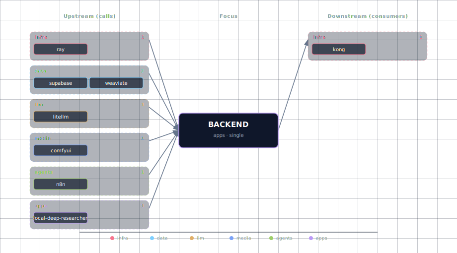

# Backend API (FastAPI)

Always-on adaptive FastAPI service that orchestrates the rest of the stack. It is the only "apps"-tier service that explicitly declares itself as a hub: it fans out to every data-tier (Supabase, Redis, Weaviate, Neo4j), every LLM/media surface (LiteLLM, ComfyUI, doc-processor, STT, TTS), and the agent-tier (Hermes, n8n). Health checks, LangMem-backed long-term memory, file uploads, and orchestration endpoints all live here.

The backend is `_SOURCE`-trivial — it has only one variant, `container` — because nothing in the design contemplates running FastAPI off-stack or as an external dependency. Instead, the variability lives in *what* the backend talks to: adaptive logic in `runtime_adaptive.backend.adapts_to` flips capabilities on or off based on the active `LLM_PROVIDER_SOURCE`, `WEAVIATE_SOURCE`, `STT_PROVIDER_SOURCE`, `TTS_PROVIDER_SOURCE`, and `DOC_PROCESSOR_SOURCE`.

## 1. Overview

Source: `services/backend/app/`. The FastAPI app boots in `app/main.py`, mounts feature routes (`/memory`, `/research`, `/storage`, `/health`), and reads adaptive env vars at startup. LangMem (LangChain's long-term-memory layer) is bundled in: `LANGMEM_ENABLED=true` by default, with extraction/embedding models taken from `public.llms` via LiteLLM. The backend ships no test suite — local iteration is "edit + `docker compose up --force-recreate backend`."

## 2. Access

| Path | URL | Notes |
|---|---|---|
| Direct | `http://localhost:${BACKEND_PORT}` (default `63016`) | Always exposed when the container is up. |
| Kong | `http://api.localhost:${KONG_HTTP_PORT}` | Requires `./start.sh --setup-hosts`. Recommended for browser-side calls. |
| Health | `GET /health` | Returns service + upstream-probe matrix. |

Canonical port table: [Ports and Routes](../../docs/deployment/ports-and-routes.md).

## 3. Configuration

The backend has no source-variants beyond `container`. Customization happens through `.env` and through which upstream services are enabled.

```bash
BACKEND_SOURCE=container          # only value
BACKEND_PORT=63016                # computed by topology.py from BASE_PORT
```

LangMem long-term memory:

```bash
LANGMEM_ENABLED=true
LANGMEM_MEMORY_NAMESPACE=default
LANGMEM_AUTO_CONSOLIDATE=true
LANGMEM_CONSOLIDATION_INTERVAL=86400
LANGMEM_MAX_FACTS_PER_USER=1000
LANGMEM_EXTRACTION_MODEL=          # empty = highest-priority active content model from public.llms
LANGMEM_EMBEDDING_MODEL=
```

Adaptive env (injected automatically based on active SOURCE values):

```bash
LITELLM_BASE_URL=http://litellm:4000
LITELLM_API_KEY=${LITELLM_MASTER_KEY}
WEAVIATE_URL=http://weaviate:8080
STT_ENDPOINT=...                  # resolved per STT_PROVIDER_SOURCE
TTS_ENDPOINT=...                  # resolved per TTS_PROVIDER_SOURCE
DOCLING_ENDPOINT=...              # resolved per DOC_PROCESSOR_SOURCE
HERMES_ENDPOINT=http://hermes:8000
HERMES_API_KEY=${HERMES_API_KEY}
NEO4J_URI=bolt://neo4j-graph-db:7687
NEO4J_USER=${GRAPH_DB_USER}
NEO4J_PASSWORD=${GRAPH_DB_PASSWORD}
SUPABASE_URL=http://supabase-api:3000
SUPABASE_SERVICE_KEY=${SUPABASE_SERVICE_KEY}
REDIS_URL=redis://:${REDIS_PASSWORD}@redis:6379/0
```

Adaptive listing comes from `runtime_adaptive.backend.adapts_to` in `services/backend/service.yml`.

## 4. Architecture & wiring

**Request flow (typical Open WebUI ↔ backend ↔ LiteLLM ↔ Ollama):**

1. Open WebUI sends a chat completion to Kong at `api.localhost/v1/...`.
2. Kong proxies to `backend:8000`.
3. Backend route either:
   - forwards directly to `litellm:4000/v1/chat/completions`, or
   - invokes a LangMem-augmented pipeline (retrieve facts from Supabase pgvector → enrich prompt → call LiteLLM → extract & store new facts).
4. LiteLLM dispatches to the registered provider (Ollama, Anthropic, OpenAI, etc.).

**Required hard dependencies** (from `depends_on.required`):
- `supabase` — Postgres (LangMem facts, public tables), Auth (JWT), Storage (file uploads ≤50 MB), Realtime (declared via compose).
- `redis` — session, rate-limit, queue, LangMem consolidation lock.

**Optional adaptive dependencies** (from `runtime_deps.backend.optional`):
- `neo4j-graph-db`, `searxng`, `n8n`, `weaviate`, `parakeet`, `speaches`, `chatterbox`, `docling`.

When any optional service is `disabled`, the corresponding backend feature degrades gracefully — `/storage/upload` returns 503 if Supabase Storage is down, `/research/start` 503s if LDR is disabled.

**Internal network:** all upstream calls use Docker DNS names on `backend-network`. No host-port hops; nothing reaches the host filesystem outside the mounted `./services/backend/app/` source directory.

**Init container:** none. The backend has no `backend-init`; one-time setup (DB migrations) is delegated to `supabase-db-init` which runs SQL scripts from `services/supabase/db/scripts/`.

## 5. Dependencies & Integrations

> Auto-generated section — the **Current** subsections are derived from `services/backend/service.yml`'s `data_flow.calls` field (and inverse passes). Re-run `python -m bootstrapper.docs.regen backend` after manifest changes.

### 5.1 Current — Upstream (this service calls)

| Service | Category |
|---|---|
| ray | infra |
| neo4j | data |
| redis | data |
| supabase | data |
| weaviate | data |
| litellm | llm |
| comfyui | media |
| doc-processor | media |
| stt-provider | media |
| tts-provider | media |
| hermes ↔ | agents |
| n8n | agents |

### 5.2 Current — Downstream (services that call this)

| Service | Category |
|---|---|
| kong | infra |
| hermes ↔ | agents |

### 5.3 Architecture diagram



[Open the interactive HTML diagram](./architecture.html) for a full-screen view.

### 5.4 Future — Missing pair integrations

- **backend ↔ minio** — *Why:* `minio-init` provisions a dedicated `backend` bucket plus scoped `MINIO_BACKEND_ACCESS_KEY`/`SECRET_KEY`, but the backend container receives none of those env vars and ships no S3 client. Artifact-tier storage (research outputs, ComfyUI image cache, large user uploads) currently spills into Supabase Storage, sized for app data not blobs. *Mechanism:* pass `MINIO_ENDPOINT=http://minio:9000`, `MINIO_BUCKET_BACKEND`, and the access/secret keys into `services/backend/compose.yml`; add `boto3` to `requirements.txt`; expose `POST /storage/artifact` + `GET /storage/artifact/{key}`. *Effort:* small. *Confidence:* high.
- **backend ↔ hermes** — *Why:* `HERMES_ENDPOINT` + `HERMES_API_KEY` are passed in but no client consumes them. Talking to Hermes only through LiteLLM's `hermes-agent` model loses Hermes-native surfaces (skill/tool registration, session state at `/opt/data`, dashboard introspection). *Mechanism:* add `hermes_client.py` next to `n8n_client.py`; call `${HERMES_ENDPOINT}/v1/sessions` and `/skills` with `Authorization: Bearer ${HERMES_API_KEY}`; expose `POST /agents/hermes/run` + `GET /agents/hermes/sessions/{id}`. *Effort:* small. *Confidence:* medium.
- **backend ↔ jupyterhub** — *Why:* notebook users can't reach backend's research/memory/ComfyUI APIs except through Kong + tokens, and backend has no view of JupyterHub state. A thin bridge enables programmatic notebook launches for batch evaluations. *Mechanism:* backend calls JupyterHub REST at `http://jupyterhub:8000/hub/api` with `Authorization: token ${JUPYTERHUB_TOKEN}`; expose `POST /notebooks/users/{name}/server` proxy; share `MINIO_BUCKET_JUPYTER` for artifact handoff. *Effort:* medium. *Confidence:* medium.
- **backend ↔ neo4j (knowledge-graph endpoints)** — *Why:* `neo4j`, `langchain-neo4j`, `NEO4J_URI`/`USER`/`PASSWORD` are all installed and injected, but no graph endpoints exist. LangMem facts and research sources are natural graph citizens. *Mechanism:* add `graph_service.py`; on memory-extract, mirror canonical entities into Neo4j via `bolt://neo4j-graph-db:7687`; expose `GET /memory/user/{id}/graph` and `GET /research/{session_id}/entities`. *Effort:* medium. *Confidence:* high.

### 5.5 Future — Candidate new services

- **Langfuse** ([details](../../docs/research/candidates/langfuse.md)) — *Headline:* self-hostable LLM observability with traces, evals, prompt versioning. *Wires into:* hermes, n8n, local-deep-researcher, litellm, open-webui.
- **Celery + Flower** ([details](../../docs/research/candidates/celery-flower.md)) — *Headline:* Redis-backed async worker tier so long-running research/memory-consolidate/ComfyUI calls stop blocking the FastAPI request loop. *Wires into:* redis, supabase, comfyui, local-deep-researcher.
- **MLflow** ([details](../../docs/research/candidates/mlflow.md)) — *Headline:* experiment tracking + model registry for LangMem extraction/embedding models, ComfyUI checkpoints, Hermes skill evaluations. *Wires into:* jupyterhub, comfyui, hermes, minio.

### 5.6 Future — Unused features in this service

- **LangMem auto-consolidate scheduler** — *Why pursue:* `LANGMEM_AUTO_CONSOLIDATE` + `LANGMEM_CONSOLIDATION_INTERVAL` are declared, `apscheduler` is in `requirements.txt`, but no scheduler runs in `main.py`. Wiring it lights up nightly fact-consolidation. *Effort:* small.
- **STT/TTS proxy endpoints** — *Why pursue:* `STT_ENDPOINT` and `TTS_ENDPOINT` reach the container but the FastAPI surface exposes neither; clients must hit the engines directly, bypassing auth/quota. *Effort:* small.
- **Supabase Realtime channels** — *Why pursue:* `supabase-realtime` is a `depends_on` of backend yet no WebSocket fan-out endpoints exist for streaming research logs or memory updates. *Effort:* medium.
- **Per-user storage namespacing** — *Why pursue:* `/storage/upload` accepts a `bucket` query but no per-user prefix or quota; trivial to abuse. *Effort:* small.

## 6. Troubleshooting

**`/health` returns 503 for a specific upstream.** Read which upstream is failing from the response payload, then `docker logs <project>-<service>` for the failing service. The backend never crashes on upstream failure — it degrades.

**LangMem extraction silently fails.** Check that `public.llms` has at least one row where `content_model=true AND active=true`. Without that, `LANGMEM_EXTRACTION_MODEL` resolves to empty and the consolidation loop short-circuits. Set it explicitly to a known model id (e.g. `ollama/qwen3:8b`).

**Cold-start hangs on Supabase.** Backend `depends_on: supabase-db-init: { condition: service_completed_successfully }`. If `supabase-db-init` is stuck (usually a bad SQL script in `services/supabase/db/scripts/`), backend will wait forever. Check `docker logs <project>-supabase-db-init`.

**`HERMES_ENDPOINT` reachable but feature returns 404.** Hermes-native endpoints are not wired (see Future — Missing pair integrations above). Calls go through LiteLLM's `hermes-agent` model only.

```bash
docker compose ps backend
docker compose logs -f backend
docker exec <project>-backend env | grep -E 'LITELLM|WEAVIATE|HERMES|NEO4J|STT|TTS|DOCLING'
```

For general startup and routing issues, see [Troubleshooting](../../docs/quick-start/troubleshooting.md).
