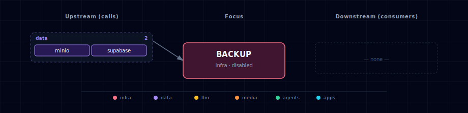

# Backup / restore

On-demand backup runner for the Atlas stack. Captures a Postgres custom-format dump (`pg_dump -Fc`) and tarballs of key named volumes, then pushes everything to an S3-compatible bucket (on-box MinIO by default, any external S3 endpoint otherwise). Restore is equally one-shot: pull the dump from S3 and feed it to `pg_restore --clean`.

The container is **never long-running** (`BACKUP_SCALE=0`). It exists in compose so it shares the stack network, env vars, and volume mounts — but it only does work when explicitly invoked:

```bash
# Run a full backup
docker compose run --rm backup

# Restore the latest backup
docker compose run --rm backup /scripts/restore-postgres.sh

# Restore a specific timestamp
BACKUP_TIMESTAMP=20240101_120000 docker compose run --rm backup /scripts/restore-postgres.sh
```

## 1. Overview

Image: `postgres:17-alpine` (provides `pg_dump` / `pg_restore`; the major version must be >= the `supabase-db` server, currently 17.x, or `pg_dump` aborts on a server-version mismatch). MinIO client (`mcli`, Alpine package `minio-client`) is installed at container startup and symlinked to `mc` so the scripts work unchanged. Volume snapshots are tar.gz archives of the bind-mounted read-only volumes at `/volumes/*`.

Scripts live under `services/backup/init/scripts/`:
- `backup-all.sh` — Postgres dump + volume tarballs -> S3 prefix `s3/<bucket>/<timestamp>/`.
- `restore-postgres.sh` — pull `postgres.dump` from S3 and `pg_restore --clean`.

## 2. Access

The backup runner has no published port and no Kong route. It is invoked directly via `docker compose run`.

| Path | URL | Notes |
|---|---|---|
| Trigger | `docker compose run --rm backup` | Runs `backup-all.sh`. Override command to run restore. |
| Bucket (MinIO) | `http://localhost:${MINIO_CONSOLE_PORT}` | Browse backups in the MinIO console. |

## 3. Configuration

```bash
BACKUP_SOURCE=disabled          # set to container to enable
BACKUP_BUCKET=atlas-backups     # target bucket
BACKUP_S3_ALIAS_URL=http://minio:9000  # S3 endpoint; swap for external S3
BACKUP_IMAGE=postgres:17-alpine        # image providing pg_dump (major >= supabase-db server)
```

Set `BACKUP_S3_ALIAS_URL` to an AWS S3 or compatible endpoint (e.g. `https://s3.us-east-1.amazonaws.com`) for offsite backups. Credentials are shared with MinIO (`MINIO_ROOT_USER` / `MINIO_ROOT_PASSWORD`); for external S3 set these to the IAM access key / secret.

Timed execution: the runner has no internal scheduler. Wire it to the Airflow DAG or n8n workflow that owns your backup schedule — invoke `docker compose run --rm backup` from the orchestrator.

## 4. Architecture & wiring

**Volumes backed up.** The compose fragment bind-mounts three named volumes read-only:

| Mount path | Named volume | Contents |
|---|---|---|
| `/volumes/supabase-storage` | `${PROJECT_NAME}-supabase-storage-data` | Supabase Storage object files |
| `/volumes/graph-db` | `${PROJECT_NAME}-graph-db-data` | Neo4j graph database |
| `/volumes/weaviate` | `${PROJECT_NAME}-weaviate-data` | Weaviate vector index |

Postgres data lives in `supabase-db-data` but is captured via `pg_dump` (not volume tar), so the dump is consistent and portable across Postgres versions.

**mc binary.** Alpine's `minio-client` package installs the binary as `mcli`. The entrypoint runs `ln -sf /usr/bin/mcli /usr/local/bin/mc` before the backup script so scripts can call `mc` directly.

**Network.** Attached to `backend-network` only — reaches `supabase-db:5432` and `minio:9000` via Docker DNS.

## 5. Dependencies & Integrations

> Auto-generated section — the **Current** subsections are derived from `services/backup/service.yml`'s `data_flow.calls` field (and inverse passes). Re-run `python -m bootstrapper.docs.regen backup` after manifest changes.

### 5.1 Current — Upstream (this service calls)

| Service | Category |
|---|---|
| minio | data |
| supabase | data |

### 5.2 Current — Downstream (services that call this)

_No downstream consumers._

### 5.3 Architecture diagram



[Open the interactive HTML diagram](./architecture.html) for a full-screen view.

### 5.4 Future — Missing pair integrations

- **backup -> airflow** — *Why:* schedule the backup runner from an Airflow DAG (`BashOperator` calling `docker compose run --rm backup`) for cron-based automation without adding a cron daemon. *Effort:* small.
- **backup -> n8n** — *Why:* n8n's Execute Command node can trigger backup runs and send Slack/email alerts on failure. *Effort:* small.

### 5.5 Future — Candidate new services

- **Restic** — *Why:* restic provides incremental, deduplicated, encrypted backups with retention policies, replacing the full-tar approach. *Effort:* medium.

### 5.6 Future — Unused features in this service

- **Volume restore** — *Why:* `restore-postgres.sh` only restores the Postgres dump; volume tarballs are captured but there is no companion restore script. *Effort:* small.
- **Retention / pruning** — *Why:* backups accumulate indefinitely in the bucket; a pruning pass (keep last N / older than X days) would bound storage growth. *Effort:* small.
- **Backup verification** — *Why:* the current flow pushes files but never verifies them; a post-upload `pg_restore --list` check would catch corrupt dumps early. *Effort:* small.

## 6. Troubleshooting

**`mc: not found`.** The `apk add minio-client` step failed or the symlink was not created. Run `docker compose run --rm --entrypoint sh backup -c "apk add --no-cache minio-client && ls /usr/bin/mcli"` to verify the package installs.

**`pg_dump: connection refused`.** `supabase-db` is not healthy. Check `docker compose ps supabase-db` and wait for the health check to pass before running the backup.

**`ERROR: bucket does not exist`.** The bucket is auto-created by the script (`mc mb --ignore-existing`), but MinIO must be running. Check `docker compose ps minio`.

**Empty `/volumes/*`.** The named volumes must exist (the services must have been started at least once). Run `docker volume ls | grep ${PROJECT_NAME}` to confirm.

```bash
docker compose run --rm backup /scripts/backup-all.sh
docker compose logs backup
docker compose run --rm --entrypoint sh backup -c "mc alias set s3 http://minio:9000 $MINIO_ROOT_USER $MINIO_ROOT_PASSWORD && mc ls s3/"
```

For general startup and routing issues, see [Troubleshooting](../../docs/quick-start/troubleshooting.md).
