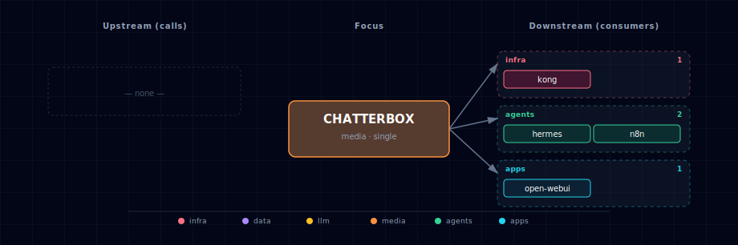

# Chatterbox (TTS engine)

Chatterbox is one of the TTS engines selectable via `TTS_PROVIDER_SOURCE`. It is
documented under the **TTS Provider** aggregator rather than as a standalone
service, because the user-facing role is "pick a TTS engine" — not "pick
Chatterbox":

→ See [services/tts-provider/README.md](../tts-provider/README.md) for the full
user-facing description, source-variant table, and configuration reference.

## Engine quick reference

- **Image:** `travisvn/chatterbox-tts-api:gpu` (GPU only; voice-cloning model)
- **License:** MIT (Resemble AI)
- **Activation:** `TTS_PROVIDER_SOURCE=chatterbox-container-gpu` (or
  `chatterbox-localhost` for a host-installed instance)
- **In-container port:** 4123
- **Host port:** `${CHATTERBOX_PORT}` (computed from `BASE_PORT` by the
  bootstrapper)

The manifest (`service.yml`) and compose fragment (`compose.yml`) in this folder
are the bootstrapper's source of truth for those values; treat this README as a
pointer, not a duplicate of the aggregator doc.

## 5. Dependencies & Integrations

> Auto-generated section — the **Current** subsections are derived from `services/chatterbox/service.yml`'s `data_flow.calls` field (and inverse passes). Re-run `python -m bootstrapper.docs.regen chatterbox` after manifest changes.

### 5.1 Current — Upstream (this service calls)

_No upstream calls._

### 5.2 Current — Downstream (services that call this)

_No downstream consumers._

### 5.3 Architecture diagram

[Open the interactive HTML diagram](./architecture.html) for a full-screen view.

### 5.4 Future — Missing pair integrations

_No high-confidence opportunities identified._

### 5.5 Future — Candidate new services

_No high-confidence opportunities identified._

### 5.6 Future — Unused features in this service

_No high-confidence opportunities identified._
