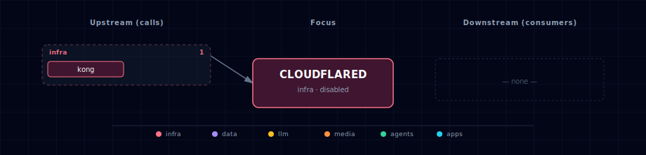

# Cloudflare Tunnel

Egress-only public-edge service that terminates TLS at Cloudflare's global network and proxies inbound traffic to Kong. Disabled by default; enable when you need a publicly reachable Atlas stack without opening inbound firewall ports.

## 1. Overview

`cloudflared` runs as a single container that dials out to Cloudflare and registers as a named tunnel. All TLS termination happens at the Cloudflare edge — no certificate management is needed inside the stack. The tunnel forwards every request it receives to `http://kong-api-gateway:8000`, making Kong the single internal entry point for all routed traffic.

The service is **egress-only**: it publishes no host port and has no Kong route. It connects to `backend-network` and reaches Kong by Docker DNS name.

Image: `cloudflare/cloudflared:2026.6.1` (pin a dated tag; bump deliberately).

## 2. Access

| Path | URL | Notes |
|---|---|---|
| Public | configured in Cloudflare dashboard | Any hostname you map in Zero Trust → Networks → Tunnels |
| Internal metrics | `cloudflared:2000/metrics` | Prometheus-compatible; not scraped by default |
| Host port | — | None. Egress-only. |

All public hostnames and routing rules are defined in the Cloudflare Zero Trust dashboard, not in this repository. Point your tunnel's public hostname(s) at `http://kong-api-gateway:8000` to reach the Atlas gateway.

## 3. Configuration

```bash
CLOUDFLARED_SOURCE=disabled               # change to "container" to enable
CLOUDFLARE_TUNNEL_TOKEN=                  # required when SOURCE=container; from Zero Trust > Networks > Tunnels
CLOUDFLARED_IMAGE=cloudflare/cloudflared:2026.6.1
# CLOUDFLARED_SCALE is auto-managed: 1 when SOURCE=container, 0 when disabled
```

**To enable:**

1. Create a named tunnel in the Cloudflare Zero Trust dashboard (Zero Trust > Networks > Tunnels > Add a tunnel).
2. Copy the tunnel token.
3. Set `CLOUDFLARED_SOURCE=container` and `CLOUDFLARE_TUNNEL_TOKEN=<your-token>` in `.env`.
4. In the dashboard, add a public hostname pointing at `http://kong-api-gateway:8000` (service type HTTP, URL `kong-api-gateway:8000`).
5. Restart the stack: `./start.sh`.

If `CLOUDFLARE_TUNNEL_TOKEN` is empty when `CLOUDFLARED_SOURCE=container`, the daemon exits immediately with an authentication error.

## 4. Architecture & wiring

**Startup ordering.** `cloudflared` depends on `kong-api-gateway: { condition: service_healthy }` so the gateway is ready before the tunnel connects.

**No ingress port.** Unlike most services, cloudflared has no `*_PORT` env var. The container listens on nothing externally; it dials out and forwards back. The internal metrics endpoint (`TUNNEL_METRICS: 0.0.0.0:2000`) is container-internal only.

**Scale toggle.** `CLOUDFLARED_SCALE` is written by the bootstrapper to `1` (SOURCE=container) or `0` (disabled). The compose fragment uses `deploy.replicas: ${CLOUDFLARED_SCALE:-0}`, so the container is simply not started when disabled.

**Security posture.** The tunnel does not bypass Kong authentication. Every request that arrives at Cloudflare's edge is forwarded to Kong, which applies its own route rules, auth plugins, and rate limiting. Cloudflare Access policies are an additional optional layer configurable in the Zero Trust dashboard.

## 5. Dependencies & Integrations

> Auto-generated section — the **Current** subsections are derived from `services/cloudflared/service.yml`'s `data_flow.calls` field (and inverse passes). Re-run `python -m bootstrapper.docs.regen cloudflared` after manifest changes.

### 5.1 Current — Upstream (this service calls)

| Service | Category |
|---|---|
| kong | infra |

### 5.2 Current — Downstream (services that call this)

_No downstream consumers._

### 5.3 Architecture diagram



[Open the interactive HTML diagram](./architecture.html) for a full-screen view.

### 5.4 Future — Missing pair integrations

_No high-confidence opportunities identified._

### 5.5 Future — Candidate new services

_No high-confidence opportunities identified._

### 5.6 Future — Unused features in this service

_No high-confidence opportunities identified._
