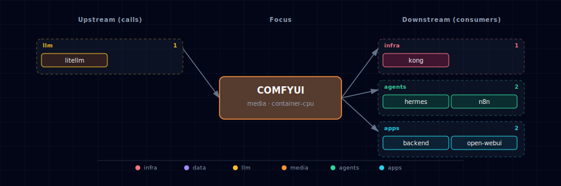

# ComfyUI

Node-based image generation workflow engine. ComfyUI runs as a single container with a web UI on its own port, exposing an HTTP API (`/prompt`, `/history/{id}`, `/view`) and a WebSocket (`/ws`) that streams `executing`/`executed`/`progress` events while a workflow runs. The stack treats ComfyUI as a media-tier engine: backend, n8n, Hermes, and Open WebUI all consume it indirectly through Kong (browser) or directly via the internal Docker DNS name.

Four source variants cover the common deployment shapes: containerized CPU and GPU (built from `ai-dock/comfyui` images), a localhost mode that routes consumers to a host-running ComfyUI, and an external URL mode for shared/remote instances. Disabled mode removes it from compose entirely. A short-lived `comfyui-init` container stages model checkpoints into the `comfyui-models` volume based on `COMFYUI_MODEL_SET` (`minimal | sd15 | sdxl | full`).

## 1. Overview

Image: `ghcr.io/ai-dock/comfyui:v2-cpu-22.04-v0.2.7` (CPU default) or the latest-cuda variant for GPU. Output behavior: by default outputs are uploaded to Supabase Storage via `COMFYUI_UPLOAD_TO_SUPABASE=true` and the `COMFYUI_STORAGE_BUCKET=comfyui-images` bucket. A second volume (`comfyui-custom-nodes`) holds community nodes; today nothing seeds it.

## 2. Access

| Path | URL | Notes |
|---|---|---|
| Direct | `http://localhost:${COMFYUI_PORT}` (default `63041`) | Web UI + REST API. |
| Kong | `http://comfyui.localhost:${KONG_HTTP_PORT}` | Browser-friendly; needs `./start.sh --setup-hosts`. |
| Internal | `${COMFYUI_ENDPOINT}` | Resolved per `COMFYUI_SOURCE`: `http://comfyui:18188` for container, `http://host.docker.internal:8000` for localhost, custom URL for external. |
| WebSocket | `ws://comfyui:18188/ws` | Streams progress events; one connection per caller today. |

Canonical port table: [Ports and Routes](../../docs/deployment/ports-and-routes.md).

## 3. Configuration

```bash
COMFYUI_SOURCE=container-cpu                # container-cpu | container-gpu | localhost | external | disabled
COMFYUI_PORT=63041                          # computed by topology.py
COMFYUI_BASE_URL=http://comfyui:18188       # in-container default
COMFYUI_ARGS=--listen                       # bootstrapper injects --cpu or --force-fp16 per source
COMFYUI_PLATFORM=linux/amd64
COMFYUI_MODEL_SET=minimal                   # minimal | sd15 | sdxl | full
COMFYUI_UPLOAD_TO_SUPABASE=true
COMFYUI_STORAGE_BUCKET=comfyui-images
COMFYUI_AUTO_UPDATE=false                   # GPU variant flips this to true upstream
```

Localhost / external overrides:

```bash
COMFYUI_LOCALHOST_PORT=8000                 # URL is derived as http://host.docker.internal:8000 at compose-render time
COMFYUI_EXTERNAL_URL=                       # required when COMFYUI_SOURCE=external
COMFYUI_LOCAL_MODELS_PATH=~/Documents/ComfyUI/models   # bind-mounted when SOURCE=localhost
```

Auto-managed (do not edit manually):

```bash
COMFYUI_ENDPOINT=...                        # what backend/n8n/jupyterhub/open-webui consume
IS_LOCAL_COMFYUI=true|false
COMFYUI_SCALE / COMFYUI_INIT_SCALE
```

## 4. Architecture & wiring

**Request flow.** Backend or n8n POSTs a workflow JSON to `${COMFYUI_ENDPOINT}/prompt` and receives a `prompt_id`. To track progress, the caller either polls `GET /history/{prompt_id}` or opens a `/ws` websocket and filters by `prompt_id`. Outputs land under `output/` inside the container; the `/view` endpoint serves them by filename.

**Init flow** (`comfyui-init`): plain alpine + inline `apk add curl && wget …`. The init script reads `COMFYUI_MODEL_SET` and downloads the corresponding checkpoint, VAE, and LoRA bundle into the `comfyui-models` volume. Failure mode is non-fatal — ComfyUI starts even if downloads incomplete, you just get model-not-found errors at workflow time.

**Hard dependencies** (`depends_on.required`): `supabase`, `litellm`, `ollama`. The Supabase dep covers the Storage upload path; LiteLLM and Ollama are inherited from `runtime_adaptive` (ComfyUI custom nodes that call LLMs route through LiteLLM).

**Volumes:** `comfyui-models` (checkpoints, VAEs, LoRAs), `comfyui-custom-nodes` (community nodes, currently unseeded), `comfyui-output` (generated images, also uploaded to Supabase).

**Output deduplication.** None today — the same workflow run twice generates two outputs and two Supabase uploads. There is no content-hash dedup pass.

## 5. Dependencies & Integrations

> Auto-generated section — the **Current** subsections are derived from `services/comfyui/service.yml`'s `data_flow.calls` field (and inverse passes). Re-run `python -m bootstrapper.docs.regen comfyui` after manifest changes.

### 5.1 Current — Upstream (this service calls)

| Service | Category |
|---|---|
| litellm | llm |

### 5.2 Current — Downstream (services that call this)

| Service | Category |
|---|---|
| kong | infra |
| hermes | agents |
| n8n | agents |
| backend | apps |
| open-webui | apps |

### 5.3 Architecture diagram



[Open the interactive HTML diagram](./architecture.html) for a full-screen view.

### 5.4 Future — Missing pair integrations

- **comfyui ↔ minio** — *Why:* ComfyUI currently uploads outputs to Supabase Storage via `COMFYUI_UPLOAD_TO_SUPABASE`/`COMFYUI_STORAGE_BUCKET`, but `services/minio/service.yml` already provisions a dedicated `comfyui` bucket plus `MINIO_COMFYUI_ACCESS_KEY` that is never consumed. Routing outputs to MinIO keeps generated media in the artifact tier and gives downstream services a stable S3 URL. *Mechanism:* small ComfyUI custom node (or sidecar reading the `executed` event on `ws://comfyui:18188/ws`) that pushes `/view`-rendered artifacts to `s3://comfyui` on `http://minio:9000` using `MINIO_COMFYUI_ACCESS_KEY`. Add `minio` to `runtime_deps.optional`. *Effort:* small. *Confidence:* high.
- **comfyui ↔ weaviate (via multi2vec-clip)** — *Why:* every ComfyUI generation produces an image plus the prompt that made it. The stack already runs `multi2vec-clip` as part of the weaviate family, so generated outputs can be auto-embedded for similarity search with zero new infra. *Mechanism:* post-execution hook PUTs `{image, prompt, workflow_id}` into a `ComfyImage` Weaviate class with `vectorizer: multi2vec-clip` on `http://weaviate:8080/v1/objects`. *Effort:* medium. *Confidence:* high.
- **comfyui ↔ n8n** — *Why:* `services/n8n/service.yml` already installs `n8n-nodes-comfyui` and the image-to-image package, but the comfyui manifest declares no `runtime_deps.optional` link to n8n and the credentials store is not pre-seeded. *Mechanism:* pre-seed an n8n credential at startup (n8n REST API `POST /credentials`) pointing at `${COMFYUI_ENDPOINT}`; add `n8n` to comfyui's `runtime_deps.optional`. *Effort:* small. *Confidence:* medium.
- **comfyui ↔ redis** — *Why:* compose already lists `redis` in `depends_on` but Redis isn't actually used by ComfyUI. A small queue-state bridge would let n8n/backend poll job status without holding a websocket open per request. *Mechanism:* custom node subscribing to its own websocket and mirroring `executing`/`executed`/`progress` events into Redis pubsub channels `comfyui:job:<prompt_id>`. *Effort:* medium. *Confidence:* low (cheaper path is polling `/history`).

### 5.5 Future — Candidate new services

- **Langfuse** ([details](../../docs/research/candidates/langfuse.md)) — *Headline:* self-hostable trace store capturing LiteLLM + ComfyUI + Hermes generation pipelines end-to-end. *Wires into:* litellm, hermes, n8n, backend, open-webui.

### 5.6 Future — Unused features in this service

- **ComfyUI-Manager + `cm-cli` for custom-node provisioning** — *Why pursue:* the stack mounts a `comfyui-custom-nodes` volume but `init/scripts/download_models.sh` only stages checkpoints; adding `cm-cli install <pkg>` would make custom-node sets reproducible. *Effort:* small.
- **Workflow-API mode + `/prompt` ingestion from non-UI clients** — *Why pursue:* backend and Hermes have no documented call pattern; a worked example of POSTing a workflow JSON to `/prompt` and tracking it via `/history/{prompt_id}` would unlock programmatic image-gen from agents. *Effort:* small.
- **Video model support (Mochi / LTX-Video)** — *Why pursue:* ComfyUI upstream supports video diffusion but `COMFYUI_MODEL_SET` has no `video` tier, so GPU users hand-edit the init script. *Effort:* medium.
- **Authentication on the ComfyUI endpoint** — *Why pursue:* `server.py` ships no auth and Kong fronts ComfyUI on `comfyui.localhost`. A Kong basic-auth or JWT plugin would prevent any LAN peer from queueing GPU jobs. *Effort:* small.

## 6. Troubleshooting

**`AssertionError: Torch not compiled with CUDA enabled` on GPU mode.** You selected `container-gpu` but the host lacks NVIDIA Container Toolkit. Verify with `docker info | grep -i runtime`; expect `nvidia` listed. Otherwise switch to `container-cpu` or install the toolkit.

**Init container downloads stall mid-workflow.** `comfyui-init` runs in the background of the first `./start.sh`; large model sets (`full`) take ~10 GB and 5-15 min. Workflows referencing not-yet-downloaded models 404 until init exits. `docker logs <project>-comfyui-init -f` shows progress.

**Generated images don't appear in Supabase.** Confirm `COMFYUI_UPLOAD_TO_SUPABASE=true` and `SUPABASE_SERVICE_KEY` is valid. Upload happens after each successful workflow; failure mode is silent retry (check `docker logs <project>-comfyui` for `[supabase upload] …`).

**Localhost mode (`COMFYUI_SOURCE=localhost`) — containers can't reach host.** Linux Docker needs `host.docker.internal` mapped to the host gateway. The bootstrapper injects `extra_hosts: ["host.docker.internal:host-gateway"]` automatically; if you bypassed it, that's the gap. Kong's compose has the same wiring for the same reason.

**`ws://comfyui:18188/ws` 502s through Kong.** Kong's WebSocket support is wired but consumers using `comfyui.localhost` instead of `comfyui:18188` may hit timeout-related drops. From sibling containers prefer the internal DNS name.

```bash
docker compose ps comfyui comfyui-init
docker compose logs -f comfyui
curl -s http://localhost:${COMFYUI_PORT}/system_stats | jq .   # GPU/CPU info, queue depth
```

For general startup and routing issues, see [Troubleshooting](../../docs/quick-start/troubleshooting.md).

## 7. Operations

**Switch model sets.** Edit `COMFYUI_MODEL_SET` in `.env` (`minimal | sd15 | sdxl | full`) and re-run `./start.sh`. `comfyui-init` re-runs and downloads anything missing into the `comfyui-models` volume; existing checkpoints are not deleted.

**Add a custom model manually.** Drop `.safetensors` files into the `comfyui-models` volume directly:

```bash
docker cp ./my-model.safetensors <project>-comfyui:/opt/ComfyUI/models/checkpoints/
```

Restart ComfyUI to pick it up. The downside: this lives outside the init script, so a cold-start wipes it.

**Queue a workflow programmatically.**

```bash
curl -X POST http://localhost:${COMFYUI_PORT}/prompt \
  -H 'content-type: application/json' \
  -d @workflow.json
# → {"prompt_id": "abc-123", "number": 0, "node_errors": {}}

curl http://localhost:${COMFYUI_PORT}/history/abc-123
# → {"abc-123": {"prompt": [...], "outputs": {...}}}
```

**Monitor a running workflow.**

```bash
# Open ws://comfyui:18188/ws and filter messages by prompt_id
# Event types: status, executing, executed, progress, execution_error
```

## 8. Performance notes

- **CPU mode is slow.** A 512×512 SD 1.5 generation takes ~30-90s on CPU; the same on a modest GPU takes 2-5s. Use CPU mode for testing workflows, not for production.
- **GPU FP16.** The GPU variant injects `--force-fp16` automatically; halves VRAM usage with negligible quality impact for most SD/SDXL workloads.
- **Model loading dominates first-run latency.** Each checkpoint is ~2-7 GB; the first workflow using a model pays a 5-30s load cost as ComfyUI maps it into memory. Subsequent runs reuse the cached model.
- **No batching today.** ComfyUI processes one workflow at a time; concurrent requests queue. For high throughput, add replicas (out of scope for the default stack).
