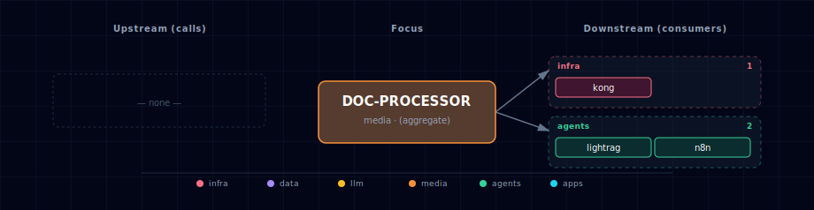

# Document Processor Service

AI-powered document processing using IBM's Docling library with OpenAI-compatible API.

## 1. Overview

The Document Processor service offers intelligent document conversion and extraction with:

- **Multiple Backend Support**: Localhost (CPU/GPU) and Docker (NVIDIA GPU)
- **Advanced Processing**: Tables (DocLayNet + TableFormer), formulas, images, code blocks
- **GPU Acceleration**: 4.3x speedup for table extraction on NVIDIA GPUs
- **Multiple Formats**: PDF, DOCX, PPTX, HTML, Images, and more
- **RAG-Ready**: Structure-aware chunking for retrieval-augmented generation
- **OpenAI-Compatible**: REST API with standard endpoints

## 2. Quick Start

### 2.1 GPU Users (NVIDIA CUDA)

**Edit `.env`:**
```bash
DOC_PROCESSOR_SOURCE=docling-container-gpu
```

**Start the stack:**
```bash
./start.sh
```

### 2.2 Localhost Users (CPU or Native GPU)

**Step 1: Install dependencies**
```bash
cd services/docling/provider/localhost
uv sync
```

**Step 2: Start doc processor server on host (in separate terminal)**
```bash
cd services/docling/provider/localhost
uv run server.py
```

**Step 3: Start the stack with doc processor enabled**
```bash
./start.sh --doc-processor-source docling-localhost
```

**Note:**
- Document processor is **disabled by default** - you must explicitly enable it
- First run downloads models (~500MB) and may take 5-10 minutes
- Subsequent runs are instant
- Alternative: Edit `.env` and set `DOC_PROCESSOR_SOURCE=docling-localhost` for permanent enable

### 2.3 Disable Document Processor

```bash
DOC_PROCESSOR_SOURCE=disabled
```

## 3. Test the API

```bash
curl -X POST http://localhost:63040/v1/document/convert \
  -F "file=@document.pdf" \
  -F "output_format=markdown" \
  -F "use_ocr=auto" \
  -F "table_mode=accurate"
```

## 4. Configuration

### 4.1 Environment Variables

| Variable | Description | Default |
|----------|-------------|---------|
| `DOC_PROCESSOR_SOURCE` | Service source (docling-container-gpu, docling-localhost, disabled) | `disabled` |
| `DOC_PROCESSOR_PORT` | External port (container mode) | `63040` |
| `DOCLING_OUTPUT_FORMAT` | Output format (markdown, html, json, doctags) | `markdown` |
| `DOCLING_USE_OCR` | OCR mode (auto, always, never) | `auto` |
| `DOCLING_TABLE_MODE` | Table extraction (accurate, fast) | `accurate` |

### 4.2 GPU-Specific (NVIDIA Docker)

| Variable | Description | Default |
|----------|-------------|---------|
| `DOCLING_GPU_DEVICE` | Device type | `cuda` |
| `DOCLING_GPU_IMAGE` | Docker base image | `pytorch/pytorch:2.5.1-cuda12.4-cudnn9-runtime` |
| `DOCLING_GPU_SCALE` | Container replicas (set by bootstrapper) | `0` |

### 4.3 Processing Options

| Variable | Description | Default |
|----------|-------------|---------|
| `DOCLING_MAX_FILE_SIZE` | Max file size in bytes | `52428800` (50MB) |
| `DOCLING_ENABLE_FORMULAS` | Extract mathematical formulas | `true` |
| `DOCLING_ENABLE_CODE_BLOCKS` | Extract code blocks | `true` |
| `DOCLING_CHUNK_SIZE` | Default chunk size for RAG | `512` |
| `DOCLING_CHUNK_OVERLAP` | Default chunk overlap | `50` |

### 4.4 Localhost-Specific

| Variable | Description | Default |
|----------|-------------|---------|
| `DOCLING_LOCALHOST_URL` | Local service URL | `http://host.docker.internal:63021` |

## 5. API Reference

### 5.1 POST /v1/document/convert

Convert documents to structured format.

**Request:**

```bash
curl -X POST http://localhost:63040/v1/document/convert \
  -F "file=@document.pdf" \
  -F "output_format=markdown" \
  -F "use_ocr=auto" \
  -F "table_mode=accurate" \
  -F "enable_chunking=true" \
  -F "chunk_size=512" \
  -F "chunk_overlap=50"
```

**Parameters:**

- `file` (required): Document file (PDF, DOCX, PPTX, HTML, images, etc.)
- `output_format`: Output format (`markdown`, `html`, `json`, `doctags`)
- `use_ocr`: OCR mode (`auto`, `always`, `never`)
- `table_mode`: Table extraction quality (`accurate`, `fast`)
- `enable_chunking`: Enable RAG chunking (boolean)
- `chunk_size`: Size of each chunk in characters
- `chunk_overlap`: Overlap between chunks in characters

**Response:**

```json
{
  "content": "# Extracted Document\n\nContent here...",
  "format": "markdown",
  "metadata": {
    "pages": 10,
    "tables": 3,
    "images": 5,
    "formulas": 2,
    "processing_time": 1.23,
    "source_format": "pdf",
    "file_size": 1024000
  },
  "chunks": [
    {
      "text": "Chunk text here...",
      "metadata": {
        "chunk_index": 0,
        "page_number": 1,
        "section_title": "Introduction",
        "chunk_type": "text"
      }
    }
  ]
}
```

### 5.2 GET /health

Health check endpoint.

**Request:**

```bash
curl http://localhost:63040/health
```

**Response:**

```json
{
  "status": "healthy",
  "backend": "docling",
  "device": "cuda"
}
```

### 5.3 GET /v1/models

List available models and configurations.

**Request:**

```bash
curl http://localhost:63040/v1/models
```

**Response:**

```json
{
  "models": [
    {
      "id": "docling-default",
      "name": "Docling Document Processor",
      "description": "IBM Docling with TableFormer and DocLayNet"
    }
  ]
}
```

## 6. Supported Formats

### 6.1 Documents
- PDF (.pdf)
- Microsoft Word (.docx, .doc)
- Microsoft PowerPoint (.pptx, .ppt)
- Microsoft Excel (.xlsx)
- HTML (.html, .htm)

### 6.2 Images
- PNG (.png)
- JPEG (.jpg, .jpeg)
- TIFF (.tiff, .tif)

## 7. Output Formats

### 7.1 Markdown (Default)
Clean, readable markdown with preserved structure.

```bash
output_format=markdown
```

### 7.2 HTML
Semantic HTML with preserved styling information.

```bash
output_format=html
```

### 7.3 JSON
Structured JSON with detailed metadata.

```bash
output_format=json
```

### 7.4 DocTags
IBM Docling's native format with full document structure.

```bash
output_format=doctags
```

## 8. Performance

### 8.1 GPU Backend (NVIDIA)

| Hardware | Table Speed | PDF Speed | Memory |
|----------|-------------|-----------|--------|
| RTX 3060 | 4.3x faster | ~2s/page | ~2GB VRAM |
| RTX 4090 | 4.3x faster | ~1s/page | ~2GB VRAM |
| A100 | 4.3x faster | ~0.5s/page | ~2GB VRAM |

### 8.2 CPU Backend (Localhost)

| Hardware | Table Speed | PDF Speed | Memory |
|----------|-------------|-----------|--------|
| M1/M2/M3 | Baseline | ~5s/page | ~2GB RAM |
| Intel i7 | Baseline | ~8s/page | ~2GB RAM |
| AMD Ryzen | Baseline | ~6s/page | ~2GB RAM |

*Speed depends on document complexity and number of tables*

## 9. Integration

### 9.1 Open WebUI

Document upload and processing automatically uses doc processor endpoint if available.

### 9.2 n8n Workflows

Use HTTP Request node:

```
POST http://docling-gpu:8000/v1/document/convert
```

### 9.3 JupyterHub Notebooks

```python
import requests

with open("document.pdf", "rb") as f:
    response = requests.post(
        "http://docling-gpu:8000/v1/document/convert",
        files={"file": f},
        data={
            "output_format": "markdown",
            "enable_chunking": True,
            "chunk_size": 512
        }
    )

result = response.json()
print(result["content"])
print(f"Extracted {result['metadata']['pages']} pages")
```

### 9.4 Backend API

The backend service automatically exposes doc processor endpoints if available.

## 10. RAG Integration

### 10.1 Enable Chunking

```bash
curl -X POST http://localhost:63040/v1/document/convert \
  -F "file=@document.pdf" \
  -F "enable_chunking=true" \
  -F "chunk_size=512" \
  -F "chunk_overlap=50"
```

### 10.2 Chunk Metadata

Each chunk includes:
- `chunk_index`: Position in document
- `page_number`: Source page (if available)
- `section_title`: Section heading (if available)
- `chunk_type`: Content type (text, table, image, formula, code)

### 10.3 Example RAG Workflow

```python
import requests
import json

# 1. Convert document with chunking
with open("document.pdf", "rb") as f:
    response = requests.post(
        "http://localhost:63040/v1/document/convert",
        files={"file": f},
        data={"enable_chunking": True, "chunk_size": 512}
    )

result = response.json()

# 2. Store chunks in vector database
for chunk in result["chunks"]:
    # Generate embeddings and store in Weaviate
    embedding = generate_embedding(chunk["text"])
    store_in_weaviate(chunk["text"], embedding, chunk["metadata"])

# 3. Query for relevant chunks
query = "What are the main findings?"
relevant_chunks = search_weaviate(query, top_k=5)

# 4. Generate answer with LLM
context = "\n\n".join([c["text"] for c in relevant_chunks])
answer = llm_query(f"Context: {context}\n\nQuestion: {query}")
```

## 11. Architecture

```
services/docling/provider/
├── gpu/                    # NVIDIA GPU implementation (Docker)
│   ├── Dockerfile         # CUDA + PyTorch optimized
│   ├── processor.py       # Docling processing logic
│   └── requirements.txt   # Dependencies
├── localhost/              # Native execution (CPU or GPU)
│   ├── server.py          # Standalone FastAPI server
│   ├── processor.py       # Docling processing logic
│   ├── models.py          # Pydantic models (copied from shared)
│   ├── utils.py           # Utilities (copied from shared)
│   ├── requirements.txt
│   └── README.md          # Installation guide
└── shared/                 # Common components
    ├── api_server.py      # FastAPI REST server (used by GPU)
    ├── models.py          # Pydantic response models
    └── utils.py           # File handling and chunking
```

## 12. Source Modes

### 12.1 docling-container-gpu

Runs Docling in Docker container with NVIDIA GPU acceleration.

**Best for**: NVIDIA GPU users (RTX 3060+, A100, etc.)

**Resources**: ~2GB VRAM, CUDA 12.4+

**Advantages**:
- 4.3x faster table extraction
- Isolated environment
- No local installation needed

### 12.2 docling-localhost

Connects to Docling running on host machine.

**Best for**: Custom installations, development, CPU-only systems

**Setup**: Run Docling locally on port 63021

**Advantages**:
- Works on any platform (Mac, Linux, Windows)
- Can use native GPU drivers
- Easier debugging

### 12.3 disabled

No document processing service.

**Best for**: When document processing is not needed

**Impact**: Document upload/conversion features unavailable

## 13. Required Services

### 13.1 Required

- None (Document processor is optional for all services)

### 13.2 Optional (Can Use Doc Processor)

- **open-web-ui**: Document upload and processing
- **n8n**: Document processing workflows
- **backend**: Proxy document processing API endpoints
- **jupyterhub**: Notebooks with document processing capabilities
- **local-deep-researcher**: Research document analysis

## 14. Advanced Features

### 14.1 Table Extraction Modes

**Accurate Mode** (default):
- Uses TableFormer model for precise table extraction
- 4.3x faster on GPU
- Best for complex tables with merged cells

**Fast Mode**:
- Uses rule-based extraction
- 10x faster than accurate mode
- Best for simple tables

### 14.2 OCR Modes

**Auto** (default):
- Only uses OCR when needed (scanned PDFs, images)
- Best balance of speed and accuracy

**Always**:
- Forces OCR on all documents
- Slower but may extract more text

**Never**:
- Disables OCR completely
- Fastest but may miss text in images

### 14.3 Formula Extraction

```bash
DOCLING_ENABLE_FORMULAS=true
```

Extracts mathematical formulas in LaTeX format.

### 14.4 Code Block Extraction

```bash
DOCLING_ENABLE_CODE_BLOCKS=true
```

Identifies and extracts code blocks with syntax preservation.

## 15. References

- [IBM Docling Documentation](https://ds4sd.github.io/docling/)
- [Docling GitHub](https://github.com/DS4SD/docling)
- [TableFormer Paper](https://arxiv.org/abs/2203.01017)
- [DocLayNet Dataset](https://github.com/DS4SD/DocLayNet)

## 16. Dependencies & Integrations

> Auto-generated section — the **Current** subsections are derived from `services/doc-processor/service.yml`'s `data_flow.calls` field (and inverse passes). Re-run `python -m bootstrapper.docs.regen doc-processor` after manifest changes.

### 16.1 Current — Upstream (this service calls)

_No upstream calls._

### 16.2 Current — Downstream (services that call this)

| Service | Category |
|---|---|
| kong | infra |
| n8n | agents |

### 16.3 Architecture diagram



[Open the interactive HTML diagram](./architecture.html) for a full-screen view.

### 16.4 Future — Missing pair integrations

- **doc-processor ↔ weaviate** — *Why:* closes the RAG loop — Docling already emits structure-aware chunks; persisting them straight into the stack's vector store removes per-consumer reimplementation. *Mechanism:* post-convert callback writes to `http://weaviate:8080/v1/objects` (upstream ships `rag_weaviate.ipynb` showing the pattern). *Effort:* medium. *Confidence:* high.
- **doc-processor ↔ minio** — *Why:* convert is slow (1-8s/page) and the same source is frequently re-requested. Caching `(sha256 → DocTags JSON)` in MinIO removes re-processing cost and gives stable S3 URIs that n8n/backend can reference. *Mechanism:* sidecar writes `s3://docling-cache/<sha>.json` via boto3 on convert; subsequent requests short-circuit. *Effort:* medium. *Confidence:* medium.
- **doc-processor ↔ n8n** — *Why:* README invites this pattern but no shipped workflow exists. A first-party "PDF → markdown → Weaviate" workflow makes RAG ingest a two-click setup. *Mechanism:* `services/n8n/init/workflows/docling-rag.json` doing HTTP Request → `POST http://docling-gpu:8000/v1/document/convert` → Weaviate node. *Effort:* small. *Confidence:* high.
- **doc-processor ↔ hermes** — *Why:* Hermes agents lack a "read this document" tool. Docling-MCP exposes convert/extract directly to MCP-capable runtimes. *Mechanism:* run `docling-mcp` as a streamable-HTTP MCP endpoint registered as a Hermes custom provider. *Effort:* medium. *Confidence:* medium.
- **doc-processor ↔ redis** — *Why:* response-cache the slow conversions in the stack's already-deployed cache. *Mechanism:* keyed on `sha256(file)+options`, TTL 24h, stored at `redis://redis:6379/2` with compressed JSON. *Effort:* small. *Confidence:* medium.

### 16.5 Future — Candidate new services

- **Docling MCP Server** ([details](../../docs/research/candidates/docling-mcp.md)) — *Headline:* first-party MCP wrapper exposing Docling convert/extract tools to agent runtimes. *Wires into:* hermes, openclaw, backend.
- **Apache Tika** ([details](../../docs/research/candidates/apache-tika.md)) — *Headline:* fallback extractor for legacy/exotic formats Docling doesn't cover (RTF, ODT, EML, MSG, ZIP). *Wires into:* n8n, backend.

### 16.6 Future — Unused features in this service

- **Audio/ASR pipeline** — *Why pursue:* Docling natively parses WAV/MP3/WebVTT to DoclingDocument with timestamps + sections, more structured than raw STT output. *Effort:* medium.
- **HybridChunker (tokenizer-aware)** — *Why pursue:* replaces naive `chunk_size`/`chunk_overlap` with embedding-model-aware boundaries, materially improving RAG recall. *Effort:* small.
- **DocTags lossless output** — *Why pursue:* enables round-trip editing and full-fidelity caching; we currently consume only markdown. *Effort:* small.
- **VLM pipeline (GraniteDocling 258M)** — *Why pursue:* better layout + chart understanding than the default DocLayNet/TableFormer pair, at low VRAM cost. *Effort:* medium.
- **Structured information extraction (beta)** — *Why pursue:* enables doc → entities/relations without a separate LLM step, feeding the proposed Neo4j integration. *Effort:* large.

## 17. Troubleshooting

### 17.1 Model Download Fails

**Problem**: First startup fails to download models

**Solution**:
1. Check Hugging Face Hub access
2. Set `HUGGING_FACE_HUB_TOKEN` if needed
3. Verify disk space (~1GB required)

### 17.2 Slow Processing

**Problem**: Document processing slower than expected

**Solution**:
- **GPU**: Check CUDA drivers (`nvidia-smi`)
- **GPU**: Use `table_mode=fast` for faster (less accurate) table extraction
- **Memory**: Ensure sufficient RAM/VRAM available

### 17.3 OCR Issues

**Problem**: Text not extracted from scanned PDFs

**Solution**:
- Set `use_ocr=always` to force OCR on all documents
- Check document quality (low-res images may fail)
- Verify OCR dependencies are installed

### 17.4 Container Won't Start

**Problem**: docling-gpu fails to start

**Solution**:
1. Check logs: `docker logs genai-docling-gpu`
2. Verify SOURCE setting matches your hardware
3. Ensure Docker has sufficient resources allocated
4. Check GPU drivers and CUDA version

### 17.5 File Size Errors

**Problem**: "File too large" error

**Solution**:
- Increase `DOCLING_MAX_FILE_SIZE` in `.env`
- Split large documents into smaller files
- Compress images in PDF documents
