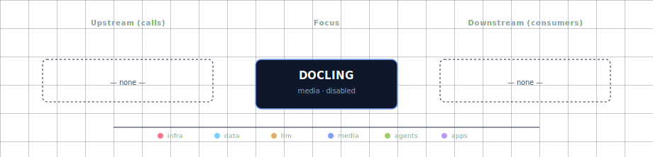

# Docling (Document Processor engine)

Docling is the engine behind the **Document Processor** role selectable via
`DOC_PROCESSOR_SOURCE`. It is documented under the **Document Processor**
aggregator rather than as a standalone service, because the user-facing role is
"pick a doc-processing engine" — not "pick Docling":

→ See [services/doc-processor/README.md](../doc-processor/README.md) for the
full user-facing description, source-variant table, configuration reference,
and integration notes.

## 1. Engine quick reference

- **Image (GPU):** `pytorch/pytorch:2.12.1-cuda12.6-cudnn9-runtime` (used as
  `BASE_IMAGE` in the GPU provider Dockerfile)
- **License:** MIT (IBM)
- **Activation:** `DOC_PROCESSOR_SOURCE=docling-container-gpu` (or
  `docling-localhost` for host-installed Docling)
- **In-container port:** 8000
- **Host port:** `${DOC_PROCESSOR_PORT}` (computed from `BASE_PORT` by the
  bootstrapper)

The manifest (`service.yml`) and compose fragment (`compose.yml`) in this folder
are the bootstrapper's source of truth for those values; treat this README as a
pointer, not a duplicate of the aggregator doc.

## 2. Dependencies & Integrations

> Auto-generated section — the **Current** subsections are derived from `services/docling/service.yml`'s `data_flow.calls` field (and inverse passes). Re-run `python -m bootstrapper.docs.regen docling` after manifest changes.

### 2.1 Current — Upstream (this service calls)

_No upstream calls._

### 2.2 Current — Downstream (services that call this)

| Service | Category |
|---|---|
| kong | infra |
| lightrag | agents |
| n8n | agents |

### 2.3 Architecture diagram

[Open the interactive HTML diagram](./architecture.html) for a full-screen view.

### 2.4 Future — Missing pair integrations

_No high-confidence opportunities identified._

### 2.5 Future — Candidate new services

_No high-confidence opportunities identified._

### 2.6 Future — Unused features in this service

_No high-confidence opportunities identified._
