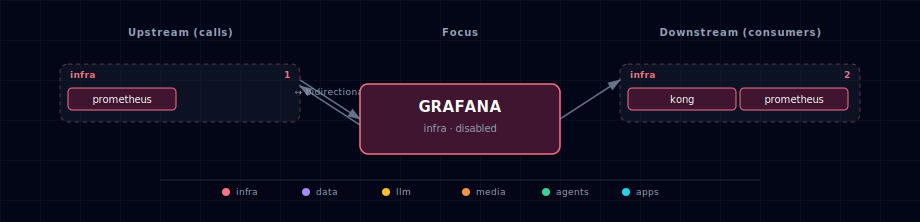

# Grafana (observability UI + alerting)

Grafana runs as a single container in the stack's `infra` band. It pre-provisions a Prometheus datasource pointing at the in-cluster Prometheus, plus 7 starter dashboards under the **GenAI Vanilla** folder. Persistence uses SQLite on a named volume — single-replica only.

## 1. Overview

Image: `grafana/grafana:11.4.3` (AGPL — operational-use safe). The bootstrapper auto-generates `GRAFANA_ADMIN_PASSWORD` on first run via `generate_grafana_admin_password()` (mirrors LiteLLM's master-key pattern). Anonymous access is **off**; admin login is required.

Unified alerting is enabled. No alert rules or contact points ship pre-provisioned — users add their own under `provisioning/alerting/` (which contains a no-op `placeholder.yml` stub to satisfy Grafana's `.yaml`-suffix scanner; replace it with real alert configuration when wiring up).

`config/provisioning/` ships four subdirectories — Grafana scans all of them at startup and errors loudly on any that are absent:

- `datasources/` — Prometheus datasource (UID `Prometheus`)
- `dashboards/` — the 7 shipped JSON dashboards + `dashboards.yml` provider
- `alerting/` — alert rules / contact points (currently just the placeholder)
- `plugins/` — app-plugin provisioning (currently empty, kept via `.gitkeep`)

## 2. Access

| Surface | URL | Auth |
|---|---|---|
| Direct | `http://localhost:${GRAFANA_PORT}` | `${GRAFANA_ADMIN_USERNAME}` / `${GRAFANA_ADMIN_PASSWORD}` |
| Kong | `http://grafana.localhost:${KONG_HTTP_PORT}` | Same |
| Internal | `http://grafana:3000` | Same — backend-network only |

## 3. Configuration

```bash
GRAFANA_SOURCE=disabled                 # container | disabled
GRAFANA_ADMIN_USERNAME=admin
GRAFANA_ADMIN_PASSWORD=                 # auto-generated on first run
GRAFANA_PORT=                           # auto-assigned by topology (infra block)
```

Auto-managed (do not edit by hand):

```bash
GRAFANA_ENDPOINT=...                    # not consumed externally; written for symmetry
GRAFANA_SCALE
```

The provisioned datasource reads `${PROMETHEUS_ENDPOINT}` — when Prometheus is `disabled`, this interpolates to empty and Grafana shows "datasource unreachable" until Prometheus is turned on.

## 4. Dashboards (7 shipped)

| File | Title | Source metrics |
|---|---|---|
| `stack-overview.json` | Stack Overview | UP/DOWN counts, request rate aggregation, host + container resource summary |
| `litellm.json` | LiteLLM | Per-model requests, tokens, spend, latency p50/p95/p99, errors |
| `kong.json` | Kong API Gateway | Per-route req rate, status codes, p95 latency, bandwidth |
| `postgres-redis.json` | Postgres + Redis | Connections, query rate, table sizes, memory, ops/sec, hit ratio |
| `containers-and-host.json` | Containers + Host | cAdvisor per-container CPU/mem/IO, node-exporter host load/disk |
| `n8n.json` | n8n | Workflow executions, status, active count |
| `app-tier.json` | App tier (Weaviate + MinIO) | Vector queries, S3 traffic, bucket sizes |

All dashboards reference the `Prometheus` datasource by name (UID = `Prometheus` per `provisioning/datasources/prometheus.yml`).

## 5. Dependencies & Integrations

> Auto-generated section — the **Current** subsections are derived from `services/grafana/service.yml`'s `data_flow.calls` field (and inverse passes). Re-run `python -m bootstrapper.docs.regen grafana` after manifest changes.

### 5.1 Current — Upstream (this service calls)

| Service | Category |
|---|---|
| prometheus ↔ | infra |

### 5.2 Current — Downstream (services that call this)

| Service | Category |
|---|---|
| prometheus ↔ | infra |

### 5.3 Architecture diagram



[Open the interactive HTML diagram](./architecture.html) for a full-screen view.

### 5.4 Future — Missing pair integrations

_No high-confidence opportunities identified._

### 5.5 Future — Candidate new services

- **Loki + Tempo datasources** — when log and trace bundles ship, add their datasources to `provisioning/datasources/` and surface them as additional dashboards.
- **Alertmanager** — only if Grafana's unified alerting hits a real limitation (HA, clustering).
- **OAuth provider** — replace the admin-password model with Supabase Auth / GitHub OAuth via `GF_AUTH_GENERIC_OAUTH_*` env vars.

### 5.6 Future — Unused features in this service

- **Anonymous read mode** — `GF_AUTH_ANONYMOUS_ENABLED=true` would let teammates view dashboards without an account. Off by default for safety; flip when sharing externally.
- **Postgres backend** — Supabase Postgres could replace the SQLite file-based store, enabling horizontal scaling. Today's single-replica deployment doesn't need it.
- **Image renderer** — server-side panel-to-PNG rendering for alert notifications and reports. Adds a sidecar but unlocks rich alert payloads.

## 6. Troubleshooting

- **"Datasource unreachable" on every panel** — Prometheus is `disabled`. Set `PROMETHEUS_SOURCE=container` in `.env` and re-run `./start.sh`. The datasource URL is interpolated at provisioning time, so a Grafana restart is required after changing `PROMETHEUS_ENDPOINT`.
- **Admin login rejected** — check `GRAFANA_ADMIN_PASSWORD` in `.env`. The bootstrapper only auto-generates it on FIRST run (empty value); a wrong value persists. Wipe and re-run to regenerate, or edit `.env` directly.
- **Dashboards missing** — Grafana's provisioner watches the directory every 30s (`updateIntervalSeconds: 30`). If a dashboard JSON has a syntax error, Grafana logs it under "Provisioning errors" and skips the file.
- **Redirect URL contains internal `grafana` hostname instead of `grafana.localhost`** — Kong's `preserve_host: True` flag must be set on the Grafana route. The route generator handles this; verify with `curl -I http://grafana.localhost`.
