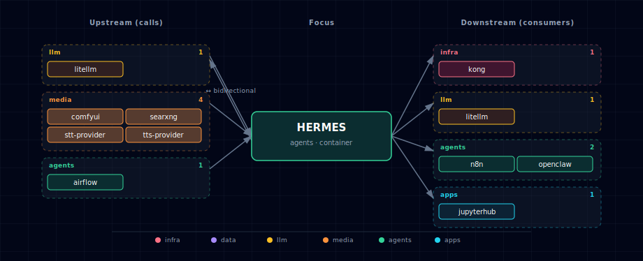

# Hermes Agent

**Port:** 63028 (API), 63029 (dashboard)
**SOURCE variable:** `HERMES_SOURCE`
**SOURCE options:** container, localhost, disabled

## 1. Overview

Hermes is a programmable AI-agent runtime from Nous Research — the missing
*agent loop* layer between raw LLM chat and channel-specific adapters like
OpenClaw. It exposes an OpenAI-compatible API on port 8642 and a web
dashboard on port 9119.

Key facts:

- **File-based persistence** — everything lives under `/opt/data` (the
  `hermes-data` named volume). No Postgres / Redis dependency.
- **No GPU required** — Hermes is an orchestrator; inference is delegated to
  whatever endpoint `model.base_url` points at. Stack default routes through
  the LiteLLM gateway.
- **MCP-native** — first-class client for any MCP server.
- **64K-context floor** — Hermes preflight-checks the model's context
  window. `HERMES_DEFAULT_MODEL` MUST be a ≥64K-context model. Stock Ollama
  models default to 4096 — use `--ctx-size 65536` or a cloud model.
- **Disk footprint** — verified at **~5.66 GB** on `linux/amd64` and
  `linux/arm64` (the image is multi-arch — works on Apple Silicon and
  standard Linux servers). Plan-time estimates put it at 2.6 GB; the
  actual size is over 2x that. Plan disk space accordingly.
- **Bundles 87 default skills** — synced into `~/.hermes/skills/` on every
  container start. Our `creative-comfyui-host-override.md` file is added
  alongside them and takes precedence per Hermes's skill resolver.

## 2. Access

| Path | URL | Notes |
|---|---|---|
| OpenAI-compatible API (direct) | `http://localhost:63028` | Bearer token: `${HERMES_API_KEY}`. Same surface as OpenAI's `/v1/chat/completions`. |
| Dashboard (direct) | `http://localhost:63029` | Web admin UI for skills, sessions, model config. |
| Dashboard (Kong) | `http://hermes.localhost:63002` | Requires `./start.sh --setup-hosts`. |
| Internal DNS (other containers) | `http://hermes:8642` | Reachable from LiteLLM, n8n, backend, jupyterhub, openclaw. |

See the canonical port table at [Ports and Routes](../../docs/deployment/ports-and-routes.md).

## 3. Architecture & wiring

Hermes is wired into the stack in two directions:

1. **Hermes → LiteLLM (outbound)** — Hermes calls
   `http://litellm:4000/v1/chat/completions` for every LLM operation. Pick
   the model via `HERMES_DEFAULT_MODEL` (any name LiteLLM exposes).
2. **LiteLLM → Hermes (inbound)** — `services/litellm/init/scripts/init.py` appends
   a `hermes-agent` row to LiteLLM's `model_list` when `HERMES_SOURCE !=
   disabled`. Consequence: Open-WebUI, n8n, backend, JupyterHub, OpenClaw
   all see `hermes-agent` in their model dropdowns automatically — no
   per-consumer wiring.

The loop is intentional. Hermes is the agent runtime above raw chat; LiteLLM
is the single front door for LLM traffic.

### 3.1 Optional integration points (wired by `hermes-init`)

`services/hermes/init/scripts/init-hermes.sh` renders `/opt/data/config.yaml` from
environment. When the underlying service is enabled, Hermes gets:

| Hermes feature | Stack service | Mechanism |
|---|---|---|
| LLM reasoning | LiteLLM | `model.provider: custom`, `base_url: http://litellm:4000/v1` |
| TTS (text-to-speech) | Speaches (Kokoro/Piper, default) / Chatterbox (voice cloning) | `tts.provider: openai`, `base_url: ${TTS_ENDPOINT}/v1` — auto-set from the active TTS engine (e.g. `http://speaches:8000/v1` or `http://chatterbox:4123/v1`) |
| STT (speech-to-text) | Speaches (Faster-Whisper, default) / Parakeet (NVIDIA NeMo) / whisper.cpp (Apple Silicon) | `stt.provider: openai`, `base_url: ${STT_ENDPOINT}/v1` — auto-set from the active STT engine |
| Web search | SearXNG | `search.provider: searxng`, `base_url: http://searxng:8080` |
| Image generation | ComfyUI | Skill override at `/opt/data/skills/creative-comfyui-host-override.md` pinning the bundled `creative-comfyui` skill to `http://comfyui:18188` (Hermes's default is hardcoded to `127.0.0.1:8188`). |

When a dependency is `disabled`, the corresponding block is omitted from
`config.yaml` and Hermes simply doesn't expose that capability. Graceful
degradation; no failure.

## 4. Configuration

```bash
HERMES_SOURCE=container             # container | localhost | disabled
HERMES_IMAGE=nousresearch/hermes-agent:0.13.0
HERMES_API_PORT=63028
HERMES_DASHBOARD_PORT=63029
HERMES_DASHBOARD_ENABLED=true
HERMES_DASHBOARD_TUI=1              # 1 = embed Chat tab (PTY+WS); 0 = read-only dashboard
HERMES_DEFAULT_MODEL=               # blank = hermes-init auto-picks from LiteLLM's model_list
HERMES_CONTEXT_LENGTH=65536         # hard floor; leave alone
HERMES_API_KEY=                     # auto-generated if empty
HERMES_MEMORY_LIMIT=4g
HERMES_CPU_LIMIT=2.0
```

**Auto-default model.** When `HERMES_DEFAULT_MODEL` is blank, `hermes-init`
queries `http://litellm:4000/v1/models` at startup and picks the first
match from a priority list (`ollama/qwen3.6:latest` → `claude-sonnet-4-6`
→ `claude-opus-4-7` → `gpt-5` → `gpt-5-codex` → `gpt-5-mini` → first
available non-hermes-agent model). Cheapest-local-first, big-context-
cloud-second. Operator-supplied values are never overridden.

**Dashboard Chat tab.** With `HERMES_DASHBOARD_TUI=1` (the default), the
dashboard exposes `/chat` and a `/ws/chat` WebSocket route, embedding a
PTY-backed `hermes --tui` session as a tab — letting you talk to the
agent directly from the web UI without going through Open WebUI or
`curl`. The upstream `nousresearch/hermes-agent` image already ships
`ptyprocess` for this. Set `HERMES_DASHBOARD_TUI=0` for a read-only
dashboard. Reference: [upstream Web-Dashboard docs](https://hermes-agent.nousresearch.com/docs/user-guide/features/web-dashboard).

Use `./start.sh` for the guided wizard, or pass `--hermes-source <option>`
for scripted changes.

### 4.1 Containerize vs. localhost

| Scenario | Recommended SOURCE |
|---|---|
| Hermes consumed by Open-WebUI / n8n / OpenClaw (default) | **container** |
| Hermes operates your real machine (real shell, real browser) | `localhost` |
| Microphone-driven live voice mode | `localhost` (container mic passthrough is non-trivial) |
| Resource-constrained machine | `disabled` |

## 5. Known caveats

- **`HERMES_UID` cannot be `0`** — the upstream entrypoint runs
  `usermod -u $HERMES_UID hermes` to remap the in-container user, which
  fails with `usermod: UID '0' already exists` (root). Stack default is
  `10000`; keep it non-zero.
- **Gateway warning on first boot** — the gateway logs
  `WARNING gateway.run: No user allowlists configured. All unauthorized
  users will be denied.` This is about Hermes's *messaging-platform*
  allowlists (Telegram, Discord, etc.), NOT the OpenAI-compatible API
  surface. Set `GATEWAY_ALLOW_ALL_USERS=true` in `~/.hermes/.env`, or
  configure per-platform allowlists (`TELEGRAM_ALLOWED_USERS=...`,
  `DISCORD_ALLOWED_USERS=...`) when wiring messaging channels through
  OpenClaw.
- **Image tag scheme — `latest` + per-commit `sha-...`, no semver** —
  upstream publishes only the moving `latest` tag and immutable
  `sha-<commit>` tags (no `v0.13.0`-style semver). Default ships
  `nousresearch/hermes-agent:latest` so first-run users get the current
  release; production deployments should pin to a specific sha:

  ```bash
  # In .env — pin a specific build digest
  HERMES_IMAGE=nousresearch/hermes-agent:sha-e85592591e8028cceecb0ea2b4992a1643b52f93
  ```

  Latest tags are listed at
  <https://hub.docker.com/r/nousresearch/hermes-agent/tags>. If a fresh
  `latest` introduces a regression, picking the previous sha tag is a
  one-line rollback.
- **ComfyUI hardcoded URL** — Hermes's bundled `creative-comfyui` skill
  defaults to `127.0.0.1:8188`. We override via a skill file dropped under
  `/opt/data/skills/`. If a workflow ignores the override, the fallback is
  to add a `socat` sidecar mapping `127.0.0.1:8188 → comfyui:18188`.
- **STT base_url override is undocumented** — Hermes documents `base_url`
  override for the OpenAI TTS provider; STT may need a fallback to
  `provider: command` with a `HERMES_LOCAL_STT_COMMAND`-style curl. See the
  comment in `services/hermes/init/templates/config.yaml.tmpl`.
- **64K context floor** — small Ollama models (default 4096 ctx) will fail
  Hermes's preflight check. Pull with `ollama run <model> --ctx-size 65536`
  or pick a cloud model.
- **Open-WebUI model-list cache** — Open-WebUI caches the LiteLLM model list
  for 5 minutes (`MODEL_LIST_CACHE_TTL=300`). After first start, `hermes-agent`
  may take up to 5 minutes to appear in the dropdown. Set
  `OPEN_WEB_UI_MODEL_CACHE_TTL=0` to disable while developing.

## 6. Integration notes

Depends on (must be alive for Hermes to be useful):

- **LiteLLM gateway** — `http://litellm:4000` — Hermes refuses to operate
  without a reachable LLM endpoint.

Optionally consumes (wired automatically when the SOURCE != disabled):

- **TTS provider** (`TTS_PROVIDER_SOURCE`) — Speaches / Chatterbox / disabled
- **STT provider** (`STT_PROVIDER_SOURCE`) — Speaches / Parakeet / whisper.cpp / disabled
- **ComfyUI** (`COMFYUI_SOURCE`)
- **SearXNG** (`SEARXNG_SOURCE`)

Consumed by (the `hermes-agent` model name appears in their dropdowns or
their env exposes `HERMES_ENDPOINT`):

- **Open-WebUI** — `hermes-agent` model in the chat dropdown (via LiteLLM).
- **n8n** — `hermes-agent` callable from any HTTP-Request or AI node; also
  `HERMES_ENDPOINT` in the worker process env.
- **Backend API** — `HERMES_ENDPOINT` + `HERMES_API_KEY` for code paths that
  want the agent loop instead of raw chat completions.
- **JupyterHub** — notebooks see `HERMES_ENDPOINT` for direct calls; also
  the `hermes-agent` model via LiteLLM.
- **OpenClaw** — `HERMES_ENDPOINT` + `HERMES_API_KEY` so OpenClaw can bridge
  Hermes agents to messaging channels (WhatsApp / Telegram / Discord).

## 7. Troubleshooting

```bash
# Service status
docker compose ps hermes hermes-init

# Logs
docker compose logs -f hermes
docker compose logs hermes-init   # one-shot config rendering

# Verify the OpenAI-compatible API is up
HERMES_KEY=$(grep ^HERMES_API_KEY .env | cut -d= -f2)
curl -fsS http://localhost:63028/v1/models \
  -H "Authorization: Bearer ${HERMES_KEY}" | jq .

# Verify hermes-agent appears in LiteLLM's model_list
curl -fsS http://localhost:63012/v1/models \
  -H "Authorization: Bearer ${LITELLM_MASTER_KEY}" | jq '.data[].id' | grep hermes

# Inspect the rendered config Hermes is using
docker compose exec hermes cat /opt/data/config.yaml
```

For general startup and routing issues, see [Troubleshooting](../../docs/quick-start/troubleshooting.md).

## 8. References

- Upstream repo — <https://github.com/NousResearch/hermes-agent>
- Official docs — <https://hermes-agent.nousresearch.com/docs/>
- Open-WebUI integration guide — <https://hermes-agent.nousresearch.com/docs/user-guide/messaging/open-webui>
- Docker / bridged-network compose form — <https://hermes-agent.nousresearch.com/docs/user-guide/docker>

## 9. Dependencies & Integrations

> Auto-generated section — the **Current** subsections are derived from `services/hermes/service.yml`'s `data_flow.calls` field (and inverse passes). Re-run `python -m bootstrapper.docs.regen hermes` after manifest changes.

### 9.1 Current — Upstream (this service calls)

| Service | Category |
|---|---|
| ray | infra |
| litellm ↔ | llm |
| comfyui | media |
| searxng | media |
| stt-provider | media |
| tts-provider | media |
| backend ↔ | apps |

### 9.2 Current — Downstream (services that call this)

| Service | Category |
|---|---|
| kong | infra |
| litellm ↔ | llm |
| n8n | agents |
| openclaw | agents |
| backend ↔ | apps |
| jupyterhub | apps |
| open-webui | apps |

### 9.3 Architecture diagram



[Open the interactive HTML diagram](./architecture.html) for a full-screen view.

### 9.4 Future — Missing pair integrations

- **hermes ↔ neo4j** — *Why:* Adds durable cross-session episodic memory (entities, relations) queryable from other services, replacing flat-file state under `/opt/data`. *Mechanism:* Custom skill over `bolt://graph-db:7687` exposed as a `memory.graph` tool. *Effort:* medium. *Confidence:* medium.
- **hermes ↔ weaviate** — *Why:* Semantic recall across sessions and ingested docs, reusing the in-stack `multi2vec-clip` vectorizer. *Mechanism:* Skill calling `http://weaviate:8080/v1/objects` against a `HermesMemory` class. *Effort:* medium. *Confidence:* medium.
- **hermes ↔ minio** — *Why:* Skill outputs (ComfyUI images, STT transcripts) get shareable URLs other services can fetch instead of being trapped in a bind mount. *Mechanism:* New `hermes-artifacts` bucket via the existing `minio-init` IAM pattern; S3 SigV4 against `http://minio:9000`. *Effort:* small. *Confidence:* high.
- **hermes ↔ n8n** — *Why:* Reverses the current one-way edge so Hermes can invoke n8n workflows as tools, turning 400+ n8n connectors into Hermes capabilities without per-platform skills. *Mechanism:* Generic "call-n8n" skill POSTing to `http://n8n:5678/webhook/<id>` with `N8N_WEBHOOK_TOKEN`. *Effort:* small. *Confidence:* high.
- **hermes ↔ doc-processor** — *Why:* Lets Hermes answer questions about uploaded PDFs by routing them through the in-stack Docling parser before context or vector ingest. *Mechanism:* Skill POSTing multipart to `http://docling:5001/v1/convert/file`. *Effort:* small. *Confidence:* high.
- **hermes ↔ supabase** — *Why:* A JWT-scoped shared session store lets one Hermes session follow a user across Open WebUI, JupyterHub, and OpenClaw instead of being pinned to single-tenant `/opt/data`. *Mechanism:* Skill writing to `hermes_sessions` via PostgREST at `http://supabase-api:3000`, keyed by Supabase JWT `sub`. *Effort:* medium. *Confidence:* medium.

### 9.5 Future — Candidate new services

- **Langfuse** ([details](../../docs/research/candidates/langfuse.md)) — *Headline:* Self-hostable observability and prompt-trace store for LLM and diffusion workflows, capturing structured traces, evaluations, and cost telemetry. *Wires into:* litellm, hermes, n8n, comfyui, supabase, minio.
- **MCP Gateway** ([details](../../docs/research/candidates/mcp-gateway.md)) — *Headline:* A consolidated MCP server exposing neo4j, weaviate, minio, n8n, and supabase as MCP tools any MCP-native client can mount. *Wires into:* hermes, open-webui, jupyterhub, neo4j, weaviate, minio, n8n.

### 9.6 Future — Unused features in this service

- **MCP server mode** — *Why pursue:* Unlocks tool-use over Neo4j/Weaviate/MinIO/n8n via a uniform protocol instead of bespoke skills, leveraging Hermes's existing MCP-client support. *Effort:* medium.
- **Messaging-platform allowlists** — *Why pursue:* Wiring `GATEWAY_ALLOW_ALL_USERS`, `TELEGRAM_ALLOWED_USERS`, and `DISCORD_ALLOWED_USERS` is required before OpenClaw can safely bridge Hermes to Telegram/Discord/WhatsApp without an open relay. *Effort:* small.
- **Per-user / multi-tenant sessions** — *Why pursue:* Needed for any shared deployment beyond a single developer's laptop; current `/opt/data` layout is single-tenant. *Effort:* large.
- **Voice mode (mic passthrough)** — *Why pursue:* Enables true voice agent UX in-stack, currently gated on running Hermes via `localhost` SOURCE for mic access. *Effort:* large.
- **Skill marketplace / dynamic skill install** — *Why pursue:* Lets users add capabilities without rebuilding the image; Hermes upstream already supports dynamic skill loading. *Effort:* medium.
