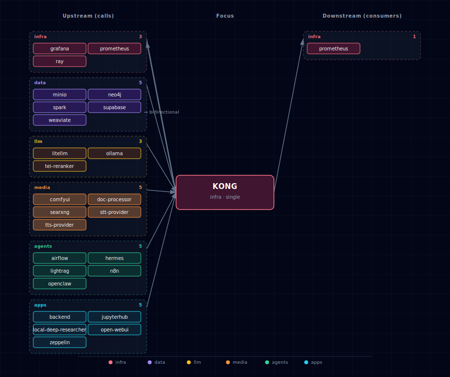

# Kong API Gateway

Kong serves as the intelligent API gateway for Atlas, providing dynamic routing, authentication, and service management.

## 1. Overview

Kong acts as the central entry point for most services, routing requests to appropriate backend services based on dynamic configuration generated at startup.

## 2. Dynamic Configuration

Unlike traditional static configuration files, Atlas uses dynamic Kong configuration that adapts to your SOURCE settings:

- **Automatic Route Generation**: Kong routes are created based on enabled services
- **Health Checking**: Localhost services are checked for availability before routing
- **Adaptive Configuration**: Disabled services automatically have their routes removed
- **No Manual Configuration**: Replaces the old dual kong.yml/kong-local.yml approach

The configuration is generated at startup by `bootstrapper/utils/kong_config_generator.py`.

`volumes/api/kong-dynamic.yml` is **a generated runtime artifact, not a checked-in file**. It is `.gitignore`d, regenerated on every `./start.sh`, and reflects the resolved SOURCE state (container / localhost / disabled) at that moment. Direct `docker compose up` from a clean checkout will fail because the bind mount target won't exist — always launch through `./start.sh`, which writes the file before invoking compose.

Validate the default-route **generator contract** (no `./start.sh` needed; the checker materialises a tmp dir with a copy of `.env.example`, runs `kong_config_generator` against it, and verifies the output. Your local `volumes/api/kong-dynamic.yml` is *not* read — its contents depend on your current `.env`, which makes it useless as a regression check):

```bash
uv run --project bootstrapper python scripts/check-kong-routes.py
```

Plain `python3 scripts/check-kong-routes.py` works too if `PyYAML` is on your system Python — the checker prints `FAIL import: PyYAML is required to parse Kong config` and exits with status 2 otherwise. The `uv` form is preferred because it uses the project's pinned dependencies.

## 3. Service Routing

### 3.1 Always-Available Routes (Supabase)
- `/auth/v1/` → Supabase Auth service
- `/rest/v1/` → Supabase API (PostgREST)
- `/graphql/v1/` → Supabase GraphQL
- `/realtime/v1/` → Supabase Realtime
- `/storage/v1/` → Supabase Storage
- `/pg/` → Supabase Meta service
- `/` → Supabase Studio dashboard

### 3.2 Dynamic Routes (Based on SOURCE)
- `comfyui.localhost` → ComfyUI service (if enabled)
- `n8n.localhost` → n8n service (if enabled)
- `search.localhost` → SearxNG service (if enabled)
- `api.localhost` → Backend API (always-on adaptive core service)
- `chat.localhost` → Open WebUI (if enabled)
- `jupyter.localhost` → JupyterHub (if enabled)
- `openclaw.localhost` → OpenClaw gateway (if enabled)
- `hermes.localhost` → Hermes Agent web dashboard (if `HERMES_SOURCE != disabled` and `HERMES_DASHBOARD_ENABLED=true`)
- `litellm.localhost` → LiteLLM gateway + admin dashboard (always-on; same alias exposes `/ui/`, `/v1/*`, and `/spend/*`)
- `minio.localhost` → MinIO admin console (if `MINIO_SOURCE != disabled`; S3 API at `MINIO_PORT` NOT aliased — S3 clients use the direct port)
- `studio.localhost` → Supabase Studio dashboard (and bare `localhost` falls through to the same upstream)
- `graph.localhost` → Neo4j Browser (`NEO4J_GRAPH_DB_SOURCE != disabled`)
- `weaviate.localhost` → Weaviate REST API (`WEAVIATE_SOURCE != disabled`)
- `ollama.localhost` → Ollama upstream (`LLM_PROVIDER_SOURCE ∈ {ollama-container-*, ollama-localhost}`)
- `docling.localhost` → Docling document processor (`DOC_PROCESSOR_SOURCE != disabled`)
- `research.localhost` → Local Deep Researcher (`LOCAL_DEEP_RESEARCHER_SOURCE != disabled`)
- `stt.localhost` → STT engine (`STT_PROVIDER_SOURCE != disabled`; container resolves to `parakeet-gpu` or `speaches`, localhost to `host.docker.internal` on the per-engine port)
- `tts.localhost` → TTS engine (`TTS_PROVIDER_SOURCE != disabled`; container resolves to `speaches:8000` or `chatterbox:4123`, localhost to `host.docker.internal` on the per-engine port)
- `spark.localhost` → Spark Master Web UI (`SPARK_SOURCE != disabled`; routes to in-container `spark-master:8080`)
- `spark-history.localhost` → Spark History Server UI (`SPARK_SOURCE != disabled`; routes to in-container `spark-history:18080`)
- `zeppelin.localhost` → Zeppelin notebook UI (`ZEPPELIN_SOURCE != disabled`; routes to in-container `zeppelin:8080`; hard-gated on `SPARK_SOURCE != disabled`)
- `airflow.localhost` → Airflow Web UI + REST API (`AIRFLOW_SOURCE != disabled`; routes to in-container `airflow-webserver:8080`; same alias serves UI at `/` and REST API under `/api/v2/`)
- `lightrag.localhost` → http://lightrag:9621/ (LightRAG WebUI + API; `preserve_host` enabled)
- `rerank.localhost` → http://tei-reranker:80/ (TEI rerank API)

Example: `curl http://lightrag.localhost:${KONG_HTTP_PORT}/health`

Each `*-localhost` source still gets a Kong route — Kong proxies through `host.docker.internal` to the user's host machine. Kong's compose entry includes `extra_hosts: ["host.docker.internal:${HOST_GATEWAY_IP}"]` so this works on Linux Docker too (Docker Desktop on macOS/Windows resolves it automatically). Users with non-default localhost ports override via `<SVC>_LOCALHOST_PORT` env vars; both the in-container consumers (`runtime_sc.<svc>.localhost.environment`) and the Kong route generator (`bootstrapper/utils/kong_config_generator.py`) read the same PORT var and derive the URL as `http://host.docker.internal:${<SVC>_LOCALHOST_PORT}`, keeping both paths in sync.

## 4. SOURCE-Based Configuration

### 4.1 ComfyUI Routes
```python
# Generated based on COMFYUI_SOURCE
if source == 'localhost':
    port = os.environ.get('COMFYUI_LOCALHOST_PORT', '8000')
    service['url'] = f'http://host.docker.internal:{port}/'
elif source in ['container-cpu', 'container-gpu']:
    service['url'] = 'http://comfyui:18188/'
# No route created if source == 'disabled'
```

### 4.2 Localhost Service Health Checks
When routing to localhost services, Kong generator performs health checks:

```python
def check_localhost_service(self, host: str, port: int, service_name: str) -> bool:
    try:
        with socket.create_connection((host, port), timeout=2):
            return True
    except (socket.error, socket.timeout):
        print(f"WARN: {service_name} localhost service not reachable on {host}:{port}")
        return False
```

## 5. Authentication

Kong handles multiple authentication schemes:

- **API Key Authentication**: Used for Supabase API services
- **Basic Authentication**: Used for protected admin interfaces
- **Pass-through Authentication**: For services that handle their own auth

## 6. CORS Handling

All services automatically get CORS plugin configuration for cross-origin requests:

```python
'plugins': [{'name': 'cors'}]
```

## 7. Rate Limiting

Some services include rate limiting for protection:

```python
# SearxNG example
{
    'name': 'rate-limiting',
    'config': {
        'minute': 60,
        'hour': 1000,
        'policy': 'local'
    }
}
```

## 8. WebSocket Support

Kong supports WebSocket connections for real-time services:

```python
{
    'name': 'realtime-v1-ws',
    'url': 'http://supabase-realtime:4000/socket',
    'protocol': 'ws',
    # ...
}
```

## 9. Configuration Generation Process

1. **Startup**: `start.py` calls Kong configuration generator at step 4.5
2. **Environment Parsing**: Current .env file is parsed for SOURCE values
3. **Health Checks**: Localhost services are checked for availability  
4. **Route Generation**: Only enabled services get routes created
5. **File Writing**: Configuration written to volumes/api/kong-dynamic.yml
6. **Kong Startup**: Kong loads the generated configuration

## 10. Debugging Kong Configuration

### 10.1 View Generated Configuration
```bash
# Check what configuration was generated
cat volumes/api/kong-dynamic.yml

# View Kong logs
docker logs ${PROJECT_NAME}-kong-api-gateway -f

# Test Kong routing end-to-end (proxies SearXNG's /healthz through Kong;
# the bare-localhost root now serves the basic-auth-gated Studio route)
curl -H 'Host: search.localhost' http://localhost:63000/healthz
```

### 10.2 Verify Routes
```bash
# List all configured routes
docker exec ${PROJECT_NAME}-kong-api-gateway kong config -c /home/kong/kong.yml dump

# Test specific routes
curl -H "Host: comfyui.localhost" http://localhost:63000/
curl -H "Host: n8n.localhost" http://localhost:63000/
curl -H "Host: jupyter.localhost" http://localhost:63000/
curl -H "Host: openclaw.localhost" http://localhost:63000/
curl -H "Host: hermes.localhost" http://localhost:63000/
curl -H "Host: litellm.localhost" http://localhost:63000/ui/
curl -H "Host: minio.localhost" http://localhost:63000/
curl -H "Host: spark.localhost" http://localhost:63000/
curl -H "Host: spark-history.localhost" http://localhost:63000/
curl -H "Host: zeppelin.localhost" http://localhost:63000/
curl -H "Host: airflow.localhost" http://localhost:63000/
# Airflow REST API (same alias). 3.x is JWT-only — exchange password
# for a token via /auth/token, then call /api/v2/ with Bearer auth:
TOKEN=$(curl -fsS -X POST -H "Host: airflow.localhost" \
  -H 'Content-Type: application/json' \
  -d "{\"username\":\"admin\",\"password\":\"${AIRFLOW_ADMIN_PASSWORD}\"}" \
  http://localhost:63000/auth/token | jq -r .access_token)
curl -H "Host: airflow.localhost" -H "Authorization: Bearer $TOKEN" \
  http://localhost:63000/api/v2/dags
```

## 11. Advanced Configuration

For advanced Kong configuration needs, modify the `KongConfigGenerator` class in `bootstrapper/utils/kong_config_generator.py`.

Key methods:
- `generate_kong_config()` - Main configuration generator
- `check_localhost_service()` - Health check implementation
- `generate_*_service()` - Service-specific route generators

## 12. Integration with Other Services

Kong integrates tightly with:
- **Service Configuration**: Uses SOURCE values from service_config.py
- **Environment Management**: Reads from parsed .env files
- **Health Monitoring**: Checks localhost service availability
- **Dynamic Scaling**: Adapts to enabled/disabled services

For more information on Kong's role in the overall architecture, see the system overview in the project [README](../../README.md) and the architecture diagram at `docs/diagrams/architecture.svg`.

## 13. Dependencies & Integrations

> Auto-generated section — the **Current** subsections are derived from `services/kong/service.yml`'s `data_flow.calls` field (and inverse passes). Re-run `python -m bootstrapper.docs.regen kong` after manifest changes.

### 13.1 Current — Upstream (this service calls)

| Service | Category |
|---|---|
| grafana | infra |
| prometheus ↔ | infra |
| ray | infra |
| minio | data |
| neo4j | data |
| spark | data |
| supabase | data |
| weaviate | data |
| litellm | llm |
| ollama | llm |
| tei-reranker | llm |
| comfyui | media |
| doc-processor | media |
| searxng | media |
| stt-provider | media |
| tts-provider | media |
| airflow | agents |
| hermes | agents |
| lightrag | agents |
| n8n | agents |
| openclaw | agents |
| backend | apps |
| jupyterhub | apps |
| local-deep-researcher | apps |
| open-webui | apps |
| zeppelin | apps |

### 13.2 Current — Downstream (services that call this)

| Service | Category |
|---|---|
| cloudflared | infra |
| prometheus ↔ | infra |

### 13.3 Architecture diagram



[Open the interactive HTML diagram](./architecture.html) for a full-screen view.

### 13.4 Future — Missing pair integrations

- **kong ↔ multi2vec-clip** — *Why:* exposing CLIP's raw `/vectors` endpoint via Kong lets backend, n8n, and jupyterhub compute embeddings directly instead of round-tripping a Weaviate query, unlocking re-ranking and offline batch jobs. *Mechanism:* alias `clip.localhost` → `http://multi2vec-clip:8080/vectors`, gated by `MULTI2VEC_CLIP_SOURCE != disabled`, CORS plugin only. *Effort:* small. *Confidence:* low.

### 13.5 Future — Candidate new services

- **Prometheus** ([details](../../docs/research/candidates/prometheus.md)) — *Headline:* time-series database that turns Kong's bundled `prometheus` plugin plus per-service exporters into a single observability spine. *Wires into:* kong, redis, supabase, n8n, ollama, litellm, backend.
- **Keycloak** ([details](../../docs/research/candidates/keycloak.md)) — *Headline:* self-hosted OIDC/OAuth2 provider replacing the stack's ad-hoc per-service basic-auth with a single SSO layer fronted by Kong. *Wires into:* kong, jupyterhub, open-webui, n8n, minio, neo4j, openclaw, backend.
- **Grafana Loki** ([details](../../docs/research/candidates/grafana-loki.md)) — *Headline:* log-aggregation backend that pairs with Kong's `http-log` plugin to give the stack a single queryable log store across every routed service. *Wires into:* kong, backend, litellm, n8n, hermes, comfyui, supabase.

### 13.6 Future — Unused features in this service

- **`prometheus` plugin** — *Why pursue:* Kong 3.9 OSS bundles it; enabling it per-route gives free p50/p95/error-rate per upstream with zero code changes. *Effort:* small.
- **`opentelemetry` plugin** — *Why pursue:* emit OTLP spans for every gateway hop so requests through Kong → LiteLLM → Ollama can be stitched into a single trace. *Effort:* small.
- **`jwt` plugin (replacing per-route basic-auth)** — *Why pursue:* validate JWTs against Supabase GoTrue keys already in `.env` to secure jupyter/n8n/openclaw/hermes without standing up a new identity service. *Effort:* medium.
- **`request-size-limiting` plugin** — *Why pursue:* ComfyUI and Docling routes accept arbitrarily large multipart uploads; a 100 MB cap at the gateway prevents accidental host OOM. *Effort:* small.
- **`correlation-id` plugin** — *Why pursue:* inject `X-Request-ID` on ingress so backend/litellm/hermes logs become joinable across the request path. *Effort:* small.
- **`ai-proxy` plugin** — *Why pursue:* Kong's AI Gateway normalizes OpenAI/Anthropic/Ollama request shapes at the edge, worth evaluating as a comparison (not replacement) for LiteLLM's role. *Effort:* large.
- **`ai-prompt-guard` plugin** — *Why pursue:* regex allow/deny on prompt content at the gateway gives a defense-in-depth layer before LiteLLM. *Effort:* medium.
- **Health-check active probing** — *Why pursue:* swap the one-shot TCP probe at startup for Kong's `healthchecks.active` block so localhost services auto-recover when they bounce. *Effort:* small.
- **Admin API on a private port** — *Why pursue:* Kong's admin API (8001) is currently disabled; selectively exposing read-only `/status` on an internal port would unblock health dashboards. *Effort:* small.

## 14. Troubleshooting

### 14.1 Common Issues

**Route not found (404)**
- Check if service SOURCE is enabled
- Verify service is running and healthy
- Check hosts file configuration

**Connection refused**
- For localhost routes, ensure service is running on specified port
- Check firewall settings for localhost services
- Verify Docker network connectivity

**Authentication errors**
- Check if service requires API key authentication
- Verify Supabase keys are properly generated
- Ensure proper headers are sent

### 14.2 Debug Commands
```bash
# Check Kong gateway status
docker compose ps | grep kong

# View detailed Kong configuration
docker exec ${PROJECT_NAME}-kong-api-gateway cat /home/kong/kong.yml

# Test internal Kong admin API
docker exec ${PROJECT_NAME}-kong-api-gateway curl http://localhost:8001/status
```
