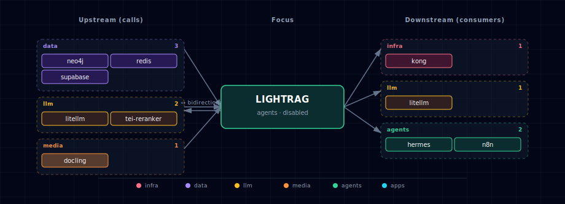

# LightRAG

> **Image:** `ghcr.io/hkuds/lightrag:v1.5.4`
> **Container port:** 9621 (API + WebUI)  · **Default host port:** allocated by `topology.py` (agents band 63060–63079)
> **Default:** disabled

## 1. Overview

[LightRAG](https://github.com/HKUDS/LightRAG) is a graph-augmented RAG server. It ingests documents (PDF, Office, images, tables, equations — multimodal pipeline absorbed from RAG-Anything in v1.5.0), extracts a knowledge graph via LLM-driven entity/relation extraction, embeds chunks and entities into a vector store, and exposes a unified query API that combines graph traversal with vector search.

In this stack, LightRAG reuses existing infrastructure:

- **LLM + embeddings** routed through LiteLLM (`LLM_BINDING_HOST=http://litellm:4000/v1`).
- **Vector store** → Supabase pgvector (`PGVectorStorage`).
- **Graph store** → Neo4j (`Neo4JStorage`).
- **KV + doc-status** → Redis (`RedisKVStorage`).
- **Document parsing** → Docling (when `DOC_PROCESSOR_SOURCE != disabled`).
- **Reranking** defaults off. Atlas does not directly wire LightRAG to TEI today because LightRAG's built-in Jina/Cohere rerank clients send a payload shape that TEI's `/rerank` endpoint does not accept.

When any of these backends is disabled, LightRAG transparently falls back to in-process file backends (`NanoVectorDBStorage` / `NetworkXStorage` / `JsonKVStorage`). Multimodal images become text-only when docling is disabled.

## 2. Source variants

| Source | Scale | Endpoint | Notes |
|---|---|---|---|
| `container` | 1 | `http://lightrag:9621` | In-stack LightRAG |
| `localhost` | 0 | `http://host.docker.internal:${LIGHTRAG_LOCALHOST_PORT}` | Host-installed LightRAG |
| `disabled` | 0 | `""` | LightRAG off; consumers see empty endpoint |

## 3. Configuration

Storage selectors and model bindings can be overridden via `.env`:

```env
LIGHTRAG_SOURCE=disabled                            # default
LIGHTRAG_KV_STORAGE=RedisKVStorage                  # alt: JsonKVStorage
LIGHTRAG_VECTOR_STORAGE=PGVectorStorage             # alt: NanoVectorDBStorage, QdrantVectorDBStorage, ...
LIGHTRAG_GRAPH_STORAGE=Neo4JStorage                 # alt: NetworkXStorage, MemgraphStorage, AGEStorage
LIGHTRAG_DOC_STATUS_STORAGE=RedisDocStatusStorage   # alt: PGDocStatusStorage, JsonDocStatusStorage
LIGHTRAG_LLM_MODEL=                                 # empty = inherit LITELLM_DEFAULT_MODEL
LIGHTRAG_EXTRACT_LLM_MODEL=                         # empty = inherit LLM_MODEL
LIGHTRAG_KEYWORD_LLM_MODEL=                         # empty = inherit LLM_MODEL
LIGHTRAG_QUERY_LLM_MODEL=                           # empty = inherit LLM_MODEL
LIGHTRAG_EXTRACT_MAX_ASYNC_LLM=                     # empty = inherit MAX_ASYNC_LLM
LIGHTRAG_QUERY_LLM_TIMEOUT=                         # empty = inherit LLM_TIMEOUT
LIGHTRAG_QUERY_ENABLE_RERANK=false                  # direct TEI rerank needs an adapter
LIGHTRAG_QUERY_TOP_K=10                             # graph query KG top-k
LIGHTRAG_QUERY_CHUNK_TOP_K=5                        # graph query chunk top-k
LIGHTRAG_QUERY_MAX_TOTAL_TOKENS=12000               # graph query context budget
LIGHTRAG_EMBEDDING_MODEL=                           # empty = inherit LITELLM_EMBEDDING_MODEL
LIGHTRAG_VLM_PROCESS_ENABLE=true                    # vision LLM for images/figures
```

LightRAG v1.5 supports role-specific LLM settings for extraction, keyword extraction, and final query answering. Atlas exposes those as `LIGHTRAG_EXTRACT_*`, `LIGHTRAG_KEYWORD_*`, and `LIGHTRAG_QUERY_*` inputs, then maps them to LightRAG's native `EXTRACT_*`, `KEYWORD_*`, and `QUERY_*` runtime environment names. Leave a role value empty to inherit the base LightRAG runtime `LLM_*` settings; the base model name itself is resolved by `lightrag-init` when `LIGHTRAG_LLM_MODEL` is empty.

Atlas also exposes LightRAG's query defaults as `LIGHTRAG_QUERY_ENABLE_RERANK`, `LIGHTRAG_QUERY_TOP_K`, `LIGHTRAG_QUERY_CHUNK_TOP_K`, and `LIGHTRAG_QUERY_MAX_TOTAL_TOKENS`. Numeric query values default to concrete integers because LightRAG v1.5 parses those env vars as integers and does not accept empty strings. `LIGHTRAG_QUERY_ENABLE_RERANK` defaults to `false` because direct LightRAG-to-TEI reranking is not wire-compatible yet: LightRAG sends `{query, documents}` through its Jina/Cohere clients, while TEI expects `{query, texts}`. Re-enable reranking only when routing through a compatible adapter or custom rerank binding.

For local Ollama graph RAG, use a fast non-reasoning model for `EXTRACT` and `KEYWORD`, and reserve the stronger answer model for `QUERY`:

```env
LIGHTRAG_LLM_MODEL=qwen3.6:latest
LIGHTRAG_EXTRACT_LLM_MODEL=mistral-small3.2:24b
LIGHTRAG_KEYWORD_LLM_MODEL=mistral-small3.2:24b
LIGHTRAG_QUERY_LLM_MODEL=qwen3.6:latest
```

Atlas intentionally does not ship those model names as defaults; deployments that do not set role variables keep the existing single-model behavior.

Two security-relevant vars are auto-generated by the bootstrapper on first
launch and persisted to `.env`:

```env
LIGHTRAG_API_KEY=<auto>          # bearer for /api endpoints; forwarded to LiteLLM
LIGHTRAG_TOKEN_SECRET=<auto>     # JWT signing secret for /login flows
```

Without `LIGHTRAG_TOKEN_SECRET`, LightRAG falls back to a hardcoded default
JWT key (real security risk in any non-trivial deploy). Both are
generate-when-absent — hand-supplied values stick. Rotation requires a
litellm-init re-seed.

## 4. Usage

### 4.1 Web UI

Browse `http://lightrag.localhost:${KONG_HTTP_PORT}` (after `--setup-hosts`) or `http://localhost:${LIGHTRAG_API_PORT}/webui`. Upload documents, view the KG, run queries.

### 4.2 Native API

```bash
# Insert a document
curl -sX POST http://localhost:${LIGHTRAG_API_PORT}/documents/upload \
  -H "Authorization: Bearer ${LIGHTRAG_API_KEY}" \
  -F "file=@my-paper.pdf"

# Query
curl -sX POST http://localhost:${LIGHTRAG_API_PORT}/query \
  -H "Authorization: Bearer ${LIGHTRAG_API_KEY}" \
  -H "Content-Type: application/json" \
  -d '{"query": "/hybrid What is graph-augmented RAG?"}'
```

Query mode prefixes: `/hybrid`, `/local`, `/global`, `/naive`, `/mix`. Default is `/hybrid`.

### 4.3 Via LiteLLM (recommended for other stack services)

LightRAG is registered with LiteLLM as the `lightrag` model when enabled. Any LiteLLM consumer (open-webui, openclaw, n8n, hermes, backend, local-deep-researcher, jupyterhub) can invoke it:

```bash
curl -sX POST http://localhost:${LITELLM_PORT}/v1/chat/completions \
  -H "Authorization: Bearer ${LITELLM_MASTER_KEY}" \
  -H "Content-Type: application/json" \
  -d '{
    "model": "lightrag",
    "messages": [
      {"role": "user", "content": "/hybrid What is graph-augmented RAG?"}
    ]
  }'
```

## 5. Dependencies & Integrations

> Auto-generated section — the **Current** subsections are derived from `services/lightrag/service.yml`'s `data_flow.calls` field (and inverse passes). Re-run `python -m bootstrapper.docs.regen lightrag` after manifest changes.

### 5.1 Current — Upstream (this service calls)

| Service | Category |
|---|---|
| neo4j | data |
| redis | data |
| supabase | data |
| litellm ↔ | llm |
| docling | media |

### 5.2 Current — Downstream (services that call this)

| Service | Category |
|---|---|
| kong | infra |
| litellm ↔ | llm |
| hermes | agents |
| n8n | agents |

### 5.3 Architecture diagram



[Open the interactive HTML diagram](./architecture.html) for a full-screen view.

### 5.4 Future — Missing pair integrations

_No high-confidence opportunities identified._

### 5.5 Future — Candidate new services

_No high-confidence opportunities identified._

### 5.6 Future — Unused features in this service

_No high-confidence opportunities identified._

## 6. Storage backend matrix

| Storage role | Default backend | In-process fallback (when source disabled) |
|---|---|---|
| KV | Redis `db=2` | JsonKVStorage (`/app/data/kv/*.json`) |
| Vector | Supabase pgvector | NanoVectorDBStorage (`/app/data/vectors/*.json`) |
| Graph | Neo4j | NetworkXStorage (`/app/data/graph/*.graphml`) |
| Doc-status | Redis `db=2` | JsonDocStatusStorage |

## 7. Init container

`lightrag-init` runs once per `docker compose up`. It:

1. Runs after LiteLLM's Compose health gate and reads LiteLLM `/v1/models`.
2. Resolves the base `LIGHTRAG_LLM_MODEL` / `LIGHTRAG_EMBEDDING_MODEL` / `LIGHTRAG_EMBEDDING_DIM` from explicit overrides, LiteLLM defaults, or LiteLLM's model list, then writes LightRAG's native `LLM_MODEL` / `EMBEDDING_MODEL` / `EMBEDDING_DIM` to `/app/data/.env`. If no chat model can be resolved, init exits non-zero instead of starting LightRAG with an empty `LLM_MODEL`. Role-specific `LIGHTRAG_EXTRACT_*`, `LIGHTRAG_KEYWORD_*`, and `LIGHTRAG_QUERY_*` variables are passed directly to the runtime container.
3. Polls Postgres until it accepts connections (a readiness gate — `supabase-db` is SOURCE-replaceable, so `lightrag-init` intentionally has no hard compose `depends_on` on it), then runs the idempotent pgvector migration. The Neo4j migration runs separately and is non-fatal — it pre-creates the range index on `(:base).entity_id` that LightRAG otherwise creates on first write.

## 8. Troubleshooting

- **First boot exceeds health-check timeout** — `start_period` is 300 s. Initial tokenizer, embedding-model, and document-parser setup can take several minutes.
- **First boot logs missing PostgreSQL tables** — expected on a cold volume. LightRAG probes for its tables, logs relation-missing errors, then creates the tables and indexes before reporting healthy.
- **`OPENAI_API_KEY` warning at startup** — LightRAG checks env even when using `openai`-compatible Ollama. Harmless; the actual key is the `LITELLM_MASTER_KEY` forwarded as `LLM_BINDING_API_KEY`.
- **Empty KG after ingestion** — verify `LIGHTRAG_LLM_MODEL` actually points at a chat-capable model. Some embedding-only Ollama tags will silently produce empty triples.
- **Rerank does not run even when TEI is enabled** — expected with the stock stack. LightRAG's direct rerank clients and TEI's `/rerank` request body are incompatible without an adapter, so Atlas emits `RERANK_BINDING=null` by default.
- **`pgvector` dim mismatch** — drop and rerun the migration when changing `LIGHTRAG_EMBEDDING_DIM`: `psql ... -c "DROP SCHEMA lightrag CASCADE"` then restart.
