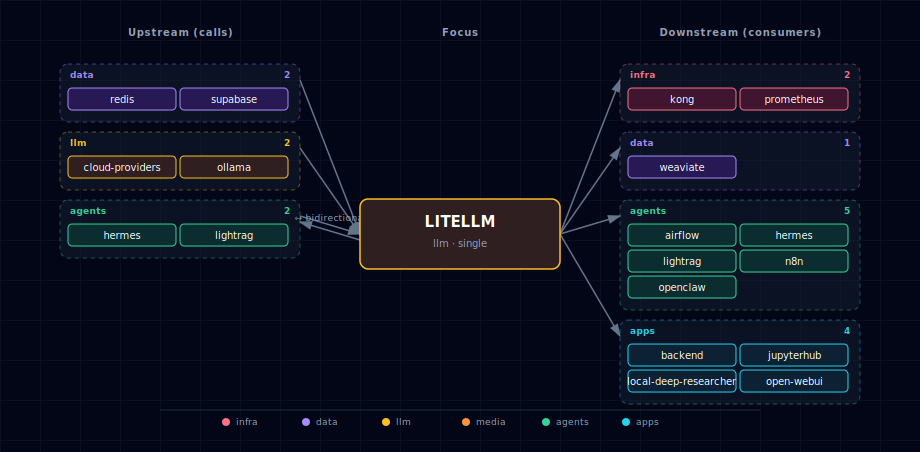

# LiteLLM Gateway

## 1. Overview

LiteLLM is the always-on OpenAI-compatible front door for every LLM provider in the stack. Every consumer service (Backend, Open WebUI, n8n, JupyterHub, Local Deep Researcher, OpenClaw, Weaviate vectorization) talks to **one URL** and **one API key** — `LITELLM_BASE_URL` / `LITELLM_API_KEY` — and LiteLLM routes each request to the right upstream based on the model name.

When [Hermes Agent](../hermes/README.md) is enabled, `services/litellm/init/scripts/init.py` appends a `hermes-agent` row to `model_list` whose `api_base` is `${HERMES_ENDPOINT}/v1`. The entry is NOT sourced from `public.llms` (Hermes is a service/runtime, not a model provider type), so it lives outside the LLM catalog taxonomy but uses the same `os.environ/HERMES_API_KEY` bearer token. Effect: Open WebUI, n8n, backend, jupyterhub, openclaw all see `hermes-agent` in the dropdown with no per-consumer wiring.

## 2. Image and ports

- Image: `ghcr.io/berriai/litellm:v1.83.14-stable.patch.2` (override via `LITELLM_IMAGE`). Pinned to a `vX.Y.Z-stable` tag; LiteLLM's prod docs explicitly warn against `main-latest` / `main-stable`.
- Internal port: `4000`. Host port: `LITELLM_PORT` (default `63030`). See `.env.example` for the current default.
- Internal port `4000` is also used by `supabase-realtime`; not a collision (different container hostnames).

## 3. Architecture

```
Consumers ──► litellm:4000 ──► Local engine (Ollama) and/or Cloud providers
                  │
                  ├─► supabase-db:5432/litellm   (DATABASE_URL)
                  └─► redis:6379                 (REDIS_HOST/PORT/PASSWORD)
```

- **Local engine** is a single-select choice (`LLM_PROVIDER_SOURCE`):
  - `ollama-container-cpu` / `ollama-container-gpu` — Docker Ollama upstream
  - `ollama-localhost` — Ollama running on the host machine
  - `none` — no local engine (cloud only)
- **Cloud providers** are independent toggles (each `enabled` / `disabled`):
  - `CLOUD_OPENAI_SOURCE` (requires `OPENAI_API_KEY`)
  - `CLOUD_ANTHROPIC_SOURCE` (requires `ANTHROPIC_API_KEY`)
  - `CLOUD_OPENROUTER_SOURCE` (requires `OPENROUTER_API_KEY`)
- Bootstrapper refuses to start when `LLM_PROVIDER_SOURCE=none` AND every cloud source is `disabled`.

## 4. Persistence

- **Database**: dedicated `litellm` database on the existing Supabase Postgres server. Created on first start by the `litellm-init` container (`services/litellm/init/scripts/init.py`). Same host (`supabase-db`), same credentials — separate logical database, so LiteLLM's `LiteLLM_*` Prisma-managed tables stay isolated from Supabase's schema. Override the database name via `LITELLM_DB_NAME`.
- **Redis**: response cache + rate-limit state. Reuses the stack's Redis at `redis:6379` with `REDIS_PASSWORD`.
- **Master key**: `LITELLM_MASTER_KEY` (must start with `sk-`) is auto-generated by the bootstrapper on first start and written into `.env`. Never overwritten on subsequent runs — virtual keys and spend history persist.

## 5. Configuration

`public.llms` (in the Supabase Postgres schema) is the single source of truth for which models LiteLLM exposes.

```
wizard / psql ──► public.llms (active=true) ──► litellm-init renders /app/config.yaml ──► litellm reads model_list
```

Two init containers cooperate on every `docker compose up`:

1. **`llm-catalog-init`** UPSERTs the curated catalog (`bootstrapper/utils/llm_catalog.py`) into `public.llms` and registers every entry from the wizard's `*_USER_MODELS` env vars (see below). Capability flags (content / structured_content / vision / embeddings) and immutable model facts (context_window, size_gb) refresh from the catalog on every run; existing `active` and `description` edits in the DB are preserved on conflict, so wizard selections and hand-edited notes survive re-runs.
2. **`litellm-init`** queries `SELECT provider, name FROM public.llms WHERE active = true` and renders `volumes/litellm/config.yaml` using per-provider routing rules baked into the init script (see the bullet list below). It does **not** join catalog metadata at render time — capability flags exist solely to drive wizard / backend behavior, not LiteLLM routing. The bootstrapper writes only a stub before `docker compose up` to satisfy the bind mount; the real `model_list` is filled in by `services/litellm/init/scripts/init.py` before the LiteLLM proxy starts.

The DB is the editable surface — change models via the wizard, or by hand. Note that `public.llms` is unique on `(provider, name)` (see `services/supabase/db/scripts/05a-public-tables-migrations.sql`), so every direct SQL edit must qualify the row by provider:

```bash
# Enable an OpenAI model
psql -h localhost -p ${SUPABASE_DB_PORT} -U postgres -d postgres -c \
  "UPDATE public.llms SET active = true WHERE provider = 'openai' AND name = 'gpt-5';"

# Enable an Ollama model
psql -h localhost -p ${SUPABASE_DB_PORT} -U postgres -d postgres -c \
  "UPDATE public.llms SET active = true WHERE provider = 'ollama' AND name = 'qwen3.6:latest';"
```

`volumes/litellm/config.yaml` is rebuilt on every run, so direct edits there are overwritten. Per-provider routing rules baked into `litellm-init`:

- **Ollama** rows: `model: ollama/<name>`, `api_base: $LITELLM_OLLAMA_UPSTREAM`.
- **OpenAI** rows: `model: <name>`, `api_key: $OPENAI_API_KEY`.
- **Anthropic** rows: `model: anthropic/<name>`, `api_key: $ANTHROPIC_API_KEY`.
- **OpenRouter** rows: `model: <name>` (catalog names already carry the `openrouter/` prefix), `api_key: $OPENROUTER_API_KEY`.

### 5.1 `*_USER_MODELS` env vars

The wizard's multiselect choices persist as comma-separated lists in `.env` so they survive across runs:

| Env var | Set by | Notes |
|---|---|---|
| `OLLAMA_USER_MODELS` | Single unified Ollama models multiselect (source-aware — container shows the library scrape only; localhost shows a merged view where rows are badged `[pulled]` if already on the upstream and `[library]` if catalog-only). | `llm-catalog-init` activates the matching rows in `public.llms` (every source). `ollama-pull` then pulls the active set from `public.llms` for container sources — note the indirection: `ollama-pull` reads the DB, not this env var directly. |
| `OLLAMA_CUSTOM_MODELS` | Ollama "additional models to pull" free-text step. | `llm-catalog-init` UPSERTs each entry as a row in `public.llms` with `active=true` for **every** Ollama source. For container sources, `ollama-pull` then fetches them. For `ollama-localhost`, the row exists for LiteLLM routing but you must `ollama pull <name>` on your host yourself. |
| `OPENAI_USER_MODELS` | OpenAI multiselect (after live `/v1/models` fetch). | `llm-catalog-init` activates matching rows; live-only names not in the curated catalog get INSERTed with generic capability defaults. |
| `ANTHROPIC_USER_MODELS` | Anthropic multiselect (after live `/v1/models` fetch). | Same INSERT-on-missing handling as OpenAI. |
| `OPENROUTER_USER_MODELS` | OpenRouter multiselect (after live `/api/v1/models` fetch). | Same INSERT-on-missing handling. |

Because these lists round-trip through `public.llms`, you can also extend them without re-running the wizard: `INSERT INTO public.llms (provider, name, active, ...) VALUES (...)` and the next `docker compose up` will pick up the row.

> Note: `llm-catalog-init` UPSERTs every row from `bootstrapper/utils/llm_catalog.py` into `public.llms` regardless of whether the matching provider is currently enabled. Disabled providers' rows still exist in the table — they just have `active=false`. Don't be surprised to see e.g. OpenAI rows after disabling the OpenAI tile; what controls whether LiteLLM exposes a model is the `active` flag, not row presence.

## 6. Access

| Surface | URL | Notes |
|---|---|---|
| Admin dashboard (Kong alias) | `http://litellm.localhost:${KONG_HTTP_PORT}/ui/` | **Use this from your browser.** A bare visit to `http://litellm.localhost:${KONG_HTTP_PORT}/` 302-redirects to `/ui/`. Requires `./start.sh --setup-hosts` so `litellm.localhost` resolves. |
| Admin dashboard (direct port) | `http://localhost:${LITELLM_PORT}/ui/` | Equivalent. The proxy root (`/`) on the direct port serves Swagger UI rather than redirecting — operators who want the API explorer should use the bare direct port; the dashboard always lives under `/ui/`. |
| Proxy API (Kong alias) | `http://litellm.localhost:${KONG_HTTP_PORT}/v1/*` | `GET /v1/models`, `POST /v1/chat/completions`, `POST /v1/embeddings`, etc. Bearer token = `${LITELLM_MASTER_KEY}`. |
| Proxy API (direct port) | `http://localhost:${LITELLM_PORT}/v1/*` | Same surface, no Kong in the path. |
| Usage telemetry | `http://litellm.localhost:${KONG_HTTP_PORT}/spend/{logs,users}` | Raw JSON rollups backing the dashboard's spend pages. Master-key auth. |
| In-network DNS (sibling containers) | `http://litellm:4000` | What `backend`, `open-web-ui`, `jupyterhub`, `local-deep-researcher`, `hermes`, and `weaviate` actually call. Not reachable from the host. |

### 6.1 Admin dashboard login

The dashboard at `/ui/` is password-protected. Credentials are set
explicitly on the LiteLLM container via two env vars:

| Env var | Default | Meaning |
|---|---|---|
| `LITELLM_UI_USERNAME` | `admin` | Username for the dashboard login form. Override in `.env` to change. |
| `LITELLM_MASTER_KEY` | auto-generated | Doubles as the dashboard **password**. The same `sk-…` value used as the proxy Bearer token. |

To recover the password:

```bash
grep '^LITELLM_MASTER_KEY=' .env | cut -d= -f2-
```

(Compose maps `LITELLM_UI_USERNAME` → `UI_USERNAME` and
`LITELLM_MASTER_KEY` → `UI_PASSWORD` inside the container; modern
LiteLLM versions require both env vars to be set explicitly — the
historic "master key alone authenticates the UI" fallback was retired
in favour of the V2 login endpoint.)

### 6.2 Kong-alias plumbing

The Kong route at `litellm.localhost` is **always-on** — no toggle. It's
generated by `bootstrapper/utils/kong_config_generator.py::generate_litellm_service()`
and proxies the entire LiteLLM surface (not just `/ui/`), so any LiteLLM
endpoint works through either the direct port or the alias. The route
uses `preserve_host: True` so LiteLLM's SPA constructs login redirect
URLs against `litellm.localhost:${KONG_HTTP_PORT}` (the browser's actual
URL) instead of the internal Docker hostname `litellm:4000` (which the
browser cannot resolve).

## 7. Ollama adapter choice (`ollama_chat/` vs `ollama/`)

LiteLLM ships two Ollama integrations and **they are not interchangeable**:

| Adapter | Hits Ollama at | Use for | Notes |
|---|---|---|---|
| `ollama_chat/<model>` | `/api/chat` | Chat completions (`/v1/chat/completions`) | Real OpenAI-shaped: multi-turn history, tool calls, vision payloads, and the Ollama-native `think` parameter all flow through. |
| `ollama/<model>` | `/api/generate` | Embeddings (`/v1/embeddings`) | Single-prompt completion. Tool calls do **not** work; multi-turn history is flattened to a single prompt; the `think` parameter is silently dropped. Required for embedding routes because `ollama_chat/` rejects `/v1/embeddings` with `Unmapped LLM provider for this endpoint`. |

`services/litellm/init/scripts/init.py::render_model_list` picks per-row using a
name heuristic: any model whose name contains `embed` (case-insensitive)
gets `ollama/` for the `/v1/embeddings` path; everything else gets
`ollama_chat/` + `think: false` so chat completions return populated
`content` (see next section).

If you add a new Ollama embedding model whose name doesn't contain
"embed", either rename it or extend the heuristic.

## 8. Thinking models (`think: false`)

Ollama's reasoning-capable family (qwen3, gpt-oss, deepseek-r1, …)
splits its output into a `thinking` channel and a `content` channel.
When the proxy's `max_tokens` budget is exceeded mid-`<think>` block —
or when a consumer like Hermes Agent only reads `content` — the
response arrives empty.

`init.py` therefore sets `think: false` on every Ollama **chat** entry
in `model_list`. Non-thinking models ignore the flag; thinking models
write their answer straight into `content` instead of `reasoning`.

Consumers that explicitly want the thinking trace can override
per-request:

```bash
curl -s -X POST http://localhost:63030/v1/chat/completions \
  -H "Authorization: Bearer $LITELLM_MASTER_KEY" \
  -d '{"model":"qwen3.6:latest","messages":[...],"think":true}'
```

`think: false` is **not** added to embedding entries (they use the
`ollama/` adapter which doesn't accept the parameter).

## 9. Health

- `GET http://localhost:63030/health/liveliness` — fast liveness check (no auth).
- `GET http://localhost:63030/v1/models` (with `Authorization: Bearer $LITELLM_MASTER_KEY`) — lists every model registered in `model_list`.

### 9.1 Expected startup noise (cosmetic, self-resolves in milliseconds)

The very first time the `litellm` container reaches the database after a
cold boot, the `genai-supabase-db` log will emit a burst of
`relation "<…>" does not exist at character 15` errors against the
`litellm` database. They look alarming but they are benign:

```
supabase_admin@litellm ERROR:  relation "LiteLLM_VerificationTokenView" does not exist
supabase_admin@litellm ERROR:  relation "MonthlyGlobalSpend" does not exist
supabase_admin@litellm ERROR:  relation "Last30dKeysBySpend" does not exist
supabase_admin@litellm ERROR:  relation "Last30dModelsBySpend" does not exist
supabase_admin@litellm ERROR:  relation "MonthlyGlobalSpendPerKey" does not exist
supabase_admin@litellm ERROR:  relation "MonthlyGlobalSpendPerUserPerKey" does not exist
supabase_admin@litellm ERROR:  relation "DailyTagSpend" does not exist
supabase_admin@litellm ERROR:  relation "Last30dTopEndUsersSpend" does not exist
```

**What it is:** LiteLLM spawns 4 uvicorn worker processes
(`--num_workers 4`); each independently bootstraps its Prisma query
engine and probes the eight dashboard views above. The probes race
LiteLLM's own per-worker `_create_database_views()` task and a
read-committed catalog-snapshot lookup in Postgres — for a 30–40 ms
window after the proxy starts serving traffic, some workers see a
relation that other workers / the Prisma migration step have just
created. After that window the views are visible to every backend and
the errors never recur.

**How to verify it's the harmless one:**

```bash
# All 8 views present in the litellm DB:
docker exec -e PGPASSWORD="$SUPABASE_DB_PASSWORD" genai-supabase-db \
  psql -U supabase_admin -d litellm -tAc "
    SELECT count(*) FROM pg_views WHERE schemaname='public' AND viewname IN
      ('LiteLLM_VerificationTokenView','MonthlyGlobalSpend','Last30dKeysBySpend',
       'Last30dModelsBySpend','MonthlyGlobalSpendPerKey','MonthlyGlobalSpendPerUserPerKey',
       'DailyTagSpend','Last30dTopEndUsersSpend')"
# Expect: 8

# All errors are clustered in a single sub-second window at startup:
docker logs genai-supabase-db 2>&1 | grep "ERROR.*does not exist" | awk '{print $2}' | sort -u
# Expect: one timestamp, all within ~50 ms

# After that window, no new ones appear:
docker logs --since 1m genai-supabase-db 2>&1 | grep -c "ERROR.*does not exist"
# Expect: 0
```

This is an upstream LiteLLM behavior (reproducible with the stock
`ghcr.io/berriai/litellm` image, no compose-layer fix possible without
forking the image or aggressively suppressing Postgres logs).
If those three checks pass it's the cosmetic race; if `count` ≠ 8 or
new errors keep appearing after startup, it's a real bug — escalate.

## 10. Smoke tests

```bash
# Liveness
curl -s http://localhost:63030/health/liveliness

# Chat completion (Ollama upstream)
curl -s -H "Authorization: Bearer $LITELLM_MASTER_KEY" \
  -X POST http://localhost:63030/v1/chat/completions \
  -d '{"model":"ollama/qwen3.6:latest","messages":[{"role":"user","content":"hi"}]}'

# Embeddings (Ollama upstream — Weaviate uses this path)
curl -s -H "Authorization: Bearer $LITELLM_MASTER_KEY" \
  -X POST http://localhost:63030/v1/embeddings \
  -d '{"model":"ollama/nomic-embed-text","input":"hi"}'

# Cache and spend audit
redis-cli -h localhost -p ${REDIS_PORT} KEYS "litellm*"
psql -h localhost -p ${SUPABASE_DB_PORT} -U postgres -d litellm -c "SELECT * FROM \"LiteLLM_SpendLogs\" ORDER BY \"startTime\" DESC LIMIT 5;"
```

## 11. Bypass paths

- **`ollama-pull`** still talks to the Ollama upstream directly (`/api/pull`) — model pulls are not OpenAI-compatible and don't go through LiteLLM. The compose service injects `OLLAMA_HOST_URL` from `LITELLM_OLLAMA_UPSTREAM`. The pull container does not run when `LLM_PROVIDER_SOURCE=none` (`OLLAMA_PULL_SCALE=0`).
- **Open WebUI's native Ollama UI features** (model pulls in the UI) are disabled — `ENABLE_OLLAMA_API: "false"` is set in compose. Use the `ollama-pull` init container or `docker exec -it $PROJECT_NAME-ollama ollama pull <model>` for direct pulls.

## 12. Backup option

If LiteLLM ever stops being a fit (license shift, security incident, project drift), [Portkey AI Gateway](https://github.com/Portkey-ai/gateway) (Apache-2.0, ~8.7k★, 1600+ models) is the documented fallback. Migration cost is bounded because every consumer reads only `LITELLM_BASE_URL` + `LITELLM_API_KEY` — swap the gateway, not the consumers.

## 13. Dependencies & Integrations

> Auto-generated section — the **Current** subsections are derived from `services/litellm/service.yml`'s `data_flow.calls` field (and inverse passes). Re-run `python -m bootstrapper.docs.regen litellm` after manifest changes.

### 13.1 Current — Upstream (this service calls)

| Service | Category |
|---|---|
| redis | data |
| supabase | data |
| cloud-providers | llm |
| ollama | llm |
| hermes ↔ | agents |

### 13.2 Current — Downstream (services that call this)

| Service | Category |
|---|---|
| kong | infra |
| prometheus | infra |
| weaviate | data |
| comfyui | media |
| airflow | agents |
| hermes ↔ | agents |
| n8n | agents |
| openclaw | agents |
| backend | apps |
| jupyterhub | apps |
| local-deep-researcher | apps |
| open-webui | apps |
| zeppelin | apps |

### 13.3 Architecture diagram



[Open the interactive HTML diagram](./architecture.html) for a full-screen view.

### 13.4 Future — Missing pair integrations

- **litellm ↔ minio** — *Why:* LiteLLM ships a first-class S3 logger that persists full request/response payloads. MinIO is in the stack but unused for LLM telemetry — wiring it gives offline replay, prompt-regression diffs, and audit trails without a new dependency. *Mechanism:* `litellm_settings.success_callback: ["s3"]` + `s3_callback_params` pointing at `http://minio:9000`; provision a `litellm-logs` bucket via `minio-init`. *Effort:* small. *Confidence:* high.
- **litellm ↔ stt-provider** — *Why:* LiteLLM exposes a unified `/v1/audio/transcriptions` endpoint, but consumers hit `STT_ENDPOINT` directly today, bypassing LiteLLM's auth/rate-limit/spend/Kong-alias affordances. *Mechanism:* add an `audio_transcription` row in `model_list` with `model: openai/<name>` + `api_base: ${STT_ENDPOINT}` (speaches is OpenAI-compatible; parakeet needs a thin shim). *Effort:* medium. *Confidence:* medium.
- **litellm ↔ tts-provider** — *Why:* same argument as STT — LiteLLM has `/v1/audio/speech` routing; consumers hit TTS engines directly. *Mechanism:* TTS row in `model_list` with `model: openai/<voice>` + `api_base: ${TTS_ENDPOINT}` for speaches; chatterbox (port 4123, non-OpenAI shape) needs an adapter. *Effort:* medium. *Confidence:* medium.
- **litellm ↔ searxng** — *Why:* LiteLLM's MCP servers feature lets a tool be advertised to every chat-completions client. Wiring searxng as a built-in `search_web` tool gives open-webui/n8n/hermes/jupyterhub web search for free. *Mechanism:* define a LiteLLM MCP server in `litellm_settings.mcp_servers` calling `http://searxng:8080/search?format=json`. *Effort:* medium. *Confidence:* medium.

### 13.5 Future — Candidate new services

- **Langfuse** ([details](../../docs/research/candidates/langfuse.md)) — *Headline:* self-hostable LLM observability (traces, prompts, evals) with a documented LiteLLM callback. *Wires into:* litellm, hermes, n8n, open-webui, backend, local-deep-researcher, jupyterhub.

### 13.6 Future — Unused features in this service

- **Guardrails** — *Why pursue:* presidio PII redaction, lakera prompt-injection scanning, hide-secrets — all configurable per virtual key. Stack handles user data but has zero LLM-side PII controls today. *Effort:* medium.
- **Virtual keys + team budgets** — *Why pursue:* the master key is the only credential; consumers all share it. Per-service virtual keys with spend caps would give n8n / jupyterhub / open-webui isolated budgets and revocable creds. *Effort:* small.
- **Prompt caching (Redis)** — *Why pursue:* LiteLLM can transparently cache prompts in Redis (already deployed) keyed by content hash, slashing cost on repeated tool-call chains common in hermes/n8n flows. *Effort:* small.
- **`/v1/audio/transcriptions` + `/v1/audio/speech` routing** — *Why pursue:* see pair-integrations above. *Effort:* medium.
- **Fallback model chains** — *Why pursue:* declare `fallbacks: [{"gpt-5": ["claude-opus", "ollama/qwen3.6"]}]` so a cloud outage degrades gracefully to local Ollama. *Effort:* small.
