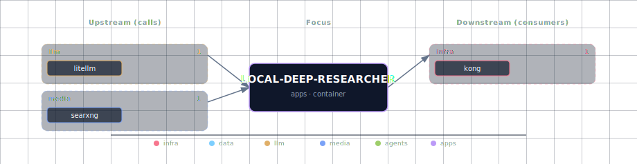

# Local Deep Researcher

LangGraph-based multi-step research agent. The user submits a topic, LDR runs a search-summarize-reflect-search loop (default 3 iterations), and returns a Markdown report citing the sources it found. Upstream is [langchain-ai/local-deep-researcher](https://github.com/langchain-ai/local-deep-researcher); the stack runs it via the LangGraph dev server (`langgraph dev`) listening on port 2024 inside the container, exposed at `LOCAL_DEEP_RESEARCHER_PORT` on the host.

LDR is **completely local** by design — it relies on the stack's LiteLLM gateway (so any registered local Ollama model works) and SearXNG for web search. No outbound API keys required for the default loop. The backend exposes a typed `/research/start|status|result|cancel|logs|sessions|health` surface (`research_client.py`) — but note the client currently speaks a bespoke `/research/*` + `/health` upstream protocol that the stock `langgraph dev` server does not serve (its real API is `/ok`, `/threads`, `/runs`; §4 shows the threads/runs mechanism), so these backend routes fail upstream until the client is ported to the LangGraph protocol (tracked follow-up). The LDR endpoint itself is reachable directly and via Kong's `research.localhost` alias.

## 1. Overview

Image: `python:3.11.15-slim` (the build script clones the upstream repo and runs `pip install -e .` at startup). Source variants are minimal — `container` or `disabled`. There is no GPU path; LDR doesn't run inference itself, it orchestrates LiteLLM.

## 2. Access

| Path | URL | Notes |
|---|---|---|
| Direct | `http://localhost:${LOCAL_DEEP_RESEARCHER_PORT}` (default `63083`) | LangGraph dev-server REST API. |
| Kong | `http://research.localhost:63000` | Route generated from `LOCAL_DEEP_RESEARCHER_SOURCE` (needs the `--setup-hosts` entries). |
| LangGraph API | `POST /threads`, `POST /threads/{id}/runs/stream` | Standard LangGraph dev-server endpoints. |

Canonical port table: [Ports and Routes](../../docs/deployment/ports-and-routes.md).

## 3. Configuration

```bash
LOCAL_DEEP_RESEARCHER_SOURCE=container       # container | disabled
LOCAL_DEEP_RESEARCHER_PORT=63083             # computed by topology.py
LOCAL_DEEP_RESEARCHER_LOOPS=3                # max research iterations
LOCAL_DEEP_RESEARCHER_SEARCH_API=searxng     # only searxng is wired today; tavily/perplexity supported upstream
LOCAL_DEEP_RESEARCHER_WORKERS=3              # langgraph dev --n-workers
```

Adaptive env (auto-injected):

```bash
LITELLM_BASE_URL=http://litellm:4000
LITELLM_API_KEY=${LITELLM_MASTER_KEY}
STT_ENDPOINT=...
TTS_ENDPOINT=...
DOCLING_ENDPOINT=...
```

**Required hard dependencies** (`depends_on.required`): `searxng`, `litellm`. Without SearXNG, LDR has no search backend; without LiteLLM, no LLM to summarize. LDR is **DB-free** — it does not connect to Supabase. Research sessions are persisted to `public.research_*` by the **backend** (`research_service.py`), which calls this LangGraph server over HTTP; that supabase dependency belongs to the backend, not LDR.

**Optional adaptive** (`runtime_deps.local-deep-researcher.optional`): `neo4j-graph-db`, `n8n`, `weaviate`, the media providers. Wiring exists in the manifest but nothing in the LDR code consumes them today — these are forward-looking hooks.

## 4. Architecture & wiring

**Research loop:**

1. Client calls `POST /threads` to create a thread.
2. Client calls `POST /threads/{id}/runs/stream` with the research topic.
3. LangGraph executes the StateGraph defined upstream:
   - `generate_query` — LiteLLM produces a search query.
   - `web_research` — calls SearXNG at `http://searxng:8080/search?format=json`.
   - `summarize_sources` — LiteLLM summarizes the gathered snippets into a `running_summary`.
   - `reflect_on_summary` — LiteLLM produces a follow-up query if loop count < `LOCAL_DEEP_RESEARCHER_LOOPS`.
   - `finalize_summary` — outputs the final Markdown report.
4. State (running_summary, sources_gathered, loop_count) lives in the LangGraph dev-server's in-memory checkpointer.

**Checkpointer caveat.** The dev-server's default in-memory checkpointer drops thread state on container restart, so resumable research isn't possible today. A Redis-backed checkpointer is a documented future pair (a fresh db index, e.g. `/4`; `/3` belongs to JupyterHub).

**Search backend.** `LOCAL_DEEP_RESEARCHER_SEARCH_API=searxng` calls `http://searxng:8080/search?q=…&format=json`. SearXNG must have `formats: [json]` enabled (it does, in `services/searxng/config/settings.yml`).

**LLM gateway.** Every LangGraph node that needs an LLM goes through LiteLLM at `http://litellm:4000/v1/chat/completions`. The model id used at each step is configured in the upstream repo's `init-config.py`; the stack pins it to whatever LiteLLM advertises by default.

**Backend integration.** `services/backend/app/app/research_client.py` targets `http://local-deep-researcher:2024` with a `ResearchRequest`/`ResearchResult` schema, exposed through the backend's `/research/*` routes (sessions persist to `public.research_sessions`). Known gap: the client's upstream paths (`/research/*`, `/health`) don't exist on the LangGraph dev server, so calls 404 and sessions land in FAILED — porting the client to `/threads` + `/runs` is a tracked follow-up.

## 5. Dependencies & Integrations

> Auto-generated section — the **Current** subsections are derived from `services/local-deep-researcher/service.yml`'s `data_flow.calls` field (and inverse passes). Re-run `python -m bootstrapper.docs.regen local-deep-researcher` after manifest changes.

### 5.1 Current — Upstream (this service calls)

| Service | Category |
|---|---|
| litellm | llm |
| searxng | media |

### 5.2 Current — Downstream (services that call this)

| Service | Category |
|---|---|
| kong | infra |
| backend | apps |
| open-webui | apps |

### 5.3 Architecture diagram



[Open the interactive HTML diagram](./architecture.html) for a full-screen view.

### 5.4 Future — Missing pair integrations

- **local-deep-researcher ↔ redis** — *Why:* LDR runs `langgraph dev` with the in-memory checkpointer, so thread state is lost on restart; no Redis checkpointer is wired today. *Mechanism:* swap checkpointer to `langgraph.checkpoint.redis.RedisSaver` pointed at a fresh index (`redis://:${REDIS_PASSWORD}@redis:6379/4` — `/3` is JupyterHub's); add `REDIS_URL` to LDR env. *Effort:* small. *Confidence:* medium.
- **local-deep-researcher ↔ neo4j** — *Why:* each research run yields `sources_gathered` + a `running_summary`. Writing these as `(Topic)-[CITES]->(Source)` triples lets later runs detect overlap and reuse evidence. *Mechanism:* post-`finalize_summary` callback writes Cypher `MERGE` via `bolt://neo4j-graph-db:7687`. *Effort:* medium. *Confidence:* medium.
- **local-deep-researcher ↔ minio** — *Why:* the final markdown report lives only in `/app/data` inside the container; no other service can consume it. *Mechanism:* on `finalize_summary`, S3 `PutObject` to `${MINIO_ENDPOINT}` bucket `research-reports` keyed by `session_id`. *Effort:* small. *Confidence:* medium.
- **local-deep-researcher ↔ hermes** — *Why:* Hermes has no path to invoke multi-step web research today. Exposing LDR as a Hermes tool turns "deep research" into a single tool call. *Mechanism:* Hermes custom tool POSTs to `http://local-deep-researcher:2024/threads/{id}/runs/stream` and returns the final summary; configured in `services/hermes/init/templates/config.yaml.tmpl`. *Effort:* medium. *Confidence:* medium.

### 5.5 Future — Candidate new services

- **Langfuse** ([details](../../docs/research/candidates/langfuse.md)) — *Headline:* self-hosted LLM observability with a first-class LangChain/LangGraph callback. *Wires into:* litellm, hermes, n8n, comfyui.
- **Firecrawl** ([details](../../docs/research/candidates/firecrawl.md)) — *Headline:* self-hosted JS-rendering scraper that returns clean markdown, replacing LDR's `FETCH_FULL_PAGE` DuckDuckGo path with structured extraction. *Wires into:* n8n, backend, hermes.
- **Crawl4AI** ([details](../../docs/research/candidates/crawl4ai.md)) — *Headline:* LLM-native crawler with built-in chunking and markdown extraction, deployable as a sidecar to LDR. *Wires into:* n8n, weaviate, backend.

### 5.6 Future — Unused features in this service

- **Persistent LangGraph checkpointer** — *Why pursue:* dev-server inmem checkpointer drops thread history on restart, so resumable research is impossible. *Effort:* small.
- **Tavily / Perplexity search backends** — *Why pursue:* upstream supports both via `SEARCH_API=tavily|perplexity` + API keys; manifest only exposes searxng/duckduckgo. *Effort:* small.
- **`USE_TOOL_CALLING` for gpt-oss models** — *Why pursue:* enables structured tool calls instead of JSON mode for gpt-oss family, improving reliability with LiteLLM-routed local models. *Effort:* small.
- **`STRIP_THINKING_TOKENS` toggle** — *Why pursue:* Hermes-style reasoning models leak `<think>` blocks into the report; upstream env var hides them. *Effort:* small.
- **`FETCH_FULL_PAGE` toggle** — *Why pursue:* hard-coded false in `init-config.py`; not exposed in `service.yml`. *Effort:* small.
- **LangSmith tracing** — *Why pursue:* `LANGSMITH_API_KEY` ships upstream; superseded if Langfuse lands but useful as a stopgap. *Effort:* small.

## 6. Troubleshooting

**Container restarts every 30s.** Usually the upstream repo clone or `pip install -e .` failed on first run. `docker logs <project>-local-deep-researcher` shows the failing step. Network or PyPI mirror issues are the most common root cause.

**Research returns empty / "no sources gathered".** SearXNG returned no JSON results. Check `curl 'http://localhost:${SEARXNG_PORT}/search?q=test&format=json'`; if the JSON format is disabled, fix `services/searxng/config/settings.yml`.

**Runs hang at `summarize_sources`.** LiteLLM is unreachable or the configured model is overloaded. `docker logs <project>-litellm -f` and confirm the model in use is registered.

**State lost on restart.** Expected — see the in-memory checkpointer note above. The fix is the Redis-checkpointer integration listed under Future.

**Kong route 404 for `research.localhost`.** The route IS generated when `LOCAL_DEEP_RESEARCHER_SOURCE=container`; a 404 here usually means the `*.localhost` hosts entries are missing (`./start.sh --setup-hosts`) or the service is disabled.

```bash
docker compose ps local-deep-researcher
docker compose logs -f local-deep-researcher
curl -s http://localhost:${LOCAL_DEEP_RESEARCHER_PORT}/threads -X POST -H 'content-type: application/json' -d '{}'
```

For general startup and routing issues, see [Troubleshooting](../../docs/quick-start/troubleshooting.md).

## 7. Operations

**Run a research session from the CLI.**

```bash
# 1. Create a thread
THREAD=$(curl -s -X POST http://localhost:${LOCAL_DEEP_RESEARCHER_PORT}/threads \
  -H 'content-type: application/json' -d '{}' | jq -r .thread_id)

# 2. Stream a run (SSE)
curl -N -X POST http://localhost:${LOCAL_DEEP_RESEARCHER_PORT}/threads/$THREAD/runs/stream \
  -H 'content-type: application/json' \
  -d '{"assistant_id":"agent","input":{"research_topic":"vector database trade-offs 2026"}}'
```

The stream emits LangGraph node events; the final `finalize_summary` event contains the Markdown report.

**Inspect thread state.**

```bash
curl -s http://localhost:${LOCAL_DEEP_RESEARCHER_PORT}/threads/$THREAD/state | jq '.values'
```

Returns `running_summary`, `sources_gathered`, `loop_count`, current node — useful for debugging stalls.

**Tune the research depth.** `LOCAL_DEEP_RESEARCHER_LOOPS=3` is a balance between report quality and cost. Bump to 5+ for thorough surveys; drop to 1 for fast lookups.

**Configure the LLM used per step.** The upstream repo's `init-config.py` hard-pins models; to swap them, edit that file in the clone (inside the container) and restart, or override via `LANGCHAIN_*` env vars supported upstream.

## 8. Performance notes

- **Cost per run.** ~5 LLM calls per loop × `LOOPS` loops = 15 calls for the default. Plus one SearXNG call per loop. Local Ollama → free + slow (~30-90s/loop); cloud APIs via LiteLLM → fast + metered.
- **No streaming back to backend.** The `/runs/stream` SSE channel exists but the backend's `research_client.py` consumes it synchronously; fanning events out to Open WebUI via Supabase Realtime remains future work.
- **Thread state size.** A 3-loop run produces ~30-60 KB of state (summary + sources). The in-memory checkpointer holds the last N threads in process; under load it can grow unbounded — restart cleans it.
