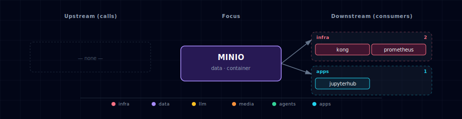

# MinIO

## 1. Overview

S3-compatible object storage for the artifact tier of the stack. Complements Supabase Storage rather than replacing it: Supabase Storage stays the app-tier surface (row-level-security uploads, signed URLs, ≤50 MB files); MinIO is the artifact-tier surface for high-throughput, large-blob workloads.

## 2. Endpoints

| Surface | URL | Notes |
|---|---|---|
| Admin console (Kong alias) | `http://minio.localhost:${KONG_HTTP_PORT}` | **Use this from your browser.** Requires `./start.sh --setup-hosts` so `minio.localhost` resolves to `127.0.0.1`. Login `minioadmin` / `${MINIO_ROOT_PASSWORD}`. |
| Admin console (direct port) | `http://localhost:${MINIO_CONSOLE_PORT}` (default `63018`) | Equivalent; no hosts setup required. |
| S3 API (host) | `http://localhost:${MINIO_PORT}` (default `63017`) | NOT aliased through Kong — S3 clients use full URLs with explicit ports anyway, and Kong proxying introduces unhelpful preserve-host complications for the S3 signature workflow. |
| S3 API (internal) | `http://minio:9000` | What sibling containers (backend, n8n, ComfyUI, JupyterHub, docling consumers) call via the per-bucket service-account credentials. |
| Admin console (internal) | `http://minio:9001` | What Kong proxies for the alias. |

The Kong route at `minio.localhost` is generated by
`bootstrapper/utils/kong_config_generator.py::generate_minio_service()`
and gated on `MINIO_SOURCE != disabled`. Uses `preserve_host: True`
so the MinIO console SPA constructs login / session-cookie URLs
against the browser's real hostname instead of the internal
`minio:9001`. Same pattern n8n / Hermes / LiteLLM use.

## 3. Default credentials

- **Root user:** `MINIO_ROOT_USER` (default `minioadmin`)
- **Root password:** `MINIO_ROOT_PASSWORD` — auto-generated to `.env` on first `./start.sh`. Retrieve with `grep ^MINIO_ROOT_PASSWORD= .env`. Use these credentials to log into the admin console.

Root credentials are NEVER surfaced to consumers — see Service accounts below.

## 4. Bucket layout

Five buckets are pre-provisioned by `minio-init`. Bucket names are the bare service identifier:

| Bucket | Intended consumer |
|---|---|
| `comfyui` | ComfyUI generated outputs |
| `backend` | Backend (FastAPI) large blobs / embeddings / model checkpoints |
| `n8n` | n8n workflow file inputs and outputs |
| `jupyter` | JupyterHub datasets and model artifacts |
| `docling` | Doc Processor parsed-document persistence |

Bucket names are overridable via `MINIO_BUCKET_<NAME>` env vars; hand-edits stick.

## 5. Service accounts

Each consumer has its own MinIO service account with an inline IAM policy scoped to a single bucket:

```json
{
  "Version": "2012-10-17",
  "Statement": [
    { "Effect": "Allow", "Action": ["s3:GetObject", "s3:PutObject", "s3:DeleteObject"],
      "Resource": ["arn:aws:s3:::<bucket>/*"] },
    { "Effect": "Allow", "Action": ["s3:ListBucket"],
      "Resource": ["arn:aws:s3:::<bucket>"] }
  ]
}
```

Credentials are auto-generated to `.env` and exposed as `MINIO_<NAME>_ACCESS_KEY` and `MINIO_<NAME>_SECRET_KEY` where `<NAME>` ∈ `{COMFYUI, BACKEND, N8N, JUPYTER, DOCLING}`. A cross-bucket access attempt with a consumer credential returns `403 AccessDenied`.

## 6. Consumer integration recipe (for follow-up PRs)

Python (boto3):

```python
import boto3
from botocore.client import Config
import os

s3 = boto3.client(
    "s3",
    endpoint_url=os.environ["MINIO_ENDPOINT"],
    aws_access_key_id=os.environ["MINIO_BACKEND_ACCESS_KEY"],
    aws_secret_access_key=os.environ["MINIO_BACKEND_SECRET_KEY"],
    region_name=os.environ["MINIO_REGION"],
    config=Config(s3={"addressing_style": "path"}),
)
s3.put_object(Bucket=os.environ["MINIO_BUCKET_BACKEND"], Key="hello.txt", Body=b"hello")
```

Shell (`mc`):

```sh
mc alias set local http://localhost:${MINIO_PORT} "$MINIO_BACKEND_ACCESS_KEY" "$MINIO_BACKEND_SECRET_KEY"
mc cp ./somefile local/backend/somefile
```

## 7. Source variants

`MINIO_SOURCE` may be:

- `container` (default) — run MinIO in a Docker Compose container
- `disabled` — turn MinIO off (`MINIO_SCALE=0`); the service is not scheduled

`localhost` and `external` variants are not provided in this release.

## 8. Data persistence

MinIO data lives in the `${PROJECT_NAME}-minio-data` named Docker volume mounted at `/data`. `./stop.sh --cold` removes this volume.

## 9. Operations

- **Add a bucket manually:** `mc mb local/<bucket>` from a host with `mc` and the root alias configured.
- **Rotate a service-account key:** edit `MINIO_<NAME>_ACCESS_KEY` and `MINIO_<NAME>_SECRET_KEY` in `.env`, then run `docker compose up --force-recreate minio-init` to re-provision.
- **Logs:** `docker logs ${PROJECT_NAME}-minio` and `docker logs ${PROJECT_NAME}-minio-init`.

## 10. Dependencies & Integrations

> Auto-generated section — the **Current** subsections are derived from `services/minio/service.yml`'s `data_flow.calls` field (and inverse passes). Re-run `python -m bootstrapper.docs.regen minio` after manifest changes.

### 10.1 Current — Upstream (this service calls)

_No upstream calls._

### 10.2 Current — Downstream (services that call this)

| Service | Category |
|---|---|
| kong | infra |
| prometheus | infra |
| jupyterhub | apps |

### 10.3 Architecture diagram



[Open the interactive HTML diagram](./architecture.html) for a full-screen view.

### 10.4 Future — Missing pair integrations

- **minio ↔ backend** — *Why:* `minio-init` provisions a `backend` bucket plus scoped keys, but FastAPI never consumes them — large blobs, model checkpoints, embedding caches have nowhere durable to land. *Mechanism:* boto3 client at `http://minio:9000` with `MINIO_BACKEND_ACCESS_KEY`/`SECRET_KEY`, path-style addressing. *Effort:* small. *Confidence:* high.
- **minio ↔ n8n** — *Why:* the `n8n` bucket and keys are pre-provisioned, and n8n ships a first-party S3 node with custom-endpoint support; workflows could persist files without hitting Supabase Storage's 50 MB ceiling. *Mechanism:* n8n S3 credential at `http://minio:9000`; optional `N8N_EXTERNAL_BINARY_DATA_MODE=s3`. *Effort:* small. *Confidence:* high.
- **minio ↔ weaviate** — *Why:* Weaviate explicitly supports MinIO as `backup-s3` (upstream docs). Stack has no Weaviate backup story today. *Mechanism:* enable `backup-s3` in `WEAVIATE_ENABLE_MODULES`, set `BACKUP_S3_BUCKET=weaviate-backups`, `BACKUP_S3_ENDPOINT=minio:9000`, `BACKUP_S3_USE_SSL=false`; add `weaviate-backups` entry in `init-minio.sh`. *Effort:* small. *Confidence:* high.
- **minio ↔ jupyterhub** — *Why:* notebooks need a durable, sharable dataset tier outside the per-user volume; the `jupyter` bucket and keys exist. *Mechanism:* inject `MINIO_JUPYTER_*` + `AWS_S3_ENDPOINT=http://minio:9000` into singleuser env; expose via `s3fs`/`boto3`. *Effort:* small. *Confidence:* high.
- **minio ↔ comfyui** — *Why:* ComfyUI outputs sit in an ephemeral volume; a `comfyui` bucket exists. Persisting renders lets backend/n8n/open-webui share artifacts across `./stop.sh --cold`. *Mechanism:* post-generation hook (custom node or sidecar) uploads `output/` to `s3://comfyui/` via `MINIO_COMFYUI_*`. *Effort:* medium. *Confidence:* medium.
- **minio ↔ doc-processor** — *Why:* docling parses have no persistent landing zone; the `docling` bucket is unused, blocking downstream RAG flows from finding outputs at stable URIs. *Mechanism:* doc-processor writes payloads to `s3://docling/<source-hash>/` via `MINIO_DOCLING_*` keys. *Effort:* small. *Confidence:* high.

### 10.5 Future — Candidate new services

- **Langfuse** ([details](../../docs/research/candidates/langfuse.md)) — *Headline:* LLM observability platform that uses S3 (MinIO) for long-term trace/blob storage. *Wires into:* litellm, hermes, backend, open-webui, local-deep-researcher.
- **Apache Iceberg + DuckDB** ([details](../../docs/research/candidates/iceberg-duckdb.md)) — *Headline:* open table format on top of MinIO that gives the stack a queryable analytics tier. *Wires into:* jupyterhub, backend, n8n.

### 10.6 Future — Unused features in this service

- **Bucket notifications (webhook/Redis/NATS targets)** — *Why pursue:* MinIO can POST object-created events to a webhook or Redis stream; would let backend/n8n/Weaviate react to uploads instead of polling. *Effort:* medium.
- **Object lifecycle rules (expiration + versioning)** — *Why pursue:* `comfyui` and `jupyter` buckets will grow unbounded; per-bucket ILM rules (expire after N days, keep N versions) are a one-shot `mc ilm` config in `init-minio.sh`. *Effort:* small.
- **Server-side encryption (SSE-S3 / SSE-KMS)** — *Why pursue:* stack stores secrets and user uploads in plaintext on the host volume; SSE-S3 with auto-generated KEK gives at-rest encryption without consumer changes. *Effort:* medium.
- **STS / AssumeRole for per-user JupyterHub creds** — *Why pursue:* replaces the single shared `MINIO_JUPYTER_*` credential with short-lived per-user tokens. *Effort:* large.

## 11. Troubleshooting

- **`SignatureDoesNotMatch`** — most often clock skew between host and container. Sync your host clock.
- **Browser-based S3 client fails with CORS** — MinIO's default CORS config rejects unrecognized origins. Configure via `mc admin config` if browser uploads are required.
- **`403 AccessDenied`** — confirm the consumer credential's scoped policy matches the target bucket. Use root credentials to inspect: `mc admin policy info local <consumer>-policy`.
- **Cross-path-style failures** — MinIO requires path-style addressing. In boto3 use `Config(s3={"addressing_style": "path"})`.
- **`minio` container restart-loops** — typically `MINIO_ROOT_PASSWORD` is empty. Confirm `.env` has it populated; if blank, delete the line and re-run `./start.sh` (the bootstrapper will regenerate).
