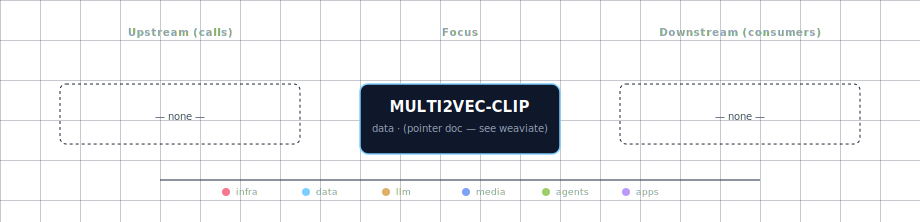

# Multi2Vec CLIP

Multimodal CLIP vectorizer module for Weaviate. Runs the [`semitechnologies/multi2vec-clip-inference`](https://github.com/weaviate/multi2vec-clip-inference) image, exposing `POST /vectorize` and `GET /meta` on internal port `8080`. Today its only consumer is Weaviate (via the `multi2vec-clip` module — `CLIP_INFERENCE_API=http://multi2vec-clip:8080`); the data-flow graph shows no other service calling it directly, but the same `/vectorize` endpoint is reachable from every container on the `backend-network`.

The default model is `sentence-transformers-clip-ViT-B-32` (English-only ViT-B/32). The module exposes both text and image embedding paths through a single endpoint, so a single call can vectorize a `{texts, images}` batch for cross-modal similarity search.

## 1. Overview

Image: `semitechnologies/multi2vec-clip-inference:sentence-transformers-clip-ViT-B-32_v1.0.7`. Container port: `8080` (internal-only — no host port published). The container runs CUDA-off by default (`ENABLE_CUDA=0`); a GPU variant exists in the manifest but is undocumented and untested.

## 2. Access

| Path | URL | Notes |
|---|---|---|
| Direct | — | No host port. Internal-only by design. |
| Internal | `http://multi2vec-clip:8080/vectorize` | What Weaviate (and future consumers) call. |
| Kong | — | Infrastructure module; no Kong route. |
| Meta | `GET http://multi2vec-clip:8080/meta` | Returns model config; useful as a health probe. |

Canonical port table: [Ports and Routes](../../docs/deployment/ports-and-routes.md).

## 3. Configuration

```bash
MULTI2VEC_CLIP_SOURCE=container-cpu       # container-cpu | container-gpu | disabled
CLIP_INFERENCE_API=http://multi2vec-clip:8080
```

What Weaviate sees (set by the `weaviate-init` step):

```bash
WEAVIATE_ENABLE_MODULES=text2vec-openai,multi2vec-clip,generative-openai
CLIP_INFERENCE_API=http://multi2vec-clip:8080
```

Disabling the CLIP module requires updating both the source variant **and** Weaviate's module list:

```bash
MULTI2VEC_CLIP_SOURCE=disabled
WEAVIATE_ENABLE_MODULES=text2vec-openai,generative-openai
CLIP_INFERENCE_API=
```

The `weaviate` service's compose interpolation respects this; collections that previously used `multi2vec-clip` as their vectorizer will start failing on next ingest if the module disappears.

## 4. Architecture & wiring

**Call shape.**

```http
POST /vectorize
Content-Type: application/json

{
  "texts": ["a red sports car"],
  "images": ["<base64 PNG>"]
}

→ 200 OK
{
  "textVectors": [[...512 floats...]],
  "imageVectors": [[...512 floats...]]
}
```

Weaviate calls this endpoint internally on every `POST /v1/objects` against a collection whose `vectorizer: multi2vec-clip`. The CLIP module knows nothing about Weaviate — it's a pure embedding service.

**Network.** Joined to `backend-network`. Any container on the same network can `POST /vectorize` directly without going through Weaviate. The data-flow graph deliberately doesn't list this because no service does it today.

**Volumes / state.** None. The model is baked into the image; the container is stateless and trivially restartable.

**Manifest layout.** `multi2vec-clip` is its own service family in `services/multi2vec-clip/` but is declared as a sub-row of the `weaviate` family in `services/weaviate/service.yml`. There is no standalone `services/multi2vec-clip/service.yml` today — its env vars and compose definition live alongside Weaviate's.

## 5. Dependencies & Integrations

> Auto-generated section — the **Current** subsections are derived from `services/multi2vec-clip/service.yml`'s `data_flow.calls` field (and inverse passes). Re-run `python -m bootstrapper.docs.regen multi2vec-clip` after manifest changes.

### 5.1 Current — Upstream (this service calls)

_No upstream calls._

### 5.2 Current — Downstream (services that call this)

_No downstream consumers._

### 5.3 Architecture diagram



[Open the interactive HTML diagram](./architecture.html) for a full-screen view.

### 5.4 Future — Missing pair integrations

- **multi2vec-clip ↔ backend** — *Why:* backend has no direct path to multimodal embeddings; today it can only reach CLIP indirectly by writing through Weaviate. Direct `/vectorize` calls unlock zero-shot image tagging, image-vs-text similarity scoring, and ad-hoc embedding without round-tripping through a collection. *Mechanism:* `POST http://multi2vec-clip:8080/vectorize` with `{texts, images}`. *Effort:* small. *Confidence:* high.
- **multi2vec-clip ↔ minio** — *Why:* MinIO hosts artifact buckets (comfyui, backend, n8n, jupyter, docling) but none of those image artifacts are indexed for semantic retrieval. A small ingest worker streams new objects through CLIP into Weaviate. *Mechanism:* MinIO bucket-notification webhook → fetch object → base64 → `POST /vectorize` → upsert into a `MediaAssets` Weaviate collection. *Effort:* medium. *Confidence:* medium.
- **multi2vec-clip ↔ comfyui** — *Why:* ComfyUI continuously generates images that vanish into volumes; auto-embedding each generation into Weaviate enables prompt-similarity search, dedup, and "find prior renders that look like X". *Mechanism:* ComfyUI custom SaveImage post-hook → call backend ingest endpoint → backend forwards bytes to `multi2vec-clip:8080/vectorize` and upserts. *Effort:* medium. *Confidence:* medium.
- **multi2vec-clip ↔ jupyterhub** — *Why:* notebook users today spin up their own CLIP model to experiment with multimodal embeddings; the stack already runs one. *Mechanism:* JupyterHub user pods reach `http://multi2vec-clip:8080/vectorize` over `backend-network`; document a one-cell helper in the notebook starter image. *Effort:* small. *Confidence:* high.
- **multi2vec-clip ↔ n8n** — *Why:* n8n workflows handling inbound email/Slack attachments or webhook-uploaded images can vectorize on-the-fly for routing, classification, or RAG. *Mechanism:* n8n HTTP Request node → `POST http://multi2vec-clip:8080/vectorize` → branch on cosine-similarity to label-vectors. *Effort:* small. *Confidence:* high.
- **multi2vec-clip ↔ doc-processor** — *Why:* docling extracts figures/diagrams from PDFs but discards the visual signal. CLIP-embedding extracted figures alongside text chunks enables true multimodal RAG over document corpora. *Mechanism:* docling post-extraction step → for each figure, base64 → `POST /vectorize` → store with parent-chunk metadata. *Effort:* medium. *Confidence:* medium.

### 5.5 Future — Candidate new services

- **SigLIP 2 vectorizer image** ([details](../../docs/research/candidates/siglip2-vectorizer.md)) — *Headline:* drop-in upgrade of the multi2vec-clip container to a Google SigLIP 2 image for stronger multilingual + higher-resolution multimodal retrieval. *Wires into:* weaviate, backend, jupyterhub.

### 5.6 Future — Unused features in this service

- **GPU mode (`MULTI2VEC_CLIP_SOURCE=container-gpu`)** — *Why pursue:* manifest declares the variant but no documentation or smoke-test covers it; GPU users default to CPU. *Effort:* small.
- **Model variant selection beyond ViT-B-32** — *Why pursue:* upstream ships SigLIP 2, multilingual XLM-R+ViT, LAION ViT-B-16; we hard-pin `sentence-transformers-clip-ViT-B-32`. Exposing `MULTI2VEC_CLIP_IMAGE` choices in the wizard unlocks multilingual + higher-recall regimes. *Effort:* small.
- **Multi-field weighted vectors** — *Why pursue:* the CLIP module supports per-field weights (`image_fields` weight 0.9, `text_fields` weight 0.1); no collection in `weaviate-init` exercises this. *Effort:* small.
- **`/meta` health surfacing** — *Why pursue:* container exposes `/meta` with model config; not scraped or shown in the wizard's service-table health column. *Effort:* small.
- **`trust_remote_code` for custom CLIP variants** — *Why pursue:* enables loading community models (Qwen3-VL, ColPali) already supported by the upstream loader. *Effort:* medium (security review needed).

## 6. Troubleshooting

**Container OOMs on CPU.** ViT-B-32 needs ~1.5 GB RSS at idle, more under load. Docker Desktop's default 2 GB host limit will kill it. Raise the Docker memory budget or switch to `container-gpu` if a GPU is available.

**Weaviate ingest fails with `connection refused to multi2vec-clip:8080`.** Either `MULTI2VEC_CLIP_SOURCE=disabled` or the container is unhealthy. `docker compose ps multi2vec-clip` and `curl http://localhost:<host-port-if-published>/meta` from the host (note: no host port by default — `docker exec` into Weaviate and curl from there).

**Embeddings look random / clustering broken.** Confirm `/meta` returns the expected model name. A stale image cache after a model change can pin you to the old checkpoint. `docker compose pull multi2vec-clip && docker compose up -d --force-recreate multi2vec-clip`.

**Module not available in Weaviate.** `WEAVIATE_ENABLE_MODULES` must list `multi2vec-clip`. Check `docker exec <project>-weaviate env | grep ENABLE_MODULES`.

```bash
docker compose ps multi2vec-clip
docker compose logs -f multi2vec-clip
docker exec <project>-weaviate curl -s http://multi2vec-clip:8080/meta | jq .
```

For general startup and routing issues, see [Troubleshooting](../../docs/quick-start/troubleshooting.md).

## 7. Operations

**Smoke-test from a sibling container.**

```bash
docker exec <project>-backend curl -s http://multi2vec-clip:8080/meta | jq .
# → {"model": "sentence-transformers/clip-ViT-B-32", "imageFields": [], "textFields": []}
```

**Embed a text + image batch.**

```bash
docker exec <project>-backend curl -s -X POST http://multi2vec-clip:8080/vectorize \
  -H 'content-type: application/json' \
  -d "$(jq -n --arg img "$(base64 < ./photo.png)" '{texts:["red car"], images:[$img]}')"
# → {"textVectors":[[...512 floats...]], "imageVectors":[[...512 floats...]]}
```

Output vectors are 512-d for ViT-B/32. Cosine similarity between a text vector and an image vector gives the canonical CLIP score.

**Restart without rebuilding.** Stateless — `docker compose restart multi2vec-clip` is safe. The model file is in the image; container restart re-mmaps the same weights from disk in <5s.

## 8. Performance notes

- **CPU latency.** ~50-150ms per `/vectorize` call on a modern x86 core for a single text or single image; throughput scales near-linearly with parallel HTTP calls until you hit CPU saturation.
- **GPU latency.** The GPU variant is ~5-10× faster but the round-trip cost dominates for single-image calls; batch images (`images: [b64_1, b64_2, …]`) to amortize.
- **Batching window.** The container processes one HTTP request at a time. Concurrent calls queue inside `uvicorn`; for high throughput, run multiple replicas (one per GPU/CPU).
- **Vector dimensionality is fixed by the model.** ViT-B/32 → 512. Other models (SigLIP 2 → 768, larger CLIPs → 768/1024) require updating Weaviate's collection schema to match.
