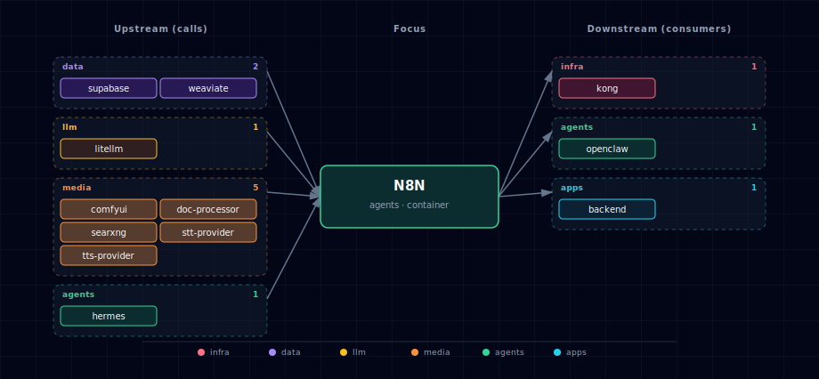

# n8n

Workflow automation engine. The stack runs n8n in **queue mode** by default — one `n8n` web/API container plus an `n8n-worker` container that consumes jobs from Redis. A short-lived `n8n-init` container handles first-run setup: installing community nodes (ComfyUI image-to-image, MCP client), importing seeded workflows from `services/n8n/init/workflows/`, and seeding credentials. The result is a fully-wired automation surface that ties LLM (LiteLLM), media (ComfyUI/STT/TTS/Docling/SearXNG), and data (Supabase/Weaviate/MinIO) services together without writing code.

n8n is also the only "agents"-tier service besides Hermes; the two are complementary. n8n is event-driven and visual (cron triggers, webhooks, manual runs); Hermes is conversational and skill-driven. n8n reaches Hermes through a shared `HERMES_ENDPOINT` env var so a workflow can hand off to an agent (the reverse edge — Hermes calling a workflow — isn't wired today; see §4).

## 1. Overview

Image: `n8nio/n8n:latest`. The web/API container handles HTTP + UI; the worker container handles execution. Both share state through Supabase Postgres (workflow definitions, executions history, credentials) and Redis (queue + execution coordination). The `n8n-init` container runs to completion on first start, then exits — `condition: service_completed_successfully` makes the web container wait for it.

## 2. Access

| Path | URL | Notes |
|---|---|---|
| Direct | `http://localhost:${N8N_PORT}` (default `63064`) | UI + REST API. |
| Kong | `http://n8n.localhost:${KONG_HTTP_PORT}` | Recommended for browser use; needs `./start.sh --setup-hosts`. Kong route uses `preserve_host: True`. |
| Webhook | `${N8N_HOST}/webhook/<path>` | n8n's webhook entry point; resolves to whichever host you used to reach n8n. |

Canonical port table: [Ports and Routes](../../docs/deployment/ports-and-routes.md).

## 3. Configuration

```bash
N8N_SOURCE=container                # container | disabled
N8N_PORT=63064                      # computed by topology.py
N8N_ENCRYPTION_KEY=<random>         # auto-generated by bootstrapper; rotate before deploy
N8N_AUTH_ENABLED=true               # owner-account flow at first login
N8N_HOST=n8n.localhost              # Kong alias hostname
N8N_PROTOCOL=http
N8N_EXECUTIONS_MODE=queue           # queue (default, requires worker + redis) | regular (single-process)
N8N_COMMUNITY_PACKAGES_ENABLED=true
N8N_COMMUNITY_PACKAGES_ALLOW_TOOL_USAGE=true   # required for AI Agent nodes to use community nodes as tools
N8N_INIT_NODES=n8n-nodes-comfyui,@ksc1234/n8n-nodes-comfyui-image-to-image,n8n-nodes-mcp
```

Adaptive env (auto-injected based on active SOURCE values):

```bash
STT_ENDPOINT=...                    # resolved per STT_PROVIDER_SOURCE
TTS_ENDPOINT=...                    # resolved per TTS_PROVIDER_SOURCE
DOCLING_ENDPOINT=...                # resolved per DOC_PROCESSOR_SOURCE
```

Required Postgres/Redis env (built from the upstream services' creds):

```bash
DB_TYPE=postgresdb
DB_POSTGRESDB_HOST=supabase-db
DB_POSTGRESDB_DATABASE=postgres
DB_POSTGRESDB_USER=supabase_admin
DB_POSTGRESDB_PASSWORD=${SUPABASE_DB_PASSWORD}
QUEUE_BULL_REDIS_HOST=redis
QUEUE_BULL_REDIS_PASSWORD=${REDIS_PASSWORD}
```

**Required runtime dep:** `weaviate` (per `runtime_deps.n8n.requires`). With `WEAVIATE_SOURCE=disabled`, n8n is force-disabled with an error message — the stack design treats Weaviate-backed vector ops as load-bearing for the seeded AI workflows.

## 4. Architecture & wiring

**Queue mode flow:**

1. UI/webhook hits `n8n:5678` (web container) → workflow record stored in Supabase Postgres.
2. Execution is pushed onto BullMQ queue in Redis db `/0` (`QUEUE_BULL_REDIS_DB: 0`).
3. `n8n-worker` polls Redis, picks up the job, runs the workflow, writes execution history back to Postgres.
4. UI streams progress via Redis pub/sub back to the web container.

**Init flow** (`n8n-init`, alpine + inline `npm install -g`):

1. Wait for n8n web container to be reachable.
2. Install each package in `N8N_INIT_NODES` into the user-node directory.
3. Import seeded JSON workflows from `services/n8n/init/workflows/`.
4. Exit 0.

**Hard dependencies** (`depends_on.required`): `supabase`, `redis`, `litellm`. Without LiteLLM, all AI Agent nodes (the most-used feature) 404.

**Adaptive integrations** (`runtime_adaptive.n8n.adapts_to`): `stt_provider`, `tts_provider`, `doc_processor`. When any of those is `disabled`, the corresponding endpoint env var is set to empty and workflow nodes referencing it surface 502 at run time.

**Hermes wiring.** `HERMES_ENDPOINT` is injected so workflows can call into Hermes via the HTTP Request node. Inverse path (Hermes → n8n) is webhook-driven: n8n's public REST API has no execute endpoint, so expose a Webhook-trigger workflow and have Hermes POST to its URL.

**Seeded workflows.** `services/n8n/init/workflows/searxng-research-workflow.json` ships as a worked example of the SearXNG → LiteLLM research pattern. More workflows would go here.

## 5. Calling LightRAG from n8n

When `LIGHTRAG_SOURCE != disabled`, the env vars `LIGHTRAG_ENDPOINT` and `LIGHTRAG_API_KEY` are injected into n8n containers. Use the HTTP Request node:

- URL: `={{$env.LIGHTRAG_ENDPOINT}}/query`
- Auth: Bearer token from `={{$env.LIGHTRAG_API_KEY}}`
- Body (JSON): `{"query": "/hybrid Your question"}`

## 6. Dependencies & Integrations

> Auto-generated section — the **Current** subsections are derived from `services/n8n/service.yml`'s `data_flow.calls` field (and inverse passes). Re-run `python -m bootstrapper.docs.regen n8n` after manifest changes.

### 6.1 Current — Upstream (this service calls)

| Service | Category |
|---|---|
| redis | data |
| supabase | data |
| weaviate | data |
| litellm | llm |
| comfyui | media |
| doc-processor | media |
| searxng | media |
| stt-provider | media |
| tts-provider | media |
| hermes | agents |
| lightrag | agents |

### 6.2 Current — Downstream (services that call this)

| Service | Category |
|---|---|
| kong | infra |
| prometheus | infra |
| openclaw | agents |
| backend | apps |
| jupyterhub | apps |

### 6.3 Architecture diagram



[Open the interactive HTML diagram](./architecture.html) for a full-screen view.

### 6.4 Future — Missing pair integrations

- **n8n ↔ comfyui** — *Why:* `n8n-nodes-comfyui` is installed by `n8n-init`, but no `COMFYUI_ENDPOINT` env is injected into n8n's compose, so users hand-enter `http://comfyui:18188` in every workflow credential. *Mechanism:* inject `COMFYUI_ENDPOINT=${COMFYUI_ENDPOINT}` (matches the STT/TTS/DOCLING pattern); add `comfyui` to `runtime_deps.optional`. *Effort:* small. *Confidence:* high.
- **n8n ↔ minio** — *Why:* MinIO already provisions an `n8n` bucket plus `MINIO_N8N_*` creds, but neither credentials nor the S3 endpoint are passed to n8n, so the dedicated bucket sits unused. *Mechanism:* env-inject `S3_ENDPOINT=http://minio:9000`, `S3_BUCKET=${MINIO_BUCKET_N8N}`, `S3_ACCESS_KEY`/`S3_SECRET_KEY`; add `minio` to `runtime_deps.optional`. Path-style addressing required. *Effort:* small. *Confidence:* high.
- **n8n ↔ neo4j** — *Why:* Neo4j is the stack's graph store but has no first-party n8n node; KG-from-document flows can't write to Neo4j without custom HTTP-node calls. *Mechanism:* inject `NEO4J_URI=bolt://neo4j-graph-db:7687` + creds; use the HTTP Request node hitting `http://neo4j-graph-db:7474/db/neo4j/tx/commit` until a vetted community node is adopted. *Effort:* medium. *Confidence:* medium.
- **n8n ↔ searxng** — *Why:* n8n advertises a `SearXNG Tool` sub-node for AI-agent workflows but the endpoint is not injected. *Mechanism:* inject `SEARXNG_ENDPOINT=http://searxng:8080`; add `searxng` to `runtime_deps.optional`. *Effort:* small. *Confidence:* high.
- **n8n ↔ openclaw** — *Why:* OpenClaw is the messaging-platform gateway. Wiring it to n8n turns every n8n webhook into a chat-triggered automation. *Mechanism:* OpenClaw → n8n via webhook at `http://n8n:5678/webhook/<path>`; n8n → OpenClaw via HTTP Request node; shared bearer secret in both manifests. *Effort:* medium. *Confidence:* medium.

### 6.5 Future — Candidate new services

- **Langfuse** ([details](../../docs/research/candidates/langfuse.md)) — *Headline:* self-hostable LLM/diffusion trace + eval store; n8n's HTTP node can log per-step trace events. *Wires into:* litellm, hermes, comfyui.
- **Browserless** ([details](../../docs/research/candidates/browserless.md)) — *Headline:* headless-Chrome backend so n8n can scrape JS-rendered pages, render PDFs, screenshot. *Wires into:* searxng, doc-processor, backend.
- **NocoDB** ([details](../../docs/research/candidates/nocodb.md)) — *Headline:* spreadsheet UI over the existing Supabase Postgres, with a first-party n8n node for row CRUD. *Wires into:* supabase, backend.

### 6.6 Future — Unused features in this service

- **MCP Server Trigger node** — *Why pursue:* n8n can expose workflows as MCP tools that Hermes/LiteLLM clients consume, completing the bidirectional MCP story (we install the client node `n8n-nodes-mcp` but never run a server). *Effort:* small.
- **Native Weaviate Vector Store cluster node** — *Why pursue:* upstream ships a native Weaviate vector-store node; workflows currently talk to Weaviate via raw HTTP. Switching unlocks embeddings + retrievers without custom code. *Effort:* small.
- **Built-in webhook auth (header auth + signature verification)** — *Why pursue:* OpenClaw and external triggers need verified webhooks; n8n supports this but no defaults are baked into the manifest. *Effort:* small.

## 7. Troubleshooting

**`Command start not found` restart loop.** Almost always corruption in the `genai-n8n-data` volume after a partial cold-start. Surgical fix: `docker volume rm <project>-n8n-data` (without `./stop.sh --cold`). On next `./start.sh`, n8n re-initializes from scratch.

**Init container exits with `EACCES` writing nodes.** The community-package install needs the node-modules dir writable. Check `docker logs <project>-n8n-init`; typically a remnant from an earlier failed run. `docker volume rm <project>-n8n-data` clears it.

**Workflows enqueued but never execute.** `EXECUTIONS_MODE=queue` requires both the web and worker containers up. Verify `docker compose ps | grep n8n` shows two healthy n8n rows and Redis is reachable from both.

**AI Agent nodes 404.** LiteLLM is down or `LITELLM_MASTER_KEY` rotated without restarting n8n. n8n caches the key at startup; bounce n8n after rotation.

```bash
docker compose ps n8n n8n-worker
docker compose logs -f n8n
docker compose logs -f n8n-worker
docker compose logs n8n-init        # one-shot; useful for first-run debug
```

For general startup and routing issues, see [Troubleshooting](../../docs/quick-start/troubleshooting.md).
