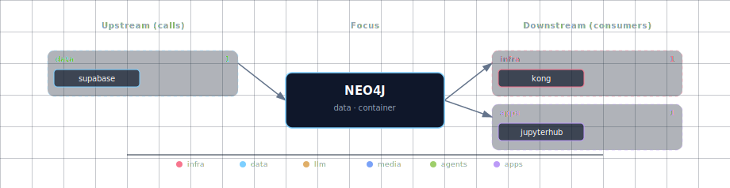

# Neo4j Graph Database

Neo4j provides graph database capabilities for Atlas, enabling relationship modeling and graph-based queries.

## 1. Overview

The Neo4j service provides:
- Graph database for storing and querying relationships
- Web-based browser interface for data visualization
- Cypher query language support
- Automatic backup and restore capabilities

## 2. Access Information

- **Browser Interface and HTTP API**: `http://localhost:${GRAPH_DB_DASHBOARD_PORT}` (default: 63021)
- **Bolt Protocol**: `bolt://localhost:${GRAPH_DB_PORT}` (default: 63020)

## 3. Default Credentials

- **Username**: `${GRAPH_DB_USER}` (default: `neo4j`)
- **Password**: `${GRAPH_DB_PASSWORD}` (from .env file)

## 4. Backup and Restore

The Neo4j service includes built-in backup and restore capabilities.

### 4.1 Manual Backup

To manually create a graph database backup:

```bash
# Create a backup (will temporarily stop and restart Neo4j)
docker exec -it ${PROJECT_NAME}-neo4j-graph-db /usr/local/bin/backup.sh
```

The backup will be stored in the `/snapshot` directory inside the container, which is mounted to the `./services/neo4j/build/snapshot/` directory on your host machine.

### 4.2 Manual Restore

To restore from a previous backup:

```bash
# Restore from the latest backup
docker exec -it ${PROJECT_NAME}-neo4j-graph-db /usr/local/bin/restore.sh
```

### 4.3 Automatic Restore

- **Automatic restoration at startup** is enabled by default
- When the container starts, it automatically restores from the latest backup if available
- To disable automatic restore, remove or rename the `auto_restore.sh` script in the Dockerfile

### 4.4 Important Backup Notes

- By default, data persists in the Docker volume between restarts
- Backups are FULL dumps (`neo4j-admin database dump`); the database
  is stopped for the duration and restarted automatically (EXIT trap)
- Backup files are timestamped for easy identification

## 5. Data Persistence

Neo4j data is stored in Docker named volumes:
- **Volume Name**: `atlas-graph-db-data` (from `${PROJECT_NAME}-graph-db-data`)
- **Mount Point**: `/data` (inside container)
- **Backup Location**: `/snapshot` (mounted to host)

## 6. Environment Variables

Key environment variables for Neo4j:

```bash
# Authentication
GRAPH_DB_USER=neo4j
GRAPH_DB_PASSWORD=your_password
GRAPH_DB_AUTH=neo4j/your_password  # Combined form consumed by the Neo4j container as NEO4J_AUTH

# Port Configuration
GRAPH_DB_PORT=63020            # Bolt protocol (mapped to 7687 inside the container)
GRAPH_DB_DASHBOARD_PORT=63021  # Browser interface and HTTP API (mapped to 7474)

# Database Settings
NEO4J_server_memory_heap_initial__size=512m
NEO4J_server_memory_heap_max__size=1G
NEO4J_server_memory_pagecache_size=512m
```

## 7. Usage Examples

### 7.1 Connect via Cypher Shell
```bash
# Connect using Docker
docker exec -it ${PROJECT_NAME}-neo4j-graph-db cypher-shell -u neo4j -p ${GRAPH_DB_PASSWORD}

# Sample queries
MATCH (n) RETURN count(n);  // Count all nodes
MATCH (n) DETACH DELETE n;  // Clear all data (use with caution)
```

### 7.2 Connect via Python
```python
from neo4j import GraphDatabase

driver = GraphDatabase.driver(
    "bolt://localhost:63020",
    auth=("neo4j", "your_password")
)

with driver.session() as session:
    result = session.run("MATCH (n) RETURN count(n) as node_count")
    print(result.single()["node_count"])

driver.close()
```

### 7.3 Basic Graph Operations
```cypher
// Create nodes
CREATE (p:Person {name: 'Alice', age: 30})
CREATE (p:Person {name: 'Bob', age: 25})

// Create relationships
MATCH (a:Person {name: 'Alice'}), (b:Person {name: 'Bob'})
CREATE (a)-[:KNOWS]->(b)

// Query relationships
MATCH (p:Person)-[:KNOWS]->(friend:Person)
RETURN p.name, friend.name
```

## 8. LightRAG graph store

When `LIGHTRAG_SOURCE != disabled` AND `NEO4J_GRAPH_DB_SOURCE != disabled`, `lightrag-init` provisions `Entity` constraints and indexes. LightRAG writes the extracted KG (entities + relations) to Neo4j. Browse at `neo4j.localhost:${KONG_HTTP_PORT}`.

## 9. Integration with Other Services

### 9.1 Backend API
The FastAPI backend can connect to Neo4j for:
- Storing user relationships
- Knowledge graph operations
- Recommendation systems
- Complex relationship queries

### 9.2 n8n Workflows
Neo4j can be integrated into workflows for:
- Graph-based data processing
- Relationship analysis
- Network analysis workflows
- Data enrichment with graph context

## 10. Performance Tuning

### 10.1 Memory Configuration
Adjust memory settings based on your data size and available system memory:

```bash
# For larger datasets
NEO4J_server_memory_heap_max__size=2G
NEO4J_server_memory_pagecache_size=1G

# For smaller datasets or limited memory
NEO4J_server_memory_heap_max__size=512m
NEO4J_server_memory_pagecache_size=256m
```

### 10.2 Query Optimization
- Use indexes for frequently queried properties
- Limit result sets with `LIMIT` clause
- Use `EXPLAIN` and `PROFILE` to analyze query performance
- Consider graph data modeling best practices

## 11. Monitoring and Maintenance

### 11.1 Health Checks
```bash
# Check container status
docker logs ${PROJECT_NAME}-neo4j-graph-db -f

# Test HTTP endpoint
curl http://localhost:63021/

# Check Bolt connection
docker exec ${PROJECT_NAME}-neo4j-graph-db cypher-shell -u neo4j -p password "RETURN 'Connection OK'"
```

### 11.2 Database Statistics
```cypher
// Get database info
CALL db.info()

// Get node and relationship counts
MATCH (n) RETURN labels(n), count(n) ORDER BY count(n) DESC

// Check indexes
SHOW INDEXES
```

### 11.3 Cleanup Operations
```cypher
// Remove all data (use with extreme caution)
MATCH (n) DETACH DELETE n

// Remove specific node types
MATCH (p:Person) DETACH DELETE p

// Remove orphaned relationships
MATCH ()-[r]-() WHERE startNode(r) IS NULL OR endNode(r) IS NULL DELETE r
```

## 12. Further Reading

- [Neo4j Documentation](https://neo4j.com/docs/)
- [Cypher Query Language](https://neo4j.com/docs/cypher-manual/)
- [Neo4j APOC Documentation](https://neo4j.com/docs/apoc/)
- [Graph Data Modeling](https://neo4j.com/docs/graph-data-modeling/)

## 13. Dependencies & Integrations

> Auto-generated section — the **Current** subsections are derived from `services/neo4j/service.yml`'s `data_flow.calls` field (and inverse passes). Re-run `python -m bootstrapper.docs.regen neo4j` after manifest changes.

### 13.1 Current — Upstream (this service calls)

_No upstream calls._

### 13.2 Current — Downstream (services that call this)

| Service | Category |
|---|---|
| kong | infra |
| airflow | agents |
| lightrag | agents |
| jupyterhub | apps |

### 13.3 Architecture diagram



[Open the interactive HTML diagram](./architecture.html) for a full-screen view.

### 13.4 Future — Missing pair integrations

- **neo4j ↔ n8n** — *Why:* unlocks no-code graph automation (entity sync, alerting on graph patterns, hydrating workflows from Cypher). n8n ships a first-party Neo4j credential + node. *Mechanism:* n8n Neo4j node configured with `bolt://neo4j-graph-db:7687`, `neo4j` / `${GRAPH_DB_PASSWORD}`; add `NEO4J_URI` to `services/n8n/compose.yml` and a credential seed in n8n init. *Effort:* small. *Confidence:* high.
- **neo4j ↔ minio** — *Why:* Neo4j currently dumps backups to a local bind mount (`./services/neo4j/build/snapshot/`). Pushing dumps to MinIO gives durable, versioned, off-node backup. *Mechanism:* modify `backup.sh` to `mc cp` the dump to `s3://${MINIO_BUCKET}/neo4j-backups/`. *Effort:* small. *Confidence:* high.
- **neo4j ↔ hermes** — *Why:* persistent agent memory + entity/relation recall across sessions; Hermes skills write structured episodic memory as a graph and traverse it for context. *Mechanism:* Hermes custom skill via Bolt at `bolt://neo4j-graph-db:7687` using the official neo4j Python driver; `GRAPH_DB_USER`/`GRAPH_DB_PASSWORD` from `.env`. *Effort:* medium. *Confidence:* medium.
- **neo4j ↔ weaviate** — *Why:* GraphRAG patterns — Weaviate finds semantically similar chunks, Neo4j expands the neighbourhood (entities, citations, relationships) for grounded answers. *Mechanism:* backend orchestrator: Weaviate `nearText` → take payload `entity_ids` → Cypher `MATCH (e)-[*1..2]-(n) RETURN n`. *Effort:* medium. *Confidence:* medium.
- **neo4j ↔ doc-processor** — *Why:* Docling extracts structured document elements (sections, tables, references); persisting them as a graph turns the doc corpus into a navigable knowledge graph. *Mechanism:* backend route or n8n flow: docling JSON → LiteLLM entity/relation extractor → Cypher `MERGE` over Bolt. *Effort:* medium. *Confidence:* medium.
- **neo4j ↔ local-deep-researcher** — *Why:* LDR lists neo4j as optional in `runtime_deps` but no concrete wiring exists; research runs naturally produce claim/source/entity graphs that benefit later sessions. *Mechanism:* LDR LangGraph node emitting Cypher on each research step via `bolt://neo4j-graph-db:7687`. *Effort:* small. *Confidence:* medium.

### 13.5 Future — Candidate new services

- **Neo4j LLM Knowledge Graph Builder** ([details](../../docs/research/candidates/neo4j-llm-graph-builder.md)) — *Headline:* first-party Neo4j Labs app that turns PDFs/web pages/YouTube transcripts into a queryable knowledge graph. *Wires into:* backend, doc-processor, open-webui, minio.
- **Graphiti (Zep)** ([details](../../docs/research/candidates/graphiti.md)) — *Headline:* temporal knowledge-graph framework for agent memory, built on Neo4j. *Wires into:* hermes, backend, n8n, local-deep-researcher.
- **NeoDash** ([details](../../docs/research/candidates/neodash.md)) — *Headline:* low-code Cypher dashboards over the existing Neo4j instance, no extra database. *Wires into:* kong (route at `dash.localhost`), backend.

### 13.6 Future — Unused features in this service

- **Native vector index (HNSW)** — *Why pursue:* Neo4j 5 ships an HNSW vector index, letting us store embeddings on graph nodes and combine ANN search with graph traversal in one DB. *Effort:* small.
- **GenAI plugin (`genai.vector.encode*`)** — *Why pursue:* embed text directly inside Cypher via OpenAI/Vertex/Bedrock — wire it to LiteLLM and ingestion becomes one query. *Effort:* small.
- **APOC core + extended** — *Why pursue:* image is plain `neo4j:5.19.0`; APOC is not preinstalled. APOC unlocks bulk import, periodic-iterate, JSON/HTTP, and LLM procedures. *Effort:* small.
- **Neosemantics (n10s)** — *Why pursue:* RDF/ontology import/export bridges Neo4j with external semantic-web sources (Wikidata, schema.org). *Effort:* medium.
- **Read-only role for LLM-generated Cypher** — *Why pursue:* safe execution of model-authored queries from open-webui/hermes; mitigates prompt-injection-to-`DETACH DELETE`. *Effort:* small.

## 14. Troubleshooting

### 14.1 Common Issues

**Container won't start**: Check memory allocation and port conflicts
**Authentication failures**: Verify `GRAPH_DB_PASSWORD` (and `GRAPH_DB_AUTH`) in `.env`
**Connection refused**: Ensure ports are not blocked by firewall
**Out of memory errors**: Increase heap size or reduce dataset size

### 14.2 Debug Commands
```bash
# View detailed logs
docker logs ${PROJECT_NAME}-neo4j-graph-db --tail=100 -f

# Check resource usage
docker stats ${PROJECT_NAME}-neo4j-graph-db

# Verify configuration
docker exec ${PROJECT_NAME}-neo4j-graph-db cat /var/lib/neo4j/conf/neo4j.conf
```

### 14.3 Recovery Procedures
```bash
# If database is corrupted, restore from backup
docker exec -it ${PROJECT_NAME}-neo4j-graph-db /usr/local/bin/restore.sh

# If backup is corrupted, reinitialize (data loss)
docker volume rm atlas-graph-db-data
docker compose up neo4j-graph-db
```

For more troubleshooting help, see [../quick-start/troubleshooting.md](../../docs/quick-start/troubleshooting.md).
