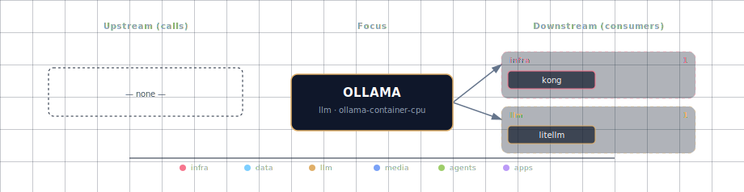

# Ollama (LLM upstream behind LiteLLM)

**Internal port:** 11434 (no host port mapping for `ollama-container-*` — Ollama is reached over the compose network only)
**SOURCE variable:** `LLM_PROVIDER_SOURCE`
**SOURCE options:** `ollama-container-cpu`, `ollama-container-gpu`, `ollama-localhost`, `none`

For `ollama-localhost`, Ollama must already be listening on the host at the port set by `OLLAMA_LOCALHOST_PORT` (default `11434`) — the stack never spins up an Ollama container in that mode, so the upstream is your responsibility.

## 1. Overview

Ollama is the local LLM engine that runs behind the always-on **LiteLLM gateway**. Consumer services (Backend, Open WebUI, n8n, JupyterHub, Local Deep Researcher, OpenClaw, [Hermes Agent](../hermes/README.md), Weaviate vectorization) do **not** talk to Ollama directly — they read `LITELLM_BASE_URL` + `LITELLM_API_KEY` and LiteLLM routes the request to the configured Ollama upstream. See [LiteLLM Gateway](../litellm/README.md) for the consumer-facing surface.

`LLM_PROVIDER_SOURCE` is a single-select choice for the Ollama upstream:

- `ollama-container-cpu` / `ollama-container-gpu` — Ollama running inside the stack as a Docker container
- `ollama-localhost` — Ollama running natively on the host machine
- `none` — no local engine; the stack runs cloud-only via LiteLLM's enabled cloud providers

## 2. Access

| Path | URL | Notes |
|---|---|---|
| Through LiteLLM | `http://localhost:63030/v1` | Consumer-facing OpenAI-compatible endpoint. Use `LITELLM_BASE_URL` from `.env`. |
| Direct (internal) | `http://ollama:11434` | Reachable only from inside the Compose network. The Ollama container no longer publishes a host port. |

The Ollama container no longer publishes a host port; the OpenAI-compatible surface is owned by LiteLLM (default `LITELLM_PORT=63030`). See the canonical port table at [Ports and Routes](../../docs/deployment/ports-and-routes.md).

## 3. Configuration

Configure the Ollama upstream through `.env`, the interactive wizard, or CLI flags:

```bash
LLM_PROVIDER_SOURCE=<option>
# Optional, only when LLM_PROVIDER_SOURCE=ollama-localhost:
OLLAMA_LOCALHOST_PORT=11434
```

LiteLLM resolves the upstream URL from `LITELLM_OLLAMA_UPSTREAM` (set automatically by the bootstrapper based on `LLM_PROVIDER_SOURCE`). Consumers should never reference `LITELLM_OLLAMA_UPSTREAM` directly.

Use `./start.sh` for the guided wizard, or pass a targeted flag for scripted changes when the CLI exposes one.

## 4. Integration notes

The Ollama service participates in the Docker Compose network and is consumed exclusively by:

- **LiteLLM** — for chat completions and embeddings via the OpenAI-compatible proxy.
- **`ollama-pull`** — init container that reads `SELECT name FROM public.llms WHERE provider='ollama' AND active=true` and pulls each row via `/api/pull` (not OpenAI-compatible, so this bypasses LiteLLM by design). The wizard's `OLLAMA_USER_MODELS` / `OLLAMA_CUSTOM_MODELS` env vars feed into this set indirectly: `llm-catalog-init` activates the matching rows on every `docker compose up`, and `ollama-pull` then fetches whatever is active. Runs only when `LLM_PROVIDER_SOURCE` starts with `ollama-container-` (host-side Ollama instances are not pull-controllable from the stack).

If `LLM_PROVIDER_SOURCE=none`, the stack still starts as long as at least one of `CLOUD_OPENAI_SOURCE`, `CLOUD_ANTHROPIC_SOURCE`, or `CLOUD_OPENROUTER_SOURCE` is `enabled`. The bootstrapper refuses to start when all four are `none`/`disabled`.

## 5. Models — single unified picker, source-aware

The interactive wizard surfaces **one** Ollama model multi-select (and a free-text "additional to pull" step for container sources). The option list is source-aware so the user never sees two near-duplicate pages:

- **`ollama-container-*`** — the multi-select shows the live `https://ollama.com/library` scrape (~230 entries; exact count depends on the upstream catalog at fetch time). Nothing is pulled yet — the in-stack container is launched after wizard exit — so the library is the only meaningful discovery surface. The `ollama-pull` init container fetches checked entries on first start.
- **`ollama-localhost`** — the multi-select **merges** `/api/tags` (already-pulled on your upstream) with the library scrape. Each row carries a status badge: `[pulled]` (on disk on the upstream — checking activates it immediately) or `[library]` (catalog-only — registering requires `ollama pull <name>` on the host before requests succeed).

Every row is 2 cells tall, enriched with metadata scraped from each model card on `ollama.com/library`:

- **Line 1**: capability badges (`[embedding]`, `[thinking]`, `[vision]`, `[tools]`, `[audio]` — from `x-test-capability`; `[mlx]` for Apple-Silicon-optimised variants — from the detail page's per-row MLX chip), the `[legacy]` badge when applicable, and the pull count (far right, muted, `K`/`M`/`B` format). Capability badges are rendered in fixed canonical columns (`embedding · thinking · vision · tools · audio · mlx`) so the same tag lands at the same horizontal position across rows; absent slots reserve their column width so alignment survives sparse rows. Narrow terminals (< 100 cells wide for parents, < 110 for leaves) drop the alignment and fall back to inline variable-width tags.
- **Line 2** (muted, indented): every variant in the form `<param-count> (<approx-GB>)` joined with `·` — e.g. `8b (4.8GB) · 70b (42GB) · 405b (243GB)`. Param count is Ollama's canonical tag namespace; the GB figure is approximate Q4 disk footprint (`params × 0.6 bytes/param`, real downloads ±10–15%). Followed by the curated description (when present) and an `updated X ago` annotation.

**`[legacy]` badge** — applied to any model whose `Updated …` timestamp is ≥ 365 days. Demoted below recent models in the sort order; visually muted.

**Search box** above the filter chips: a single-line input (placeholder `Tab or /  to filter models by name…`) that narrows the list by case-insensitive substring against the model name. Press `Tab`, click into it with the mouse, or press `/` to focus it; once focused, type to filter live. The input is visually highlighted (bold cyan text on a darker accent background) so you can tell at a glance that keystrokes are landing in search and not in the option list. To return focus to the option list, press `Tab` again, `Enter`, or `Esc`. Up/down still walk the visible rows while you're typing — pair with the substring filter to preview matches without losing your cursor. Every wizard keybinding except those four exits and the arrows is temporarily suppressed while the search box has focus, so letters and spaces land in the input as text.

**Filter chip row** above the list: single-select chips for `ALL · embedding · thinking · vision · tools · audio`. Click a chip — or press `f` to cycle from the keyboard — to narrow the visible list to that capability; rows you've already checked are preserved across filter switches. The chip filter and the search box stack: both must match for a row to show.

**Ollama Cloud-exclusive models excluded** — the listing page tags some entries (`glm-5`, `minimax-m2`, `kimi-k2`, `deepseek-v4-pro`, …) as cloud-only. Those cannot be `ollama pull`-ed, so the wizard drops them from the multiselect and logs the count to the session log. Hybrid models that publish both cloud and pullable local variants (`gemma3`, `gpt-oss`, `qwen3-coder`, `deepseek-v3.1`, …) stay in the list with their local variants intact.

**Variant picker (in-place tree)** — multi-variant Ollama rows show a `▶` indicator on the left. Press `Space` on a parent to expand its tree in place; variants appear as indented leaves with `└─` connectors directly below. Press `Space` again to collapse. Press `Space` on a leaf to toggle that specific tag (`qwen3:8b`, etc.). Single-variant rows toggle directly. Selections persist to `OLLAMA_USER_MODELS` as `qwen3:8b,qwen3:14b`. Per-row mutex: bare (`qwen3`) and tagged (`qwen3:8b`) entries never coexist — toggling a leaf auto-clears any bare entry. No popup, no focus handover.

**On expand, the wizard fetches `ollama.com/library/{model}`** (the detail page) and caches the result for the session. The detail page exposes per-variant disk size (`5.2GB`), context window (`40K` / `128K` / `256K`), and input modalities — letting us derive per-variant capability badges (`[vision]` from `Image` in inputs, `[audio]` from `Audio`). Leaves of the same parent can therefore carry different tags (e.g., `gemma3:4b` has `[vision]`, `gemma3:270m` doesn't). On fetch failure, the wizard falls back to the listing-page param-count tags (`8b`, `70b`, …) with a Q4-quantization size approximation.

**Sort order** — two recency buckets, recent first, each sorted descending by total pulls:
1. Recent (updated within 365 days).
2. Legacy (`[legacy]` badge, updated > 365 days ago).

Failure modes degrade gracefully:
- Library scrape down → falls back to the curated default-active baseline in `bootstrapper/utils/llm_catalog.py` (qwen3.6:latest, qwen3-embedding:0.6b, nomic-embed-text). Capability tags and sizes are not recoverable; `[legacy]` is suppressed in fallback because no age data is available. Logged in the session log.
- `/api/tags` unreachable → merged view degrades to library-only with a warning. Logged.
- Both down → placeholder row explains what to fix.

The default-active baseline is already activated in `public.llms` from `08-seed-data.sql`, so the multi-select is **purely additive** — leaving everything unchecked still leaves the baseline active. Pre-checking behaviour: on first visit (`OLLAMA_USER_MODELS` empty), the wizard pre-checks the default-active baseline so the user sees it already ticked. On subsequent visits, the saved `OLLAMA_USER_MODELS` selection is restored, intersected with the visible options.

The third step — **Ollama  ·  additional models to pull** — is a free-text comma-separated list. Shown only for `ollama-container-*` sources; persists as `OLLAMA_CUSTOM_MODELS`. `llm-catalog-init` registers each entry as a row in `public.llms` (with `active=true`) for **every** Ollama source; `ollama-pull` then fetches the active set for `ollama-container-*` only. For `ollama-localhost`, you must `ollama pull <name>` on your host yourself.

For `ollama-container-*` sources, `ollama-pull` reads the active set from `public.llms` and pulls each one (`OLLAMA_USER_MODELS` ∪ `OLLAMA_CUSTOM_MODELS` flowing through `llm-catalog-init`'s UPSERT and live-only INSERT path). For `ollama-localhost`, the wizard only registers entries in `public.llms` — you still need to `ollama pull <name>` on your host before requests will succeed.

| Variable | Set by | Consumed by |
|---|---|---|
| `OLLAMA_USER_MODELS` | Single unified Ollama models multi-select. | `llm-catalog-init` for every source (registers + activates rows in `public.llms`, INSERTing live-only names that aren't in the curated catalog); `ollama-pull` for container sources only. |
| `OLLAMA_CUSTOM_MODELS` | Wizard "additional models to pull" text step. | `llm-catalog-init` for every source (registers row + warns for host-side); `ollama-pull` for container sources only. |

## 6. Dependencies & Integrations

> Auto-generated section — the **Current** subsections are derived from `services/ollama/service.yml`'s `data_flow.calls` field (and inverse passes). Re-run `python -m bootstrapper.docs.regen ollama` after manifest changes.

### 6.1 Current — Upstream (this service calls)

_No upstream calls._

### 6.2 Current — Downstream (services that call this)

| Service | Category |
|---|---|
| kong | infra |
| litellm | llm |

### 6.3 Architecture diagram



[Open the interactive HTML diagram](./architecture.html) for a full-screen view.

### 6.4 Future — Missing pair integrations

Note: backend, open-webui, n8n, jupyterhub, local-deep-researcher, hermes, weaviate all reach Ollama indirectly through LiteLLM today. These pairs cover gaps where the LiteLLM proxy hides Ollama-native surface (model management, runtime introspection, private GGUF import).

- **ollama ↔ backend** — *Why:* backend has no view of Ollama runtime state. `/api/ps` exposes loaded models, VRAM footprint, TTL; `/api/show` exposes capabilities and Modelfile. An admin endpoint turns "is the model warm?" from a guess into a fact. *Mechanism:* backend reads `OLLAMA_ENDPOINT` and calls `GET ${OLLAMA_ENDPOINT}/api/ps` + `/api/show`; new `/admin/llm/status` route. *Effort:* small. *Confidence:* high.
- **ollama ↔ jupyterhub** — *Why:* notebooks doing model research want raw `/api/pull`, `/api/create`, `/api/show`, embeddings, and structured-output `format` — none of which round-trip cleanly through LiteLLM. *Mechanism:* inject `OLLAMA_HOST=http://ollama:11434` into singleuser env; pre-install `ollama` Python client. *Effort:* small. *Confidence:* high.
- **ollama ↔ minio** — *Why:* `ollama-pull` only fetches from the public registry. Private GGUFs (licensed, fine-tuned, air-gapped) cannot enter the stack today; MinIO is provisioned for artifacts. *Mechanism:* new `ollama-import` init step reading `OLLAMA_MINIO_BUCKET` keys, streaming each GGUF to `/root/.ollama/blobs`, then `POST /api/create` with a generated `FROM ./blob` Modelfile. *Effort:* medium. *Confidence:* medium.
- **ollama ↔ n8n** — *Why:* n8n workflows already call LiteLLM but can't drive `/api/pull` — meaning "nightly, ensure `qwen3:8b` is pulled" or "on webhook, hot-swap a model" cannot be authored. *Mechanism:* ship an n8n credential pointing at `http://ollama:11434`; n8n's HTTP Request node handles streaming `pull` progress lines. *Effort:* small. *Confidence:* medium.

### 6.5 Future — Candidate new services

- **Langfuse** ([details](../../docs/research/candidates/langfuse.md)) — *Headline:* self-hosted LLM trace, eval, and prompt-management store. *Wires into:* litellm (native callback), hermes, backend, n8n, local-deep-researcher, open-webui.
- **OpenLIT** ([details](../../docs/research/candidates/openlit.md)) — *Headline:* OpenTelemetry-native observability for LLM + vector calls with first-class Ollama instrumentation. *Wires into:* backend, hermes, jupyterhub, weaviate, litellm.

### 6.6 Future — Unused features in this service

- **Quantized KV cache (`OLLAMA_KV_CACHE_TYPE=q8_0` / `q4_0`)** — *Why pursue:* ~2× context length at the same VRAM budget, currently unset (defaults to f16). *Effort:* small.
- **`OLLAMA_FLASH_ATTENTION=1`** — *Why pursue:* free throughput on supported GPUs; currently unset. *Effort:* small.
- **`OLLAMA_NUM_PARALLEL` / `OLLAMA_MAX_LOADED_MODELS`** — *Why pursue:* stack runs multi-tenant (backend + open-webui + n8n + hermes) but uses Ollama defaults. Tuning prevents head-of-line blocking. *Effort:* small.
- **`/api/ps` + `/api/show` surface** — *Why pursue:* gives UI and ops scripts visibility into VRAM occupancy, model capabilities, load TTL. *Effort:* small.
- **Native structured-output `format` (JSON schema)** — *Why pursue:* richer than the OpenAI `response_format` LiteLLM forwards; useful for hermes skills and backend agents that need strict schemas. *Effort:* medium.
- **Modelfile customization pipeline** — *Why pursue:* stack-specific system prompts, templates, ADAPTERs (LoRA) cannot be authored today; `ollama-pull` only consumes public tags. *Effort:* medium.
- **`OLLAMA_KEEP_ALIVE` tuning** — *Why pursue:* default 5m evicts models between idle bursts; per-model overrides via `keep_alive` request field would cut cold-start tail latency. *Effort:* small.

## 7. Troubleshooting

```bash
# Check Ollama container status
docker compose ps ollama

# Check Ollama logs
docker compose logs -f ollama

# Verify LiteLLM can reach Ollama (from inside the network)
docker exec genai-litellm curl -s http://ollama:11434/api/tags
```

For general startup and routing issues, see [Troubleshooting](../../docs/quick-start/troubleshooting.md). For LiteLLM-specific debugging (model registration, virtual keys, spend logs), see [LiteLLM Gateway](../litellm/README.md).
