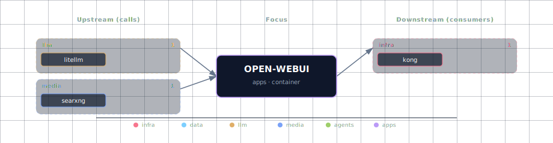

# Open WebUI

**Port:** 63015
**SOURCE variable:** `OPEN_WEB_UI_SOURCE`
**SOURCE options:** container, disabled

## 1. Overview

Main browser chat UI. It adapts to the configured LLM provider and related stack services.

## 2. Access

| Path | URL | Notes |
|---|---|---|
| Direct | http://localhost:63015 | Works when the service is enabled in container mode and the port is exposed. |
| Kong | http://chat.localhost:63002 | Requires `./start.sh --setup-hosts`; only available for services with Kong routes. |

See the canonical port table at [Ports and Routes](../../docs/deployment/ports-and-routes.md).

## 3. Configuration

Configure this service through `.env`, the interactive wizard, or CLI flags where available. Prefer SOURCE variables and documented env vars over direct `docker-compose.yml` edits.

```bash
OPEN_WEB_UI_SOURCE=<option>
```

Use `./start.sh` for the guided wizard, or pass a targeted flag for scripted changes when the CLI exposes one.

## 4. Integration notes

The service participates in the Docker Compose network and may be consumed by the Backend API, Open WebUI, JupyterHub, n8n, Weaviate, or init containers depending on which SOURCE modes are enabled.

When [Hermes Agent](../hermes/README.md) is enabled (`HERMES_SOURCE != disabled`), it appears in the model dropdown as `hermes-agent` via the LiteLLM gateway — no per-WebUI wiring required. The model-list cache TTL is 5 minutes (`OPEN_WEB_UI_MODEL_CACHE_TTL=300`) so a newly-enabled Hermes can take that long to appear in the dropdown; set the TTL to `0` during development.

If a dependency is disabled, adaptive services should degrade where supported. Some implementation-level dependency cleanup is tracked separately as bootstrapper work and is outside this documentation pass.

## 5. Troubleshooting

```bash
# Check service status
docker compose ps

# Check logs; replace SERVICE with the compose service name when needed
docker compose logs -f SERVICE
```

For general startup and routing issues, see [Troubleshooting](../../docs/quick-start/troubleshooting.md).

## 6. Dependencies & Integrations

> Auto-generated section — the **Current** subsections are derived from `services/open-webui/service.yml`'s `data_flow.calls` field (and inverse passes). Re-run `python -m bootstrapper.docs.regen open-webui` after manifest changes.

### 6.1 Current — Upstream (this service calls)

| Service | Category |
|---|---|
| litellm | llm |
| doc-processor | media |
| searxng | media |
| hermes | agents |

### 6.2 Current — Downstream (services that call this)

| Service | Category |
|---|---|
| kong | infra |

### 6.3 Architecture diagram



[Open the interactive HTML diagram](./architecture.html) for a full-screen view.

### 6.4 Future — Missing pair integrations

- **open-webui ↔ searxng** — *Why:* Open WebUI consumes SearXNG as a first-class web-search provider for in-chat grounding, but the stack only wires SearXNG to local-deep-researcher today. *Mechanism:* `ENABLE_RAG_WEB_SEARCH=true` + `RAG_WEB_SEARCH_ENGINE=searxng` + `SEARXNG_QUERY_URL=http://searxng:8080/search?q=<query>&format=json`. *Effort:* small. *Confidence:* high.
- **open-webui ↔ jupyterhub** — *Why:* Open WebUI ships a Jupyter-backed code-execution engine that runs LLM-emitted Python in a real kernel with persistent state, instead of the in-browser Pyodide sandbox. *Mechanism:* `CODE_EXECUTION_ENGINE=jupyter` + `CODE_EXECUTION_JUPYTER_URL=http://jupyterhub:8000` + `CODE_EXECUTION_JUPYTER_AUTH=token` (mirror for `CODE_INTERPRETER_*`). *Effort:* medium. *Confidence:* high.
- **open-webui ↔ minio** — *Why:* Chat uploads, generated images, and TTS audio currently live in a Docker volume and vanish on `--cold`; Open WebUI supports S3 storage natively and MinIO is already in the stack. *Mechanism:* `STORAGE_PROVIDER=s3` + `S3_ENDPOINT_URL=http://minio:9000` + `S3_BUCKET_NAME=openwebui` with MinIO credentials, plus an `mc mb` init step. *Effort:* small. *Confidence:* high.
- **open-webui ↔ n8n** — *Why:* n8n workflows could be surfaced to chat as Open WebUI Tools, letting users trigger automations ("email this summary", "create a Jira ticket") without writing Python. *Mechanism:* register an OpenAPI tool server pointing at an n8n webhook that serves `openapi.json` (via a workflow-to-schema wrapper). *Effort:* medium. *Confidence:* medium.
- **open-webui ↔ neo4j** — *Why:* The existing `memory_tool.py` writes flat memories to Postgres; a Neo4j-backed graph would link entity → fact → source-conversation and power richer recall. *Mechanism:* extend `extras/tools/memory_tool.py` to call a backend endpoint that writes Cypher to `bolt://neo4j:7687`. *Effort:* medium. *Confidence:* medium.

### 6.5 Future — Candidate new services

- **Open WebUI Pipelines** ([details](../../docs/research/candidates/open-webui-pipelines.md)) — *Headline:* First-party plugin server for filters (rate-limit, toxicity, Langfuse tracing) and custom pipe providers. *Wires into:* open-webui, litellm, hermes, kong.
- **mcpo** ([details](../../docs/research/candidates/mcpo.md)) — *Headline:* Open WebUI's MCP-to-OpenAPI proxy exposes any stdio/SSE MCP server as a REST tool server consumable by Open WebUI and LiteLLM. *Wires into:* open-webui, hermes, litellm, n8n, kong.
- **Langfuse** ([details](../../docs/research/candidates/langfuse.md)) — *Headline:* Self-hostable LLM observability (traces, evals, prompt management) plugged in via the Pipelines filter. *Wires into:* litellm, hermes, n8n, comfyui, supabase, redis.

### 6.6 Future — Unused features in this service

- **OIDC / SSO via Supabase Auth** — *Why pursue:* Supabase GoTrue is already running and Open WebUI supports generic OAuth/OIDC, so a single login could unify Open WebUI, n8n, and JupyterHub identity. *Effort:* medium.
- **Native MCP client** — *Why pursue:* Open WebUI now ships a built-in MCP client; wiring it to stack-local MCP servers (filesystem, git) gives chat real tool surfaces without per-tool Python glue. *Effort:* small.
- **Hybrid BM25 + vector reranking** — *Why pursue:* Weaviate is wired but Open WebUI's built-in hybrid search and cross-encoder reranker are off, leaving knowledge-base recall worse than it needs to be. *Effort:* small.
- **Channels / multi-user workspaces** — *Why pursue:* Channels turn the WebUI into a team space with `@model` mentions and pair naturally with the Supabase auth gap above. *Effort:* medium.
- **Notes with agentic access** — *Why pursue:* The built-in rich-text notes editor that LLMs can read and write replaces ad-hoc scratchpads with zero new infrastructure. *Effort:* small.
