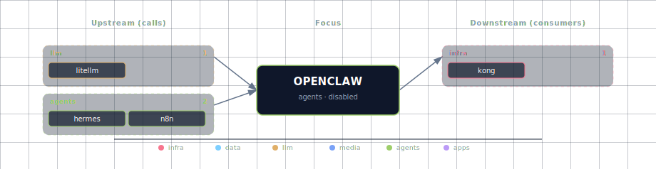

# OpenClaw AI Agent Service

Open-source AI agent for messaging platforms with web-based administration dashboard.

## 1. Overview

The OpenClaw service provides an AI-powered agent that connects to messaging apps:

- **Messaging Integration**: WhatsApp, Telegram, Discord, Slack, iMessage, and more
- **File Management**: Read, create, and manage files in a dedicated workspace
- **Calendar Management**: Schedule events and manage calendars
- **GitHub Monitoring**: Monitor repositories, issues, and pull requests
- **Command Execution**: Execute commands via messaging interface
- **Web Dashboard**: Browser-based admin panel for configuration and approvals
- **Multi-Provider LLM**: Defaults to the stack's LiteLLM gateway (Ollama upstream + cloud providers); direct Anthropic/OpenAI keys still supported as overrides

## 2. Architecture

OpenClaw runs as a single gateway process that:

- Serves the web dashboard on the configured gateway port. The stack default is 63063 (container) / 63024 (localhost); OpenClaw's native/default port is commonly 18789.
- Manages messaging platform connections (bridge) on the configured bridge port. The stack default is 63064.
- Stores configuration in `~/.openclaw/` directory
- Stores workspace files in `~/.openclaw/workspace/`

For LLM access, OpenClaw points at the stack's **LiteLLM gateway** (`LITELLM_BASE_URL` + `LITELLM_API_KEY`) by default — one URL fronts the Ollama upstream and any enabled cloud providers (OpenAI, Anthropic, OpenRouter). Direct provider keys (`OPENCLAW_OPENAI_API_KEY`, `OPENCLAW_ANTHROPIC_API_KEY`) remain available as overrides for cases where OpenClaw should bypass LiteLLM. The gateway also connects to messaging platforms (WhatsApp, Telegram, etc.) for user interaction.

**Container Mode Initialization**: When running in container mode, an `openclaw-init` container runs first to:
- Set correct volume permissions (uid 1000/node) on config and workspace volumes
- Pre-configure the gateway for non-loopback binding (`gateway.controlUi.dangerouslyAllowHostHeaderOriginFallback`)

The gateway container starts with `--bind lan` to listen on all interfaces (required for Docker networking).

## 3. Quick Start

### 3.1 Container Mode (Docker)

**Step 1: Configure source**

Edit `.env`:
```bash
OPENCLAW_SOURCE=container
```

**Step 2: Start the stack**
```bash
./start.sh
```

Or use CLI override:
```bash
./start.sh --openclaw-source container
```

**Step 3: Access the dashboard**

Open `http://localhost:63063` or `http://openclaw.localhost:63000` (via Kong).

**Step 4: Run onboarding**
```bash
docker exec -it genai-openclaw-gateway openclaw onboard
```

**Note:**
- OpenClaw is **disabled by default** - you must explicitly enable it
- First run requires onboarding to configure messaging channels (LLM access is pre-wired through LiteLLM)

### 3.2 Localhost Mode (Native)

**Step 1: Install OpenClaw**
```bash
# Requires Node.js 22+
npm install -g openclaw
```

**Step 2: Run onboarding**
```bash
openclaw onboard --install-daemon
```

**Step 3: Start the gateway**
```bash
openclaw gateway --port 63024
```

**Step 4: Start the stack with OpenClaw localhost**
```bash
./start.sh --openclaw-source localhost
```

Or edit `.env`:
```bash
OPENCLAW_SOURCE=localhost
# Optional: if your local OpenClaw runs on its native/default 18789 instead:
# OPENCLAW_LOCALHOST_PORT=18789
# (URL is derived as http://host.docker.internal:18789 at compose-render time.)
```

### 3.3 Disable OpenClaw

```bash
OPENCLAW_SOURCE=disabled
```

## 4. Configuration

### 4.1 Environment Variables

| Variable | Description | Default |
|----------|-------------|---------|
| `OPENCLAW_SOURCE` | Service source (container, localhost, disabled) | `disabled` |
| `OPENCLAW_IMAGE` | Docker image | `ghcr.io/openclaw/openclaw:latest` |
| `OPENCLAW_GATEWAY_PORT` | Gateway HTTP port | `63063` |
| `OPENCLAW_BRIDGE_PORT` | Bridge port | `63064` |
| `OPENCLAW_GATEWAY_TOKEN` | Optional token for securing gateway API | `` |
| `OPENCLAW_SCALE` | Container replicas (set by bootstrapper) | `0` |

### 4.2 LLM Configuration

By default OpenClaw is wired into the stack's LiteLLM gateway via:

| Variable | Description | Default |
|----------|-------------|---------|
| `LITELLM_BASE_URL` | OpenAI-compatible URL of the LiteLLM proxy | `http://litellm:4000` (in-network) |
| `LITELLM_API_KEY` | Bearer key for LiteLLM (equals `LITELLM_MASTER_KEY`) | auto-generated |

### 4.3 Optional Direct-Provider Overrides

These bypass LiteLLM and let OpenClaw call providers directly — useful when you want a separate budget/key from the rest of the stack, or to talk to a model LiteLLM doesn't have registered.

| Variable | Description | Default |
|----------|-------------|---------|
| `OPENCLAW_ANTHROPIC_API_KEY` | Anthropic API key for OpenClaw | Falls back to stack-wide key |
| `OPENCLAW_OPENAI_API_KEY` | OpenAI API key for OpenClaw | Falls back to stack-wide `OPENAI_API_KEY` |

### 4.4 Localhost-Specific

| Variable | Description | Default |
|----------|-------------|---------|
| `OPENCLAW_LOCALHOST_PORT` | Local service port. Default matches the stack port offset; set to `18789` if your local OpenClaw runs on its native/default port. URL is derived as `http://host.docker.internal:${OPENCLAW_LOCALHOST_PORT}` at compose-render time. | `63024` |

## 5. LLM Configuration

OpenClaw inherits LLM access from the always-on LiteLLM gateway:

- **Default path (LiteLLM)**: OpenClaw is configured as an OpenAI-compatible client against `LITELLM_BASE_URL` with `LITELLM_API_KEY`. Whatever Ollama / OpenAI / Anthropic / OpenRouter upstreams you've enabled in the stack are routed transparently through LiteLLM. To pick a model, use the model IDs registered in `volumes/litellm/config.yaml` (e.g. `ollama/qwen3.6:latest`, `gpt-4o`, `claude-sonnet-4-6`).
- **Anthropic override**: Set `OPENCLAW_ANTHROPIC_API_KEY` in `.env` to make OpenClaw call Anthropic directly, bypassing LiteLLM. Without it, OpenClaw uses the stack-wide Anthropic key (if configured) through LiteLLM.
- **OpenAI override**: Set `OPENCLAW_OPENAI_API_KEY` in `.env` to bypass LiteLLM for OpenAI traffic. Falls back to the stack-wide `OPENAI_API_KEY` when unset.

**Provider Priority**: When direct override keys are present, OpenClaw prefers them in this order: Anthropic direct > OpenAI direct > LiteLLM gateway. To force every request through LiteLLM (recommended for budget tracking and spend logs), leave both `OPENCLAW_*_API_KEY` overrides empty.

## 6. Web Dashboard

The OpenClaw gateway includes a built-in web dashboard for administration:

- **Direct access**: `http://localhost:63063`
- **Via Kong**: `http://openclaw.localhost:63000`

The dashboard provides:
- Chat interface for interacting with the agent
- Configuration management
- Execution approvals
- Channel status monitoring

**Security**: The dashboard is an admin surface. If `OPENCLAW_GATEWAY_TOKEN` is set, you'll need to provide the token to access the dashboard.

## 7. Interactive CLI Usage

Run OpenClaw CLI commands inside the container:

```bash
# Run onboarding
docker exec -it genai-openclaw-gateway openclaw onboard

# Configure settings (e.g. point OpenClaw at LiteLLM)
docker exec -it genai-openclaw-gateway openclaw config set models.providers.openai.baseUrl "http://litellm:4000/v1"

# Check health
docker exec -it genai-openclaw-gateway openclaw doctor

# View gateway status
docker exec -it genai-openclaw-gateway openclaw gateway probe
```

Or use docker compose run for one-off commands:
```bash
docker compose run --rm openclaw-gateway openclaw config get gateway.auth.token
```

## 8. Health Check

```bash
# Direct health check
curl http://localhost:63063/healthz

# Deep health check (requires token)
docker exec genai-openclaw-gateway node dist/index.js health --token "$OPENCLAW_GATEWAY_TOKEN"
```

## 9. Source Modes

### 9.1 container

Runs OpenClaw gateway in a Docker container.

**Best for**: Standard deployment, messaging app integrations

**Resources**: ~2GB RAM minimum

**Setup**: Automatic via docker-compose

### 9.2 localhost

Connects to OpenClaw running natively on the host machine.

**Best for**: Development, custom configurations, persistent settings

**Resources**: Node.js 22+, npm

**Setup**: Manual - `npm install -g openclaw`, then `openclaw gateway`

### 9.3 disabled

No OpenClaw agent (default).

**Best for**: When messaging agent functionality is not needed

**Impact**: No messaging platform integration available

## 10. Required Services

### 10.1 Required

- None (OpenClaw is optional for all services)

### 10.2 LLM access

- **LiteLLM gateway** (default): Provides Ollama + cloud providers behind a single OpenAI-compatible URL (`LITELLM_BASE_URL`). Always-on; no per-provider wiring needed in OpenClaw.
- **Anthropic direct** (override): `OPENCLAW_ANTHROPIC_API_KEY`
- **OpenAI direct** (override): `OPENCLAW_OPENAI_API_KEY`

## 11. References

- [OpenClaw Documentation](https://docs.openclaw.ai/)
- [OpenClaw Docker Guide](https://docs.openclaw.ai/install/docker)
- [LiteLLM Gateway](../litellm/README.md) — the OpenAI-compatible front door OpenClaw points at by default
- [Hermes Agent](../hermes/README.md) — the programmable agent runtime OpenClaw bridges to messaging channels
- [OpenClaw GitHub Repository](https://github.com/openclaw/openclaw)

## 12. Dependencies & Integrations

> Auto-generated section — the **Current** subsections are derived from `services/openclaw/service.yml`'s `data_flow.calls` field (and inverse passes). Re-run `python -m bootstrapper.docs.regen openclaw` after manifest changes.

### 12.1 Current — Upstream (this service calls)

| Service | Category |
|---|---|
| litellm | llm |
| hermes | agents |
| n8n | agents |

### 12.2 Current — Downstream (services that call this)

| Service | Category |
|---|---|
| kong | infra |

### 12.3 Architecture diagram



[Open the interactive HTML diagram](./architecture.html) for a full-screen view.

### 12.4 Future — Missing pair integrations

- **openclaw ↔ hermes** — *Why:* OpenClaw is positioned as a channel adapter (40+ messaging surfaces); Hermes is the programmable agent runtime already in the stack. The compose file already passes `HERMES_ENDPOINT`/`HERMES_API_KEY` — only the bridge wiring is missing. *Mechanism:* OpenClaw skill or webhook plugin forwarding inbound messages to `http://hermes:8000/v1/chat/completions`; replies posted back via OpenClaw's `send` RPC. *Effort:* medium. *Confidence:* high.
- **openclaw ↔ n8n** — *Why:* OpenClaw's webhooks plugin explicitly lists n8n as a primary trigger source; gives non-developers a visual surface to wire messaging events to stack workflows. *Mechanism:* n8n HTTP Request node → `POST http://openclaw-gateway:18789/webhooks/<route>` with `Authorization: Bearer <route-secret>`. *Effort:* small. *Confidence:* high.
- **openclaw ↔ minio** — *Why:* Workspace files, voice notes, and media attachments live only in the `openclaw-workspace` Docker volume — not addressable by other stack services. *Mechanism:* configure S3 backend with `endpoint=http://minio:9000`, dedicated `openclaw` bucket alongside the existing `MINIO_BUCKET_*` set. *Effort:* small. *Confidence:* medium.
- **openclaw ↔ doc-processor** — *Why:* when users drop PDFs/Office docs into a chat, OpenClaw's built-in PDF handling is shallow; doc-processor (Docling) produces structured markdown + chunks the rest of the stack uses. *Mechanism:* custom OpenClaw skill posting attachments to `http://docling:5001/v1/convert/file`; persist markdown to workspace + MinIO. *Effort:* medium. *Confidence:* high.
- **openclaw ↔ weaviate** — *Why:* OpenClaw lists "memory search across persistent knowledge bases" but has no backend wired; Weaviate is the stack's vector DB. *Mechanism:* skill or MCP server bridging to `http://weaviate:8080/v1/objects` (REST) or `:50051` (gRPC); embedding via LiteLLM's embeddings endpoint. *Effort:* medium. *Confidence:* medium.
- **openclaw ↔ searxng** — *Why:* OpenClaw ships web-search tools with multiple providers but defaults to commercial APIs; SearXNG is the stack's privacy-preserving metasearch. *Mechanism:* set OpenClaw's web-search provider to a custom HTTP backend pointing at `${SEARXNG_INTERNAL_URL}/search?format=json&q=...`. *Effort:* small. *Confidence:* medium.

### 12.5 Future — Candidate new services

- **Honcho** ([details](../../docs/research/candidates/honcho.md)) — *Headline:* hosted/self-hostable user-memory store explicitly listed as an OpenClaw memory-engine backend. *Wires into:* hermes, backend, local-deep-researcher.

### 12.6 Future — Unused features in this service

- **MCP CLI / external MCP server support** — *Why pursue:* lets OpenClaw consume any MCP server (Neo4j, Weaviate, GitHub) over stdio/SSE/streamable-http, unlocking RAG and graph tools without bespoke skills. *Effort:* medium.
- **Webhooks plugin (inbound TaskFlow trigger)** — *Why pursue:* standard surface for n8n/CI/external triggers; auth model already defined. *Effort:* small.
- **Sandbox runners (Docker/SSH backends)** — *Why pursue:* non-main sessions can run tools in Docker sandboxes — meaningfully safer than current host-bound execution. *Effort:* medium.
- **Local TTS/STT providers** — *Why pursue:* stack already runs `tts-provider` and `stt-provider`; swap OpenClaw's cloud STT/TTS for local providers to keep voice fully on-device. *Effort:* small.
- **Memory engines (Honcho / QMD search)** — *Why pursue:* persistent cross-session memory currently absent. *Effort:* medium.
- **S3 / object-storage backend** — *Why pursue:* wire workspace + media to MinIO for cross-service file sharing. *Effort:* small.

## 13. Troubleshooting

### 13.1 Permission Denied on Startup

**Problem**: `EACCES: permission denied, open '/home/node/.openclaw/openclaw.json'`

**Solution**:
1. The `openclaw-init` container should fix this automatically on startup
2. If it persists, manually fix: `docker run --rm -v genai-openclaw-config:/data alpine chown -R 1000:1000 /data`
3. Restart the gateway: `docker restart genai-openclaw-gateway`

### 13.2 Gateway Won't Start

**Problem**: OpenClaw container fails to start

**Solution**:
1. Check logs: `docker logs genai-openclaw-gateway`
2. Verify image is available: `docker pull ghcr.io/openclaw/openclaw:latest`
3. Ensure ports 63063/63064 are not in use
4. Check Docker has sufficient memory (2GB+ recommended)

### 13.3 Can't See LLM Models

**Problem**: OpenClaw doesn't see any models

**Solution**:
1. Verify LiteLLM is healthy: `curl http://localhost:63030/health/liveliness`
2. List the models LiteLLM has registered: `curl -H "Authorization: Bearer $LITELLM_MASTER_KEY" http://localhost:63030/v1/models`
3. Run inside the container: `docker exec genai-openclaw-gateway openclaw config get models.providers.openai`
4. Confirm `LITELLM_BASE_URL` and `LITELLM_API_KEY` are present in the OpenClaw container environment
5. If you specifically need Ollama models, ensure `LLM_PROVIDER_SOURCE` is set to one of the `ollama-*` values (not `none`) so LiteLLM has an Ollama upstream to forward to

### 13.4 Dashboard Not Loading

**Problem**: Web dashboard returns errors

**Solution**:
1. Check health endpoint: `curl http://localhost:63063/healthz`
2. Wait for startup (20s start period)
3. If using Kong, verify hosts file: `./start.sh --setup-hosts`
4. Check if `OPENCLAW_GATEWAY_TOKEN` is required

### 13.5 Port Already in Use

**Problem**: Port 63063 or 63064 is occupied

**Solution**:
```bash
# Use different base port
./start.sh --base-port 64000

# Or check what's using the port
lsof -i :63063
```
