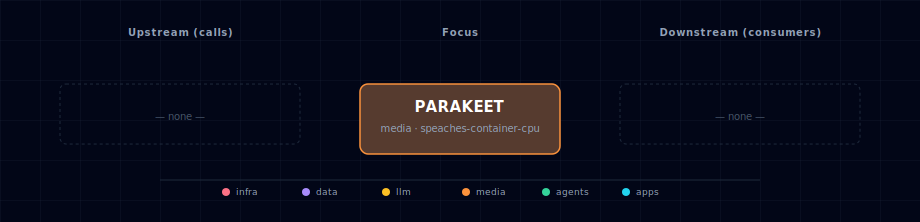

# Parakeet (STT engine)

Parakeet is one of the STT engines selectable via `STT_PROVIDER_SOURCE`. It is
documented under the **STT Provider** aggregator rather than as a standalone
service, because the user-facing role is "pick an STT engine" — not "pick
Parakeet":

→ See [services/stt-provider/README.md](../stt-provider/README.md) for the full
user-facing description, source-variant table, and configuration reference.

## 1. Engine quick reference

- **Image:** `nvcr.io/nvidia/pytorch:26.06-py3` (GPU only — Parakeet-TDT model)
- **License:** CC-BY-4.0 (NVIDIA)
- **Activation:** `STT_PROVIDER_SOURCE=parakeet-container-gpu` (or
  `parakeet-localhost` — Parakeet-MLX on macOS / native Linux)
- **In-container port:** 8000
- **Host port:** `${STT_PROVIDER_PORT}` (computed from `BASE_PORT` by the
  bootstrapper)

This manifest also owns the broader `STT_PROVIDER_SOURCE` enum (every STT
option across engines), which is why it lives here historically rather than
on the aggregator. The manifest (`service.yml`) and compose fragment
(`compose.yml`) in this folder are the bootstrapper's source of truth for those
values; treat this README as a pointer, not a duplicate of the aggregator doc.

## 2. Dependencies & Integrations

> Auto-generated section — the **Current** subsections are derived from `services/parakeet/service.yml`'s `data_flow.calls` field (and inverse passes). Re-run `python -m bootstrapper.docs.regen parakeet` after manifest changes.

### 2.1 Current — Upstream (this service calls)

_No upstream calls._

### 2.2 Current — Downstream (services that call this)

| Service | Category |
|---|---|
| kong | infra |
| hermes | agents |
| n8n | agents |
| open-webui | apps |

### 2.3 Architecture diagram

[Open the interactive HTML diagram](./architecture.html) for a full-screen view.

### 2.4 Future — Missing pair integrations

_No high-confidence opportunities identified._

### 2.5 Future — Candidate new services

_No high-confidence opportunities identified._

### 2.6 Future — Unused features in this service

_No high-confidence opportunities identified._
