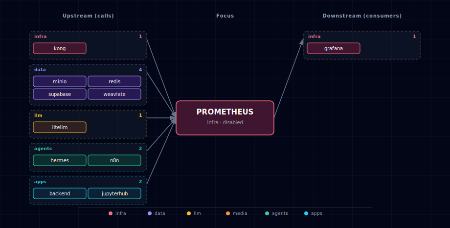

# Prometheus (metrics scraper + TSDB)

Prometheus runs as a family of three containers in the stack's `infra` band: the main `prometheus` server, `node-exporter` for host-level metrics, and `cadvisor` for per-container metrics. All three share a single lifecycle — `PROMETHEUS_SOURCE` is one toggle that scales them as a unit.

## 1. Overview

Image: `prom/prometheus:v2.55.1` (Apache 2.0). The bundled exporters are `prom/node-exporter:v1.11.1` and `gcr.io/cadvisor/cadvisor:v0.55.1`. Default TSDB retention is **7 days**, user-configurable at wizard time via the inline secondary numeric input on the Prometheus source step.

The scrape config is static (`services/prometheus/config/prometheus.yml`) and lists every supported target across the stack. Targets that belong to services currently `disabled` simply report `UP=0` — cleaner than templating the scrape file based on enabled services. Recording / alert rules live under `services/prometheus/config/rules/`; the bundled `stack-recording.yml` is an empty placeholder.

## 2. Access

| Surface | URL | Auth |
|---|---|---|
| Prometheus UI + API (direct) | `http://localhost:${PROMETHEUS_PORT}` | None |
| Prometheus UI + API (Kong) | `http://prometheus.localhost:${KONG_HTTP_PORT}` | None (intentional — Kong-gated, internal-only scrape paths) |
| Direct (internal) | `http://prometheus:9090` | None — backend-network only |
| node-exporter (direct) | `http://localhost:${NODE_EXPORTER_PORT}/metrics` | None |
| cAdvisor (direct) | `http://localhost:${CADVISOR_PORT}` | None |

`prometheus.localhost` is intentionally exposed without auth — its data is not sensitive when the route is internal-network-only and the service is opt-in. Pair with Grafana for the user-facing dashboard surface.

## 3. Configuration

```bash
PROMETHEUS_SOURCE=disabled              # container | disabled
PROMETHEUS_RETENTION_DAYS=7             # 1..365
PROMETHEUS_PORT=                        # auto-assigned by topology (infra block)
NODE_EXPORTER_PORT=                     # auto-assigned
CADVISOR_PORT=                          # auto-assigned
```

Auto-managed (do not edit by hand):

```bash
PROMETHEUS_ENDPOINT=...                  # consumed by Grafana provisioning
PROMETHEUS_SCALE / NODE_EXPORTER_SCALE / CADVISOR_SCALE
POSTGRES_EXPORTER_SCALE / REDIS_EXPORTER_SCALE  # cross-manifest writes
```

The bootstrapper's `_generate_prometheus_config()` hook writes all five scale vars from `PROMETHEUS_SOURCE` — the two `*_EXPORTER_SCALE` writes target the sidecar exporters in `services/supabase/` and `services/redis/`, gating them on this manifest's source.

## 4. Scrape targets

13 targets ship in `config/prometheus.yml`:

| Job | Target | Notes |
|---|---|---|
| `prometheus` | `prometheus:9090` | Self-metrics |
| `grafana` | `grafana:3000` | Grafana self-metrics |
| `node` | `node-exporter:9100` | Host CPU/mem/disk/net |
| `cadvisor` | `cadvisor:8080` | Per-container resources |
| `kong` | `kong-api-gateway:8100` | Kong Status API + Prometheus plugin. (The Compose service name is `kong-api-gateway`; `kong` alone does not resolve on the backend-network.) |
| `litellm` | `litellm:4000` | Per-model tokens / cost / latency / errors (requires `callbacks: [prometheus]` in LiteLLM config) |
| `weaviate` | `weaviate:2112` | Requires `PROMETHEUS_MONITORING_ENABLED=true` on Weaviate |
| `n8n` | `n8n:5678` | Requires `N8N_METRICS=true` |
| `n8n-worker` | `n8n-worker:5678` | Queue mode runs executions worker-side — execution-data counters live here |
| `minio` | `minio:9000/minio/v2/metrics/cluster` | Requires `MINIO_PROMETHEUS_AUTH_TYPE=public` |
| `backend` | `backend:8000/metrics` | `prometheus-fastapi-instrumentator` middleware |
| `postgres-exporter` | `postgres-exporter:9187` | Sidecar embedded in Supabase family; scales 1↔0 with `PROMETHEUS_SOURCE` |
| `redis-exporter` | `redis-exporter:9121` | Sidecar embedded in Redis family; scales 1↔0 with `PROMETHEUS_SOURCE` |

Ollama is **deliberately not scraped** — LiteLLM is its gateway and emits per-call request/token/cost metrics, so scraping Ollama directly would duplicate that data. Container-level resource usage is covered by cAdvisor.

**Deferred targets:** JupyterHub (the image is single-user `jupyter/datascience-notebook`, not real JupyterHub — no built-in `/metrics`) and Hermes (third-party `nousresearch/hermes-agent` image with no `/metrics` endpoint) used to ship as scrape jobs with placeholder ports. Both are now omitted from `config/prometheus.yml` until upstream instrumentation lands (Hermes) or the multi-user JupyterHub migration ships.

## 5. Dependencies & Integrations

> Auto-generated section — the **Current** subsections are derived from `services/prometheus/service.yml`'s `data_flow.calls` field (and inverse passes). Re-run `python -m bootstrapper.docs.regen prometheus` after manifest changes.

### 5.1 Current — Upstream (this service calls)

| Service | Category |
|---|---|
| grafana ↔ | infra |
| kong ↔ | infra |
| minio | data |
| redis | data |
| supabase | data |
| weaviate | data |
| litellm | llm |
| n8n | agents |
| backend | apps |

### 5.2 Current — Downstream (services that call this)

| Service | Category |
|---|---|
| grafana ↔ | infra |
| kong ↔ | infra |

### 5.3 Architecture diagram



[Open the interactive HTML diagram](./architecture.html) for a full-screen view.

### 5.4 Future — Missing pair integrations

_No high-confidence opportunities identified._

### 5.5 Future — Candidate new services

- **Alertmanager** — pair with Prometheus's alerting rules for paging/routing. Today the bundle uses Grafana's unified alerting; a separate Alertmanager would matter only if clustered HA alerting becomes a requirement.
- **Loki** — log aggregation companion. Same operational pattern as Prometheus (scrape-then-store-then-query).
- **Tempo** — distributed tracing companion. Closes the metrics + logs + traces triangle for full observability.
- **OpenTelemetry collector** — neutral collection plane for metrics + logs + traces, replacing per-service exporters where applicable.

### 5.6 Future — Unused features in this service

- **Remote write to long-term storage** — `remote_write` to Mimir / Thanos / VictoriaMetrics for retention beyond local TSDB. Useful when the 7-day default isn't enough but local disk pressure is.
- **Recording rules** — pre-aggregated time series for expensive Grafana queries; `config/rules/stack-recording.yml` is an empty placeholder ready to be populated.
- **Native histograms** — Prometheus 2.40+ ships native histogram support; LiteLLM and the FastAPI instrumentators can emit them with smaller storage footprint than classic histograms.

## 6. Troubleshooting

- **Targets show `DOWN` for services that are running** — most likely the service hasn't enabled its `/metrics` endpoint (check the per-service flag: `N8N_METRICS=true`, `PROMETHEUS_MONITORING_ENABLED=true`, etc.). Visit `http://prometheus.localhost/targets` to see the `lastError` for each failing job.
- **No metrics for postgres / redis** — the sidecar exporters scale=0 when `PROMETHEUS_SOURCE=disabled` (they're useless without a scraper). Confirm `PROMETHEUS_SOURCE=container` is set in `.env` and re-run `./start.sh`.
- **Disk pressure** — `prometheus-data` named volume grows roughly linearly with retention × scrape rate × series count. Lower `PROMETHEUS_RETENTION_DAYS` or trim scrape jobs in `config/prometheus.yml`.
- **cAdvisor or node-exporter unable to start on macOS** — `/proc` and host-level filesystem mounts behave differently inside Docker Desktop's VM than on bare Linux. Some node-exporter collectors degrade gracefully; cAdvisor mostly produces container-level metrics that are platform-agnostic. Host-level metrics on macOS are best-effort.
