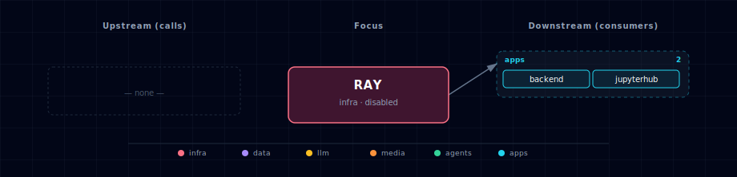

# Ray

Distributed-compute substrate for the stack. Ray runs as a head + worker cluster reachable from JupyterHub, Backend (via REST), and any host Python via `ray.init("ray://localhost:<RAY_CLIENT_PORT>")`.

## 1. Overview

Ray (`rayproject/ray:2.55.1`, Apache 2.0) is a generic parallel-compute framework. This stack ships it as a 2-container family (head + workers) wired so every tier can dispatch parallel work without rolling its own asyncio.gather glue. Use Ray when you have N independent units of work to fan out across CPUs (and eventually GPUs on multi-host Linux).

Active when `RAY_SOURCE ∈ {ray-container-cpu, ray-container-gpu}`. The `ray-external` source lets you point at a managed Anyscale or self-hosted external Ray cluster instead.

## 2. Access

| Surface | URL | Auth |
|---|---|---|
| Dashboard (UI + REST job-submission API) | `http://localhost:${RAY_DASHBOARD_PORT}` direct or `http://ray.localhost:${KONG_HTTP_PORT}` via Kong | Direct: unauthenticated. Kong: basic-auth with `DASHBOARD_USERNAME` / `DASHBOARD_PASSWORD`. |
| Client server (host Python) | `ray://localhost:${RAY_CLIENT_PORT}` | None |
| GCS (internal cluster controller) | `:${RAY_GCS_PORT}` host-side; `:6379` inside the network | None — internal only |
| Backend REST jobs API | `http://localhost:${BACKEND_PORT}/api/ray/jobs/submit` etc. | Backend's existing auth |

## 3. Configuration

| Env var | Default | When | Description |
|---|---|---|---|
| `RAY_SOURCE` | `disabled` | always | One of `ray-container-cpu`, `ray-container-gpu`, `ray-external`, `disabled`. |
| `RAY_WORKER_COUNT` | `2` | when source ∈ {cpu, gpu} | Number of `ray-worker` containers. Use `0` for head-only single-node mode. No hard upper bound — bounded by host RAM and CPUs. |
| `RAY_EXTERNAL_ADDRESS` | `""` | required when `RAY_SOURCE=ray-external` | `ray://…:10001` URL of the external cluster. |
| `RAY_DASHBOARD_PORT`, `RAY_GCS_PORT`, `RAY_CLIENT_PORT` | auto-assigned | always | Topology-allocated in the infra block. |
| `RAY_IMAGE`, `RAY_GPU_IMAGE`, `RAY_HEAD_SCALE`, `RAY_WORKER_SCALE`, `RAY_ADDRESS` | auto-managed | always | Resolved by `_generate_ray_config()` from RAY_SOURCE + RAY_WORKER_COUNT. Don't edit by hand. |

**Wizard behavior:** when the user selects `ray-container-cpu` or `ray-container-gpu`, the wizard then prompts for `RAY_WORKER_COUNT` (integer, default 2). When the user selects `ray-external`, the wizard prompts for `RAY_EXTERNAL_ADDRESS`.

## 4. Architecture & wiring

**Containers in the family:**
- `ray-head` — the cluster controller. Runs `ray start --head`. Exposes ports 8265 (dashboard + REST), 6379 (GCS — Ray's internal cluster controller, *distinct from the project's Redis cache* despite both using Redis wire protocol), 10001 (client server). Healthcheck on `:8265/api/version`.
- `ray-worker` — one or more replicas. Runs `ray start --address=ray-head:6379 --block`. No host ports.

**Why two `tmp` volumes:** Ray spills object-store state to `/tmp/ray` per node. Separate volumes for head and workers prevent collision.

**Critical shared memory:** Both containers set `shm_size: 4gb` — Docker's default 64MB causes immediate crash because Ray's Plasma object store needs shared memory. If you see startup failures with "Connection refused" on port 8265 within 60 seconds, check shm size.

**No external runtime dependencies.** Ray ships its own GCS (Redis-protocol cluster controller) and Plasma (shared-memory object store). The cluster is fully self-contained. The `supabase` + `redis` entries in this manifest's `depends_on.required` are **display-ordering pins** (so Kong wins the alphabetical tie within the infra port-slot block), NOT runtime calls — Ray does not actually talk to either at runtime.

**Consumers in the stack:**
- **Backend** — exposes `/api/ray/jobs/{submit,status,stop,cluster-status}` for HTTP-driven job submission. Adapts via `RAY_ADDRESS` set by `_generate_ray_config()`.
- **JupyterHub** — notebooks can `import ray; ray.init()` directly (RAY_ADDRESS picked up from env). Sample notebook: `services/jupyterhub/notebooks/hello-ray.ipynb`.
- **Hermes** — agents can submit Ray jobs by calling Backend's `/api/ray/jobs/submit` (Hermes already calls Backend via `data_flow.calls`). No Hermes code change.

## 5. Dependencies & Integrations

> Auto-generated section — the **Current** subsections are derived from `services/ray/service.yml`'s `data_flow.calls` field (and inverse passes). Re-run `python -m bootstrapper.docs.regen ray` after manifest changes.

### 5.1 Current — Upstream (this service calls)

_No upstream calls._

### 5.2 Current — Downstream (services that call this)

_No downstream consumers._

### 5.3 Architecture diagram

[Open the interactive HTML diagram](./architecture.html) for a full-screen view.

### 5.4 Future — Missing pair integrations

_No high-confidence opportunities identified._

### 5.5 Future — Candidate new services

_No high-confidence opportunities identified._

### 5.6 Future — Unused features in this service

_No high-confidence opportunities identified._

## 6. Troubleshooting

- **Head container exits immediately with "Bus error" or "/dev/shm too small"** — Docker's default shared-memory size (64MB) is too small. Compose's `shm_size: 4gb` should handle this, but some installs (rootless Podman, older Docker) ignore it. Verify with `docker inspect ${PROJECT_NAME}-ray-head | grep ShmSize`.
- **Workers stuck "starting"** — they `depends_on: ray-head: service_healthy`. The head's `start_period: 60s` allows up to 60s before health checks count. If still stuck after 2 minutes, check the head's healthcheck output: `docker exec ${PROJECT_NAME}-ray-head curl -v http://localhost:8265/api/version`.
- **`ray.init("ray://localhost:PORT")` from host fails with version mismatch** — your host's `ray` Python package version must match the cluster's image version. Pin `ray>=2.55.1,<2.56` in your host venv to match the image's `rayproject/ray:2.55.1`.
- **Dashboard unreachable through Kong** — Kong's `ray.localhost` route requires `--setup-hosts` to have run AND basic-auth credentials match `DASHBOARD_USERNAME` / `DASHBOARD_PASSWORD` in `.env`. The direct port works without these.
- **`RAY_SOURCE=ray-external` ignored** — make sure `RAY_EXTERNAL_ADDRESS` is also set. The `requires: [RAY_EXTERNAL_ADDRESS]` source-option check will warn at wizard time but won't crash if the env var is set to an empty string.
