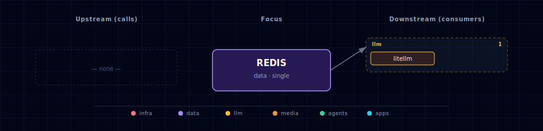

# Redis

Shared cache, queue, and pub/sub broker for the stack. The manifest comment is blunt: Redis is "consumed by half the stack." It has one container, one source variant (`container`), no GPU paths, and no init container. Despite being infrastructure rather than a feature, Redis is the single most cross-cutting service in the project — n8n's queue mode, Kong's rate-limit cache, Open WebUI's WebSocket store, the backend's session/queue layer, and (eventually) Local Deep Researcher's LangGraph checkpointer all share this one instance.

The stack convention partitions Redis by **database index**, not by service. Database `/0` is the default for backend; `/1` is reserved (n8n queue), `/2` for Open WebUI WebSocket, `/3` for Local Deep Researcher checkpoints, `/4` for Kong rate-limit cache. Consumers that need an isolated namespace build their own connection string off `${REDIS_PASSWORD}` and `redis:6379/<db>`.

## 1. Overview

Image: `redis:7.2-alpine`. Persistence: AOF (`--appendonly yes`). Auth: a single shared password (`REDIS_PASSWORD`) — there are no ACL users today. The container exposes the standard `6379` port internally; the host port (default `63021`) is published only for debugging. Inside the stack, every consumer talks to `redis:6379` via the Docker DNS name on `backend-network`.

Volume: `${PROJECT_NAME}-redis-data` (AOF append log). `./stop.sh --cold` removes it.

## 2. Access

| Path | URL | Notes |
|---|---|---|
| Host (debug) | `localhost:${REDIS_PORT}` (default `63021`) | Use with `redis-cli -h 127.0.0.1 -p 63021 -a "$REDIS_PASSWORD"`. |
| Internal | `redis://:${REDIS_PASSWORD}@redis:6379/<db>` | What sibling containers use. |
| Kong | — | Redis is infrastructure; no Kong route. |

Canonical port table: [Ports and Routes](../../docs/deployment/ports-and-routes.md).

## 3. Configuration

```bash
REDIS_SOURCE=container                                 # only value
REDIS_PORT=63021                                       # host port; container port is always 6379
REDIS_PASSWORD=redis_password                          # rotate before any deployment
REDIS_URL=redis://:${REDIS_PASSWORD}@redis:6379/0      # default; consumers override db index
```

The default `REDIS_PASSWORD` is for fresh-install convenience only — rotate it via `.env` and `docker compose up --force-recreate redis` (cascades to dependent services, which read `REDIS_PASSWORD` at startup).

Database-index convention (consumer-built URLs):

| DB | Consumer | Notes |
|---|---|---|
| 0 | backend | session/queue |
| 1 | n8n | queue mode |
| 2 | open-webui | WebSocket store |
| 3 | local-deep-researcher | reserved for LangGraph checkpointer (not yet wired) |
| 4 | kong | rate-limit cache |

## 4. Architecture & wiring

**Startup ordering.** Compose-level `depends_on` waits on `supabase-db-init: { condition: service_completed_successfully }`. This is purely a startup ordering hack so Redis starts after the Postgres init is done — there is no functional Postgres dependency.

**Consumers.** From the data-flow graph: `litellm` (cache + budget tracking) and `backend` (session/queue/LangMem locks) call Redis directly today. n8n, Kong, Open WebUI, and Local Deep Researcher consume Redis via their compose `REDIS_URL`/`KONG_REDIS_HOST`/`WEBSOCKET_REDIS_URL` env wiring, which the data-flow model treats as compose-level wiring rather than a runtime call.

**Failure mode.** Every consumer treats Redis as fatal: a Redis outage kills n8n queue execution, drops Open WebUI live updates, breaks LiteLLM caching, and stops LangMem consolidation. There is no fallback in the stack.

**Eviction policy.** Currently unset — Redis runs with the default `noeviction`. For the AOF-only durable use cases (n8n queue, sessions) this is fine; for cache-style consumers (embedding cache, doc-processor cache) it is wrong. See Future — Unused features below.

**Observability sidecar (`redis-exporter`).** The Redis family also ships a `redis-exporter` container (`oliver006/redis_exporter:v1.62.0`) on host port `${REDIS_EXPORTER_PORT}` and in-container `9121`. It scales **1↔0 with `PROMETHEUS_SOURCE`** — the bootstrapper's `_generate_prometheus_config()` hook writes `REDIS_EXPORTER_SCALE` from this single switch, so the sidecar is dormant when Prometheus is off and self-starts when Prom is enabled. Prometheus scrapes it at `redis-exporter:9121/metrics`; the `Postgres + Redis` Grafana dashboard renders memory usage, ops/sec, and hit ratio.

## 5. Dependencies & Integrations

> Auto-generated section — the **Current** subsections are derived from `services/redis/service.yml`'s `data_flow.calls` field (and inverse passes). Re-run `python -m bootstrapper.docs.regen redis` after manifest changes.

### 5.1 Current — Upstream (this service calls)

_No upstream calls._

### 5.2 Current — Downstream (services that call this)

| Service | Category |
|---|---|
| prometheus | infra |
| litellm | llm |
| airflow | agents |

### 5.3 Architecture diagram



[Open the interactive HTML diagram](./architecture.html) for a full-screen view.

### 5.4 Future — Missing pair integrations

- **redis ↔ comfyui** — *Why:* ComfyUI's compose declares `depends_on: redis` (startup ordering only) but the container receives no `REDIS_URL`. A real link would let n8n/backend enqueue generation jobs to a Redis list/stream and read `progress`/`executed` events back via a sidecar publisher, replacing the per-caller websocket pattern. *Mechanism:* ComfyUI custom node + `redis-py` writing `XADD comfyui:events` on progress; producers `BLPOP comfyui:jobs` from a tiny worker that calls `/prompt`. *Effort:* medium. *Confidence:* medium.
- **redis ↔ local-deep-researcher** — *Why:* the manifest comment in `services/redis/service.yml` already reserves db `/3` for LDR, but its compose has no `REDIS_URL`. LangGraph's Redis checkpointer would let long-running research runs survive container restarts and let backend stream node-by-node progress. *Mechanism:* `redis://:${REDIS_PASSWORD}@redis:6379/3` consumed by `langgraph.checkpoint.redis.RedisSaver`; `PUBSUB` channel `ldr:run:<id>` for progress. *Effort:* small. *Confidence:* high.
- **redis ↔ hermes** — *Why:* Hermes has no shared state between requests; conversation memory, tool-call rate-limits, and per-user budget counters live in process. *Mechanism:* Hermes custom skill reads/writes `hermes:session:<id>` hashes and `hermes:ratelimit:<user>` counters via `redis-py`. *Effort:* small. *Confidence:* medium.
- **redis ↔ doc-processor** — *Why:* document parsing is expensive and idempotent on file SHA. A Redis cache keyed on `sha256(file)` lets repeat ingests (common during n8n flow iteration) short-circuit; a Redis stream broadcasts `doc:parsed` events to backend + weaviate ingest. *Mechanism:* cache: `SETEX doc:parsed:<sha> 86400 <json>`; event bus: `XADD doc:events`. *Effort:* small. *Confidence:* medium.
- **redis ↔ weaviate** — *Why:* embedding generation dominates ingest latency; a content-hash → vector cache cuts repeat-ingest cost dramatically and de-duplicates concurrent embeddings across n8n/backend. *Mechanism:* `GET emb:<model>:<sha>` before calling Weaviate's vectorizer; `SETEX` on miss. Lives behind a tiny helper in backend. *Effort:* medium. *Confidence:* medium.

### 5.5 Future — Candidate new services

- **RedisInsight** ([details](../../docs/research/candidates/redisinsight.md)) — *Headline:* official Redis GUI for browsing keys, profiling commands, and inspecting streams across all stack consumers. *Wires into:* backend, n8n, kong, litellm, open-webui, jupyterhub.
- **Redis Stack (`redis-stack-server`)** ([details](../../docs/research/candidates/redis-stack.md)) — *Headline:* drop-in Redis image bundling RediSearch, RedisJSON, RedisBloom, and RedisTimeSeries — unlocks vector + JSON queries without a second datastore. *Wires into:* backend, weaviate (overlap), n8n, hermes.

### 5.6 Future — Unused features in this service

- **Redis Streams (`XADD`/`XREAD`/consumer groups)** — *Why pursue:* replace ad-hoc HTTP fan-out between backend, n8n, ComfyUI, and doc-processor with a single durable event bus already present in the image. *Effort:* medium.
- **Pub/Sub channels** — *Why pursue:* live progress streaming for ComfyUI and LDR to the Open WebUI chat surface without polling. *Effort:* small.
- **Redis ACL users** — *Why pursue:* replace the single shared `REDIS_PASSWORD` with per-service users so a compromised n8n container cannot read the Kong rate-limit cache. *Effort:* small.
- **`maxmemory` + eviction policy** — *Why pursue:* cache use-cases (embedding cache, doc cache) need `allkeys-lru`; currently unbounded. *Effort:* small.
- **RDB snapshots alongside AOF** — *Why pursue:* faster cold-start restore; current `--appendonly yes` is durable but slow to replay on large datasets. *Effort:* small.

## 6. Troubleshooting

**`NOAUTH Authentication required`.** Consumer's `REDIS_URL` is missing the password segment. Inspect with `docker exec <project>-backend env | grep REDIS_URL`. Expected shape: `redis://:${REDIS_PASSWORD}@redis:6379/<db>` — note the leading colon before the password (no username).

**n8n `EXECUTIONS_MODE=queue` workflows hang.** Check `docker logs <project>-redis` for connection errors from n8n. n8n's queue mode requires Redis on db `/1`; if the password rotated without restarting n8n, its workers retry forever.

**Memory pressure.** With no `maxmemory` set, Redis grows until the container's memory limit kills it. For now, monitor with `docker exec <project>-redis redis-cli -a "$REDIS_PASSWORD" INFO memory` and bounce the container if needed. Set `maxmemory` + `maxmemory-policy allkeys-lru` if growth becomes load-bearing.

**Data loss after `./stop.sh --cold`.** Expected — `--cold` deletes the `${PROJECT_NAME}-redis-data` volume, taking the AOF log with it. Use `./stop.sh` (no `--cold`) to preserve queue/session state across restarts.

```bash
docker compose ps redis
docker compose logs -f redis
docker exec <project>-redis redis-cli -a "$REDIS_PASSWORD" INFO server
```

For general startup and routing issues, see [Troubleshooting](../../docs/quick-start/troubleshooting.md).

## 7. Operations

**Inspect keys by namespace.** Consumers use unstructured key names today; useful prefixes to scan are `bull:` (n8n queue), `litellm:` (caching/budget), `langmem:` (backend memory locks), `kong:` (rate-limit counters). Scan with `redis-cli --scan --pattern 'bull:*'` — never `KEYS` on a busy instance.

**Watch traffic live.** `redis-cli MONITOR` dumps every command server-side. Useful when verifying a new consumer is connecting to the right db index. Verbose — turn off as soon as you're done.

**Force AOF rewrite.** `BGREWRITEAOF`. After heavy churn the AOF grows non-linearly; a rewrite compacts it. Safe to run any time.

**Cold-start vs warm-start.** `./stop.sh` (no flags) preserves the AOF and Redis replays it on next boot — n8n queue + sessions survive. `./stop.sh --cold` deletes the volume entirely.

**Capacity rule of thumb.** With AOF and no `maxmemory`, the container OOMs at the Docker memory limit. The stack default is whatever Docker Desktop allocates (~2 GB). For production deployments, set `maxmemory` explicitly to ~75% of the container's memory budget and pick an eviction policy per workload.

## 8. Tuning

Stack-relevant knobs that aren't currently exposed via `.env`:

| Knob | Default | Recommended for stack |
|---|---|---|
| `maxmemory` | unbounded | 75% of container memory budget |
| `maxmemory-policy` | `noeviction` | `allkeys-lru` for cache workloads; keep `noeviction` only if AOF durability matters more than uptime |
| `appendfsync` | `everysec` | leave as-is; `always` is overkill, `no` loses queue state on crash |
| `save` (RDB) | disabled | enable for faster cold-start replay |

To change these today, edit the `command:` line in `services/redis/compose.yml`. Adding them to `service.yml` as proper env vars is a small future change.

## 9. Security

- **Shared password.** Every consumer uses the same `REDIS_PASSWORD`. A compromised n8n container can read Kong's rate-limit cache, LiteLLM's budget counters, and backend sessions. Redis 7 ACLs would fix this — see Future — Unused features.
- **No TLS in-cluster.** Traffic on `backend-network` is unencrypted. Acceptable for the single-host stack; not for multi-host deployments. Wrap with `stunnel` or upgrade to a Redis variant with native TLS if you cross trust boundaries.
- **Host port exposed.** `REDIS_PORT` (default 63021) is published on the host. With the default password this is a soft target if anyone has LAN access. Either rotate `REDIS_PASSWORD` aggressively or remove the host-port publish from `services/redis/compose.yml` and use `docker exec` for debugging.
- **AOF includes commands, not just data.** `appendonly.aof` is a literal command log; anyone with read access to the volume can reconstruct every key. Treat the volume as confidential.

## 10. Further reading

- [Redis commands reference](https://redis.io/commands/) — the canonical command index, organized by data type.
- [Redis persistence](https://redis.io/docs/latest/operate/oss_and_stack/management/persistence/) — AOF vs RDB trade-offs, useful when tuning the stack's defaults.
- [BullMQ on Redis](https://docs.bullmq.io/) — n8n's queue layer; explains the `bull:*` key shape.
- [LiteLLM caching](https://docs.litellm.ai/docs/caching/all_caches) — Redis cache integration LiteLLM uses (see the candidate list above for enabling it).
