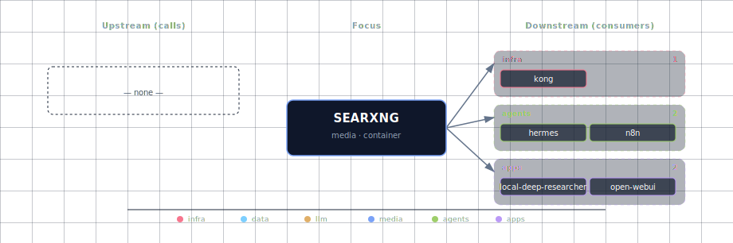

# SearXNG

Privacy-preserving metasearch engine. SearXNG aggregates results from 200+ upstream engines (Google, Bing, DuckDuckGo, Brave, Wikipedia, arXiv, Crossref, etc.) without keeping logs, fingerprinting users, or sending API keys. The stack uses it as the default search backend for Local Deep Researcher, Hermes, Open WebUI's "Web Search" toggle, and n8n's seeded `searxng-research-workflow.json`.

The container runs `searxng/searxng:2026.6.28-357662d86`. `services/searxng/config/settings.yml` is a **thin override** on the image's default settings (`use_default_settings`): it enables JSON output (so results are machine-readable) and drops the Tor-only engines (`ahmia`/`torch`, which need a Tor proxy the stack doesn't wire). Everything else — the full engine list with version-matched per-engine config, public-instance mode off, metrics on, `server.limiter: false`, `valkey.url: false` (no Redis/Valkey store) — is inherited from the image default. `SEARXNG_SECRET` is applied via the SearXNG-native env var (set in compose), not written into the file.

> **Why a thin override, not a fork:** a full forked `settings.yml` carries the entire ~250-engine list and drifts from the pinned image on every bump — engines lose their modules (`Cannot load engine …`) or change config APIs (`Engine setup was not successful`), spamming startup errors. `use_default_settings` inherits the image's correct config and ends the drift; we override only JSON output + the Tor-engine removal.

## 1. Overview

Image: `searxng/searxng:2026.6.28-357662d86`. Container port: `8080`. Source variants: `container` or `disabled`. Configuration is split between `service.yml` env vars (consumed by the bootstrapper to substitute into compose) and the static `settings.yml` (a thin `use_default_settings` override consumed by SearXNG itself). `SEARXNG_SECRET` reaches SearXNG via the `SEARXNG_SECRET` container env var (SearXNG overrides `server.secret_key` from it natively) — nothing templates the file at startup.

## 2. Access

| Path | URL | Notes |
|---|---|---|
| Direct | `http://localhost:${SEARXNG_PORT}` (default `63043`) | Web UI + `/search` API. |
| Kong | `http://search.localhost:${KONG_HTTP_PORT}` | Browser-friendly; needs `./start.sh --setup-hosts`. |
| Internal | `http://searxng:8080/search` | What sibling containers call (LDR, n8n, Hermes, Open WebUI). |
| JSON API | `GET /search?q=…&format=json` | Enabled in `settings.yml`; used by every machine consumer. |

Canonical port table: [Ports and Routes](../../docs/deployment/ports-and-routes.md).

## 3. Configuration

```bash
SEARXNG_SOURCE=container             # container | disabled
SEARXNG_PORT=63043                   # computed by topology.py
SEARXNG_SECRET=                      # auto-generated by bootstrapper; rotate by clearing + restart
```

> **Note on public-instance hardening + metrics + locale:** these knobs are
> NOT yet wired to live config. Earlier versions surfaced
> `SEARXNG_PUBLIC_INSTANCE`, `SEARXNG_ENABLE_METRICS`, and
> `SEARXNG_DEFAULT_LOCALE` in `.env.example` but `config/settings.yml`
> carries literal values for those settings — flipping the env vars
> changed nothing. To actually harden a public-facing SearXNG instance
> today, edit `config/settings.yml` directly (`server.public_instance:
> true`, `general.enable_metrics: true`, `search.default_lang:
> <locale>`). A future spec will template `settings.yml` at startup
> (envsubst init step) so the env-var path becomes load-bearing.

Static config at `services/searxng/config/settings.yml` — a **thin `use_default_settings` override**. Only the two stack-specific overrides live here; everything else is inherited from the image's version-matched default:

- `search.formats: [html, json]` — JSON enabled (it's HTML-only by default) so LDR/n8n/Hermes/backend can parse responses.
- `use_default_settings.engines.remove: [ahmia, torch]` — drop the Tor-only engines (they need a Tor proxy the stack doesn't wire, and otherwise fail engine setup at boot).

Inherited from the default (no longer forked here): the full engine list with correct per-engine config (POST search method, `image_proxy: false`, outgoing timeouts, scholarly engines like arXiv/Crossref/OpenAlex/PubMed/Semantic Scholar shipping default-off, etc.). To tweak a single engine, add a minimal `engines:` entry — SearXNG merges it over that engine's default — instead of re-forking the whole list.

**Required hard dependencies** (`depends_on.required`): `redis` — **ordering/slot-pinning only**. SearXNG runs with `valkey.url: false` (no Redis/Valkey traffic) and compose no longer gates startup on redis; the manifest entry remains because the topology port allocator derives slot positions from `depends_on` (removing it would renumber later services' ports). Re-enabling the limiter store means pointing `valkey.url` at `redis` and restoring the compose gate.

## 4. Architecture & wiring

**Request flow:** caller (LDR, Hermes, n8n, Open WebUI, or browser) → `http://searxng:8080/search?q=…&format=json` → SearXNG dispatches to enabled engines in parallel → aggregates and de-duplicates → JSON array of `{url, title, content, engine, score}` back to caller.

**No per-engine API keys required** for the default set (DuckDuckGo, Bing, Brave, Wikipedia, Stack Exchange, GitHub). Some engines (Google search) need cookies SearXNG manages internally; some (Google Scholar) work without.

**Trusted-proxy concern.** SearXNG's bot detection trusts only configured proxies for `X-Forwarded-For`. The stack's `config/limiter.toml` sets `botdetection.trusted_proxies` to the three RFC1918 ranges (so any Docker bridge network qualifies) and adds `pass_ip` entries for loopback and the same private ranges, which is how n8n / LDR / backend requests pass through cleanly even when the limiter is later enabled.

**Consumers (data-flow downstream):** Kong, Hermes, n8n, Local Deep Researcher, JupyterHub (SEARXNG_URL in the notebook env), Open WebUI. The data-flow graph doesn't list Open WebUI today because the upstream-supported web-search toggle is wired off — flipping `ENABLE_RAG_WEB_SEARCH=true` and `RAG_WEB_SEARCH_ENGINE=searxng` adds Open WebUI as a runtime caller.

**Volumes / state.** No persistent volumes — SearXNG is stateless. Restarts are instant.

## 5. Dependencies & Integrations

> Auto-generated section — the **Current** subsections are derived from `services/searxng/service.yml`'s `data_flow.calls` field (and inverse passes). Re-run `python -m bootstrapper.docs.regen searxng` after manifest changes.

### 5.1 Current — Upstream (this service calls)

_No upstream calls._

### 5.2 Current — Downstream (services that call this)

| Service | Category |
|---|---|
| kong | infra |
| hermes | agents |
| n8n | agents |
| jupyterhub | apps |
| local-deep-researcher | apps |

### 5.3 Architecture diagram



[Open the interactive HTML diagram](./architecture.html) for a full-screen view.

### 5.4 Future — Missing pair integrations

- **searxng ↔ open-webui** — *Why:* Open WebUI ships a first-class "Web Search" toggle naming SearXNG as a supported provider, but no env vars are set in `services/open-webui/service.yml` — chat sessions have no live-web grounding without the side-loaded `research_tool.py` extra. *Mechanism:* add `searxng` to `runtime_adaptive.open-web-ui.adapts_to`; set `ENABLE_RAG_WEB_SEARCH=true`, `RAG_WEB_SEARCH_ENGINE=searxng`, `SEARXNG_QUERY_URL=http://searxng:8080/search?q=<query>` when `SEARXNG_SOURCE != disabled`. *Effort:* small. *Confidence:* high.
- **searxng ↔ n8n** — *Why:* the repo ships `services/n8n/init/config/searxng-research-workflow.json` that calls `http://searxng:8080/search`, but n8n's manifest does not declare searxng in `runtime_deps.optional`. If the user disables SearXNG, the workflow imports fine and silently 404s on first run. *Mechanism:* add `searxng` to `services/n8n/service.yml` `runtime_deps.n8n.optional`; emit an info_message; optionally add the `n8n-nodes-langchain.toolSearXng` sub-node. *Effort:* small. *Confidence:* high.
- **searxng ↔ weaviate** — *Why:* SearXNG results are ephemeral — every query re-hits external engines. Caching top-N hits in a Weaviate class lets backend / Hermes do hybrid retrieval over "what we've already searched" without re-burning engine quota or tripping CAPTCHAs. *Mechanism:* small fetcher calls `GET http://searxng:8080/search?format=json`, then POSTs each hit to `http://weaviate:8080/v1/objects` in a `WebSearchResult` class. *Effort:* medium. *Confidence:* medium.
- **searxng ↔ comfyui** — *Why:* SearXNG's image category returns direct image URLs. ComfyUI workflows wanting a reference image for img2img currently require users to paste URLs by hand; an n8n bridge closes that loop. *Mechanism:* n8n HTTP Request → `searxng:8080/search?q=<q>&categories=images&format=json` → pipe top URL into ComfyUI's `LoadImage` node via `/prompt`. *Effort:* medium. *Confidence:* medium.

### 5.5 Future — Candidate new services

- **Perplexica** ([details](../../docs/research/candidates/perplexica.md)) — *Headline:* self-hosted Perplexity-style AI answering engine that consumes SearXNG + an OpenAI-compatible LLM (LiteLLM). *Wires into:* searxng, litellm, ollama, kong.
- **Browserless** ([details](../../docs/research/candidates/browserless.md)) — *Headline:* headless-Chrome service that renders the JS-heavy URLs SearXNG returns so doc-processor/weaviate get the actual page text. *Wires into:* n8n, doc-processor, backend.

### 5.6 Future — Unused features in this service

- **`open_metrics` Prometheus endpoint** — *Why pursue:* `settings.yml` leaves `open_metrics: ''`, so `/metrics` is disabled. Engine-latency and error-rate stats are a near-free win for any future Prometheus sidecar. *Effort:* small.
- **`image_proxy: true`** — *Why pursue:* currently off; turning it on (or wiring `SEARXNG_IMAGE_PROXY`) lets ComfyUI / Open WebUI fetch image results without third-party-host 403s, at the cost of RAM. *Effort:* small.
- **Scholarly engines (arXiv, Crossref, OpenAlex, PubMed, Semantic Scholar)** — *Why pursue:* enabling them upgrades LDR/Hermes from general-web to scholarly search. *Effort:* small.
- **`limiter: true` with Redis/Valkey bot detection** — *Why pursue:* the stack ships a Redis the limiter could use, but nothing is wired today (`valkey.url: false`, no startup dependency). Enabling means pointing `valkey.url` at `redis://redis:6379` AND restoring the compose/manifest dependency in one change. *Effort:* small.
- **JSON-RPC `engines=` filter exposure** — *Why pursue:* Open WebUI/Hermes call `/search` with no engine pinning, so a slow/failing engine drags p99. Pass `engines=duckduckgo,brave` from callers. *Effort:* small.

## 6. Troubleshooting

**`/search?format=json` returns HTML.** This happens only if `json` was removed from the `server.formats:` list in `settings.yml` (the shipped default already includes it: `[html, json]`). Restore it, or rebuild from `services/searxng/config/settings.yml`.

**`429 Too Many Requests` from a single upstream engine.** Engine-side rate-limit, not SearXNG's. The aggregator silently drops that engine for the query; results shrink. Either wait or disable the offending engine in `settings.yml`.

**Image results 403 on click.** Third-party host blocks hotlinking; enable `image_proxy: true` (or wire `SEARXNG_IMAGE_PROXY`) so SearXNG proxies the byte stream.

**Open WebUI's web-search toggle does nothing.** Expected today — the wiring is one of the high-confidence future integrations above. The `research_tool.py` extra is the current workaround.

**LDR / Hermes get empty results.** Check that the engines they request via `engines=` (if any) are enabled in `settings.yml`. Default-off scholarly engines return 200 with `[]` if unconfigured.

```bash
docker compose ps searxng
docker compose logs -f searxng
curl -s "http://localhost:${SEARXNG_PORT}/search?q=test&format=json" | jq '.results[0]'
```

For general startup and routing issues, see [Troubleshooting](../../docs/quick-start/troubleshooting.md).

## 7. Operations

**Add or remove an engine.** Edit the `engines:` block in `services/searxng/config/settings.yml` and restart SearXNG. Each engine row supports `disabled: true/false`, per-engine `timeout:`, `categories:`, and engine-specific options (e.g. `language:` for Wikipedia).

**Pin engines per query.** Pass `engines=duckduckgo,brave` in the URL. Callers (LDR, Hermes, Open WebUI) currently don't, which lets a slow engine drag the p99; pinning to two fast engines per call shaves latency dramatically.

**Inspect the live engine selection.** `GET /preferences` returns the current per-engine state. Useful when a result set looks too narrow.

**Rotate the secret.** Delete `SEARXNG_SECRET` from `.env` and re-run `./start.sh` — the bootstrapper regenerates it and rewrites `settings.yml`. Existing user-saved preferences (cookies signed by the old secret) are invalidated.

**Public-instance mode.** SearXNG's upstream `public_instance: true` setting turns on additional anti-abuse defaults (engine throttling, captcha hints) intended for instances that face the open internet. Edit `config/settings.yml` directly to enable it (see §3 Note about why the matching env var is not wired today). Leave off for stack-internal use.

## 8. Performance notes

SearXNG aggregates upstream engines in parallel; aggregate latency tracks the slowest engine in the selected set, not the average. Practical implications:

- **Two-engine queries are 5-10× faster than 10-engine queries.** Default-on engine list is reasonable for browser UX but wasteful for machine consumers; pinning `engines=duckduckgo,brave` (or similar) per call is recommended.
- **Image search is slower than text** because the image-result aggregation includes byte-fetch checks. Combined with `image_proxy: false`, you can get a fast response with URLs that 403 on click.
- **JSON output is faster than HTML.** No template render path. Machine consumers should always pass `format=json`.

## 9. Security & privacy

- **No request logging.** SearXNG's design is to forget queries the moment a response goes out. The stack doesn't override that — there are no access logs to scrape and no per-user query history.
- **Engine selection sets your exposure.** Default-on engines include Google, Bing, Brave (commercial trackers as upstreams). The privacy story is "SearXNG hides *you* from them" via no-referrer + IP-from-server, not "no commercial engine sees your query." If that matters, prune the engines list to privacy-aligned upstreams (DuckDuckGo, Mojeek, Brave's privacy-flag mode).
- **No outbound proxy by default.** SearXNG calls each engine directly from its container. To route engine calls through Tor or another proxy, set `outgoing.proxies:` in `settings.yml`.
- **Public-instance hardening.** If you must expose SearXNG to the internet, edit `config/settings.yml` directly: set `server.public_instance: true` AND `server.limiter: true` (after wiring `valkey.url` at the stack Redis — nothing is wired today) AND open the Kong route. Without the limiter, the instance becomes an open relay for engine abuse. See §3 for why the env-var path isn't wired today.

## 10. Further reading

- [SearXNG documentation](https://docs.searxng.org/) — admin + dev reference; covers `settings.yml`, engine configuration, and the limiter plugin.
- [SearXNG search API](https://docs.searxng.org/dev/search_api.html) — exact request/response shape for `/search`.
- [Engine settings reference](https://docs.searxng.org/admin/settings/settings_engines.html) — every engine's tunable knobs, useful when enabling scholarly engines.
- [Botdetection / limiter](https://docs.searxng.org/admin/searx.botdetection.html) — explains the Redis/Valkey-backed limiter (not wired in this stack; see §3).
