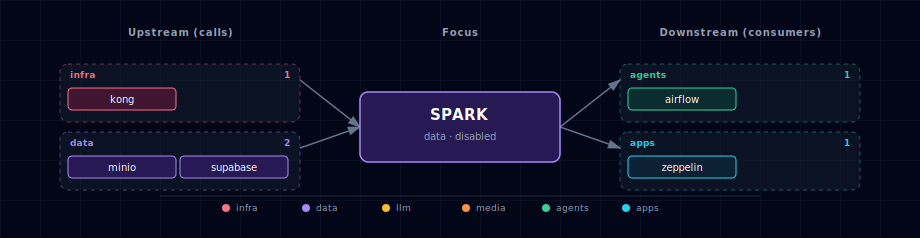

# Apache Spark (standalone cluster)

Spark runs as a 4-container family in the stack's `data` band: `spark-master`, `spark-worker` (replicas via `SPARK_WORKER_COUNT`), `spark-history`, and `spark-init` (a vanilla-alpine init that creates the MinIO bucket on first start).

## 1. Overview

Image: `apache/spark:4.1.2` (Apache 2.0; the upstream Apache image). Standalone mode — no YARN, no Kubernetes. Each role (master, worker, history) is launched with an explicit `/opt/spark/bin/spark-class` command in `services/spark/compose.yml` since `apache/spark` doesn't carry the `SPARK_MODE=master|worker|history` env-driven entrypoint that Bitnami used to ship. Spark Connect (gRPC) is enabled on port `15002` so Zeppelin and external clients can submit jobs via the modern `sc://spark-master:15002` URL.

> **Note on image choice:** earlier drafts of this service pinned `bitnami/spark:4.1.2`. Bitnami's image library moved behind the Broadcom paywall in 2025; no public 4.x tag exists today. `apache/spark` is the upstream-maintained alternative.

## 2. Access

| Surface | URL | Auth |
|---|---|---|
| Master UI (direct) | `http://localhost:${SPARK_MASTER_UI_PORT}` | None |
| Master UI (Kong) | `http://spark.localhost:${KONG_HTTP_PORT}` | None |
| History UI (direct) | `http://localhost:${SPARK_HISTORY_PORT}` | None |
| History UI (Kong) | `http://spark-history.localhost:${KONG_HTTP_PORT}` | None |
| Spark Connect | `sc://spark-master:15002` | None — backend-network only |
| Master RPC | `spark://spark-master:7077` | None — backend-network only |

## 3. Configuration

```bash
SPARK_SOURCE=disabled              # container | disabled
SPARK_IMAGE=apache/spark:4.1.2
SPARK_MASTER_UI_PORT=              # auto-assigned by topology (data band)
SPARK_HISTORY_PORT=                # auto-assigned
SPARK_WORKER_COUNT=2               # 1-8 (wizard prompts via SecondaryNumberInput)
```

## 4. Integration with the stack

- **MinIO** — `spark-history` reads `s3a://spark-history/` for event logs. The `spark-init` container creates the bucket on first start (idempotent).
- **Supabase Postgres** — Spark JDBC connector available; users add `--jars postgresql.jar` and point at `jdbc:postgresql://supabase-db:5432/${SUPABASE_DB_NAME}`. No pre-wired connection.
- **Zeppelin** — Zeppelin's Spark interpreter points at `spark://spark-master:7077` and `sc://spark-master:15002`. See `services/zeppelin/README.md` (added in the same PR).
- **Airflow** — Airflow's `spark_default` Connection is seeded by `airflow-init` when `SPARK_SOURCE=container`. The provided `example_etl_with_llm.py` DAG uses `SparkSubmitOperator`. See `services/airflow/README.md` (added in the same PR).
- **Prometheus + Grafana** — deferred. Spec §5.1 marks Spark × Prometheus + Grafana as CRITICAL-opt-in (JMX exporter sidecar + scrape job + `spark.json` dashboard), but the implementation is not yet wired. Tracking as a follow-up; for now use cAdvisor's container-level metrics in the existing Grafana dashboards.

## 5. Dependencies & Integrations

> Auto-generated section — the **Current** subsections are derived from `services/spark/service.yml`'s `data_flow.calls` field (and inverse passes). Re-run `python -m bootstrapper.docs.regen spark` after manifest changes.

### 5.1 Current — Upstream (this service calls)

| Service | Category |
|---|---|
| minio | data |
| supabase | data |

### 5.2 Current — Downstream (services that call this)

| Service | Category |
|---|---|
| airflow | agents |
| zeppelin | apps |

### 5.3 Architecture diagram



[Open the interactive HTML diagram](./architecture.html) for a full-screen view.

### 5.4 Future — Missing pair integrations

_No high-confidence opportunities identified._

### 5.5 Future — Candidate new services

_No high-confidence opportunities identified._

### 5.6 Future — Unused features in this service

_No high-confidence opportunities identified._

## 6. Troubleshooting

- **History UI shows no jobs** — confirm the spark-history bucket exists in MinIO (`mc ls minio/spark-history`). The `spark-init` container should have created it. If empty, check `spark-init` logs.
- **Workers don't appear in the master UI** — Compose's `depends_on: spark-master: condition: service_healthy` should serialize this. If a worker stays "lost", check `docker logs ${PROJECT_NAME}-spark-worker-1`.
- **OOM in a worker** — Spark workers are unbounded by default. Set `SPARK_WORKER_MEMORY=4G` in the container env block for production use.
- **Spark Connect refused** — port 15002 is backend-network-only; Zeppelin should hit `sc://spark-master:15002` directly. Don't expose 15002 to the host.
