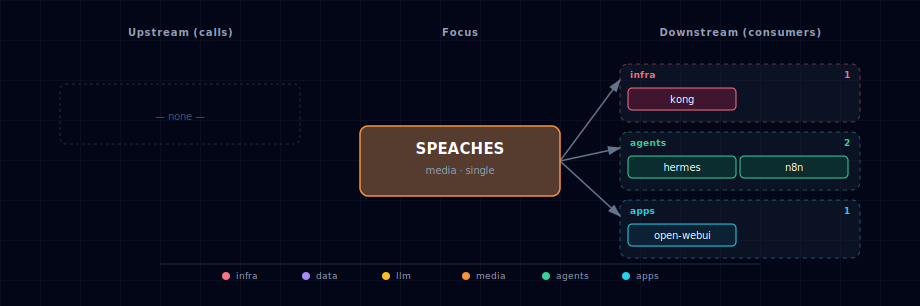

# Speaches (unified TTS + STT engine)

Speaches is a dual-role engine — one container exposes both
`/v1/audio/transcriptions` (STT, Faster-Whisper) and `/v1/audio/speech`
(TTS, Kokoro + Piper voices). It is selectable via either
`STT_PROVIDER_SOURCE=speaches-*` or `TTS_PROVIDER_SOURCE=speaches-*`. When both
roles pick a Speaches variant, the bootstrapper dedupes to one running
container.

It is documented under both aggregators:

- → See [services/stt-provider/README.md](../stt-provider/README.md) for STT.
- → See [services/tts-provider/README.md](../tts-provider/README.md) for TTS.

## 1. Engine quick reference

- **Images:**
  - CPU: `ghcr.io/speaches-ai/speaches:0.9.0-rc.3-cpu`
  - GPU: `ghcr.io/speaches-ai/speaches:0.9.0-rc.3-cuda`
- **License:** MIT
- **Activation:** any of
  - `STT_PROVIDER_SOURCE=speaches-container-cpu`
  - `STT_PROVIDER_SOURCE=speaches-container-gpu`
  - `TTS_PROVIDER_SOURCE=speaches-container-cpu`
  - `TTS_PROVIDER_SOURCE=speaches-container-gpu`
- **In-container port:** 8000
- **Host port:** `${SPEACHES_PORT}` (computed from `BASE_PORT`)

The manifest (`service.yml`) and compose fragment (`compose.yml`) in this folder
are the bootstrapper's source of truth for those values; treat this README as a
pointer, not a duplicate of the aggregator docs.

## 2. Dependencies & Integrations

> Auto-generated section — the **Current** subsections are derived from `services/speaches/service.yml`'s `data_flow.calls` field (and inverse passes). Re-run `python -m bootstrapper.docs.regen speaches` after manifest changes.

### 2.1 Current — Upstream (this service calls)

_No upstream calls._

### 2.2 Current — Downstream (services that call this)

| Service | Category |
|---|---|
| kong | infra |
| hermes | agents |
| n8n | agents |
| open-webui | apps |

### 2.3 Architecture diagram

[Open the interactive HTML diagram](./architecture.html) for a full-screen view.

### 2.4 Future — Missing pair integrations

_No high-confidence opportunities identified._

### 2.5 Future — Candidate new services

_No high-confidence opportunities identified._

### 2.6 Future — Unused features in this service

_No high-confidence opportunities identified._
