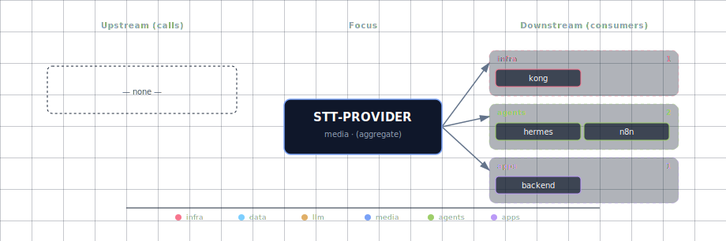

# STT Provider

Pluggable speech-to-text layer. All backends speak the OpenAI
`/v1/audio/transcriptions` protocol.

## 1. Source matrix

| `STT_PROVIDER_SOURCE` | Engine | Container image | License | Hardware |
|---|---|---|---|---|
| `speaches-container-cpu` (default) | Speaches → Faster-Whisper | `ghcr.io/speaches-ai/speaches:0.9.0-rc.3-cpu` | MIT | Linux + macOS Docker, CPU |
| `speaches-container-gpu` | Speaches → Faster-Whisper | `ghcr.io/speaches-ai/speaches:0.9.0-rc.3-cuda` | MIT | NVIDIA |
| `parakeet-container-gpu` | NVIDIA Parakeet-TDT (NeMo) | (built from `services/parakeet/provider/gpu/Dockerfile`) | CC-BY-4.0 | NVIDIA |
| `parakeet-localhost` | Parakeet-MLX (Mac) or native Parakeet | — | NVIDIA Open Model | macOS MLX / Linux |
| `whisper-cpp-localhost` | whisper.cpp | — (`brew install whisper-cpp`) | MIT | macOS Metal+ANE / Linux |
| `disabled` | — | — | — | — |

Speaches shares its container with the TTS provider when both are speaches —
one running instance, two endpoints. If TTS picks one variant and STT picks
the other (e.g. cpu vs gpu), GPU wins and the bootstrapper prints a notice.

## 2. Engine comparison

| | Speaches (Faster-Whisper distil-large-v3) | Parakeet-TDT v3 | whisper.cpp (large-v3) |
|---|---|---|---|
| English WER (LibriSpeech test-clean) | ~3.5% | ~3.0% | ~3.8% |
| Multilingual | 99 langs | 25 EN/EU langs | 99 langs |
| Realtime factor on Apple Silicon | ~0.3× CPU container | ~0.003× MLX | ~0.1× Metal+CoreML |
| Realtime factor on NVIDIA | ~0.05× (RTX 4090) | ~0.0003× (A100) | ~0.05× (CUDA) |
| Word-level timestamps | ✅ | ✅ | ✅ |
| Streaming | partial (chunked) | ✅ (TDT) | ✅ |

Speaches is the default because Faster-Whisper-distil-large-v3 has the best
"works on every platform out of the box" profile. Parakeet remains the
SOTA-quality NVIDIA choice. whisper.cpp is the best macOS-native path.

## 3. Quick start

The default already runs:

```bash
./start.sh
curl -X POST http://localhost:63042/v1/audio/transcriptions \
  -F file=@sample.wav -F model=whisper-1
# expect: {"text":"..."}
```

NVIDIA SOTA (Parakeet):

```bash
./start.sh --stt-provider-source parakeet-container-gpu
```

macOS native — fastest path for Apple Silicon:

```bash
# Option A: whisper.cpp (Metal + Core ML / ANE)
brew install whisper-cpp
bash $(brew --prefix)/share/whisper-cpp/models/download-ggml-model.sh large-v3
whisper-server --host 0.0.0.0 --port 63025 \
  --model "$(brew --prefix)/share/whisper-cpp/models/ggml-large-v3.bin" \
  --inference-path /v1/audio/transcriptions &

./start.sh --stt-provider-source whisper-cpp-localhost

# Option B: Parakeet-MLX (highest quality on EN/EU, MLX-native)
pip install -r services/parakeet/provider/mlx/requirements.txt
cd services/parakeet/provider && python -m uvicorn mlx.api_server:app --host 0.0.0.0 --port 63022 &
./start.sh --stt-provider-source parakeet-localhost
```

See [the whisper-cpp README](../parakeet/provider/whisper-cpp/README.md)
for the whisper.cpp walkthrough and Linux build instructions, or
[the MLX README](../parakeet/provider/mlx/README.md) for Parakeet-MLX.

## 4. Environment variables

| Variable | Default | Notes |
|---|---|---|
| `STT_PROVIDER_SOURCE` | `speaches-container-cpu` | Engine selector. |
| `STT_PROVIDER_PORT` | `63042` | Wizard display port; bootstrapper rewrites to match the active container. |
| `STT_ENDPOINT` | (auto) | Internal URL containers reach STT on. |
| `STT_PROVIDER_SCALE` | (auto) | 1 when any container variant is active. |
| `SPEACHES_STT_MODEL` | `Systran/faster-distil-whisper-large-v3` | HuggingFace repo of the active model. Faster-Whisper accepts any whisper-format checkpoint. |
| `PARAKEET_MODEL` | `nvidia/parakeet-tdt-0.6b-v3` | Or `…-v2` for English-only (slightly faster). |
| `PARAKEET_GPU_IMAGE` | `nvcr.io/nvidia/pytorch:25.01-py3` | Base for the Parakeet GPU Dockerfile. |
| `PARAKEET_LOCALHOST_PORT` | `63022` | Host port where a host-side Parakeet server listens. URL is derived as `http://host.docker.internal:63022`. |
| `WHISPER_CPP_LOCALHOST_PORT` | `63025` | Host port where a host-side whisper.cpp server listens. URL is derived as `http://host.docker.internal:63025`. |
| `HUGGING_FACE_HUB_TOKEN` | (empty) | For gated models. |

## 5. OpenAI-compatible API

Every engine implements the same call shape:

```http
POST http://<endpoint>/v1/audio/transcriptions
Content-Type: multipart/form-data

file=<binary audio>
model=whisper-1
language=en               (optional)
response_format=json      (optional: json, text, srt, verbose_json, vtt)
```

The `model` field is largely ignored — every engine returns whatever
checkpoint is loaded. Pass `whisper-1` for maximum compatibility with the
OpenAI client library.

## 6. Open WebUI integration

The bootstrapper writes:

- `AUDIO_STT_ENGINE=openai`
- `AUDIO_STT_OPENAI_API_BASE_URL=${STT_ENDPOINT}/v1`
- `AUDIO_STT_OPENAI_API_KEY=sk-unused`
- `AUDIO_STT_MODEL=whisper-1`

Open WebUI's microphone button starts working as soon as the STT service is
healthy.

## 7. Supported audio formats

WAV (.wav), FLAC (.flac), MP3 (.mp3), M4A (.m4a), OGG (.ogg), OPUS (.opus),
WEBM (.webm). Internally everything resamples to 16 kHz mono before
inference.

## 8. References

- [Speaches](https://github.com/speaches-ai/speaches)
- [Faster-Whisper](https://github.com/SYSTRAN/faster-whisper)
- [Parakeet-TDT v3 model card](https://huggingface.co/nvidia/parakeet-tdt-0.6b-v3)
- [Parakeet-MLX](https://github.com/senstella/parakeet-mlx)
- [whisper.cpp](https://github.com/ggml-org/whisper.cpp)
- [OpenAI Whisper API spec](https://platform.openai.com/docs/guides/speech-to-text)

## 9. Dependencies & Integrations

> Auto-generated section — the **Current** subsections are derived from `services/stt-provider/service.yml`'s `data_flow.calls` field (and inverse passes). Re-run `python -m bootstrapper.docs.regen stt-provider` after manifest changes.

### 9.1 Current — Upstream (this service calls)

_No upstream calls._

### 9.2 Current — Downstream (services that call this)

| Service | Category |
|---|---|
| kong | infra |
| hermes | agents |
| n8n | agents |

### 9.3 Architecture diagram



[Open the interactive HTML diagram](./architecture.html) for a full-screen view.

### 9.4 Future — Missing pair integrations

- **stt-provider ↔ minio** — *Why:* transcripts vanish with the HTTP response — nothing persists source audio or transcript JSON. Pushing both to MinIO gives every service a stable URL and enables re-transcription on engine swap. *Mechanism:* new `stt-transcripts` bucket provisioned by `minio-init`; post-transcribe hook puts `s3://stt-transcripts/<sha256>.wav` plus sidecar `.json` via S3 SigV4 over `http://minio:9000`. *Effort:* small. *Confidence:* high.
- **stt-provider ↔ weaviate** — *Why:* indexing durable transcripts turns long-form audio (meetings, podcasts, voice notes) into a semantically searchable corpus alongside the docling pipeline. *Mechanism:* `Transcript` class with `text`, `start_ms`, `end_ms`, `source_audio_uri`, vectorized by the active `text2vec-openai` module via `http://weaviate:8080/v1/objects`. *Effort:* medium. *Confidence:* medium.
- **stt-provider ↔ redis** — *Why:* transcription is expensive and deterministic in `(audio-sha256, model, language)`. A cache cuts repeat cost to ~zero for n8n loops, re-runs, demos. *Mechanism:* `redis://redis:6379/2`, key `stt:{sha256}:{model}:{lang}` → transcript JSON, TTL 30d, sidecar wrapper in backend or a Kong plugin in front of `STT_ENDPOINT`. *Effort:* small. *Confidence:* medium.
- **stt-provider ↔ doc-processor** — *Why:* docling parses PDFs/Office docs but does not handle audio. Composing `stt → docling` gives a unified "any media → markdown" ingest. *Mechanism:* caller hits `STT_ENDPOINT`, then POSTs transcript text to `http://docling:5001/v1/convert/source` as `text/plain`. No new service. *Effort:* small. *Confidence:* medium.
- **stt-provider ↔ openclaw** — *Why:* Telegram/WhatsApp/Discord deliver voice notes as audio; OpenClaw routes text through Hermes today with no audio path. *Mechanism:* OpenClaw middleware POSTing incoming audio to `${STT_ENDPOINT}/v1/audio/transcriptions` (multipart), then forwarding the text result to its existing LLM-routing path. *Effort:* small. *Confidence:* medium.
- **stt-provider ↔ supabase** — *Why:* transcript metadata (user, session, source URI, model, language, duration) belongs in a relational store; gives open-webui / backend a "my transcripts" view keyed by Supabase JWT `sub`. *Mechanism:* `transcripts` table via PostgREST at `http://supabase-api:3000`, RLS on `auth.uid()`; post-transcribe hook writes rows pointing at MinIO URIs. *Effort:* medium. *Confidence:* medium.

### 9.5 Future — Candidate new services

- **WhisperX** ([details](../../docs/research/candidates/whisperx.md)) — *Headline:* fourth STT engine adding speaker diarization and word-aligned timestamps behind the existing OpenAI shape. *Wires into:* backend, n8n, open-webui, hermes, openclaw, minio, weaviate.

### 9.6 Future — Unused features in this service

- **Streaming / Realtime SSE+WebSocket** — *Why pursue:* Speaches ships SSE-streamed transcription and a WebSocket realtime API; we only expose the batch `/v1/audio/transcriptions`. Enables live captions in open-webui and live agent voice loops in Hermes. *Effort:* medium.
- **Translation endpoint** — *Why pursue:* Speaches/Faster-Whisper support speech translation; we never expose `/v1/audio/translations`. Cheap multilingual UX gain. *Effort:* small.
- **Per-engine model hot-swap** — *Why pursue:* Speaches loads/unloads models on demand; we hard-pin one model per engine. Lets users A/B `distil-large-v3` vs `large-v3` without restarting. *Effort:* small.
- **Word/segment timestamps in API responses** — *Why pursue:* Parakeet and Speaches both expose them; open-webui wiring requests plain `json` and discards them. Needed for click-to-seek UX and for Weaviate chunking by utterance. *Effort:* small.
- **Diarization** — *Why pursue:* no in-stack engine does it; prerequisite for meeting-grade transcripts (covered by WhisperX candidate). *Effort:* medium.
- **Sentiment / emotional-tone analysis** — *Why pursue:* upstream Speaches advertises this; feeds n8n/backend dashboards without a separate NLP service. *Effort:* small.

## 10. Troubleshooting

**`speaches` container fails its healthcheck** — `docker logs
<project>-speaches`. First request triggers a model download (~466 MB for
distil-large-v3); the healthcheck `start_period` is 120 s but slow networks
may need more time.

**Open WebUI mic button does nothing** — verify the env vars:

```bash
docker exec <project>-open-web-ui env | grep AUDIO_STT
```

If empty, `STT_PROVIDER_SOURCE` is `disabled`.

**Parakeet GPU container OOMs** — needs ~2 GB VRAM minimum. Try the
`int8` compute type (`PARAKEET_GPU_COMPUTE_TYPE=int8`) or switch to
`speaches-container-gpu` (smaller footprint).

**whisper.cpp not detected as localhost** — make sure it's serving the
`/v1/audio/transcriptions` path (use `--inference-path`).
