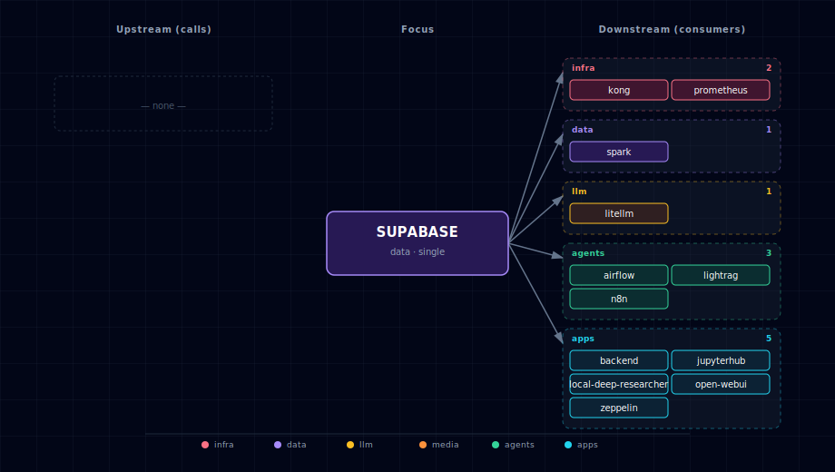

# Supabase Ecosystem

Supabase provides the core database infrastructure for Atlas, including PostgreSQL database, authentication, storage, realtime subscriptions, and a management dashboard.

## 1. Overview

The Supabase ecosystem consists of multiple integrated services:

- **PostgreSQL Database** - Primary database with pgvector and PostGIS extensions
- **Auth Service (GoTrue)** - User authentication and JWT management  
- **Storage Service** - File storage and management
- **API Service (PostgREST)** - Auto-generated REST API
- **Realtime Service** - WebSocket connections for live updates
- **Studio Dashboard** - Web-based database management interface

## 2. Database Setup Process

The database initialization follows a two-stage process managed by Docker Compose dependencies:

### 2.1 Base Database Initialization (`supabase-db` service)

- Uses the standard `supabase/postgres` image
- On first start with an empty data volume, runs internal initialization scripts from `/docker-entrypoint-initdb.d/`
- Base scripts handle:
  - Setting up PostgreSQL
  - Creating the database specified by `POSTGRES_DB`
  - Creating standard Supabase roles (`anon`, `authenticated`, `service_role`)
  - Enabling necessary extensions (`pgcrypto`, `uuid-ossp`)
  - Setting up basic `auth` and `storage` schemas

**IMPORTANT**: The `SUPABASE_DB_USER` in your `.env` file must be set to `supabase_admin`. This is required by the base image's internal scripts.

### 2.2 Custom Post-Initialization (`supabase-db-init` service)

- A dedicated, short-lived service using `postgres:15-alpine` image
- Depends on `supabase-db` and waits until it's ready using `pg_isready`
- Executes all `.sql` files from `./services/supabase/db/scripts/` directory in alphabetical order
- Custom scripts handle project-specific setup:
  - Ensuring extensions like `vector` and `postgis` are enabled (`01-extensions.sql`)
  - Ensuring schemas like `auth` and `storage` exist (`02-schemas.sql`)
  - Creating necessary custom types for Supabase Auth (`03-auth-types.sql`)
  - Setting up storage schema and tables (`04-storage.sql`)
  - Creating custom public tables like `users` and `llms` (`05-public-tables.sql`)
  - Granting appropriate permissions to standard roles (`06-permissions.sql`)
  - Creating custom functions like `public.health` (`07-functions.sql`)
  - Inserting seed data like default LLMs (`08-seed-data.sql`)

All custom SQL scripts use `IF NOT EXISTS` logic to allow safe re-runs.

### 2.3 Service Dependencies

Most other services have `depends_on: { supabase-db-init: { condition: service_completed_successfully } }` to ensure they only start after both base and custom initialization are complete.

## 3. Authentication System

The stack uses Supabase Auth (GoTrue) for user authentication and management with JWT tokens.

### 3.1 Key Components

**supabase-auth (GoTrue)**:
- Issues JWTs upon successful login/sign-up
- Validates JWTs presented to its endpoints  
- Configured via `GOTRUE_*` environment variables
- Sign-ups enabled by default (`GOTRUE_DISABLE_SIGNUP="false"`)
- Emails auto-confirmed for local development (`GOTRUE_MAILER_AUTOCONFIRM="true"`)

**supabase-api (PostgREST)**:
- Expects valid JWT in `Authorization: Bearer <token>` header
- Validates JWT signature using `PGRST_JWT_SECRET` (shared with auth)
- Enforces database permissions based on JWT role claim via PostgreSQL RLS

**supabase-storage**:
- Uses JWTs passed via Kong to enforce storage access policies

**kong-api-gateway**:
- Routes authenticated requests to backend services
- Relies on upstream services for JWT validation

### 3.2 JWT Keys (.env file)

- `SUPABASE_JWT_SECRET`: Secret key for signing/verifying JWTs (consistent across all services)
- `SUPABASE_ANON_KEY`: Pre-generated JWT for `anon` role (public access)
- `SUPABASE_SERVICE_KEY`: Pre-generated JWT for `service_role` (admin privileges)

### 3.3 Setup and Usage

1. **Generate Keys**: start.py automatically generates secure JWT keys during first run or cold start
2. **Client Authentication**: Implement login flow using `/auth/v1/token?grant_type=password`
3. **Anonymous Access**: Use `SUPABASE_ANON_KEY` for public requests
4. **Service Role Access**: Use `SUPABASE_SERVICE_KEY` for admin operations (handle securely)
5. **User Management**: Use Supabase Studio interface at `http://localhost:${SUPABASE_STUDIO_PORT}`

## 4. Individual Services

### 4.1 PostgreSQL Database

**Access**: Direct connection via standard PostgreSQL client
**Port**: `${SUPABASE_DB_PORT}` (default: 63010)
**Extensions**: pgvector, PostGIS, uuid-ossp, pgcrypto

### 4.2 Auth Service (GoTrue)

**Access**: `http://localhost:${SUPABASE_AUTH_PORT}` (default: 63014)
**Purpose**: User registration, login, password recovery, email confirmation
**Features**: JWT authentication, user management, password policies

### 4.3 Storage Service

**Access**: `http://localhost:${SUPABASE_STORAGE_PORT}` (default: 63013)
**Features**:
- Secure file storage and management
- Access control via database policies
- Integration with authentication system
- Support for various file types

### 4.4 API Service (PostgREST)

**Access**: `http://localhost:${SUPABASE_API_PORT}` (default: 63015)
**Purpose**: Auto-generated REST API for database operations
**Features**:
- Automatic API generation from database schema
- Row Level Security (RLS) enforcement
- Real-time subscriptions support
- GraphQL endpoint available

### 4.5 Realtime Service

**Access**: WebSocket at `http://localhost:${SUPABASE_REALTIME_PORT}` (default: 63016)
**Purpose**: Live database change notifications
**Features**:
- Real-time database change notifications
- WebSocket-based connections
- Subscription management
- Integration with frontend applications

### 4.6 Studio Dashboard

**Access**: `http://localhost:${SUPABASE_STUDIO_PORT}` (default: 63017)
**Purpose**: Web-based database management interface
**Credentials**: `DASHBOARD_USERNAME` / `DASHBOARD_PASSWORD` from `.env` (default user `kong_admin`; the password is auto-generated on first `./start.sh`)
**Features**:
- Database schema visualization
- Query editor and runner
- User management interface
- Storage file browser
- Real-time monitoring

### 4.7 `postgres-exporter` (observability sidecar)

**Image**: `prometheuscommunity/postgres-exporter:v0.18.1`
**Access**: `http://localhost:${POSTGRES_EXPORTER_PORT}/metrics` (in-container `9187`)
**Purpose**: Prometheus exporter exposing `pg_stat_*` views as a `/metrics` endpoint for the observability bundle.
**Configuration**: connects to `supabase-db:5432` using `${SUPABASE_DB_USER}`/`${SUPABASE_DB_PASSWORD}` with `PG_EXPORTER_AUTO_DISCOVER_DATABASES=true` so every database on the cluster is scraped (including the `litellm` database).
**Lifecycle**: scales **1↔0 with `PROMETHEUS_SOURCE`** — the bootstrapper's `_generate_prometheus_config()` hook writes `POSTGRES_EXPORTER_SCALE` from this single switch, so the sidecar is dormant when Prometheus is off. The `Postgres + Redis` Grafana dashboard renders connections, query rate, and table sizes from its output.

## 5. Environment Variables

Key environment variables for Supabase configuration:

```bash
# Database
POSTGRES_DB=postgres
SUPABASE_DB_USER=supabase_admin
SUPABASE_DB_PASSWORD=your_password
SUPABASE_DB_PORT=63010

# Authentication
SUPABASE_JWT_SECRET=your_jwt_secret
SUPABASE_ANON_KEY=generated_anon_key
SUPABASE_SERVICE_KEY=generated_service_key

# Service Ports
SUPABASE_AUTH_PORT=63014
SUPABASE_API_PORT=63015
SUPABASE_STORAGE_PORT=63013
SUPABASE_STUDIO_PORT=63017
SUPABASE_REALTIME_PORT=63016

# Dashboard Credentials (password auto-rotated on first launch)
DASHBOARD_USERNAME=kong_admin
DASHBOARD_PASSWORD=<auto-generated into .env>
```

### 5.1 Security note — pg-meta host port

`supabase-meta` (pg-meta) is published on the host at `SUPABASE_META_PORT`
(default `63012`). pg-meta is an **auth-less HTTP API that executes SQL as
`supabase_admin`** — anyone who can reach that port owns the database.
Treat it like the Redis debug port: fine on a trusted dev machine, but on
any shared network either firewall it or remove the `ports:` publish from
`services/supabase/compose.yml` (Studio reaches pg-meta over the internal
Docker network and does not need the host publish).

## 6. Integration Points

**Backend API**: Uses Supabase for data persistence and user management
**Open WebUI**: Integrates with authentication for user sessions
**n8n**: Uses PostgreSQL for workflow storage and execution history
**Kong Gateway**: Routes requests to appropriate Supabase services with authentication

## 7. Common Operations

### 7.1 Connect to Database
```bash
# Using psql
psql -h localhost -p ${SUPABASE_DB_PORT} -U supabase_admin -d postgres

# Using Docker
docker exec -it ${PROJECT_NAME}-supabase-db psql -U supabase_admin -d postgres
```

### 7.2 Check Service Health
```bash
# Database
docker exec ${PROJECT_NAME}-supabase-db pg_isready

# Services
curl http://localhost:${SUPABASE_API_PORT}/health
curl http://localhost:${SUPABASE_AUTH_PORT}/health
```

### 7.3 View Logs
```bash
docker logs ${PROJECT_NAME}-supabase-db -f
docker logs ${PROJECT_NAME}-supabase-auth -f
docker logs ${PROJECT_NAME}-supabase-api -f
docker logs ${PROJECT_NAME}-supabase-studio -f
```

## 8. LightRAG schema

When `LIGHTRAG_SOURCE != disabled` AND `SUPABASE_DB_SOURCE != disabled`, `lightrag-init` runs `migrate-pgvector.sql` which provisions `CREATE EXTENSION IF NOT EXISTS vector` and a `lightrag` schema. LightRAG's `PGVectorStorage` manages tables under that schema at runtime.

## 9. Dependencies & Integrations

> Auto-generated section — the **Current** subsections are derived from `services/supabase/service.yml`'s `data_flow.calls` field (and inverse passes). Re-run `python -m bootstrapper.docs.regen supabase` after manifest changes.

### 9.1 Current — Upstream (this service calls)

_No upstream calls._

### 9.2 Current — Downstream (services that call this)

| Service | Category |
|---|---|
| backup | infra |
| kong | infra |
| prometheus | infra |
| litellm | llm |
| comfyui | media |
| airflow | agents |
| lightrag | agents |
| n8n | agents |
| backend | apps |
| jupyterhub | apps |
| local-deep-researcher | apps |
| open-webui | apps |
| zeppelin | apps |

### 9.3 Architecture diagram



[Open the interactive HTML diagram](./architecture.html) for a full-screen view.

### 9.4 Future — Missing pair integrations

- **supabase ↔ hermes** — *Why:* Hermes persists agent state to a `hermes-data` volume only (the manifest header says "no Postgres/Redis dependency"). Backing sessions, skills, and tool-call history with Postgres gives durable cross-restart memory, multi-replica safety, and stack-wide queryability. *Mechanism:* `postgresql://supabase_admin@supabase-db:5432/postgres` with a dedicated `hermes` schema; `hermes-init` creates tables with `IF NOT EXISTS`. *Effort:* medium. *Confidence:* medium.
- **supabase ↔ doc-processor** — *Why:* docling extracts structured chunks that today flow only into Weaviate as vectors. Persisting raw chunk text + source metadata in Postgres gives RLS-scoped tenant isolation, exact-match search, and a source-of-truth row Weaviate can be rebuilt from. *Mechanism:* docling writes via PostgREST at `http://supabase-api:3000/rest/v1/doc_chunks` using `SUPABASE_SERVICE_KEY`; embeddings still go to Weaviate. *Effort:* medium. *Confidence:* medium.
- **supabase ↔ openclaw** — *Why:* OpenClaw is the messaging-platform gateway and depends only on litellm; conversation history, user-to-channel mappings, and rate-limit counters currently live in-memory. *Mechanism:* `postgresql://supabase_admin@supabase-db:5432/postgres` schema `openclaw`; tables seeded by a small `openclaw-init` SQL script alongside the existing `supabase-db-init` chain. *Effort:* small. *Confidence:* medium.
- **supabase ↔ tts-provider** — *Why:* generated audio is ephemeral. Storing TTS output in `supabase-storage` keyed by `(user_id, text_hash, voice)` gives a free cache (skip re-synth on identical inputs) and a per-user history pane. *Mechanism:* `PUT http://supabase-storage:5000/object/tts/<user>/<hash>.wav` with `SUPABASE_SERVICE_KEY`; metadata row via PostgREST. *Effort:* small. *Confidence:* high.
- **supabase ↔ stt-provider** — *Why:* parakeet/speaches transcripts vanish after the response. Writing them to a `transcripts` table with the caller's JWT `sub` enables history search, RAG-over-meetings, and per-user RLS isolation. *Mechanism:* stt-provider POSTs to PostgREST `/rest/v1/transcripts` with the forwarded `Authorization: Bearer <jwt>` header so RLS picks up the user. *Effort:* small. *Confidence:* medium.

### 9.5 Future — Candidate new services

- **Supabase Edge Functions (Deno)** ([details](../../docs/research/candidates/supabase-edge-functions.md)) — *Headline:* self-hosted Deno serverless layer that lets Postgres triggers and Kong routes invoke short TypeScript handlers without standing up n8n. *Wires into:* litellm, n8n, supabase-storage, kong.
- **Supavisor** ([details](../../docs/research/candidates/supavisor.md)) — *Headline:* Supabase's own Postgres connection pooler — protects `supabase-db` from the 10+ stack services that each open their own pool. *Wires into:* backend, n8n, litellm, jupyterhub, local-deep-researcher.
- **imgproxy** ([details](../../docs/research/candidates/imgproxy.md)) — *Headline:* on-the-fly image transform/resize sidecar that Supabase Storage's `IMGPROXY_URL` is purpose-built to talk to. *Wires into:* supabase-storage, minio, comfyui, open-webui, backend.

### 9.6 Future — Unused features in this service

- **`pg_cron` + `pg_net` extensions** — *Why pursue:* enables scheduled jobs and outbound HTTP from inside Postgres (database webhooks to Hermes/n8n/Edge Functions); `01-extensions.sql` currently enables only `vector`/`postgis`/`pgcrypto`. *Effort:* small.
- **Database Webhooks** — *Why pursue:* lets row-level changes trigger LiteLLM calls or n8n flows without a polling worker; depends on `pg_net`. *Effort:* small.
- **Row-Level Security policies** — *Why pursue:* README documents `anon`/`authenticated`/`service_role` roles but no policies are defined in `06-permissions.sql`; PostgREST today leaks across users. *Effort:* medium.
- **GoTrue OAuth providers (Google, GitHub)** — *Why pursue:* stack ships with email-only login; SSO is a near-zero-code add via `GOTRUE_EXTERNAL_*` envs. *Effort:* small.
- **`pg_graphql` endpoint** — *Why pursue:* README mentions "GraphQL endpoint available" but Kong has no route and no consumer; would give n8n/backend a typed schema. *Effort:* small.
- **Realtime broadcast + presence channels** — *Why pursue:* `supabase-realtime` runs but nothing subscribes; broadcast channels would let backend push job-status updates to open-webui without polling. *Effort:* medium.
- **Storage image transformation** — *Why pursue:* prerequisite for the imgproxy candidate; lights up resize URLs once `IMGPROXY_URL` is set. *Effort:* small.

## 10. Troubleshooting

**Database connection issues**: Verify SUPABASE_DB_USER is set to `supabase_admin`
**Auth service errors**: Check JWT secret consistency across services
**Studio access issues**: Verify dashboard credentials in .env file
**Initialization failures**: Check supabase-db-init logs for SQL script errors

For more troubleshooting help, see [../quick-start/troubleshooting.md](../../docs/quick-start/troubleshooting.md).
