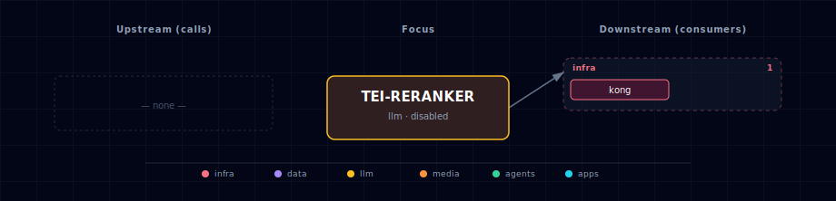

# TEI Reranker

> **Image:** `ghcr.io/huggingface/text-embeddings-inference:cpu-1.9` (CPU) / `:1.9` (GPU)
> **Container port:** 80  · **Default host port:** allocated by `topology.py` slot allocator (LLM band 63030–63039)
> **Default:** disabled

## 1. Overview

HuggingFace `text-embeddings-inference` running BAAI/bge-reranker-v2-m3 — a cross-encoder reranker that scores `(query, passage)` pairs. Use it as a quality lift on top of any first-stage retriever (vector search, BM25, hybrid). The image exposes a stable `/rerank` HTTP endpoint and a `/health` probe.

The vanilla stack uses TEI Reranker as LightRAG's optional reranker (LightRAG's `RERANK_BINDING` points at `${TEI_RERANKER_ENDPOINT}`). The service is reusable: any consumer with an OpenAI-style request body can call it directly.

## 2. Source variants

| Source | Container scale | Endpoint | Notes |
|---|---|---|---|
| `container-cpu` | 1 | `http://tei-reranker:80` | Default CPU image; runs on any host |
| `container-gpu` | 1 | `http://tei-reranker:80` | CUDA image; needs NVIDIA |
| `localhost` | 0 | `http://host.docker.internal:${TEI_RERANKER_LOCALHOST_PORT}` | Host-installed TEI |
| `disabled` | 0 | `""` | LightRAG runs without reranking |

## 3. Configuration

```env
TEI_RERANKER_SOURCE=disabled                       # default
TEI_RERANKER_PORT=...                              # slot-allocated
TEI_RERANKER_LOCALHOST_PORT=63031                  # mirror
TEI_RERANKER_MODEL_ID=BAAI/bge-reranker-v2-m3
TEI_RERANKER_REVISION=main
TEI_RERANKER_MAX_CLIENT_BATCH_SIZE=32
TEI_RERANKER_MEMORY_LIMIT=4g
TEI_RERANKER_CPU_LIMIT=2.0
TEI_RERANKER_HF_CACHE_DIR=/data
```

## 4. Usage

```bash
# Rerank passages
curl -s http://localhost:${TEI_RERANKER_PORT}/rerank \
  -H 'Content-Type: application/json' \
  -d '{
    "query": "What is graph-augmented RAG?",
    "texts": [
      "LightRAG combines knowledge graphs with dense vector retrieval.",
      "GraphQL is a query language.",
      "Reranking improves RAG quality by ordering retrieved passages."
    ]
  }'
# → [{"index": 0, "score": ...}, ...]
```

## 5. Dependencies & Integrations

> Auto-generated section — the **Current** subsections are derived from `services/tei-reranker/service.yml`'s `data_flow.calls` field (and inverse passes). Re-run `python -m bootstrapper.docs.regen tei-reranker` after manifest changes.

### 5.1 Current — Upstream (this service calls)

_No upstream calls._

### 5.2 Current — Downstream (services that call this)

_No downstream consumers._

### 5.3 Architecture diagram



[Open the interactive HTML diagram](./architecture.html) for a full-screen view.

### 5.4 Future — Missing pair integrations

_No high-confidence opportunities identified._

### 5.5 Future — Candidate new services

_No high-confidence opportunities identified._

### 5.6 Future — Unused features in this service

_No high-confidence opportunities identified._

## 6. Health checks

```bash
curl -fs http://localhost:${TEI_RERANKER_PORT}/health   # 200 OK when up
```

Container `start_period` is 120 s (first run downloads the model).

## 7. Troubleshooting

- **Out of memory on CPU variant** — bump `TEI_RERANKER_MEMORY_LIMIT`. BGE-reranker-v2-m3 needs ~3 GB on CPU under typical load.
- **Slow inference** — switch to `container-gpu` if NVIDIA is available; CPU latency is ~150 ms per pair vs ~15 ms on GPU.
- **Model not found** — verify `TEI_RERANKER_MODEL_ID` matches a public HF repo. Private repos need an `HF_TOKEN` env var (not wired by default; hand-add to the compose env block).
