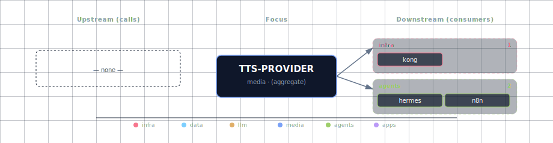

# TTS Provider

Pluggable text-to-speech layer. All backends speak the OpenAI
`/v1/audio/speech` protocol so Open WebUI, n8n, JupyterHub and the backend
API consume them uniformly.

## 1. Source matrix

| `TTS_PROVIDER_SOURCE` | Engine | Container image | License | Hardware |
|---|---|---|---|---|
| `speaches-container-cpu` (default) | Speaches → Kokoro / Piper | `ghcr.io/speaches-ai/speaches:0.9.0-rc.3-cpu` | MIT | Linux + macOS Docker, CPU |
| `speaches-container-gpu` | Speaches → Kokoro / Piper | `ghcr.io/speaches-ai/speaches:0.9.0-rc.3-cuda` | MIT | NVIDIA |
| `chatterbox-container-gpu` | Resemble AI Chatterbox | `travisvn/chatterbox-tts-api:gpu` | MIT | NVIDIA (≥8 GB) |
| `chatterbox-localhost` | Resemble AI Chatterbox | — (git clone + `uv run main.py`) | MIT | macOS MPS / Linux |
| `disabled` | — | — | — | — |

Speaches dedupes when both `TTS_PROVIDER_SOURCE` and `STT_PROVIDER_SOURCE`
select a speaches variant: one container instance serves both endpoints. If
one source picks CPU and the other GPU, GPU wins and the bootstrapper
prints a one-line notice.

## 2. Engine comparison

| | Speaches (Kokoro) | Speaches (Piper) | Chatterbox |
|---|---|---|---|
| Param count | 82 M | ~20 M | ~500 M |
| Quality | high | good | high + voice cloning |
| First-request load | ~90 MB | ~30 MB | ~2 GB |
| Voice cloning | ❌ | ❌ | ✅ 5-sec zero-shot |
| Languages | 8–9 | 30+ | 23 |
| Realtime factor on CPU | ~1× | ~0.3× | ~4×–6× (slow on CPU) |

Default is Speaches + Kokoro because it has the best quality-per-resource
ratio. Pick Chatterbox when you specifically need voice cloning.

## 3. Quick start

The default already runs:

```bash
./start.sh
# wait ~60s for the speaches container to download Kokoro and become healthy
curl http://localhost:63046/v1/audio/speech \
  -X POST -H "Content-Type: application/json" \
  -d '{"model":"hexgrad/Kokoro-82M","input":"hello world","voice":"af_heart"}' \
  --output /tmp/hello.wav
file /tmp/hello.wav   # expect RIFF / WAVE audio
```

GPU acceleration (NVIDIA):

```bash
./start.sh --tts-provider-source speaches-container-gpu
```

Voice cloning via Chatterbox (NVIDIA):

```bash
./start.sh --tts-provider-source chatterbox-container-gpu
# wait for ~3min as Chatterbox pulls weights on first request
```

Voice cloning via Chatterbox (macOS native, MPS):

```bash
# Terminal 1 — no PyPI package, install from git:
git clone https://github.com/travisvn/chatterbox-tts-api
cd chatterbox-tts-api && uv sync
PORT=63044 uv run main.py

# Terminal 2
./start.sh --tts-provider-source chatterbox-localhost
```

See [the chatterbox-localhost README](./provider/localhost/README.md)
for the full Chatterbox-on-host walkthrough.

## 4. Environment variables

| Variable | Default | Notes |
|---|---|---|
| `TTS_PROVIDER_SOURCE` | `speaches-container-cpu` | The single dial that drives everything below. |
| `TTS_PROVIDER_PORT` | `63044` | Wizard display port; bootstrapper rewrites this to match the active container. |
| `TTS_ENDPOINT` | (auto) | Internal URL containers reach the TTS service on. Read by Open WebUI / n8n / backend / JupyterHub. |
| `TTS_PROVIDER_SCALE` | (auto) | 1 when any container variant is active, else 0. |
| `SPEACHES_IMAGE` | `ghcr.io/speaches-ai/speaches:0.9.0-rc.3-cpu` | Override to pin a different release. |
| `SPEACHES_GPU_IMAGE` | `ghcr.io/speaches-ai/speaches:0.9.0-rc.3-cuda` | CUDA build pin. |
| `SPEACHES_TTS_MODEL` | `hexgrad/Kokoro-82M` | HuggingFace repo of the active TTS model. |
| `SPEACHES_PORT` | `63046` | Speaches container external port. |
| `SPEACHES_SCALE` | (auto) | 1 when speaches is active. |
| `CHATTERBOX_IMAGE` | `travisvn/chatterbox-tts-api:gpu` | GPU build tag. No version-locked GPU tag yet — pin to a digest for production. |
| `CHATTERBOX_PORT` | `63045` | Chatterbox container external port. |
| `CHATTERBOX_LOCALHOST_PORT` | `63044` | Port the stack reaches your host's chatterbox-tts-api on — defaults to the freed `TTS_PROVIDER_PORT` slot (the container `CHATTERBOX_PORT` is 63045). URL is derived as `http://host.docker.internal:${CHATTERBOX_LOCALHOST_PORT}` at compose-render time. |
| `SPEACHES_PRELOAD_MODELS` | (derived from SPEACHES_TTS_MODEL+SPEACHES_STT_MODEL) | Comma-separated list of HF model IDs Speaches downloads at startup. Skips the first-request cold-start. |

## 5. OpenAI-compatible API

Speaches:

```http
POST http://speaches:8000/v1/audio/speech
Content-Type: application/json

{
  "model": "hexgrad/Kokoro-82M",
  "input": "Hello world",
  "voice": "af_heart",
  "response_format": "wav"
}
```

Kokoro voices include `af_heart`, `af_sky`, `am_adam`, `am_michael`,
`bf_emma`, `bm_george` (full list at the Kokoro model card). For Piper
voices use the model id `rhasspy/piper-voices` with `voice` set to a Piper
voice slug.

Chatterbox (registered/built-in voice — JSON):

```http
POST http://chatterbox:4123/v1/audio/speech
Content-Type: application/json

{
  "model": "chatterbox-tts-1",
  "input": "Hello world",
  "voice": "alloy"
}
```

Chatterbox voice cloning uses **multipart upload**, not a JSON
`reference_audio` field. Either pre-register a voice via `POST /voices`
and reference it by name, or inline-upload the reference WAV:

```bash
curl -X POST http://chatterbox:4123/v1/audio/speech \
  -F "input=Hello in this voice." \
  -F "model=chatterbox-tts-1" \
  -F "voice_file=@/host/path/to/sample.wav" \
  --output cloned.wav
```

See [the chatterbox-localhost README](./provider/localhost/README.md)
for the full voice-library workflow.

## 6. Open WebUI integration

The bootstrapper writes these env vars on the open-web-ui container based
on the source you picked:

- `AUDIO_TTS_ENGINE=openai`
- `AUDIO_TTS_OPENAI_API_BASE_URL=${TTS_ENDPOINT}/v1`
- `AUDIO_TTS_OPENAI_API_KEY=sk-unused`
- `AUDIO_TTS_MODEL` = `hexgrad/Kokoro-82M` (Speaches) or `chatterbox-tts-1` (Chatterbox)
- `AUDIO_TTS_VOICE` = `af_heart` (Speaches) or `alloy` (Chatterbox)

Open WebUI admin → Settings → Audio lets you change voice / model
post-startup; the env vars are just defaults.

## 7. Migration from XTTS

The previous TTS path used `xtts-container-gpu` / `xtts-localhost` against
`ghcr.io/matatonic/openedai-speech`. Both are gone:

- The image was **archived 2026-01-04** upstream.
- XTTS-v2 weights are CPML / non-commercial.

`bootstrapper/services/source_validator.py::_migrate_legacy_tts_stt_sources`
auto-rewrites old `.env` values on the next start:

| Old | New |
|---|---|
| `TTS_PROVIDER_SOURCE=xtts-container-gpu` | `speaches-container-gpu` |
| `TTS_PROVIDER_SOURCE=xtts-localhost` | `chatterbox-localhost` |

The legacy `XTTS_ENDPOINT` env var is also stripped from `.env` — the
unified replacement is `TTS_ENDPOINT`.

## 8. References

- [Speaches](https://github.com/speaches-ai/speaches)
- [Kokoro-82M model card](https://huggingface.co/hexgrad/Kokoro-82M)
- [Piper voices](https://github.com/OHF-Voice/piper1-gpl)
- [Chatterbox upstream](https://github.com/resemble-ai/chatterbox)
- [chatterbox-tts-api server](https://github.com/travisvn/chatterbox-tts-api)
- [OpenAI Audio API spec](https://platform.openai.com/docs/guides/text-to-speech)

## 9. Dependencies & Integrations

> Auto-generated section — the **Current** subsections are derived from the member manifests' `data_flow.calls` (`services/chatterbox/service.yml`, `services/speaches/service.yml`, `services/tts-provider/service.yml`). Re-run `python -m bootstrapper.docs.regen tts-provider` after changing them.

### 9.1 Current — Upstream (this service calls)

_No upstream calls._

### 9.2 Current — Downstream (services that call this)

| Service | Category |
|---|---|
| kong | infra |
| hermes | agents |
| n8n | agents |
| open-webui | apps |

### 9.3 Architecture diagram



[Open the interactive HTML diagram](./architecture.html) for a full-screen view.

### 9.4 Future — Missing pair integrations

- **tts-provider ↔ minio** — *Why:* Chatterbox's `/voices` library lives on ephemeral container FS today, so a rebuild wipes user-registered voices; MinIO already hosts artifact buckets. *Mechanism:* fuse/rclone-mount a `tts-voices` bucket at `/app/voices`, or a sidecar that mirrors chatterbox `GET/POST /voices` to `s3://tts-voices/`. *Effort:* medium. *Confidence:* high.
- **tts-provider ↔ redis** — *Why:* repeated UI/notification phrases (welcome lines, n8n alerts, hermes acks) burn CPU on Kokoro/Piper and hit Chatterbox's >2s cold weights load. *Mechanism:* small FastAPI shim in front of `TTS_ENDPOINT` keyed on `(model, voice, text-hash, knobs)` against `redis://redis:6379` before forwarding to `/v1/audio/speech`. *Effort:* medium. *Confidence:* medium.
- **tts-provider ↔ doc-processor** — *Why:* turns ingested PDFs/HTML into audiobook WAVs — a natural "read this document" feature for backend / Open WebUI that closes the doc-processor → narration loop. *Mechanism:* backend chunks doc-processor's markdown output, POSTs each chunk to `${TTS_ENDPOINT}/v1/audio/speech`, concatenates segments, writes to MinIO. *Effort:* medium. *Confidence:* high.
- **tts-provider ↔ supabase** — *Why:* voice metadata (owner, language, source clip, registered-by user) belongs in a relational table, not chatterbox's in-memory `/voices` registry — lets Open WebUI users see their own voices and admins audit usage. *Mechanism:* backend writes a `tts_voices` row in Supabase on every chatterbox `POST /voices`; a startup reconciler re-POSTs registered voices from MinIO+Supabase back into chatterbox. *Effort:* medium. *Confidence:* medium.
- **tts-provider ↔ openclaw** — *Why:* voice-message replies to Telegram/Discord/etc. dramatically lift presence over text-only bots, and pair naturally with stt-provider on the inbound side. *Mechanism:* openclaw calls `${TTS_ENDPOINT}/v1/audio/speech` per outgoing message and uploads the returned WAV via its platform adapters (ffmpeg transcode hop for Opus/OGG). *Effort:* small. *Confidence:* medium.

### 9.5 Future — Candidate new services

- **Unmute (Kyutai)** ([details](../../docs/research/candidates/unmute.md)) — *Headline:* WebSocket OpenAI-Realtime-compatible voice loop that wraps any text LLM behind streaming STT + TTS. *Wires into:* open-webui, backend, hermes, litellm, parakeet, chatterbox, speaches.
- **OmniVoice (k2-fsa)** ([details](../../docs/research/candidates/omnivoice.md)) — *Headline:* 0.6 B diffusion-LM TTS (Apache-2.0) with **600+ language coverage** — the only meaningfully novel capability over the current Speaches/Chatterbox lineup. *Status:* assessed 2026-06-03, **skipped pending upstream readiness** (SaaS has no public API; OSS is CLI/Python with no FastAPI wrapper or Docker image). Re-evaluate Q4 2026 or when a community wrapper / Speaches adapter lands.

### 9.6 Future — Unused features in this service

- **Speaches Realtime API / speech-to-speech** — *Why pursue:* upstream advertises a Realtime API and async speech-to-speech, but the stack only consumes `/v1/audio/speech` and `/v1/audio/transcriptions`; wiring it would enable low-latency voice agents in Open WebUI + hermes. *Effort:* large.
- **Chatterbox streaming endpoints (`/v1/audio/speech/stream`, SSE)** — *Why pursue:* cuts perceived latency to ~1–2s versus waiting for the full WAV, and Open WebUI's audio player supports streamed chunks. *Effort:* small.
- **Chatterbox `/v1/audio/speech/upload` + `/voices` POST in Open WebUI** — *Why pursue:* end-users could clone their own voice from the chat UI; today only raw API callers can. *Effort:* medium.
- **Chatterbox paralinguistic tags (`[laugh]`, `[cough]`)** — *Why pursue:* richer narration for doc-processor audiobooks and hermes responses, available on the Turbo model upstream. *Effort:* small.
- **Speaches dynamic model load/unload** — *Why pursue:* stack pins `SPEACHES_TTS_MODEL` at boot, but upstream auto-loads requested models then unloads on idle — lets users pick Kokoro vs Piper per request without restart. *Effort:* small.
- **Chatterbox `exaggeration` / `cfg_weight` / `temperature` knobs** — *Why pursue:* emotion and pace controls (defaults 0.5 / 0.5 / 0.8) are exposed only via raw API; Open WebUI doesn't surface them. *Effort:* small.
- **Chatterbox `/status`, `/memory`, `/config` introspection** — *Why pursue:* feeds the backend health dashboard (and future Grafana), surfacing VRAM pressure before OOM. *Effort:* small.

## 10. Troubleshooting

**Speaches container stays unhealthy** — check `docker logs
<project>-speaches`. First start downloads models; allow up to 2 minutes.

**Chatterbox container OOMs** — needs ≥8 GB VRAM. Use Speaches instead, or
the localhost variant.

**No audio out of Open WebUI** — verify `AUDIO_TTS_OPENAI_API_BASE_URL` is
set (`docker exec <project>-open-web-ui env | grep AUDIO_TTS`). If empty,
your `TTS_PROVIDER_SOURCE` is `disabled`.

**Wrong voice playing** — the bootstrapper writes a default voice per
engine. Override in Open WebUI admin → Audio, or set
`OPEN_WEB_UI_TTS_VOICE` in `.env` directly.
