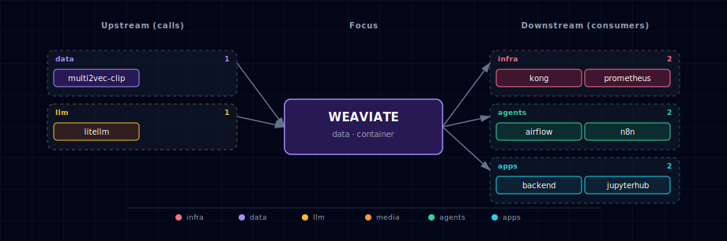

# Weaviate

**Port:** 63022 / 63023
**SOURCE variable:** `WEAVIATE_SOURCE`
**SOURCE options:** container, localhost, disabled

## 1. Overview

Vector database used for semantic search, RAG, embeddings, n8n workflows, Backend features, and notebooks.

## 2. Access

| Path | URL | Notes |
|---|---|---|
| Direct | http://localhost:63022 | Works when the service is enabled in container mode and the port is exposed. |
| Kong | — | Requires `./start.sh --setup-hosts`; only available for services with Kong routes. |

See the canonical port table at [Ports and Routes](../../docs/deployment/ports-and-routes.md).

## 3. Configuration

Configure this service through `.env`, the interactive wizard, or CLI flags where available. Prefer SOURCE variables and documented env vars over direct `docker-compose.yml` edits.

```bash
WEAVIATE_SOURCE=<option>
WEAVIATE_URL=http://weaviate:8080
```

Use `./start.sh` for the guided wizard, or pass a targeted flag for scripted changes when the CLI exposes one.

### 3.1 Vectorization through LiteLLM

Weaviate's text vectorization talks to the always-on **LiteLLM gateway** via the `text2vec-openai` module. LiteLLM's OpenAI-compatible endpoint (`LITELLM_BASE_URL`) is wired into Weaviate as the OpenAI host, and `OPENAI_APIKEY` inside the Weaviate container is set to `LITELLM_MASTER_KEY`. This means whatever embedding model LiteLLM has registered (Ollama-backed `nomic-embed-text` by default, or a cloud provider's embedding model) is what Weaviate will use — no separate `text2vec-ollama` wiring required. The default vectorizer is now `text2vec-openai`. See [LiteLLM Gateway](../litellm/README.md) for how to register additional embedding models.

### 3.2 Multi2Vec CLIP module

The default stack keeps the multimodal CLIP vectorizer enabled:

```bash
MULTI2VEC_CLIP_SOURCE=container-cpu
WEAVIATE_ENABLE_MODULES=text2vec-openai,multi2vec-clip,generative-openai
CLIP_INFERENCE_API=http://multi2vec-clip:8080
```

If you disable the CLIP provider, remove `multi2vec-clip` from `WEAVIATE_ENABLE_MODULES` and leave `CLIP_INFERENCE_API` blank:

```bash
MULTI2VEC_CLIP_SOURCE=disabled
WEAVIATE_ENABLE_MODULES=text2vec-openai,generative-openai
CLIP_INFERENCE_API=
```

## 4. Integration notes

The service participates in the Docker Compose network and may be consumed by the Backend API, Open WebUI, JupyterHub, n8n, or init containers depending on which SOURCE modes are enabled.

Optional consumers should use `WEAVIATE_URL` and perform feature-level readiness checks instead of requiring the Weaviate container as a hard Compose startup dependency. This lets n8n, JupyterHub, and other adaptive services still start when Weaviate is disabled, localhost-backed, or externalized.

## 5. Dependencies & Integrations

> Auto-generated section — the **Current** subsections are derived from `services/weaviate/service.yml`'s `data_flow.calls` field (and inverse passes). Re-run `python -m bootstrapper.docs.regen weaviate` after manifest changes.

### 5.1 Current — Upstream (this service calls)

| Service | Category |
|---|---|
| multi2vec-clip | data |
| litellm | llm |

### 5.2 Current — Downstream (services that call this)

| Service | Category |
|---|---|
| kong | infra |
| n8n | agents |
| backend | apps |
| jupyterhub | apps |
| open-webui | apps |

### 5.3 Architecture diagram



[Open the interactive HTML diagram](./architecture.html) for a full-screen view.

### 5.4 Future — Missing pair integrations

- **weaviate ↔ minio** — *Why:* Weaviate has no backup strategy today; `weaviate-data` is a single local volume. The `backup-s3` module turns MinIO into a durable backup target without new infra. *Mechanism:* enable `backup-s3` in `WEAVIATE_ENABLE_MODULES`; set `BACKUP_S3_BUCKET=weaviate-backups`, `BACKUP_S3_ENDPOINT=minio:9000`, `BACKUP_S3_USE_SSL=false`, `AWS_ACCESS_KEY_ID`/`AWS_SECRET_ACCESS_KEY`; trigger via `POST /v1/backups/s3`. *Effort:* small. *Confidence:* high.
- **weaviate ↔ doc-processor** — *Why:* closes the RAG loop. Docling already extracts structured text + tables from PDFs; today nothing routes that output into Weaviate, so n8n/backend re-implement chunking ad hoc. *Mechanism:* n8n flow or backend route reads docling JSON, chunks, then `POST /v1/batch/objects` into a `Document` collection vectorized via `text2vec-openai`. *Effort:* medium. *Confidence:* high.
- **weaviate ↔ n8n** — *Why:* n8n ships a first-class Weaviate node; workflows could ingest webhook payloads, search, and feed retrieval into the existing AI Agent nodes — currently unused despite both services being co-deployed. *Mechanism:* n8n Weaviate node → `http://weaviate:8080` (REST) or gRPC on `:50051`. *Effort:* small. *Confidence:* high.
- **weaviate ↔ hermes** — *Why:* Hermes has no long-term memory or retrieval tool. A Weaviate-backed memory skill lets Hermes recall past sessions, store tool outputs, and do semantic lookup over user docs. *Mechanism:* Hermes custom skill posts/queries via the Weaviate Python client to `http://weaviate:8080` with hybrid search; collection seeded by `weaviate-init`. *Effort:* medium. *Confidence:* medium.
- **weaviate ↔ comfyui** — *Why:* ComfyUI generates images but they're write-only artifacts on disk. CLIP-vectorizing them into Weaviate enables similarity search over the user's own generation history ("more like this"). *Mechanism:* ComfyUI custom node or n8n post-execution hook → `POST /v1/objects` to a `Generation` collection vectorized by `multi2vec-clip` (already enabled). *Effort:* medium. *Confidence:* medium.

### 5.5 Future — Candidate new services

- **Verba** ([details](../../docs/research/candidates/verba.md)) — *Headline:* Weaviate's official RAG chat UI, drop-in over the existing cluster. *Wires into:* litellm, doc-processor, kong.

### 5.6 Future — Unused features in this service

- **`backup-s3` module** — *Why pursue:* zero current backup story; MinIO is already in-stack. *Effort:* small.
- **Prometheus metrics (`PROMETHEUS_MONITORING_ENABLED=true`, port 2112)** — *Why pursue:* no observability on Weaviate today; metrics would feed any future Prometheus/Grafana sidecar. *Effort:* small.
- **Named vectors (`vectorConfig` array)** — *Why pursue:* lets one collection carry both a text2vec-openai vector and a multi2vec-clip vector for hybrid text+image search instead of two collections. *Effort:* medium.
- **Reranker modules (`reranker-transformers` or `reranker-cohere`)** — *Why pursue:* cheap quality lift on RAG queries; the transformers variant runs in-cluster with no extra API costs. *Effort:* medium.
- **Multi-tenancy (per-collection tenant shards)** — *Why pursue:* backend/n8n/Hermes could share one Weaviate cluster with per-user isolation instead of single-tenant anonymous access. *Effort:* medium.
- **Generative modules beyond OpenAI/Ollama** — *Why pursue:* LiteLLM already fronts Anthropic/Cohere; matching Weaviate's generative module list (`generative-anthropic`, `generative-cohere`) widens GraphQL-side RAG options. *Effort:* small.

## 6. Troubleshooting

```bash
# Check service status
docker compose ps

# Check logs; replace SERVICE with the compose service name when needed
docker compose logs -f SERVICE
```

For general startup and routing issues, see [Troubleshooting](../../docs/quick-start/troubleshooting.md).
