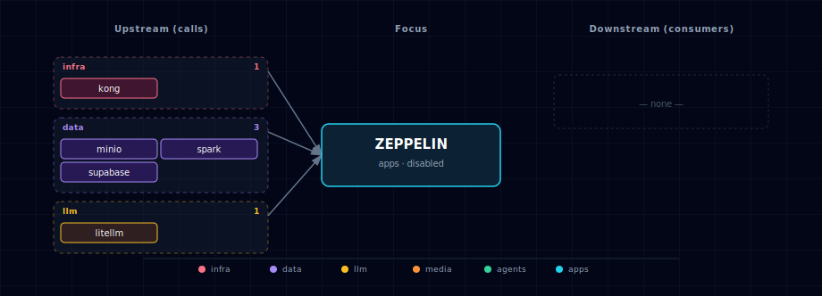

# Apache Zeppelin (Spark-first notebook)

Zeppelin runs as a single container in the stack's `apps` band. The Spark interpreter is pre-configured against the in-stack Spark cluster (master RPC + Spark Connect gRPC + MinIO S3A). The JDBC interpreter ships with credentials in env vars but Zeppelin does not auto-load them — first-time users create a `postgres` interpreter (group `jdbc`) via the UI — `default.url` = `${ZEPPELIN_JDBC_POSTGRES_URL}`; see §4 for the one-time setup. Notebooks live in `services/zeppelin/notebooks/`, bind-mounted into the container.

## 1. Overview

Image: `apache/zeppelin:0.12.0` (Apache 2.0). All interpreters run in-process (no Kubernetes interpreter isolation). The Spark interpreter is the headline. The image does NOT bundle a full Spark distribution — `/opt/zeppelin/interpreter/spark/` contains only the interpreter shim. To run `%spark` cells, configure the Spark interpreter UI to use **Spark Connect** mode:

1. Open Interpreter (top-right user menu) → `spark` → click `edit`
2. Add a property: `spark.remote` = `sc://spark-connect:15002`
3. Save + restart the interpreter

The driver then runs on the dedicated `spark-connect` sidecar, which has `hadoop-aws` + AWS SDK v2 bundle pre-installed (via `services/spark/build/Dockerfile`). All s3a:// reads/writes work transparently. `SPARK_MASTER` and `SPARK_SUBMIT_OPTIONS` are kept in env for users who want to wire a different deploy mode, but the supported in-stack pattern is Spark Connect.

**Hard requirement:** Zeppelin is gated on `SPARK_SOURCE != disabled`. Picking `ZEPPELIN_SOURCE=container` without Spark surfaces an actionable error from the bootstrapper; the spec considers a Spark-less Zeppelin broken on purpose.

**Design deviation from spec §3.2.7:** the spec envisioned a `zeppelin-init` sidecar to materialize starter notebooks and seed interpreter config files. We ship `notebooks/` bind-mounted directly and rely on env-driven interpreter config — same outcome, simpler topology, and users can edit notebooks without restarting the container.

## 2. Access

| Surface | URL | Auth |
|---|---|---|
| Direct | `http://localhost:${ZEPPELIN_PORT}` | None |
| Kong | `http://zeppelin.localhost:${KONG_HTTP_PORT}` | None |

No authentication ships pre-configured. For real use, enable Shiro auth via `conf/shiro.ini` (see [Zeppelin upstream docs](https://zeppelin.apache.org/docs/0.12.0/setup/security/shiro_authentication.html)).

## 3. Configuration

```bash
ZEPPELIN_SOURCE=disabled           # container | disabled
ZEPPELIN_IMAGE=apache/zeppelin:0.12.0
ZEPPELIN_PORT=                     # auto-assigned (apps band)
```

## 4. Integration with the stack

- **Spark** (required) — `%spark` cells need the one-time Spark Connect setup from §1 (`spark.remote = sc://spark-connect:15002` in the Interpreter UI). The image ships no Spark distribution, so the `SPARK_MASTER` / `SPARK_SUBMIT_OPTIONS` env vars in compose only take effect on a spark-submit launch path that requires a user-mounted `SPARK_HOME` — out of the box they are inert.
- **MinIO** — in Spark Connect mode, `s3a://` credentials come from the **spark-connect server's** own conf (see `services/spark/compose.yml`), so MinIO reads/writes work from `%spark` cells once Connect is configured. (`SPARK_SUBMIT_OPTIONS` would only matter on the user-mounted spark-submit path above.)
- **Supabase Postgres** — JDBC connection details exposed as env vars (`ZEPPELIN_JDBC_POSTGRES_URL` / `_USER` / `_PASSWORD`). Zeppelin does not auto-bind these to the JDBC interpreter — one-time setup: open Zeppelin → Interpreter → `+ Create`, name it `postgres` with interpreter group `jdbc`, and set `default.driver=org.postgresql.Driver`, `default.url=jdbc:postgresql://supabase-db:5432/${SUPABASE_DB_NAME}` (copy the exact value from the container's `ZEPPELIN_JDBC_POSTGRES_URL` env — `${SUPABASE_DB_NAME}` defaults to `postgres` but is configurable), `default.user`/`default.password` from the corresponding env vars. Then `%postgres SELECT version()` works — note the old `%jdbc(postgres)` prefix syntax was removed in Zeppelin 0.12 (the interpreter warns "not supported anymore" and falls back to `default.*`). Tracked as a future improvement (bind-mount `conf/interpreter.json` so this is zero-touch).
- **LiteLLM** (optional) — Python interpreter can call the LiteLLM gateway via `openai.OpenAI(base_url="http://litellm:4000/v1", api_key=...)`. No pre-configuration ships; users wire it themselves.

## 5. Starter notebook

`services/zeppelin/notebooks/spark_basics.zpln` ships pre-loaded. 4 cells:
1. Spark version check (`sc.version`)
2. Markdown intro
3. MinIO round-trip via S3A (`s3a://spark-history/...`)
4. Postgres JDBC `SELECT version()` against supabase-db (requires the one-time `postgres` interpreter setup in §4; the cell will error with "Interpreter not properly configured" until you complete it)

Use it as a template for your own notebooks.

## 6. Dependencies & Integrations

> Auto-generated section — the **Current** subsections are derived from `services/zeppelin/service.yml`'s `data_flow.calls` field (and inverse passes). Re-run `python -m bootstrapper.docs.regen zeppelin` after manifest changes.

### 6.1 Current — Upstream (this service calls)

| Service | Category |
|---|---|
| minio | data |
| spark | data |
| supabase | data |

### 6.2 Current — Downstream (services that call this)

| Service | Category |
|---|---|
| kong | infra |

### 6.3 Architecture diagram



[Open the interactive HTML diagram](./architecture.html) for a full-screen view.

### 6.4 Future — Missing pair integrations

_No high-confidence opportunities identified._

### 6.5 Future — Candidate new services

_No high-confidence opportunities identified._

### 6.6 Future — Unused features in this service

_No high-confidence opportunities identified._

## 7. Troubleshooting

- **Spark interpreter says "no master URL"** — `SPARK_MASTER` env var is missing from the container. Check the compose env block; the manifest's runtime_sc + compose.yml dual-write should ensure it. Restart the container after fixing.
- **First `%spark` cell after stack-up errors with "connection refused"** — Zeppelin's `depends_on` only gates on `spark-master: service_healthy`, but the `spark-connect` sidecar's JVM startup lags spark-master by 20-60s on cold start (loading the Spark Connect plugin + binding 15002). Just re-run the cell once spark-connect is up. We don't ship a Connect-side readiness probe because `start-connect-server.sh` doesn't expose `/health`.
- **S3A: "Access Denied" on s3a://...** — MinIO root credentials drift between `.env` and what the container received. `docker exec genai-zeppelin env | grep -E 'MINIO|SPARK_SUBMIT_OPTIONS'` to confirm. Re-run `./start.sh` to refresh.
- **JDBC interpreter "Interpreter not properly configured"** — Zeppelin does not auto-bind the `ZEPPELIN_JDBC_POSTGRES_*` env vars to a JDBC interpreter profile. Walk through §4's one-time UI setup, then restart the JDBC interpreter (Interpreter → JDBC → Restart). Supabase Postgres also must be running (it's a required dep of the stack).
- **"Notebook won't save"** — `/notebook` is bind-mounted from `services/zeppelin/notebooks/`. Confirm `services/zeppelin/notebooks/` exists and is writable by the host user. Zeppelin writes new .zpln files there.
